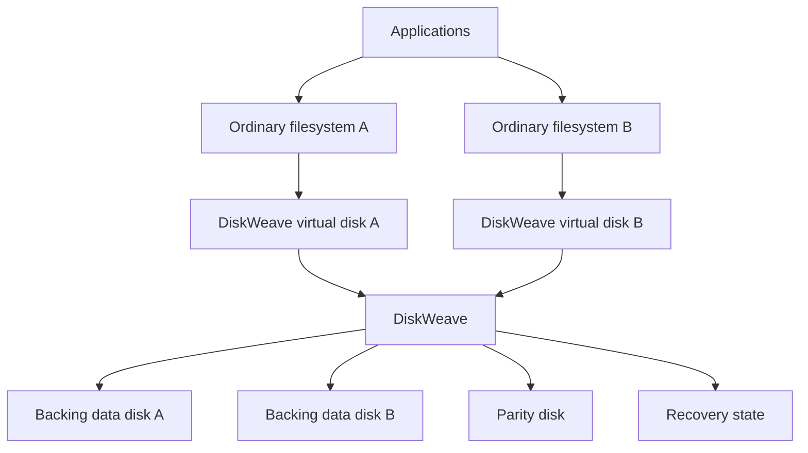

# DiskWeave

> Live parity for ordinary filesystems. Disks you can still read on their own.

DiskWeave is an experimental storage engine for protecting a collection of
data disks with parity. Each data disk keeps its own ordinary filesystem and
remains readable on its own when healthy.

DiskWeave sits below those filesystems. It sees blocks, not files or folders.
This lets it update parity as writes happen without turning the collection into
one proprietary filesystem.

**Status:** Experimental. DiskWeave has a working portable core and narrow
end-to-end demonstrations. It is not ready for production data.

## Why DiskWeave?

Some storage systems combine every disk into one integrated pool. This gives
them a rich, unified feature set, but the pool owns the data layout.

Other systems keep disks independent and refresh parity during a separate
synchronization pass. The disks stay approachable, but changes are not
protected until the next sync.

DiskWeave aims to combine live protection with independent data disks:

- parity stays current as writes happen;
- each healthy data disk remains readable with ordinary tools;
- different-sized disks can contribute their own capacity;
- checksums cover both data and parity;
- losing more disks than parity can recover does not make healthy disks
  unreadable.

## How it fits together



The filesystems manage files and folders. DiskWeave protects the storage below
them. Parity and recovery data stay separate from the data disks.

## Comparison

No approach wins every row. The right choice depends on whether you value
integrated filesystem features, independent disks, live protection,
point-in-time recovery, or a finished appliance.

Legend: ✅ Current · 🟡 Partial or conditional · 🔵 Planned · ❌ No

DiskWeave status describes its current portable and file-backed
evidence.[^dwv-scope]

| Capability | DiskWeave | [ZFS / RAID-Z](https://openzfs.github.io/openzfs-docs/Basic%20Concepts/index.html) | [SnapRAID](https://www.snapraid.it/manual) | [Unraid](https://docs.unraid.net/unraid-os/using-unraid-to/manage-storage/array/overview/) |
|---|:---:|:---:|:---:|:---:|
| Live protection | ✅ Portable | ✅ | ❌ Sync[^snap-sync] | ✅ |
| Independently readable data disks | ✅ | ❌ | ✅ | ✅ |
| Different-sized disks | 🟡 Core only | 🟡 Vdev limits[^zfs-size] | ✅ | ✅ |
| Adopt disks containing data | 🔵 Import | ❌ | ✅ | 🟡 Setup[^unraid-fill] |
| Built-in pooled file view | ❌ mergerfs[^pooling] | ✅ | ❌ mergerfs[^pooling] | ✅ |
| Parity levels offered | 1 ✅ · 2 🔵 | 1–3 | 1–6 | 1–2 |
| Integrated integrity checksums | ✅ Portable | ✅ | ✅ | 🟡 Filesystem[^unraid-fs] |
| Scrub and verified repair | ✅ Portable | ✅ | ✅ | 🟡 Filesystem[^unraid-fs] |
| Access with a missing disk | 🟡 Read-only demo | ✅ | ❌ Offline | ✅ |
| Writes with a missing disk | 🔵 Later phase[^dwv-degraded-writes] | ✅ | ❌ | ✅ |
| Healthy disks survive excess failures | ✅ | ❌ | ✅ | ✅ |
| Native snapshots | ❌ Filesystem[^dwv-features] | ✅ | ❌ Baseline[^snap-sync] | 🟡 Filesystem[^unraid-fs] |
| Stable format and recovery tools | 🔵 | ✅ | ✅ | ✅ |
| Production-ready | ❌ Experimental | ✅ | ✅ | ✅ |

[^dwv-scope]: A DiskWeave ✅ means implemented and evidenced in its current portable, simulated, or file-backed scope. It does not imply production hardware durability.

[^snap-sync]: SnapRAID updates parity during an explicit [`sync`](https://www.snapraid.it/manual). Its saved baseline can recover some files changed or deleted before the next sync, but it is not live protection or a native filesystem snapshot.

[^zfs-size]: ZFS supports mixed device sizes, but usable capacity and expansion follow [vdev geometry](https://openzfs.github.io/openzfs-docs/Basic%20Concepts/Pool%20Structure/Changing%20Pool%20Layout.html).

[^unraid-fill]: Existing data can be preserved in some initial configurations. New disks added to an existing protected array are [normally cleared before use](https://docs.unraid.net/unraid-os/using-unraid-to/manage-storage/array/adding-disks-to-array/).

[^pooling]: DiskWeave does not combine the disks into one file view. A separate tool can do that.

[^unraid-fs]: Checksums, repair, and snapshots depend on the selected [Unraid filesystem or pool](https://docs.unraid.net/unraid-os/using-unraid-to/manage-storage/file-systems/), not on one uniform main-array feature.

[^dwv-features]: DiskWeave leaves snapshots, compression, deduplication, and encryption to each data disk's filesystem. It provides no array-wide version of those features.

[^dwv-degraded-writes]: DiskWeave does not allow degraded writes today or in its first production release. A later design phase must keep new data safe outside the missing disk and verify it during rebuild.

Comparison last checked: 10 August 2026.

## Recovery

A healthy data disk stays readable even when DiskWeave or its recovery data is
unavailable.

When a disk is missing, DiskWeave reconstructs data only when the available
evidence supports one result. It rebuilds onto a separate replacement, checks
the rebuilt data, and accepts the replacement only after verification.

If disk identity, data integrity, or recovery state is unclear, DiskWeave stops
rather than guessing.

## What DiskWeave is not

DiskWeave does not manage filenames or folders. It does not provide snapshots,
compression, deduplication, encryption, or a pooled file view.

DiskWeave is not a backup. Parity does not protect against:

- accidental deletion;
- malware or malicious writes;
- lost encryption keys;
- theft, fire, or enclosure-wide destruction;
- failures beyond the configured protection level.

DiskWeave is also not yet a complete storage product. Administration,
deployment, and the production hardware path remain unfinished.

## Progress

- ✅ Portable single-parity reads and writes.
- ✅ Data disks that remain directly readable.
- ✅ Integrity checksums, exhaustive scrubbing, and evidence-based repair.
- ✅ Read-only degraded access and resumable offline rebuilds.
- ✅ Deterministic failure simulation and trace replay.
- ✅ Narrow Linux `ublk` and ext4 acceptance with file-backed data and parity.
- 🟡 Different-sized disks and capacity changes.
- 🟡 Production concurrency, raw-device operation, and hardware durability.
- 🔵 Import and rebaseline of existing data disks.
- 🔵 Dual parity.
- 🔵 Stable storage formats and standalone recovery tools.
- 🔵 Degraded writes in a later phase, after a separate safety design.
- ❌ Array-wide snapshots, compression, deduplication, or encryption.

## What works today

The portable demo exercises:

- healthy reads, writes, flushes, and reopen;
- parity updated with writes;
- read-only access with one known missing disk;
- interrupted and resumed rebuild;
- checksum verification, scrubbing, and verified repair;
- deterministic trace export and replay;
- direct reading of ordinary data disks.

The Linux acceptance path exports a file-backed DiskWeave disk through real
`ublk`, formats it as ext4, mounts it, modifies files, unmounts it, restarts
DiskWeave, and verifies the retained data.

This evidence does not establish raw-device durability, physical power-loss
safety, broad filesystem support, production deployment, or hardware safety.

## Frequently asked questions

<details>
<summary>Can I read a data disk without DiskWeave?</summary>

Yes. A healthy data disk keeps its ordinary filesystem and is meant to remain
readable with ordinary tools after DiskWeave stops. DiskWeave does not put
required metadata inside the data disk's filesystem.

</details>

<details>
<summary>Is parity updated live, or do I run a sync?</summary>

DiskWeave updates parity as protected writes happen. There is no separate sync
window in the current portable write path. This has not yet been proven as a
production hardware durability path.

</details>

<details>
<summary>Can I use disks that already contain data?</summary>

Not through a supported workflow today. Import and rebaseline are planned, but
they must identify every disk, establish parity, and create trustworthy
recovery and checksum state without damaging the existing filesystems.

</details>

<details>
<summary>Can the data disks be different sizes?</summary>

The parity core supports different protected sizes. Each data disk can
contribute its own capacity, while parity must cover the largest protected data
disk. The complete workflows for adding disks and changing capacity are still
in progress.

</details>

<details>
<summary>Does DiskWeave combine the disks into one file view?</summary>

No. Each filesystem remains separate. A pooling tool can provide one file view
without making file placement part of DiskWeave's parity or recovery logic.

</details>

<details>
<summary>What happens when a disk is missing?</summary>

DiskWeave can currently demonstrate read-only access with one known missing
data disk. It can rebuild that disk onto a separate replacement and verify the
result before accepting it. Writes while a disk is missing belong to a later
design phase.

</details>

<details>
<summary>What happens if more disks fail than parity can recover?</summary>

The missing disks cannot be reconstructed. Healthy data disks still contain
ordinary filesystems and remain independently readable. Their survival does
not restore files that existed only on the failed disks.

</details>

<details>
<summary>What does the recovery database do?</summary>

It records the facts DiskWeave needs to make safe decisions: disk identity and
layout, transaction generations, dirty ranges, checksum state, durability
evidence, and rebuild progress. It contains neither user data nor parity.

If the database is missing, corrupt, or stale, healthy data disks remain
readable. DiskWeave blocks new writes and any recovery action that lacks enough
evidence. Restoring service requires an explicit, verified recovery plan; it
does not assume the array was clean.

</details>

<details>
<summary>Which operating systems and filesystems work today?</summary>

The portable demo runs against ordinary files. The narrow Linux acceptance
path presents a file-backed DiskWeave disk through `ublk` and exercises ext4.
There is no production support matrix yet, and this evidence does not cover raw
devices, broad filesystem compatibility, or physical power-loss safety.

</details>

<details>
<summary>Was DiskWeave built with AI?</summary>

Yes. I used AI heavily to develop the architecture, specifications, Rust code,
tests, and documentation. I do not consider myself a Rust programmer, and I am
not a filesystems engineer.

That makes independent checks more important. DiskWeave gives each
correctness requirement a stable identity. Important code boundaries, tests,
and evidence link back to those requirements. When a requirement changes,
deterministic checks identify dependent requirements that need review. Those
checks do not ask another AI to judge the result.

</details>

<details>
<summary>Why should I trust DiskWeave with my data?</summary>

Today, you should not trust DiskWeave with irreplaceable data. It is
experimental. It has not established raw-device durability, physical
power-loss safety, broad filesystem support, or production reliability. Use
disposable data and keep independent backups.

The project is trying to earn trust through several independent checks:

- bounded exhaustive tests for parity, reconstruction, geometry, and range
  arithmetic;
- Kani checks over small, bounded parts of the Rust implementation;
- a bounded PlusCal/TLA+ model of recovery ordering, checked independently of
  the Rust code;
- deterministic simulation of short and torn writes, uncertain completion,
  crashes, controller resets, power loss, and corruption;
- replayable traces and minimized regression cases;
- checksums, exhaustive scrubbing, and verified separate-target repair and
  rebuild;
- narrow end-to-end ext4 testing through real Linux `ublk`, using file-backed
  storage;
- evidence records that state both what was tested and what the result does not
  prove.

The architecture also applies ideas from database recovery and distributed
systems: record durable intent before changing data, require durability
evidence before declaring state clean, and use identities and generations to
reject stale work.

No one check proves that DiskWeave is safe. Together they make failures easier
to find, reproduce, and reason about. They are evidence, not a guarantee that
DiskWeave cannot lose data.

</details>

## Try the disposable demo

The demo uses ordinary files in a new temporary directory:

```sh
DWV_DEMO_ROOT="$(mktemp -d /tmp/dwv-demo.XXXXXX)"

cargo run --bin dwv -- demo init --root "$DWV_DEMO_ROOT"
cargo run --bin dwv -- demo run --root "$DWV_DEMO_ROOT"
```

A successful run performs healthy I/O, degraded reading, rebuilding, and final
verification.

The fixture is disposable. DiskWeave does not delete it automatically.

## Who this is for

DiskWeave may interest:

- people building storage from different-sized disks;
- users who value direct access to individual data disks;
- people comparing live parity with synchronization-based protection;
- storage and filesystem engineers;
- contributors interested in explicit recovery behavior and deterministic
  failure testing.

It is not yet suitable for anyone seeking a finished storage appliance or a
production replacement for ZFS, SnapRAID, or Unraid.

## Read next

Read the [DiskWeave architecture roadmap](docs/architecture/diskweave-architecture-roadmap-v0.8.md)
for the intended design, trade-offs, and roadmap.
