**Decision posture:** **ACCEPTED** decisions are buildable commitments; **PROVISIONAL** choices are preferred but replaceable; **VALIDATE** items require executable evidence; **TUNABLE** choices are delegated to implementation agents; **USER-DECISION** items are the deliberately small set that require product-owner input; **FORMAT-EXPERIMENTAL** bytes may protect only disposable data.

> **Executive verdict**  
> DiskWeave SHALL be built as a **portable parity-protected virtual block storage engine**, not as a custom filesystem. Linux ublk remains the preferred production frontend, but the portable core is defined by normalized block requests, semantic transactions, operation slots, recovery-state semantics, and random-access stores rather than by ublk, io_uring, an async runtime, SQLite, or `procmachines`.
>
> A data member SHALL contain **no required DiskWeave metadata**. It remains an ordinary ext4, XFS, LUKS, APFS, or other conventional block image. DiskWeave identity is established from a durable topology plus multiple pieces of observed identity evidence; ambiguous clones fail closed for writable assembly.
>
> Persistent state is divided into three authority domains: **ordinary data payloads**, **DiskWeave recovery state**, and **reconstructible management state**. `array.sqlite3` is the preferred provisional implementation of recovery state. It is operationally critical while the array is active, but its loss never makes intact data payloads proprietary or unreadable. A small redundant parity-device metadata envelope is the likely native-array baseline because parity devices are already DiskWeave-owned, but it remains FORMAT-EXPERIMENTAL until exact-capacity imports, crash behavior, and independent recovery tooling are proven.
>
> Checksums are a first-class integrity plane from v0. Parity cleanliness and checksum coverage are independent dimensions. Every data and parity extent can eventually be hashed; the first modifying write durably invalidates affected integrity evidence before home-media mutation, while rehashing occurs asynchronously under generation checks.
>
> This revision also turns the architecture into an **implementation control document for downstream AI agents**. It defines semantic interfaces, failure policies, state machines, decision authority, an executable OpenSpec template, dependency ordering, self-testing workflow, and explicit stop/continue rules so routine implementation choices do not repeatedly return to the user.

## Revision 0.6 outcomes

- Removed mandatory data-member anchors, GPT metadata partitions, and `.dwv-member` sidecars.
- Replaced the prior four-domain model with three authority domains and a separate declarative configuration class.
- Made `array.sqlite3` the preferred recovery-state implementation behind a replaceable semantic port.
- Added a small parity-device metadata-envelope evaluation with bare, superblock, and superblock-plus-bitmap profiles.
- Added exact rules for metadata loss, exhaustive verification, selective repair, and the inability of sampling to establish `CLEAN`.
- Promoted data-and-parity checksums, generational invalidation, and verified repair into the first portable implementation phase.
- Added identity-evidence assessment states and clone-safe writable assembly rules.
- Added normal-write, already-dirty-write, checkpoint, checksum revalidation, metadata-loss, degraded-read, rebuild, topology-replacement, crash, and power-loss diagrams.
- Reordered OpenSpecs around persistence, corruption detection, permanent-format risk, and portable recovery before Linux performance work.
- Added an autonomous implementation-agent workflow, decision authority rules, executable OpenSpec contract, and explicit product-owner escalation criteria.

## Decision at a glance

| Area | Decision | Status |
|---|---|---|
| Product boundary | Protect byte ranges of conventional per-member block images; do not implement a custom filesystem in the parity core | **ACCEPTED** |
| Data-member layout | No required DiskWeave metadata, header, trailer, sidecar, or GPT partition on data payloads | **ACCEPTED** |
| Unified namespace | mergerfs first; optional independent `dwv-poold` later | **ACCEPTED** |
| Portable core API | Frontend-neutral requests/events, semantic actions/results, topology snapshots, and store capabilities | **ACCEPTED** |
| Linux frontend | ublk preferred; exact library, queue count, rings, buffers, and zero-copy remain replaceable | **PROVISIONAL** |
| macOS frontend | FSKit-hosted virtual raw files plus DiskImages first; macFUSE fallback; DriverKit only after evidence | **VALIDATE** |
| Transaction orchestration | `procmachines` preferred provisional implementation; explicit machine remains oracle and fallback | **PROVISIONAL** |
| Recovery database | SQLite behind `RecoveryStateStore`; journal/sync/checkpoint configuration selected by crash testing | **PROVISIONAL** |
| Parity-device envelope | Small redundant versioned envelope around simple parity payload; compare bare/B/B+bitmap before format freeze | **PROVISIONAL / FORMAT-EXPERIMENTAL** |
| Crash safety | Durable dirty-region and integrity-invalidation protocol first; journal/PPL later | **ACCEPTED** |
| Integrity | Hash data, P, and Q; keep checksum state independent from parity cleanliness | **ACCEPTED** |
| Metadata loss | All surviving data always permit a new topology and parity baseline; degraded certification depends on surviving evidence | **ACCEPTED** |
| Clean certification | Only complete verification or trustworthy durable protocol evidence establishes `CLEAN`; sampling never does | **ACCEPTED** |
| Stable format | No format v1 until crash, migration, independent-decoder, exact-capacity, and disaster-recovery gates pass | **ACCEPTED** |

# 1. Purpose and scope

This document replaces the earlier “High-Performance FUSE Parity Daemon” architecture and is intended to be specific enough that other agents can derive OpenSpecs without silently inventing storage semantics, persistence rules, cancellation behavior, or schemas.

DiskWeave targets these user-visible properties:

- heterogeneous data members contribute independent capacity; files are not striped across data members;
- each healthy data member contains a conventional independently readable block image and filesystem;
- one or two dedicated parity members provide real-time protection against known member loss;
- healthy reads normally touch only the requested data member;
- a missing member can be read through reconstruction when consistency and remaining redundancy prove it safe;
- writes update parity in real time through a crash-consistency protocol;
- a namespace layer such as mergerfs presents a unified path without becoming part of parity correctness;
- Linux is the production target, while macOS is a real portable reference implementation rather than merely a compilation host;
- the core implementation is Rust, but no Rust crate, async runtime, frontend, or database defines the durable format.

DiskWeave does **not** provide backup semantics. Parity does not protect against deletion, malware, operator error, encryption-key loss, theft, fire, enclosure-wide destruction, malicious raw writes, or more failures than the configured code tolerates.

# 2. Decision authority and product invariants

## 2.1 Classification used by implementation agents

- **ACCEPTED:** build around the semantic decision. Do not ask the user again unless new evidence invalidates the premise.
- **PROVISIONAL:** preferred implementation hidden behind a seam. Implement the preferred option, test it, record an ADR, and continue when acceptance criteria pass.
- **VALIDATE:** build the named spike, benchmark, simulator experiment, or formal model. Select the best-supported safe option and continue unless the result changes user-visible semantics or creates an irreversible format.
- **TUNABLE:** choose a sensible bounded default, benchmark representative workloads, expose configuration where useful, and do not request routine user input.
- **USER-DECISION:** a product-semantic or destructive choice that cannot be resolved from engineering evidence alone. This list is intentionally short.
- **FORMAT-EXPERIMENTAL:** persistent bytes may be changed without migration and SHALL protect only disposable fixtures or explicitly experimental arrays.
- **DEFERRED:** excluded from the current release gate.
- **REJECTED:** conflicts with an accepted invariant unless the architecture itself is reopened.

The words **SHALL**, **SHOULD**, and **MAY** are normative. Illustrative Rust-like interfaces define semantics, not a stable Rust ABI or crate API.

## 2.2 Normative product invariants

1. **Independent data-member readability.** A data payload SHALL remain a byte-for-byte conventional block-device image. DiskWeave SHALL NOT require a header, trailer, GPT metadata partition, sidecar, hidden tail reservation, or in-filesystem marker on a data member.
2. **No file striping.** A regular file SHALL live wholly on one member filesystem. A namespace layer may merge directory trees but SHALL NOT split a file among data members.
3. **Parity below filesystems.** DiskWeave SHALL protect the complete member block image, including filesystem metadata and any ciphertext produced by an encryption layer above the virtual member.
4. **No authoritative namespace database.** The parity core SHALL NOT require filenames, inode numbers, extents, xattrs, or directory state.
5. **Portable semantic core.** Core parity, transaction, integrity, recovery, rebuild, scrub, and format code SHALL run without ublk, io_uring, FSKit, macFUSE, Tokio, SQLite, or `procmachines` types in its public semantics.
6. **Fail closed on uncertain reconstruction.** Dirty, indeterminate, identity-ambiguous, or topology-ambiguous ranges SHALL NOT be used for automatic degraded reconstruction unless stronger durable evidence proves the requested bytes.
7. **Stable logical topology.** Array UUID, slot UUID, coding position, assignment instance/generation, and topology epoch are independent concepts. No parity meaning derives from probe order or `/dev` names.
8. **Evidence-based physical identity.** No single PARTUUID, filesystem UUID, WWN, serial, path, capacity, or geometry value is treated as infallible. Ambiguous clones or conflicting evidence block writable assembly.
9. **Logical and kernel I/O lifetimes are separate.** Dropping a future, `ProcMachine`, frontend connection, or request handle SHALL NOT reclaim buffers or tags while backend I/O can still complete.
10. **Bounded resources.** Admission, queues, operation slots, buffers, range locks, retries, background jobs, SQLite connections, and trace capture SHALL have explicit limits.
11. **Independent granularities.** Logical block size, codec symbol width, RMW extent, lock quantum, dirty region, checksum extent, journal alignment, and batch extent SHALL be modeled independently.
12. **Durability is an external protocol.** SQLite transactions, Rust RAII, and successful system calls do not atomically include independent data and parity devices. Dirty intent, home writes, flush fences, integrity invalidation, and clean transitions SHALL have explicit ordering.
13. **No probabilistic clean state.** Sampling MAY produce a diagnostic confidence estimate but SHALL NOT establish the same `CLEAN` state as exhaustive verification or trustworthy durable evidence.
14. **Parity and integrity are orthogonal.** `parity = CLEAN` does not require every checksum to be current. `checksum = VALID` means the digest matches a named **durable** content generation covered by target-store fence evidence; stale or absent integrity evidence is reported separately.
15. **No unverified automatic repair.** A parity equation mismatch alone does not identify the bad shard. Automatic repair requires sufficient independent verified-good evidence; otherwise DiskWeave reports a fault and preserves forensic options.
16. **Recovery DB loss is not data loss.** Losing every copy of `array.sqlite3` SHALL NOT make intact data members unreadable. With all data present, DiskWeave SHALL support creation of a new topology and parity baseline.
17. **One active writer.** Writable assembly SHALL claim the required stores as one all-or-nothing set before exposing any virtual data member.
18. **Backing/export path separation.** An exported virtual member SHALL never alias a writable backing pathname or handle while DiskWeave is active.
19. **Frontend abandonment is not rollback.** Abandonment suppresses completion delivery; it does not erase durability obligations after the irreversible boundary.
20. **Recoverability precedes format stability.** A portable inspector, documented format, exported recovery manifest, and independent parity verification/rebuild path SHALL exist before format v1.

## 2.3 Accepted architecture decisions

Implementation agents SHALL proceed without reopening these decisions during ordinary work:

- DiskWeave is a parity block engine, not a custom filesystem.
- One conventional virtual block device is exposed per stable data slot.
- Data members contain no required DiskWeave metadata.
- Linux uses a replaceable ublk adapter; macOS is a real file-backed reference implementation.
- Semantic transactions and operation-slot I/O ownership are separate layers.
- The first writable protocol is conservative dirty-region tracking with durable checksum invalidation.
- Checksums cover data and parity and are stored primarily in recovery state rather than parity payloads.
- Dirty/clean state, integrity coverage, availability, redundancy, and access mode are independent dimensions.
- Single parity ships before P/Q; degraded writes ship only after journal/PPL evidence.
- Sampling never certifies clean.
- Existing data filesystems remain directly understandable when DiskWeave is absent.

## 2.4 Provisional implementation choices

Agents SHOULD implement these preferred choices behind the named seam, gather evidence, record an ADR, and continue:

- ublk and `libublk-rs` for Linux frontend work;
- io_uring for Linux raw-store execution;
- `procmachines` for semantic transaction orchestration;
- SQLite for `array.sqlite3` and `control.sqlite3` through separate authority interfaces;
- BLAKE3-256 with an approximately 4 MiB checksum extent;
- a small redundant parity-device envelope as the native parity profile;
- FSKit plus DiskImages as the first macOS bridge, with macFUSE as fallback;
- mergerfs as the first namespace layer;
- XOR parity before a fully specified P/Q profile.

## 2.5 Validation decisions

Agents SHALL build evidence and choose without routine user interaction:

- SQLite WAL versus rollback journal, `synchronous` mode, checkpoint policy, page size, and connection topology;
- completely bare parity versus small envelope versus envelope plus coarse dirty bitmap;
- exact metadata reserve size and placement on parity devices;
- FSKit/DiskImages seekability, synchronization, cache invalidation, and disconnect behavior;
- `procmachines` versus explicit-machine production selection;
- Linux queue/ring/buffer topology and optional zero-copy;
- hardware flush/FUA truthfulness by controller path;
- journal versus PPL;
- checksum extent size and worker concurrency;
- P/Q field, coefficients, and wire semantics.

Escalate only when evidence remains genuinely inconclusive **and** the alternatives create materially different product semantics or irreversible compatibility.

## 2.6 Tunable policy delegated to implementation agents

The following SHALL receive conservative bounded defaults and benchmarks, not user questions:

- queue count/depth, I/O shard count, ring topology, CPU affinity;
- operation-slot and buffer-pool size;
- lock quantum, RMW batch size, checkpoint interval, and dirty-memory threshold;
- checksum worker count, scrub/rebuild concurrency, and bandwidth limits;
- SQLite cache size, busy timeout, connection count, and maintenance cadence;
- trace buffer size and fixture retention;
- logging/metric sampling and history retention;
- foreground/background QoS weights.

Defaults SHALL be reported, observable, and overrideable where deployment differences matter.

## 2.7 Explicit user/product decisions

The implementation should stop for user input only for matters such as:

- selecting a redundancy product profile at array creation once P/Q exists;
- authorizing a destructive import, member replacement, topology reset, or data-authoritative rebaseline;
- opting into a future bare-parity exact-capacity compatibility profile if it carries weaker recovery properties;
- opting into future degraded-write or deliberately unprotected-write behavior;
- changing a promised stable on-disk format incompatibly.

The user is not asked to choose crates, SQLite pragmas, queue depths, state-machine style, checksum worker count, or ordinary schema details.

## 2.8 Explicit non-goals for the first write-safe release

- A custom filesystem or mergerfs replacement.
- Shared multi-host/multi-initiator arrays.
- Read striping across data members.
- More than one parity equation in the first production release.
- Online topology reshape without quiescence.
- Degraded writes or unprotected writes.
- Automatic repair of an unexplained mismatch without independent integrity evidence.
- Zoned block devices.
- Correctness dependent on zero-copy, registered buffers, SIMD, FUSE-over-io_uring, or an async runtime.
- Production power-loss claims for macOS file-backed arrays.

# 3. Evaluation of the latest review and retained pushback

## 3.1 Conclusions accepted

| Review conclusion | Architecture result |
|---|---|
| Remove mandatory metadata from data members | **ACCEPTED.** Data payloads are untouched conventional images; identity comes from recovery state plus observed evidence. |
| Use three conceptual persistence domains | **ACCEPTED.** Ordinary data payloads, DiskWeave recovery state, and reconstructible management state are distinct authority classes. |
| Prefer `array.sqlite3` for protocol state | **ACCEPTED PROVISIONALLY.** SQLite is behind `RecoveryStateStore` and participates in an external multi-device durability protocol. |
| Make the recovery DB important but not existential | **ACCEPTED.** Its loss can remove degraded availability and historical integrity evidence, but not intact user data. |
| Permit a small parity-device envelope | **ACCEPTED AS PROVISIONAL FORMAT.** It has a narrow bootstrap/session role and does not become a second database. |
| Keep parity payload out of SQLite and filesystems | **ACCEPTED.** Production parity remains a simple random-access payload. |
| Promote checksums from the beginning | **ACCEPTED.** Data, P, and Q receive an independent generational integrity plane. |
| Preserve portable core, `procmachines` spike, simulator, macOS, trace replay, and testing tiers | **ACCEPTED.** |
| Make the architecture executable by downstream agents | **ACCEPTED AS A FIRST-CLASS DOCUMENT GOAL.** Sections 9, 10, 12, 13, 22, 24, and 25 are normative implementation guidance. |

## 3.2 Pushback: a parity mismatch does not prove parity is wrong

The review proposes that after losing `array.sqlite3`, matching regions remain untouched and mismatching regions have parity recomputed. The **scan versus rewrite distinction is correct**, but automatic rewrite is unsafe when the checksum index was lost:

```text
P != XOR(D0, D1, D2)
```

This equation does not identify whether `P`, `D0`, `D1`, or `D2` is wrong. Therefore:

- exhaustive comparison MAY establish that a region matches;
- a mismatch SHALL be preserved and reported unless surviving integrity evidence identifies the bad shard;
- `dwv recover metadata --trust-data` MAY explicitly establish the surviving data members as authoritative and write a new parity baseline, but this is a product/destructive decision and retains a forensic report;
- a safer default is to verify read-only, copy or preserve the old parity evidence, then build repaired parity on a replacement or explicitly authorized target.

When valid checksums identify all data as good and parity as bad, selective parity repair is automatic and safe. When checksums identify one data extent as bad and sufficient redundancy remains, verified reconstruction is allowed. Without such evidence, DiskWeave does not guess.

## 3.3 Pushback: a parity `CLEAN` certificate is an optimization, not an assumption

A parity-device envelope can retain a coarse `CLEAN`/`DIRTY` session certificate. It may allow `array.sqlite3` reconstruction without a full scan **only after** the simulator and destructive testing prove all of the following:

1. every required parity envelope is durably marked `DIRTY` before writable exposure;
2. no home write can occur before that durable transition;
3. a global `CLEAN` mark occurs only after quiescence, durable data/parity fences, and a durable recovery-state checkpoint;
4. torn, missing, stale, cloned, or conflicting copies resolve to `DIRTY/UNKNOWN`;
5. the storage path truthfully honors the required flush semantics.

Until that gate passes, metadata loss requires exhaustive verification even if an envelope says `CLEAN`. A coarse bitmap is not selected by default because making it authoritative would add another hot-path durability participant.

## 3.4 Pushback: the parity envelope cannot silently reduce protection

A parity envelope consumes physical bytes. DiskWeave SHALL enforce:

```text
largest_protected_data_payload <= usable_parity_payload
```

It SHALL NOT silently leave a data tail unprotected. Native arrays will normally require a parity device slightly larger than the largest data payload or provision data payloads with matching margin. A bare-parity exact-capacity profile remains a validation option, not an implicit fallback.

## 3.5 Pushback: `array.sqlite3` is rebuildable, but not disposable during operation

“Not existential” does not mean “non-authoritative.” During normal writable operation, `array.sqlite3` contains the current dirty/integrity/topology certificate. Corruption, staleness, or disappearance causes immediate write blocking and conservative recovery. The loss is survivable because data payloads are ordinary and parity can be re-established—not because DiskWeave can continue optimistically without protocol state.

Ordinary redundant host storage is the preferred first protection for this file. Application-level synchronous replicas remain a future option; requiring a custom consensus layer in v0 would add more correctness machinery than it removes.

## 3.6 P/Q metadata-loss nuance

For XOR `P`, data-member ordering does not change the parity equation. If all data survive, historical slots may be replaced with new logical slots and a new P baseline.

For `P/Q`, Q coefficients depend on coding positions. If data are already missing, historical coding positions are required to decode the old Q equation. A surviving parity envelope or exported manifest can preserve those positions. If all data survive, DiskWeave can assign new positions and rebuild P/Q instead of recovering the old code.

## 3.7 Rejected interpretations

- Probabilistic sampling establishing `CLEAN`.
- A SQLite BLOB table as the parity payload.
- A production filesystem wrapped around an exactly sized parity payload merely to host metadata.
- Full per-extent checksum tables in the parity envelope by default.
- Mandatory data-member sidecars or partitions.
- Treating filesystem UUID, PARTUUID, serial, or WWN as sufficient identity by itself.
- Requiring the user to resolve routine crate, queue, schema, or tuning choices.

# 4. Fundamental architecture and product boundary

## 4.1 Linux production stack

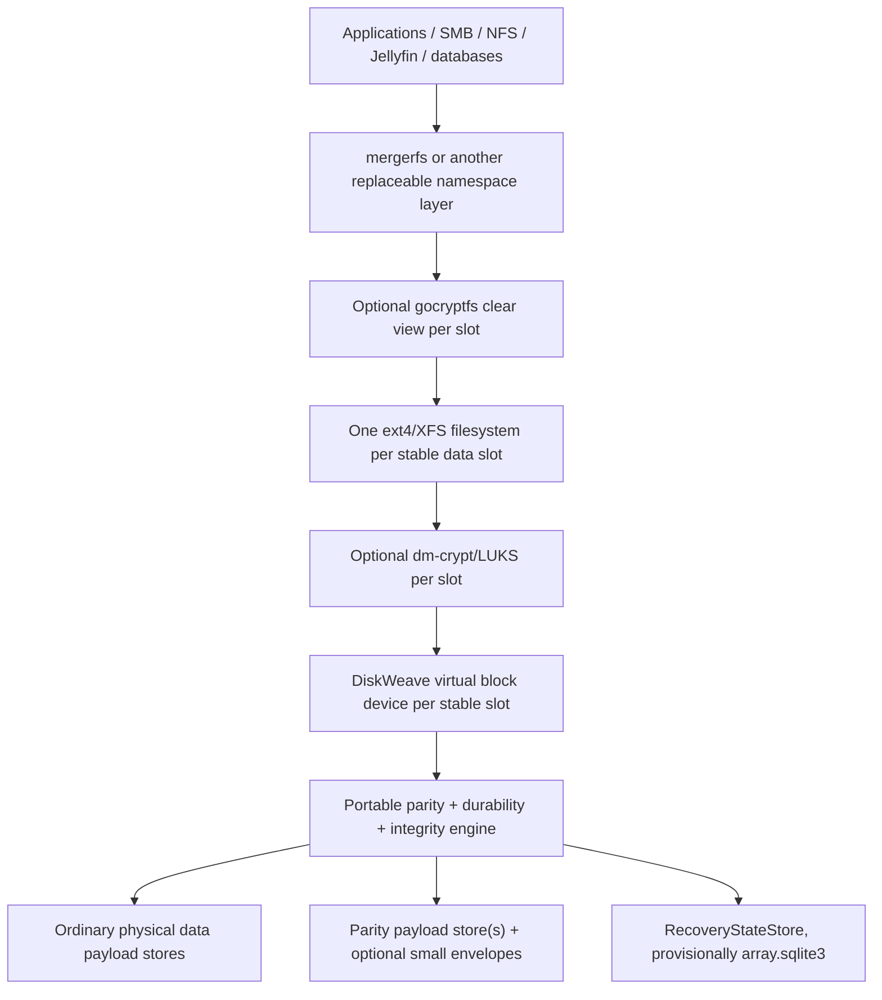

For gocryptfs, ciphertext files reside on each conventional member filesystem and cleartext views are pooled above them. For dm-crypt, encryption sits immediately above each DiskWeave virtual member. Both arrangements preserve parity over opaque bytes and keep keys outside the core.

## 4.2 Block parity versus a file-aware parity filesystem

DiskWeave deliberately chooses the first of two materially different products:

1. **Block-level parity — chosen.** DiskWeave protects every byte of each conventional member block image, including filesystem metadata. Existing filesystems retain allocation, fsync, mmap, xattr, ACL, hard-link, rename, and crash-recovery semantics.
2. **File-aware FUSE parity — rejected for the core.** DiskWeave would need to own placement, lower-file extent identity, sparse allocation, truncation, reflinks, metadata updates, directory atomicity, mmap, fsync, xattrs, hard links, and recovery. It would become a custom filesystem or depend on a proprietary extent database.

The reason is semantic fit, not a blanket performance judgment about FUSE. FUSE remains appropriate for an optional namespace implementation and may be useful as a macOS transport bridge.

## 4.3 Frontend-neutral portable core

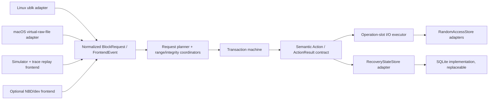

The core sees stable slot IDs, byte ranges, data buffer tokens, operation flags, topology epochs, integrity generations, and durability requirements. It never sees ublk queue tags, io_uring SQEs/CQEs, FSKit objects, file descriptors, SQLite row IDs, mount paths, or async-runtime task handles.

## 4.4 Parity plane and namespace plane

The **parity plane** (`dwvd` plus portable libraries) exposes one virtual block image per stable data slot, updates parity/recovery state, performs degraded reads, rebuild, check, scrub, and reports exact consistency/integrity state.

The **namespace plane** mounts each member filesystem and merges paths. mergerfs is the first implementation. An optional future `dwv-poold` is separately specified, knows filenames, and never defines raw parity layout or recovery truth.

The planes may share a repository, CLI, telemetry envelope, and deployment module, but remain independently restartable and replaceable.

## 4.5 Direct recovery and software-disappearance properties

- Stopping DiskWeave removes virtual endpoints but leaves each healthy data payload as an ordinary filesystem image.
- Direct read-only attachment of a healthy payload is a supported recovery workflow.
- Direct read-write attachment outside DiskWeave invalidates parity/integrity evidence and requires a new baseline.
- Removing mergerfs or a future `dwv-poold` leaves member filesystems accessible individually.
- Losing `control.sqlite3` loses history/cache/UI state only.
- Losing `array.sqlite3` loses current protocol and integrity evidence, but all surviving data members can be imported into a new topology and new parity baseline.
- Losing DiskWeave binaries does not make a healthy data payload proprietary. The project SHALL publish the parity mapping, parity-envelope format, exported recovery-manifest format, and a slow portable reference verifier/rebuilder.

# 5. Component, process, and dependency boundaries

## 5.1 Rust workspace boundaries

| Component | Responsibility | Must not know about |
|---|---|---|
| `dwv-core` | Stable IDs, topology snapshots, normalized requests, status dimensions, errors, decision rules | ublk/FSKit structs, io_uring, SQLite schema, Nix options |
| `dwv-codec` | Portable XOR/P/Q reference math and optimized implementations behind semantic traits | Device I/O, topology mutation, frontend tags |
| `dwv-format` | Parity-envelope, exported manifest, normalized trace, and golden-fixture codecs | Data-member headers, Linux paths, executor types, crate enum layouts |
| `dwv-recovery` | Recovery-state semantics, dirty/integrity generations, topology transactions, metadata-loss policy | SQLite pragmas, paths, frontend APIs |
| `dwv-recovery-sqlite` | SQLite implementation of `RecoveryStateStore`, migrations, integrity checks, backup/export | Parity math, ublk tags, operator UI history |
| `dwv-transaction-ref` | Explicit reference transaction machine and normalized action traces | Kernel I/O, SQLite calls, control UI |
| `dwv-transaction-proc` | `procmachines` implementation of the same semantic protocol | ublk tags, CQEs, pinned buffers, schema rows |
| `dwv-range` | Request splitting, global parity-address locks, checksum-extent coordination | FUSE names, queue topology |
| `dwv-durability` | Dirty/fence/journal/checkpoint/session-clean semantics and recovery decisions | OS frontend details, concrete DB |
| `dwv-store` | `RandomAccessStore`, capabilities, identity observations, buffer-token contracts | Filesystem names, mergerfs policy |
| `dwv-executor` | Bounded operation slots, child-I/O fanout, buffers, cancellation/drain, semantic aggregation | Persistent-format policy beyond action contracts |
| `dwv-sim` | Deterministic durable/volatile media, completion, fault, crash, and power-loss model | Linux/macOS frontend APIs |
| `dwv-frontend-ublk` | Translate Linux block requests, tags, flags, limits, and recovery events | Parity algorithm internals, recovery schema |
| `dwv-backend-linux` | Raw block/file I/O, io_uring or fallback, CQE ownership, capability probes | Namespace policy, SQLite schema |
| `dwv-frontend-macos` | Expose virtual raw-file endpoints and translate operations/sync | Parity-format internals, SQLite row layout |
| `dwv-control` | Assembly, identity assessment, topology transactions, jobs, reconciliation, control protocol | Kernel buffer implementation |
| `dwv-control-sqlite` | Non-authoritative `control.sqlite3` inventory/history/statistics/UI projection | Dirty/clean authority, degraded-read eligibility |
| `dwvd` | Process composition and privileged lifecycle | Pool placement semantics |
| `dwv` | Administrative CLI, inspector, offline verification/recovery tools | Ad hoc raw mutation without plans |
| `dwv-pool-core` / `dwv-poold` | Optional whole-file placement and merged namespace | Raw payload/parity devices, recovery DB internals |
| `dwv-nixos` | Kernel probes, units, namespaces, mounts, desired policy | Mutable assignment generations |

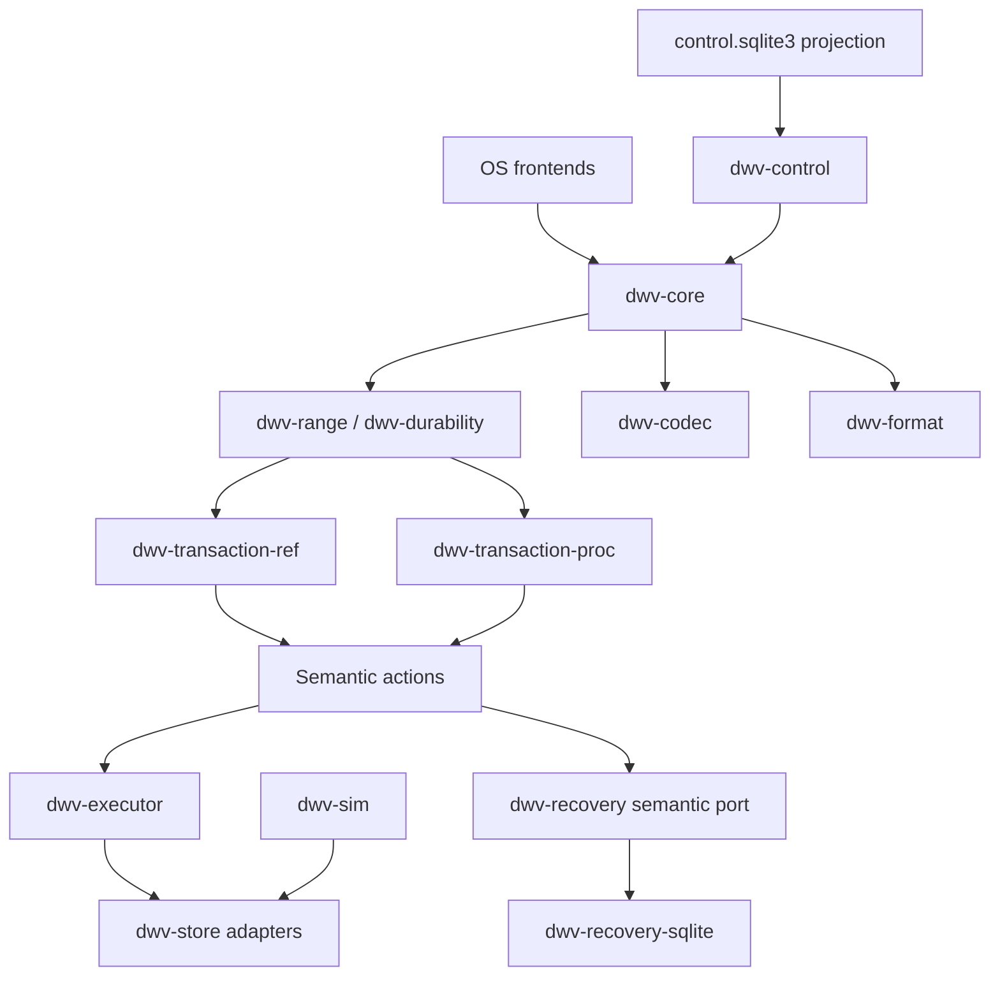

Dependency-direction tests SHALL prevent OS, database, and runtime crates from leaking into portable semantic crates. `dwv-recovery-sqlite` depends on recovery semantics; recovery semantics do not depend on SQLite.

## 5.2 Process and privilege model

- `dwvd` is the dedicated parity process. Namespace pooling runs separately.
- Linux assembly resolves identity evidence, takes an exclusive recovery-state writer lock, opens every required data/parity store with the strongest practical exclusive semantics, validates the complete set, and only then exposes ublk devices. `O_EXCL` is a useful local block-device fence, not multi-host protection [E14].
- Recovery DB lock, parity-envelope ownership, and data/parity claims are acquired as one all-or-nothing assembly set. Failure to claim one required component releases the partial set and exposes no writable virtual member.
- The Linux daemon runs in a mount namespace distinct from consumers of its ublk devices; `libublk-rs` documents a self-deadlock hazard otherwise [E11].
- macOS file-backed mode uses process locks, immutable resolved paths, file-ID checks, and denial of direct writable attachment to backing payloads while active.
- The data plane performs no SMART polling, HTTP, UI work, schema migration, or unbounded callbacks.
- Administrative operations use a versioned local protocol at `/run/diskweave/control.sock` on Linux and an equivalent private local endpoint on macOS. Rust enums and SQLite table layouts are not wire formats.

## 5.3 Authority and persistence classes

DiskWeave has three conceptual persistence domains plus declarative desired policy:

1. **Declarative desired policy — non-authoritative input.** Nix/macOS configuration, permitted devices, resource caps, safety profile, mount paths, and service ordering. Rebuilding a host SHALL NOT silently rewrite array topology.
2. **Domain A: ordinary data payloads.** Conventional user block images with no required DiskWeave bytes.
3. **Domain B: DiskWeave recovery state.** `array.sqlite3`, optional parity-device envelopes, exported recovery manifests, and later journal/PPL state. This domain controls writable assembly and recovery but is reconstructable when all data survive.
4. **Domain C: reconstructible management state.** `control.sqlite3`, logs, histories, friendly names, caches, and UI/job presentation.

An `array.sqlite3` row may authorize a protocol transition only through `RecoveryStateStore` semantics. A `control.sqlite3` row never authorizes a write, clears dirty state, selects a member, or certifies degraded reconstruction.

# 6. Array state, topology, and identity evidence

## 6.1 Orthogonal status model

A single enum such as `ReadyClean`/`ReadyDegraded` creates combinatorial ambiguity. DiskWeave represents independent dimensions and derives operator-facing modes:

```text
lifecycle:
  Stopped | Assembling | Recovering | Serving | Quiescing | Faulted

parity_consistency:
  Clean | Dirty(regions) | Indeterminate(reason) | Unknown

integrity_coverage:
  Current(percent, extents) | Stale(extents) | Absent | Unknown

data_availability:
  Complete | Reconstructable(missing_data_slots) | Unavailable

redundancy:
  Full | Reduced(missing_or_stale_roles) | None

access:
  ReadWrite | ReadOnly | Blocked

recovery_metadata:
  Current | Stale | Missing | Corrupt | Conflicting
```

Examples:

- `Serving + Clean + Current(99.997%) + Complete + Full + ReadWrite` → healthy with some stale checksums.
- `Serving + Clean + Stale(18) + Complete + Full + ReadWrite` → parity is safe; 18 checksum extents await revalidation.
- `Serving + Clean + Reconstructable + Reduced + ReadOnly` → degraded read service.
- `Recovering + Unknown + Unknown + Complete + Full + Blocked` → metadata-loss verification.

Normative rules:

- Every data-plane request captures an immutable `TopologySnapshot` with a monotonically increasing `topology_epoch`.
- A request SHALL never switch assignments or coding positions mid-transaction.
- `parity_consistency != Clean` plus missing data SHALL block automatic degraded reads unless replay/certificate evidence proves the requested state.
- Operator words such as “healthy,” “degraded,” and “unprotected” are derived labels, not persisted protocol states.

## 6.2 Topology transitions

Adding, removing, replacing, resizing, or changing a member role SHALL use a recoverable staged transition:

1. stop admission of affected new writes;
2. drain or recover in-flight transactions;
3. validate identity evidence, geometry, capacity, and the rollback plan;
4. durably record a **prepared** topology generation in recovery state while the old committed topology remains active;
5. initialize, evacuate, rebuild, or recompute under the prepared generation and persist correctness-critical progress;
6. verify the prepared member/parity state completely enough for the operation;
7. durably commit the new topology as active in `array.sqlite3`;
8. durably commit the same generation to every required parity-device envelope; if this fails, expose no new epoch and reconcile from the committed DB at restart;
9. publish the new immutable topology epoch to frontends;
10. only then release obsolete devices or increase access/redundancy claims; export manifests/backups after the committed state exists and never make an off-host export a synchronous transaction participant.

The DB commit precedes the envelope's committed-generation update so a newer parity envelope can never become active while recovery state still names the old topology. A crash between those steps blocks publication and is reconciled conservatively. udev, Disk Arbitration, file-watch, and I/O events are observations. They never mutate a transaction’s topology directly.

## 6.3 Stable logical identity

Each assignment contains distinct semantic identifiers:

- `array_uuid` — array identity;
- `slot_uuid` — stable logical data-slot identity;
- `role` — data, P, Q, or future parity role;
- `coding_position` — explicit coefficient/index position used by parity math;
- `assignment_instance_uuid` — identity of this particular physical assignment event;
- `assignment_generation` — monotonic generation within the array;
- `topology_epoch` — immutable request-visible mapping generation;
- expected protected length and geometry;
- observed identity evidence and its assessment.

A data member does **not** need to remember its historical `slot_uuid` while isolated. Recovery state maps observed devices to slots. Replacing hardware preserves `slot_uuid` and `coding_position` but creates a new assignment instance/generation.

Coding positions MAY remain sparse. Reuse after removal is prohibited until no recovery, journal, trace, or migration artifact can reference the old epoch; the first implementation SHOULD never reuse a coding position within an array.

## 6.4 Identity evidence model

The identity resolver consumes multiple observations rather than one magic identifier:

```text
IdentityEvidence:
  source:
    GPT_PARTUUID | FILESYSTEM_UUID | HARDWARE_WWN | DEVICE_SERIAL |
    TRANSPORT_PATH | CAPACITY | LOGICAL_GEOMETRY | PHYSICAL_GEOMETRY |
    FILE_ID | OPERATOR_ATTESTATION | OTHER
  normalized_value
  provenance
  observed_at
  expected_stability
  confidence_class
```

The resolver returns one of:

```text
ConfidentMatch
ChangedButExplainable(reason, required_action)
AmbiguousClone(candidates)
InsufficientEvidence(missing)
ConflictingAssignment(conflicts)
NewUnassignedDevice
```

Normative policy:

- filesystem UUID and PARTUUID duplication after cloning is expected and SHALL be detected, not treated as proof of identity;
- missing WWN/serial behind a USB bridge lowers confidence but does not automatically reject a device if other evidence is sufficient;
- capacity or geometry change requires an explicit replacement/resize path;
- a path name or probe order is never stable identity;
- writable assembly requires exactly one confident or explicitly attested candidate per required slot and no unaccounted clone conflict;
- read-only forensic tooling MAY expose candidates without choosing one;
- identity thresholds and explainable-change rules are deterministic, versioned policy, covered by fixtures, and shown by `dwv members --evidence`.

## 6.5 Physical-device access rules

A physical data payload and its byte-identical virtual member expose the same filesystem UUID. Deployment SHALL prevent duplicate writable mounts:

- Linux member mount units use stable `/dev/diskweave/<array>/<slot>` links, not generic filesystem-UUID discovery;
- physical partitions are ignored by automounters while the array is active;
- `dwvd` obtains the strongest practical exclusive access on Linux; file-backed adapters enforce equivalent single-writer policy;
- direct physical mounting while a virtual member is mounted is forbidden;
- direct read-only attachment is supported only while the array is stopped/quiesced;
- planned direct read-write maintenance SHALL first use a DiskWeave release workflow that durably marks the parity session `DIRTY/EXTERNAL_WRITE`, records the released stores, and then relinquishes claims; reassembly requires exhaustive verification or an explicit rebaseline;
- any unannounced direct read-write attachment invalidates parity, integrity evidence, and the parity-envelope clean fast path;
- DiskWeave never claims to infer all out-of-band writes, so a clean certificate assumes an intact exclusive-access chain of custody.

# 7. Geometry, parity, and granularity decisions

## 7.1 Protected geometry

- Protection applies to an opaque **data payload block image**. A native Linux data payload is normally an existing filesystem, LUKS, or whole-disk image. DiskWeave does not insert metadata before, after, or beside it as a requirement.
- Each virtual data member exposes exactly the protected byte range recorded for its slot; virtual byte zero maps to data-store byte zero.
- A parity device MAY reserve metadata outside its parity payload. Its logical parity byte zero maps to `parity_payload_offset`, never to physical byte zero by assumption.
- `largest_protected_data_payload <= usable_parity_payload` is mandatory. Bytes beyond a shorter data member contribute logical zero.
- A replacement may be larger but is initially exposed at the old protected length. Expansion is a separate topology operation.
- Existing filesystems/images must see compatible virtual geometry. The implementation SHALL certify 512-byte and 4096-byte logical-sector profiles and reject combinations whose alignment cannot be represented safely.
- Backend I/O respects each store’s minimum/alignment constraints even when upper writes are smaller; the range engine performs aligned RMW.
- Whether a payload contains a filesystem directly or a partition map plus filesystem does not alter parity mathematics.

## 7.2 Do not create one universal “parity page”

Parity is defined over byte ranges. Different units serve different purposes:

| Concept | Persisted? | Purpose | Initial direction |
|---|---:|---|---|
| Logical block size | Device property | What the virtual filesystem sees | Mirror/certify each imported member |
| Codec symbol width | Yes for Q | Finite-field interpretation | 1 byte for XOR; explicit for Q |
| RMW working block | No | Buffering and partial-write merge | 4 KiB initially |
| Lock quantum | No | Serialize overlapping parity updates | 4 KiB initially |
| Dirty-region size | Yes | Crash-recovery resync granularity | 1 MiB **PROVISIONAL** |
| Checksum extent | Yes | Integrity localization and repair | about 4 MiB **PROVISIONAL** |
| Journal block/alignment | Yes | Torn-record detection and replay | device-aligned **VALIDATE** |
| Batch extent | No | Throughput and syscall amortization | dynamic and bounded |

Per TiB of protected address space:

| Granularity | One-bit dirty map | 32-byte checksum/member |
|---:|---:|---:|
| 4 KiB | 32 MiB | 8 GiB |
| 64 KiB | 2 MiB | 512 MiB |
| 1 MiB | 128 KiB | 32 MiB |
| 4 MiB | 32 KiB | 8 MiB |

No `parity_page_bytes` field SHALL silently define locking, dirty tracking, checksums, journal layout, and SIMD. Persist only compatibility-relevant granularities.

## 7.3 Single parity

For data ranges `D_0 ... D_n`, parity `P` is:

```text
P = D_0 XOR D_1 XOR ... XOR D_n
```

A read-modify-write to data slot `k` uses:

```text
P_new = P_old XOR D_k_old XOR D_k_new
```

A missing range is reconstructed as:

```text
D_k = P XOR all surviving D_i where i != k
```

XOR is bytewise and independent of runtime batching. The format does not encode vector width or CPU dispatch.

## 7.4 Dual P/Q parity

Dual parity SHALL be a named, fully parameterized P/Q profile rather than merely “Reed-Solomon.” Persisted semantics include:

- field width and irreducible polynomial;
- symbol and byte ordering;
- coefficient assignment by explicit coding position;
- trailing-symbol, padding, and zero-extension rules;
- vectorization-independent golden vectors.

A practical form is XOR `P` plus finite-field `Q`:

```text
Q = sum(coefficient(coding_position_i) * D_i)
```

Library identity never defines this format. Single XOR parity is the first production target. Q is added only after single-parity crash, integrity, and metadata-loss semantics are proven.

## 7.5 Write strategies

**Read-modify-write (RMW)**

- Read old target data and old P; for dual parity, also old Q.
- Merge a partial incoming write into the working block.
- Compute deltas.
- Write new data and parity.
- Best for small writes and when other data disks are spun down.

**Reconstruct write (“turbo” mode)**

- Read all other data for the range.
- Compute parity from new target data plus surviving data.
- Write target and parity.
- Avoids old target/parity reads but activates all data disks.
- Useful for large sequential writes when disks are already active.

The policy is TUNABLE runtime state, not format. It SHOULD consider request size, array width, spin state, backend queues, integrity/dirty cost, and coalescing.

## 7.6 Add, remove, replace, and resize

- **Add data slot:** quiesce; assign slot/coding position; establish initial logical contents; recompute parity for the protected range; commit a new topology; verify before writable exposure.
- **Remove data slot:** evacuate data or explicitly accept destructive loss; compute parity under a new topology.
- **Replace failed data member:** assign a new assignment instance to the existing slot/coding position; rebuild to the old protected length; verify before promotion.
- **Expand data member:** parity payload capacity must already cover the new range; initialize/include it under a topology transaction before filesystem expansion.
- **Shrink:** unsupported until the upper filesystem is safely shrunk and removed bytes are proven irrelevant.
- **Replace parity:** initialize the new envelope/profile, rebuild payload, verify, then commit the new assignment generation. Old parity remains untouched until commit/rollback boundaries are satisfied.

# 8. Persistent state, parity envelope, and schema lock-in

DiskWeave does not have one monolithic “disk format.” It owns the smallest possible set of semantics across three authority domains.

## 8.1 Domain A — ordinary data payloads

A data payload is an opaque random-access byte range backed by a partition, whole-disk image, regular/sparse file, or another certified store.

Normative rules:

- it contains no required DiskWeave header, trailer, sidecar, partition, xattr, or hidden tail reservation;
- virtual payload byte zero maps to store byte zero;
- with DiskWeave stopped, a healthy payload remains attachable with ordinary tooling;
- shorter data members contribute zeros beyond their protected length;
- out-of-band writable access invalidates parity/integrity evidence;
- importing an existing filesystem does not require moving its bytes merely to create DiskWeave identity.

The user-data representation is therefore not a DiskWeave format.

## 8.2 Domain B — DiskWeave recovery state

Recovery state contains operationally important protocol truth:

- array UUID and format/profile identifiers;
- topology generations, stable slots, coding positions, assignments, and identity-evidence expectations;
- dirty/indeterminate regions, checkpoint/fence generations, and session state;
- integrity profiles, per-extent validity/digests/generations for data and parity;
- build, verification, rebuild, and migration state when correctness depends on resumability;
- future journal/PPL records and checkpoints;
- parity-device envelope state and exported recovery-manifest identity.

The preferred implementation is a separate database conventionally named:

```text
array.sqlite3
```

`array.sqlite3` is the current consistency certificate and recovery accelerator. It is authoritative during ordinary writable operation, but not existential to intact user data.

### 8.2.1 External durability protocol

SQLite commits only recovery-state bytes. It cannot atomically include writes to independent data/parity devices. DiskWeave therefore implements:

```text
SQLite durable dirty/integrity intent
        ↓
protected data/parity mutation
        ↓
required data/parity durability fence
        ↓
SQLite durable checkpoint/clean transition
```

No home-media mutation may occur before the first transition is durably committed. No region may become clean before the third transition succeeds and the final SQLite transition is durable.

### 8.2.2 Loss semantics

Losing `array.sqlite3` may cause:

- loss of fine-grained dirty-region knowledge;
- loss of historical checksum evidence;
- loss of current topology/assignment convenience;
- inability to certify degraded reconstruction in some failure combinations;
- exhaustive parity verification or parity rebuild;
- loss of resumable maintenance progress.

It SHALL NOT make intact data payloads unreadable. With all data members present, DiskWeave can create a new topology, verify or rebuild parity, and create a fresh recovery DB and checksum baseline.

### 8.2.3 Protection profiles

- **Basic:** one `array.sqlite3`; safe behavior on loss is to stop writes and use the metadata-loss recovery matrix.
- **Recommended:** `array.sqlite3` on ordinary redundant host storage such as ZFS mirror, btrfs RAID1, Linux MD RAID1, or mirrored system SSDs.
- **Stronger:** recommended profile plus independent periodic/off-host exported recovery manifest and database backup.
- **Future:** application-level synchronous recovery-state replicas using conservative dirty-union semantics.

DiskWeave SHALL not invent distributed consensus in v0 merely to avoid relying on boring mirrored host storage. If application-level replicas are later used, `CLEAN < DIRTY/UNKNOWN`; disagreement resolves conservatively and replica-set membership changes use an explicit protocol.

## 8.3 Small parity-device metadata envelope

Data members remain formatless to DiskWeave. Parity devices are already DiskWeave-owned and have no independently useful conventional filesystem, so a small redundant envelope can materially improve discovery, compatibility, and disaster recovery without weakening the data-member property.

### 8.3.1 Preferred conceptual layout

```text
DiskWeave parity extent
├── metadata copy A (known location)
├── reserved recovery-extension area (bounded)
├── parity payload (simple directly addressable P or Q bytes)
└── metadata copy B (known location near opposite end)
```

The exact offsets and reserve size are **FORMAT-EXPERIMENTAL**. A second GPT metadata partition is not required merely to host the envelope.

The logical equation remains:

```text
P[logical_offset:length] = XOR(all data slots[logical_offset:length])
```

The envelope declares how logical parity offsets map into the physical extent. It does not introduce a filesystem, allocator, B-tree, object store, or general WAL.

### 8.3.2 Candidate fields

The format OpenSpec SHALL evaluate a tiny fixed outer header plus a bounded, checksummed canonical body containing only concrete bootstrap/recovery facts such as:

```text
magic
superblock_format_version
compatible / read_only_compatible / incompatible feature bits

array_uuid
parity_device_uuid
parity_role                    # P, Q, ...
codec_profile_id and parameters

parity_payload_offset
parity_payload_length
logical geometry

committed_topology_generation
compact topology/coding-position recovery manifest
last_closed_recovery_manifest identity/digest
session_open_recovery_generation          # stable for the writable session, not per-write DB head

last_global_clean_checkpoint
last_full_verified_checkpoint, if one exists
array_session_state            # CLEAN | DIRTY | UNKNOWN

metadata_copy_generation
migration_state
checksums over header/body
```

`last_full_verified_checkpoint` SHALL be recorded only after a quiescent or otherwise formally consistent complete verification. Ordinary writes do not create a “fully verified” generation.

The envelope SHALL NOT contain:

- full per-extent checksum tables;
- SMART/UI/history data;
- arbitrary key/value records;
- a custom allocator or B-tree;
- application logs;
- unbounded topology history;
- the normal per-write transaction database.

### 8.3.3 A/B selection and feature behavior

- Copies have monotonic generations, content checksums, explicit lengths, and deterministic newest-valid selection.
- Unknown incompatible features prohibit writable assembly.
- Unknown read-only-compatible features permit only the explicitly defined read-only behavior.
- A torn, missing, conflicting, stale, or clone-ambiguous copy resolves to `DIRTY/UNKNOWN`, never optimistic `CLEAN`.
- Both copies damaged does not destroy user data. All-data-present recovery can ignore old parity and build a new baseline.
- `dwv inspect` and an independent reference decoder understand the stable envelope format.

## 8.4 Coarse parity-session clean/dirty fallback

The likely native baseline marks the parity set dirty for the entire writable session:

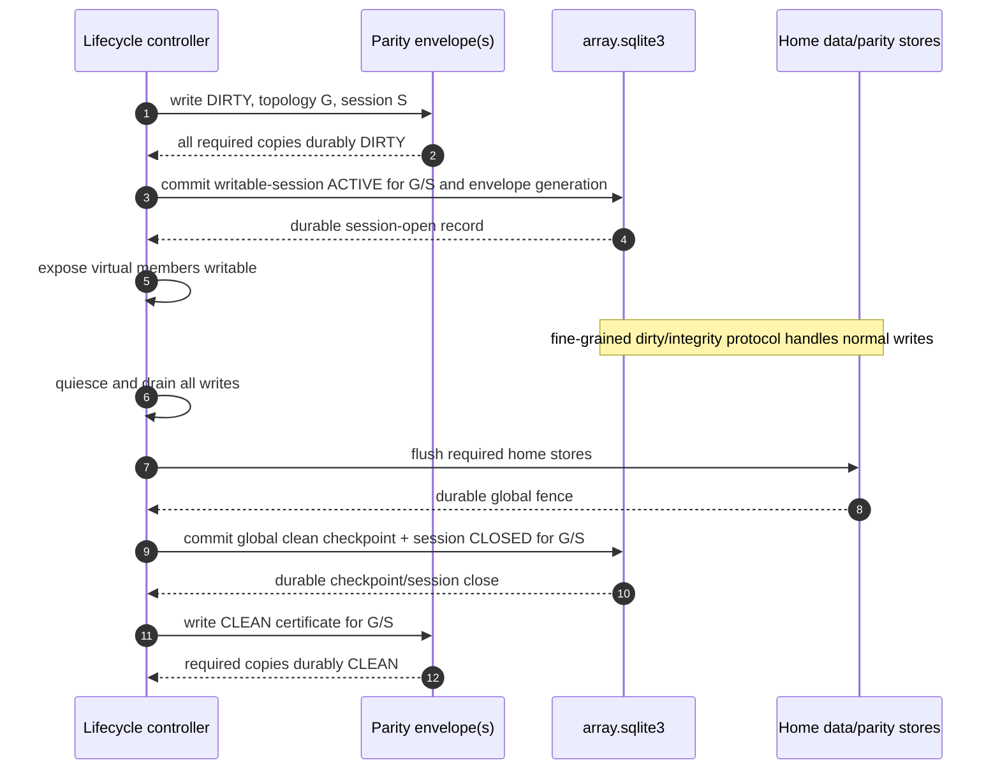

Preconditions before writable exposure:

- every required parity envelope is valid, expected, and durably `DIRTY` for the new session;
- `array.sqlite3` topology and envelope topology agree;
- `array.sqlite3` durably records the same session as `ACTIVE`, including the envelope generation that was dirtied;
- no exported virtual member exists before both the envelope dirty mark and DB session-open record are durable.

Postconditions for a `CLEAN` certificate:

- the array was quiescent;
- every protected data/parity write covered by the session is durable;
- `array.sqlite3` has a durable clean checkpoint for the same topology/session;
- every required parity envelope has durably committed the clean generation.

If any step fails or a crash occurs mid-transition, recovery never chooses the optimistic side. Reconciliation uses these rules:

- envelope `DIRTY(S)` plus a current matching DB `ACTIVE(S)` uses the DB's fine-grained dirty/indeterminate state;
- envelope `DIRTY(S)` plus a matching DB `CLOSED(S)` with a durable global fence may finish the envelope clean transition;
- envelope `DIRTY(S)` plus a missing, corrupt, stale, or nonmatching DB enters metadata-loss verification;
- envelope `CLEAN(S)` plus a DB that is dirty, stale, or nonmatching is not clean; the conservative DB/envelope conflict path applies;
- envelope `CLEAN(S)` plus matching DB `CLOSED(S)` is eligible for the fast path only after Gate H **and** when exclusive-access chain of custody since that close is not in doubt.

After simulator and power-cut certification, matching `CLEAN` certificates may allow reconstruction of `array.sqlite3` without an exhaustive parity scan. This restores **protocol parity-clean evidence**, not checksum coverage and not proof that no latent media corruption occurred after the certificate. The reconstructed DB therefore starts with integrity coverage absent/stale and SHOULD schedule an audit scrub. Before Gate H, the certificates are discovery evidence only.

## 8.5 Optional coarse dirty-region bitmap on parity devices

Profile C may add a redundant coarse bitmap to reduce recovery work when `array.sqlite3` is lost. At one bit per 1 MiB, the raw bitmap costs approximately 128 KiB per TiB of protected address space before redundancy and headers.

This is **VALIDATE**, not baseline, because an authoritative bitmap becomes another participant in the hot path:

```text
durably dirty region in array.sqlite3
+
durably dirty region in parity envelope bitmap
        ↓
only then mutate data/parity home locations
```

OS-007 SHALL compare:

| Profile | Contents | Foreground cost | DB-loss recovery | Format complexity |
|---|---|---:|---|---|
| A | Bare parity payload + external DB | none | broad verification unless other evidence survives | lowest |
| B | Redundant envelope/session certificate + external DB | session-level writes only | fast clean-session recovery or broad verification | low |
| C | B + coarse dirty bitmap | possible per-region metadata flushes | potentially verify only dirty regions | materially higher |

Profile B is the likely baseline. Profile C is selected only if exhaustive simulation and representative media benchmarks show that avoided verification justifies extra durability participants, torn-page logic, and write amplification.

## 8.6 Domain C — reconstructible management state

A separate conceptual store, provisionally:

```text
control.sqlite3
```

contains:

- SMART and device-health history;
- performance history and aggregates;
- friendly names and UI state;
- operator events and audit presentation;
- historical/non-authoritative jobs;
- cached discovery indexes and search data;
- normalized trace catalog/provenance;
- telemetry retention metadata.

Deleting `control.sqlite3` has no safety consequence. It is rebuilt from current devices, recovery state, and retained logs where available. A correctness-critical job cursor belongs in Domain B; Domain C may hold richer presentation/history.

The default SHOULD use physically separate `array.sqlite3` and `control.sqlite3` files because authority is easier to audit, back up, test, and recover. A later implementation may colocate them only if the authority boundary remains mechanically enforced and deletion/rebuild tests prove no safety coupling.

## 8.7 SQLite implementation and executable evaluation

SQLite is preferred because of its mature transaction machinery, stable cross-platform format, tooling, migrations, and operational familiarity [E18][E19][E20]. Pure Rust is not sufficient reason to prefer a younger database.

`RecoveryStateStore` keeps the choice reversible. OS-005 compares SQLite with at least redb, LMDB/libmdbx, RocksDB/LSM, and a purpose-built WAL/bitmap on:

1. crash-safety maturity;
2. durability semantics;
3. operational boringness;
4. inspectability/recovery tooling;
5. cross-platform behavior;
6. schema migration;
7. implementation simplicity;
8. representative performance.

SQLite configuration is an executable decision. Evaluate relevant WAL and rollback-journal modes, synchronization levels, checkpoint policy, page size, one/two connection patterns, process kill, simulated host reset, abrupt VM reset, and later real power loss. SQLite documents that WAL with `synchronous=NORMAL` can lose recent commits after power loss, while stronger synchronization adds commit-time sync work; DiskWeave shall not choose the mode by folklore [E19]. SQLite also depends on truthful OS/hardware sync behavior [E20].

A successful SQLite commit means only that the configured SQLite/VFS/storage contract was satisfied. The DiskWeave home-store protocol remains separate.

## 8.8 Do not put parity payload in SQLite or a production filesystem

Storing parity chunks as SQLite BLOB rows is rejected as the production layout because it adds B-tree/page overhead, journaling/WAL amplification, large-sequential-I/O indirection, database coupling, and still cannot atomically include unrelated data-device writes.

A layout such as:

```text
parity disk
└── XFS
    ├── parity.bin
    └── array.sqlite3
```

is also rejected as the default. Filesystem and database overhead reduce usable parity capacity and add an extra recovery dependency. A larger parity device MAY use excess capacity for optional backups, but correctness does not require a filesystem around parity.

## 8.9 Capacity and exact-capacity imports

A metadata reserve necessarily reduces usable parity payload:

```text
usable_parity_payload = physical_parity_extent - reserved_envelope_bytes
```

Therefore:

```text
largest_protected_data_payload <= usable_parity_payload
```

Before a parity envelope becomes mandatory for stable arrays, OS-007 SHALL choose and test one or more explicit policies:

1. require parity storage slightly larger than the largest imported data payload;
2. provision native DiskWeave data payloads with a matching capacity margin;
3. support a deliberately weaker bare-parity exact-capacity profile with external recovery state;
4. reject the configuration.

DiskWeave SHALL never truncate protection silently. The reserve should be modest and justified by concrete topology/recovery needs; speculative gigabyte reservations are rejected.

## 8.10 Metadata-loss verification and selective repair contract

With all data present and `array.sqlite3` missing:

1. discover candidate data/parity stores without writing;
2. assess identity ambiguity;
3. recover topology/coding information from parity envelopes or an exported manifest when available;
4. otherwise create a proposed new topology from explicit data-member selection;
5. exhaustively compare parity equations for every region not covered by trustworthy durable clean evidence;
6. classify matching regions as verified;
7. classify mismatches as **ambiguous integrity faults** unless surviving hashes identify the bad shard;
8. repair automatically only with sufficient verified evidence;
9. otherwise require an explicit data-authoritative rebaseline or preserve old parity and build a new target;
10. verify the chosen result, build a new checksum baseline, and create a fresh `array.sqlite3`.

A full verification scan reads the full protected address space. It is not a full parity rewrite. Matching regions require zero parity writes.

## 8.11 Permanent-format governance

DiskWeave owns only these potential compatibility formats:

| Format | What is persisted | Why | Migration rule |
|---|---|---|---|
| Data payload | No DiskWeave format | independent filesystem/image | none; direct ordinary tooling |
| Parity payload mapping | codec profile + logical-to-physical payload boundaries | interpret P/Q bytes | profile change requires new parity baseline or dual-format migration |
| Parity envelope | bootstrap, topology/coding recovery, features, session certificate | safe discovery/recovery/evolution | A/B staged generation; old reader behavior defined; interrupted migration selects last valid committed copy |
| `array.sqlite3` schema | recovery-state semantics | operational protocol | transactional schema migration; exported semantic manifest; rebuild path with all data |
| Exported recovery manifest | versioned semantic topology/profile/evidence snapshot | offline backup/interchange | versioned documented schema with compatibility rules |
| `control.sqlite3` schema | non-authoritative management state | convenience | discard/rebuild allowed |
| Trace fixture | development request/workload format | regression replay | versioned fixture migration; never array truth |

All custom formats use bounded lengths, explicit endianness, semantic algorithm IDs, feature bits, checksums, golden fixtures, fuzzing, deterministic copy selection, and independent decoding. No format encodes Rust discriminants, crate identities, pointers, queue tags, SQLite page numbers, or SIMD widths.

Format v1 is prohibited until exact-capacity behavior, corrupted/torn copies, downgrade, unknown features, interrupted migration, independent recovery tools, and full disaster-recovery drills pass.

# 9. Portable semantic contracts

The interfaces in this section are normative **semantic shapes**, not frozen Rust APIs. Implementations may use traits, callbacks, polling, async functions, generators, channels, or synchronous adapters so long as observable behavior and ownership remain equivalent.

## 9.1 Normalized block request and frontend events

```rust
struct BlockRequest {
    request_id: RequestId,
    frontend_id: FrontendId,
    slot_id: SlotUuid,
    topology_epoch: TopologyEpoch,
    op: BlockOp,
    range: ByteRange,
    buffer: Option<BufferToken>,
    ordering: OrderingIntent,
    durability: DurabilityIntent,
}

enum BlockOp {
    Read,
    Write,
    Flush,
    WriteZeroes,
    Discard,
}

struct OrderingIntent {
    submission_sequence: u64,
    preflush: bool,
    fence_domain: FenceDomain,
}

enum DurabilityIntent {
    Ordinary,
    Fua,
    ExplicitFlush,
}

enum FrontendEvent {
    Abandon { request_id: RequestId },
    Quiesced { frontend_id: FrontendId, through_sequence: u64 },
    Lost { frontend_id: FrontendId, duplicate_delivery_possible: bool },
    Recovered { frontend_id: FrontendId },
}
```

Semantics:

- `range` is byte-addressed and already validated for integer overflow; adapters may require alignment but the core mapping is byte-semantic.
- `buffer` is a generational handle to executor-owned memory, never a pointer persisted or retained by a frontend after terminal completion.
- `Abandon` changes completion interest only. It does not cancel an irreversible transaction.
- preflush/FUA/flush intent is preserved, emulated only with proven equivalence, or rejected; it is never silently discarded.
- the core never receives ublk tags, io_uring user data, FSKit item IDs, file descriptors, or async-runtime handles.

## 9.2 Frontend adapter contract

A frontend SHALL:

- translate OS operations and flags without silent strengthening or weakening;
- preserve ordering/fence evidence and report duplicate-delivery possibilities;
- advertise only limits/capabilities that the full path can satisfy;
- apply backpressure before unbounded memory or task creation;
- map terminal core results to deterministic OS-visible completion;
- retain frontend-owned tags/resources until the operation slot declares safe reclamation;
- report abandonment, loss, quiescence, and recovery explicitly;
- prevent backing/export aliasing.

The initial contract supports read, write, flush, FUA/preflush where expressible, write-zeroes, and a discard-disabled profile. Zoned commands are rejected.

## 9.3 Random-access store contract

```rust
trait RandomAccessStore {
    fn identity_observations(&self) -> IdentityObservationSet;
    fn capabilities(&self) -> StoreCapabilities;
    fn length(&self) -> u64;

    // Exact-range semantic operations. Implementations return structured
    // partial/uncertain evidence rather than silently looping away errors.
    fn read_at(&self, range: ByteRange, dst: BufferToken) -> StoreCompletion;
    fn write_at(&self, range: ByteRange, src: BufferToken, intent: WriteIntent)
        -> StoreCompletion;
    fn flush(&self, through: StoreWriteWatermark) -> StoreCompletion;
    fn write_zeroes(&self, range: ByteRange, intent: WriteIntent) -> StoreCompletion;
    fn discard(&self, range: ByteRange) -> StoreCompletion;
}

struct StoreCompletion {
    operation_id: ChildOperationId,
    completed: ByteRangeSet,
    disposition: CompletionDisposition,
    persistence: PersistenceEvidence,
}

enum CompletionDisposition {
    Success,
    Short,
    Failed(StoreError),
    Uncertain,
    Duplicate,
}
```

Rules:

- core callers decide whether retries are legal; adapters do not hide duplicate/partial effects behind an opaque success;
- a timeout with unknown media effect returns `Uncertain`;
- a store disappearance invalidates future operations under the captured topology but does not rewrite that topology;
- sparse holes are a backend allocation detail and read as zeros only where the store contract says so;
- direct I/O, io_uring, threads, mmap, or synchronous syscalls are implementation details.

### 9.3.1 Persistence and fence evidence

```rust
enum PersistenceEvidence {
    VolatileOrUnknown,
    DurableByFua { store: StoreId, through: StoreWriteWatermark },
    DurableByFence { fence: StoreFenceRef },
}

struct StoreFenceRef {
    fence_id: FenceId,
    store_id: StoreId,
    topology_epoch: TopologyEpoch,
    through: StoreWriteWatermark,
    capability_evidence_id: CapabilityEvidenceId,
}

struct FenceCertificate {
    topology_epoch: TopologyEpoch,
    fence_domain: FenceDomain,
    stores: Vec<StoreFenceRef>,
    captured_region_generations: Vec<(RegionId, u64)>,
}
```

A fence reference is semantic evidence, not an OS file descriptor or a promise inferred from elapsed time. It covers only writes to the named store submitted through the named watermark under the same store identity, topology epoch, and certified capability path. Reopening through a different device path, replacing media, changing cache policy, or losing capability provenance invalidates reuse until re-probed.

A write completion with `VolatileOrUnknown` may satisfy ordinary frontend write-back semantics but cannot authorize checksum `VALID`, region `CLEAN`, clean shutdown, or a durable FLUSH/FUA completion. A `FenceCertificate` becomes usable for a clean transition only after every required store has covering evidence and recovery state durably records the certificate under unchanged region generations.

## 9.4 Storage and frontend capability contract

```rust
struct StoreCapabilities {
    logical_block_size: u32,
    physical_block_size: u32,
    minimum_io_size: u32,
    optimal_io_size: Option<u32>,
    maximum_transfer: u64,
    required_alignment: u32,

    durable_flush: CapabilityEvidence,
    fua: CapabilityEvidence,
    stable_ordering: CapabilityEvidence,
    atomic_write_granularity: Option<u32>,
    torn_write_model: TornWriteModel,
    volatile_cache: VolatileCacheModel,

    write_zeroes: OperationCapability,
    discard: DiscardCapability,
    sparse_allocation: bool,
    direct_io: bool,
    cancellation: CancellationCapability,
    stable_identity_sources: IdentitySourceSet,
}

struct CapabilityEvidence {
    support: Supported | Unsupported | Unknown,
    evidence: Declared | Probed | Certified,
    probe_version: Option<String>,
    hardware_path_fingerprint: Option<String>,
}
```

The core selects a safety profile or refuses assembly:

- **simulation-certified** — deterministic backend satisfies the formal simulator model;
- **portable-demo** — functional semantics are available; physical power-loss durability is not claimed;
- **production-read-only** — identity/read behavior is safe but write durability is insufficient;
- **production-write-safe** — required SQLite, home-store, flush/order, and parity-envelope behavior is probed and hardware-certified.

A boolean advertised by an OS is not automatically a production certificate.

## 9.5 Recovery-state contract

`RecoveryStateStore` expresses semantic transactions rather than SQL:

```rust
trait RecoveryStateStore {
    fn load_assembly_snapshot(&self) -> RecoverySnapshot;
    fn verify_integrity(&self) -> RecoveryStoreHealth;

    fn begin_protocol_txn(&self, expected: RecoveryGeneration)
        -> RecoveryTxn;

    fn commit_durable(&self, txn: RecoveryTxn)
        -> Result<CommittedRecoveryGeneration, RecoveryError>;

    fn export_manifest(&self, generation: RecoveryGeneration)
        -> RecoveryManifest;
}

struct RecoveryTxn {
    expected_topology_epoch: TopologyEpoch,
    mutations: Vec<RecoveryMutation>,
}

enum RecoveryMutation {
    BeginWritableSession {
        session_id: SessionId,
        topology_epoch: TopologyEpoch,
        dirty_envelope_generation: u64,
    },
    MarkRegionDirty { region: RegionId, mutation_generation: u64 },
    MarkIntegrityStale { extent: IntegrityExtentId, stale_generation: u64 },
    RecordHomeFence { fence: FenceCertificate },
    CloseWritableSession { session_id: SessionId, global_fence: FenceCertificate },
    MarkRegionClean { region: RegionId, through_generation: u64 },
    InstallIntegrityDigest { record: IntegrityRecord },
    PrepareTopology { topology: TopologySnapshot },
    CommitTopology { topology_epoch: TopologyEpoch },
    RecordMaintenanceCheckpoint { job: JobId, cursor: RecoveryCursor },
}
```

Normative behavior:

- `commit_durable` is all-or-nothing for recovery mutations in that transaction according to the selected certified SQLite configuration;
- it does not imply any data/parity write is durable;
- optimistic generation mismatch aborts without side effects;
- database corruption, disappearance, or stale generation blocks new home mutations;
- implementations support integrity check, semantic export, schema migration, and rebuild from a recovery plan;
- SQL table names and row IDs do not cross this interface.

## 9.6 Topology snapshot and identity assessment

```rust
struct TopologySnapshot {
    array_uuid: ArrayUuid,
    topology_epoch: TopologyEpoch,
    assignment_generation: u64,
    codec_profile: CodecProfileId,
    data_slots: Vec<DataAssignment>,
    parity_slots: Vec<ParityAssignment>,
    protected_length: u64,
    recovery_manifest_digest: Digest,
}

struct DataAssignment {
    slot_uuid: SlotUuid,
    coding_position: CodingPosition,
    assignment_instance_uuid: AssignmentInstanceUuid,
    store_id: StoreId,
    protected_length: u64,
    expected_geometry: Geometry,
    expected_identity: IdentityExpectation,
}

enum IdentityAssessment {
    ConfidentMatch,
    ChangedButExplainable { reason: String, requires_operator_ack: bool },
    AmbiguousClone { candidates: Vec<StoreId> },
    InsufficientEvidence { missing_sources: Vec<IdentitySource> },
    ConflictingAssignment { conflicts: Vec<IdentityConflict> },
    NewUnassignedDevice,
}
```

Snapshots are immutable and reference stores through stable process-local IDs. A transaction finishing under epoch `E` never observes epoch `E+1`.

## 9.7 Operation-slot contract

```rust
struct OperationSlot {
    slot_token: OperationSlotToken,       // index + generation
    request_id: RequestId,
    topology_epoch: TopologyEpoch,
    frontend_completion_required: bool,
    state: OperationSlotState,
    buffers: Vec<BufferToken>,
    children: Vec<ChildOperationState>,
    submitted_watermarks: StoreWatermarks,
    terminal_evidence: Option<TerminalEvidence>,
}

enum OperationSlotState {
    Reserved,
    Submitted,
    PartiallyCompleted,
    Draining,
    CompletionUncertain,
    ReconciliationRequired,
    Reconciled,
    Reclaimable,
}
```

An operation slot, not the transaction machine, owns actual in-flight buffers, frontend tags, child-operation IDs, and drain state. A slot becomes `Reclaimable` only after every child operation is terminal under the backend contract and any required semantic reconciliation is recorded.

Duplicate completion for a terminal child is detected and ignored as a duplicate; completion for a stale slot generation is a fatal adapter invariant violation and is never applied to reused memory.

## 9.8 Semantic transaction actions and results

```rust
enum TransactionAction {
    AcquireRange { ranges: Vec<ParityRange> },
    PersistDirtyAndInvalidateIntegrity {
        dirty_regions: Vec<RegionId>,
        checksum_extents: Vec<IntegrityExtentId>,
    },
    ReadSet { reads: Vec<PlannedRead> },
    ComputeParity { plan: ParityComputationPlan },
    WriteSet { writes: Vec<PlannedWrite> },
    FlushSet { stores: Vec<StoreId>, through: StoreWatermarks },
    CommitCheckpointOrClear { certificate: FenceCertificate },
    ReleaseRange,
}

enum ActionResult {
    RangeAcquired(RangeGuardToken),
    RecoveryIntentDurable(CommittedRecoveryGeneration),
    ReadSetComplete(SemanticIoResult),
    ParityComputed(ComputationResult),
    WriteSetComplete(SemanticIoResult),
    FlushSetComplete(FenceEvidence),
    CheckpointCommitted(CommittedRecoveryGeneration),
    Failed(SemanticFailure),
}
```

The executor may fan one semantic action into many child operations. Individual CQEs never enter the transaction-machine API. Action traces are normalized so the reference and `procmachines` implementations can be compared despite allowed batching differences.

## 9.9 Dirty and integrity generation semantics

```rust
struct DirtyRegionRecord {
    region: RegionId,
    state: Clean | Dirty | Indeterminate,
    dirty_since_recovery_generation: Option<u64>,
    last_clean_fence: Option<FenceCertificate>,
}

struct IntegrityRecord {
    target: IntegrityTarget,              // data slot, P, Q
    extent: IntegrityExtentId,
    profile: IntegrityProfileId,
    state: IntegrityState,
}

enum IntegrityState {
    Absent,
    Stale { stale_generation: u64 },
    Valid {
        content_generation: u64,
        durable_through: StoreFenceRef,
        digest: Vec<u8>,
        verified_at_recovery_generation: u64,
    },
}
```

Rules:

- before the first home mutation of a `VALID` checksum extent, recovery state atomically changes it to `STALE` together with affected dirty regions;
- further writes while it remains `STALE` need not cause another durable checksum-state transition;
- a hash worker captures an in-memory mutation generation and target-store write watermark, obtains or reuses a durable fence covering that watermark, reads and computes the digest, then installs `VALID` only while holding the extent commit guard and proving no writer advanced the generation;
- every `VALID` record references durable target-store fence evidence; a stable read of volatile cache bytes alone can never create current integrity evidence;
- after a crash, every extent whose durable record is `STALE` remains stale regardless of lost in-memory counters;
- a digest is never interpreted under a different algorithm/extent profile or topology epoch.

## 9.10 Simulator contract

```rust
struct SimulatedStore {
    durable_media: ByteImage,
    volatile_acknowledged: Vec<VolatileWrite>,
    pending_operations: Vec<PendingOperation>,
    completion_queue: Vec<CompletionEvent>,
    fault_model: FaultModel,
}

enum SimOperation {
    Read { range: ByteRange },
    Write { range: ByteRange, data: GeneratedData },
    Flush { through: StoreWriteWatermark },
    FuaWrite { range: ByteRange, data: GeneratedData },
    CrashDaemon,
    PowerLoss,
    ResetDevice(StoreId),
    RemoveDevice(StoreId),
    RestoreDevice(StoreId),
    CorruptDurableBytes { store: StoreId, range: ByteRange },
    DeliverCompletion { child: ChildOperationId },
    DropCompletion { child: ChildOperationId },
    DuplicateCompletion { child: ChildOperationId },
}
```

- daemon crash discards process state but does not automatically discard device volatile state;
- power loss discards volatile state and resolves/torn-persist pending writes according to the configured model;
- every meaningful durability boundary is interruptible;
- failure schedules serialize to deterministic minimal regression fixtures;
- the simulator exposes durable images and recovery state to invariant checkers, not merely success/failure mocks.

## 9.11 Request decomposition and global parity address space

A write to data slot `S` at offset `O` affects parity range `[O, O+length)`. Locks are keyed by parity address, not `(slot, offset)`: simultaneous writes to different slots at the same offset race on the same parity bytes.

Processing order:

1. validate slot, bounds, topology epoch, access mode, flags, identity, and capabilities;
2. assign ordering/fence evidence;
3. split at member end, alignment, maximum transfer, lock, dirty, checksum, journal, and backend boundaries;
4. acquire global parity-address guards in deterministic order;
5. reserve transaction admission and an operation slot before any backend submission;
6. produce a pure semantic plan;
7. drive the selected transaction machine;
8. let the executor fan out and aggregate child I/O;
9. reach a terminal durability state or leave durable dirty/replay evidence;
10. observe/drain all child I/O before reclaiming the operation slot;
11. deliver or suppress frontend completion according to abandonment state.

## 9.12 Error and partial-completion policy

- short I/O is an error with exact completed-range evidence;
- timeout/lost completion is `Indeterminate`, never assumed success or failure;
- duplicate completion is recorded and ignored only when the original child is already terminal;
- after media mutation, any error keeps affected regions dirty/indeterminate and may quarantine a store/range;
- read EIO is a known erasure only for that range; reconstruction still requires sufficient trusted survivors;
- a store identity/geometry change invalidates the captured topology and triggers lifecycle handling;
- database corruption/missing/stale generation blocks new home mutations;
- retry occurs only when idempotence or duplicate semantics are explicit.

# 10. Crash consistency and irreversible transitions

## 10.1 Core safety invariant

A parity update touches independent stores. Power loss, controller reset, partial completion, daemon death, or a lying cache can leave data and parity from different moments. Rust ownership and SQLite atomicity do not repair that write hole.

The portable invariant is:

> If DiskWeave reports a range as `parity = CLEAN`, the durable recovery evidence and surviving redundancy SHALL reconstruct the exact durable protected bytes for every known-failure combination within the configured tolerance.

If the proof is unavailable, the range is `DIRTY`, `INDETERMINATE`, or `UNKNOWN`.

## 10.2 Dirty-region state machine

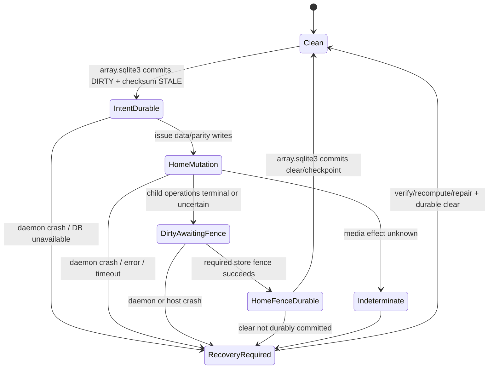

The state machine is semantic. Batching may combine regions/actions but may not remove the durable boundaries.

## 10.3 First write to a clean region

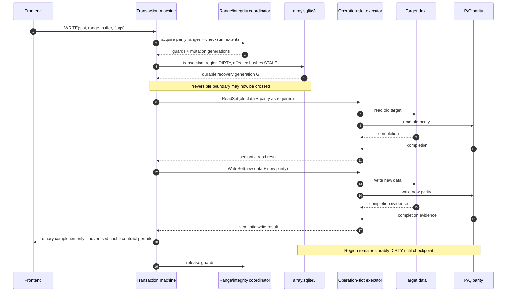

**Before irreversible home mutation:**

- topology snapshot and identity remain valid;
- range/extent guards are held;
- operation slot and buffers are reserved;
- affected dirty regions are durably `DIRTY`;
- every previously `VALID` affected checksum record is durably `STALE` in the same recovery transaction;
- no home write has been submitted if the recovery commit fails.

**After the write action:**

- success does not imply the region is clean;
- short, failed, or uncertain child I/O leaves durable dirty evidence;
- frontend abandonment does not reclaim the operation slot;
- additional overlapping writes observe the region as dirty.

## 10.4 Subsequent write to an already-dirty region

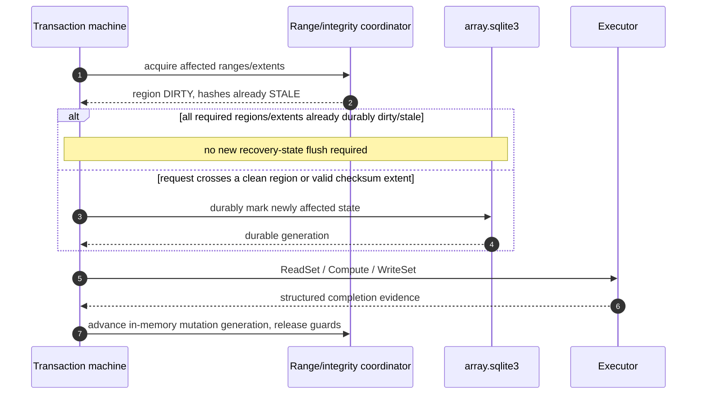

A write may skip a new DB commit only for regions already durably dirty and checksum extents already durably stale. Crossing any clean/valid boundary requires a new durable intent before the corresponding home mutation.

## 10.5 Flush, checkpoint, and clean transition

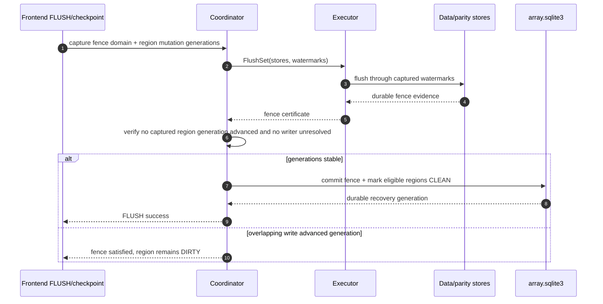

**Before `CLEAN`:**

- every data/parity write covered by the clear is durable according to certified store capabilities;
- every child operation is terminal or reconciled;
- no overlapping mutation advanced the captured generation;
- the topology epoch still matches;
- the clear/checkpoint transaction is durably committed in recovery state.

If any proof fails, the region stays dirty. Time alone never clears state.

The initial implementation MAY use an array-wide fence. Per-store/range watermarks are an optimization only after equivalence tests.

## 10.6 Virtual FLUSH and FUA

- A successful virtual `FLUSH` covers all writes in its captured ordering domain across data, parity, and recovery-state ordering obligations.
- FUA/preflush is never silently downgraded. The core may emulate FUA with write plus durable flush only when the path’s capability evidence proves equivalence.
- SQLite and home-store fences are ordered by the protocol; an `fsync` on `array.sqlite3` does not flush raw data/parity devices.
- `DISCARD` is disabled initially unless transformed into a parity-covered logical-zero operation with defined read-after-discard semantics.
- `WRITE_ZEROES` is a normal parity-covered write until an optimized equivalent is proven.

## 10.7 Global parity-session certificate

The per-region protocol remains normal truth. The parity-envelope session certificate is only disaster-recovery fallback:

- before writable exposure, every required parity envelope is durably `DIRTY(S)` and recovery state durably records matching session `ACTIVE(S)`;
- if either half of that opening handshake fails, no virtual member is exposed writable;
- during service the envelope remains dirty even if individual regions are checkpointed clean;
- only after global quiescence, home-store fence, durable recovery DB checkpoint/session `CLOSED(S)`, and no unresolved work may envelopes become `CLEAN(S)`;
- a crash during opening or clean marking yields mixed phases that are reconciled by the Section 8.4 matrix, never by selecting the optimistic copy;
- no frontend request waits for per-write envelope updates in profile B.

## 10.8 Cancellation and frontend abandonment

```mermaid
sequenceDiagram
    participant F as Frontend
    participant O as Operation slot
    participant T as Transaction machine
    participant K as Backend I/O
    participant R as Recovery state

    F->>O: submit request
    O->>T: start transaction
    T->>R: durable intent if required
    T->>K: submit child I/O with slot-owned buffers
    F--xO: request abandoned / frontend lost
    Note over O,T: suppress visible completion; do not free slot
    K-->>O: completions, failures, or uncertain drain
    O->>T: semantic result / reconciliation evidence
    T->>R: finish, checkpoint, or leave durable dirty state
    T-->>O: terminal safe classification
    O-->>O: reclaim only after all child resources terminal
```

- before durable intent, cancellation may abort with no media effect;
- after durable intent, the transaction completes, reconciles, or leaves recovery evidence;
- a cancellation API response is not sufficient to reuse buffers unless the backend contract defines it as terminal;
- timeout with uncertain effect transitions to reconciliation and blocks optimistic retry.

## 10.9 Daemon crash and power-loss recovery

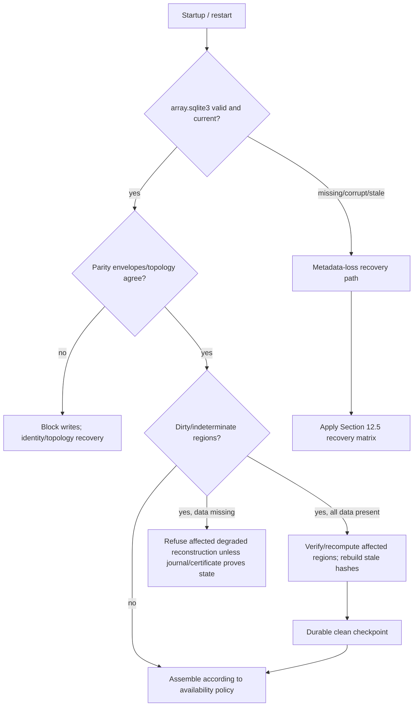

A daemon crash discards process state but may leave device-cache writes pending. A power loss discards volatile device state under the simulator/hardware model. Recovery never infers durability from missing in-memory completions.

ublk user recovery initially quiesces devices without automatic request reissue. Duplicate reissue remains disabled until every write path is proven idempotent under the selected protocol.

## 10.10 Recovery from dirty state

- validate `array.sqlite3`, parity envelopes, topology, and identity evidence;
- conservatively retain all dirty/indeterminate ranges;
- with all data present, recompute parity for affected regions from actual durable data, verify writes, rebuild hashes, then durably clear;
- this explicit dirty-write recovery rule is distinct from an unexplained clean-region mismatch: durable dirty intent identifies parity as uncertified for the interrupted mutation, so v0 protects the surviving data-home bytes without claiming that stale integrity evidence proves their historical correctness;
- with missing data, refuse affected degraded reads unless a durable journal or certified clean evidence proves reconstruction;
- if fine-grained dirty state is lost, use the metadata-loss matrix rather than assuming the whole array clean;
- recovery is resumable, throttled, repeatable after another crash, and stores correctness-critical cursors in recovery state.

## 10.11 Later journal or PPL

A later release may replace broad dirty-region recovery with a bounded journal or partial-parity log. The choice is **VALIDATE** through formal model, simulator, I/O-amplification benchmarks, and hardware power-cut tests.

A full journal may generalize to checksums and degraded writes but costs bandwidth/capacity. PPL may be smaller but codec-specific and does not automatically preserve user data. Neither is selected because it is fashionable; both must preserve all accepted invariants and remain outside data payloads.

# 11. Transaction orchestration, operation slots, concurrency, and memory

## 11.1 Two independent lifecycles

DiskWeave separates:

**Logical transaction lifecycle**

- topology snapshot and transaction ID;
- parity-address ranges and acquired guards;
- semantic stage and durability/recovery state;
- buffer handles/tokens, not memory addresses;
- action requests and structured action results;
- frontend interest/abandonment state.

**Executor/operation-slot lifecycle**

- actual initialized or pinned buffers;
- ublk queue/tag mappings or macOS file-operation handles;
- io_uring submissions and CQE tracking;
- child-operation fanout and aggregation;
- cancellation request, completion uncertainty, and drain state;
- generational token validation and final reclamation.

No implementation may infer “safe to free” from transaction-machine drop. If the daemon process dies, the OS/backend recovery path and durable protocol—not `Drop`—determine what happens next.

## 11.2 `procmachines` as leading provisional implementation

`procmachines` is restored as the preferred provisional transaction-machine implementation because it can express procedural async functions as externally driven Sans-I/O state machines, requires no async runtime for core tests, and supports deterministic input/output driving [E4]. This is well matched to semantic sequences such as:

```text
AcquireRange
PersistDirtyAndInvalidateIntegrity
ReadSet
ComputeParity
WriteSet
FlushSet
CommitCheckpointOrClear
ReleaseRange
```

Boundaries and restrictions:

- one machine orchestrates semantic operations, not every SQE/CQE;
- `IoExchange` may be used as a single outstanding semantic action/result rendezvous, but lower I/O concurrency occurs inside the executor;
- machine fields contain small state and generational `BufferToken`s, not pinned buffers or kernel tags;
- external wake/poll mechanics are wrapped behind DiskWeave’s `TransactionMachine` interface;
- crate `Arc`/mutex and exchange behavior are measured rather than assumed negligible or fatal;
- no persisted record, trace, control message, or public type refers to `ProcMachine` internals;
- the dependency is pinned and isolated; maintainers document a fork/vendor exit path if upstream maintenance is insufficient.

`procmachines` does **not** guarantee parity correctness, crash consistency, safe cancellation, fairness, queue affinity, or kernel buffer lifetime. DiskWeave’s protocol, executor, simulator, and proofs do.

## 11.3 Reference-machine comparison spike

Before broad implementation, one representative dirty-region parity write is implemented twice:

1. `dwv-transaction-proc` using `procmachines`;
2. `dwv-transaction-ref` using a small explicit enum/transition function.

Both consume the same semantic inputs and emit the same normalized action vocabulary. Tests independently schedule:

- success and EIO;
- delayed and out-of-order child completion;
- short I/O and lost/uncertain completion;
- frontend abandonment before and after the irreversible boundary;
- daemon crash at every suspension point;
- power loss after every modeled persistence transition;
- duplicate action/result delivery where an adapter may permit it.

Comparison criteria:

- identical permitted durable outcomes and safety-state classification;
- trace equivalence after normalizing allowed batching/order differences;
- no transition that clears dirty state without the same proof inputs;
- readability/reviewability by maintainers and implementation agents;
- deterministic testing ergonomics and fault injection coverage;
- allocations, lock operations, CPU/request, latency, memory, and scaling under many concurrent machines;
- dependency maturity, audit surface, and ease of replacing/forking.

The explicit machine is an oracle and production fallback, not an assumption that hand-written enums must win. `procmachines` is selected only if correctness equivalence holds and overhead/complexity is acceptable. The ADR records evidence either way.

## 11.4 Bounded operation slots and abandonment

An operation slot is allocated before any backend submission and owns all resources that must outlive task cancellation. It has a stable ID plus generation so stale tokens cannot reference a reused slot.

Possible states include:

```text
Reserved -> Submitted -> PartiallyCompleted -> Draining -> Reconciled -> Reclaimable
                           \-> CompletionUncertain -> ReconciliationRequired
```

Rules:

- frontend abandonment marks `completion_required = false`; it does not release the slot;
- cancellation is attempted only when the backend defines it, and success still requires observing the defined completion/drain event;
- after dirty intent or a home write, the semantic transaction continues or leaves durable recovery state;
- buffers are initialized before exposure and never reused until every child operation is terminal;
- process-exit recovery considers ublk duplicate/reissue policy and durable metadata, not in-memory slot state.

## 11.5 Bounded I/O shards and Linux queue topology

An I/O shard owns a bounded set of frontend queues, operation slots, buffers, executor state, and backend completion contexts. It performs no management/UI work.

The architecture freezes neither one global ring nor one ring per CPU per virtual member. Initial HDD prototypes use modest queue depth and an explicit total thread/ring/locked-memory cap. Exact queue count, depth, affinity, io_uring topology, fixed buffers, auto registration, batch I/O, and zero-copy are deployment/adapter policy.

ublk is still the preferred Linux adapter because it exposes ordinary blk-mq block devices, uses queue-wide tags and io_uring request transport, negotiates queue/device parameters, and has explicit user-recovery modes [E3]. These facts justify the adapter choice, not leakage into the portable core.

The compatibility implementation starts with the traditional supported ublk path. Newer batch/zero-copy features are optional after conformance, memory-safety, privilege, and workload benchmarks.

## 11.6 Range locks

- Lock keys are aligned global parity-address intervals.
- Writes take exclusive guards.
- Degraded reads take guards sufficient to avoid observing a mixed data/parity update.
- Healthy reads may bypass locks only after model and integration evidence proves ordinary block semantics.
- Multi-range acquisition is monotonically ordered to prevent deadlock.
- Lock entries are ephemeral/ref-counted and sharded; they are not persistent objects or actors.
- Foreground I/O has priority over rebuild/scrub under a tested fairness policy.
- Runtime `lock_quantum` is not persisted unless a future protocol explicitly depends on it.

## 11.7 Buffer and memory budget

Memory is an explicit equation:

```text
sum(frontend queue depth × frontend buffer size)
+ operation slots × per-slot buffers/metadata
+ reconstruct concurrency × array width × batch extent
+ dirty/journal/checksum working sets
+ trace/simulator buffers
+ background-job buffers
+ optional namespace buffers
```

At 8, 16, and 32 members, every release reports configured maximum RSS, pinned/locked memory, thread count, ring count, file descriptors, and worst-case reconstruct-write scratch. Admission waits or rejects before media mutation rather than allocating without bound.

## 11.8 Background QoS

Build, check, scrub, checksum generation, rebuild, trace capture, and mover work have separate bandwidth/concurrency budgets. They are resumable, pausable, and subordinate to foreground latency. They reuse the same range/durability protocol and do not hold a range guard while waiting for unrelated long-running resources.

# 12. Failure, degraded operation, and metadata-loss recovery

DiskWeave failure behavior is a protocol contract, not a generic `Err` branch.

## 12.1 Failure policy matrix

| Failure/event | Immediate request behavior | Durable/consistency action | Service transition |
|---|---|---|---|
| Short read/write | Fail semantic action with completed-range evidence | Keep affected region dirty/indeterminate after any mutation | Quarantine range/store as needed |
| Hard read EIO on target | Treat only that range as a known erasure | Reconstruct if enough trusted shards; record fault | Reduced redundancy |
| Hard write EIO | Fail request | Keep dirty; stop writes touching required failed role | Read-only/blocked |
| Timeout or lost completion | Return `Indeterminate` | Do not retry blindly; reconcile by readback/recovery | Block affected writes |
| Duplicate completion | Do not apply twice | Verify child/slot generation; record adapter fault | Continue only if safely recognized |
| Completion for reused slot generation | Fatal adapter invariant violation | Stop affected executor/frontend | Faulted |
| Data member disappears | Healthy requests to other slots may finish if safe | No writes in first release; clean ranges may reconstruct | Degraded read-only |
| Parity member disappears | Healthy data reads may finish | No writes in first release | Complete but unprotected/read-only |
| More failures than codec tolerance | Fail affected I/O | Do not mutate surviving set “best effort” | Unavailable |
| Frontend abandonment | Suppress eventual visible completion | Finish/reconcile operation slot after irreversible boundary | Service unchanged or recovering |
| Daemon crash | Frontend quiesces/recovery mode | Reopen DB/stores; recover dirty/indeterminate state | Recovering |
| Host crash/power loss | No completion assumption survives | Reassemble from durable bytes/evidence only | Recovering/blocked |
| `array.sqlite3` corrupt/missing | Stop new mutations immediately | Enter metadata-loss matrix | Read-only/blocked |
| `array.sqlite3` stale generation | Refuse optimistic use | Compare envelopes/manifests/backups; require recovery | Read-only/blocked |
| `control.sqlite3` corrupt/missing | Continue safety-critical operation | Rebuild projection | Service unaffected |
| Parity-envelope copy torn/missing | Ignore invalid copy | Select newest valid copy; if conflict, dirty/unknown | Possibly verification required |
| Parity envelopes disagree | Do not select optimistic clean | Treat dirty/unknown; reconcile topology | Block writes |
| Identity ambiguous/duplicate clone | Refuse assignment | Preserve all candidates; require operator mapping | Forensic/read-only only |
| Topology generation mismatch | Refuse request/assembly | Recover or complete topology transaction | Block writes |
| Parity equation mismatch, hashes absent | Report; do not guess | Preserve evidence; no automatic repair | Read-only/check required |
| Hash identifies one bad shard | Exclude it if sufficient other verified shards | Reconstruct and verify under transaction | Degraded during repair |
| Hash evidence conflicts or multiple unexplained faults | Do not repair | Preserve forensic state | Block/forensic |
| SQLite commit fails before home mutation | Fail request | No protected-media mutation permitted | Service may retry/recover DB |
| SQLite fails after home mutation | Fail/indeterminate | Region already dirty; stop writes and recover | Recovering |
| Flush/fence fails | Fail FLUSH/checkpoint | Do not clear dirty state | Read-only/blocked as policy requires |
| Physical store already exclusively claimed | Expose no virtual devices | Release partial claim set | Stopped/faulted |

## 12.2 Healthy and degraded reads

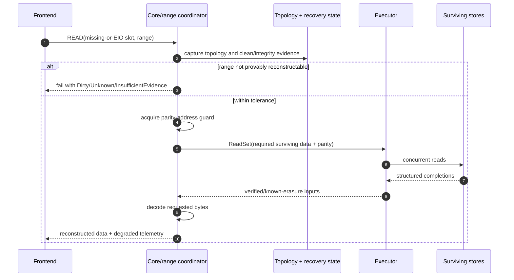

Preconditions for automatic reconstructed reads:

- the missing/EIO shard is a known erasure;
- topology/coding positions are unambiguous;
- the range is parity-clean or replay-proven;
- remaining known failures are within tolerance;
- no surviving input is excluded by current integrity evidence;
- no concurrent write can expose mixed data/parity state.

A reconstructed read is always observable in metrics/events. It is never silently labeled healthy.

## 12.3 Degraded writes

The first safe release prohibits all writes when any required data or parity role is unavailable.

Later protocols must specify each case independently:

- missing data: durable representation of new logical bytes for the absent slot;
- missing P or Q: update surviving roles while marking the missing role stale;
- one data plus one parity under P/Q: prove remaining equations and journal state;
- beyond tolerance: fail without mutating survivors.

Degraded writes require journal/PPL, duplicate-delivery semantics, rebuild reconciliation, formal model, simulator schedules, and hardware certification. They are not implied by degraded reads.

## 12.4 Parity mismatch and repair policy

| Evidence | Interpretation | Automatic action |
|---|---|---|
| Parity equation matches and hashes current | parity and hashed shards agree | none |
| Parity equation mismatches; all data hashes valid; parity hash invalid | parity extent identified bad | reconstruct/repair parity, then verify |
| Parity equation mismatches; one data hash invalid; other data/parity hashes valid | data extent identified bad | reconstruct data, verify digest and equation, then commit repair |
| Parity equation mismatches; hashes absent/stale | bad shard unknown | report only; no overwrite |
| Multiple invalid hashes beyond tolerance | insufficient trusted inputs | refuse automatic repair |
| Hash valid but equation inconsistent | evidence conflict or hash/profile bug | stop and preserve forensic state |

A repair source must itself be verified for the relevant content/topology generation. “Readable” is not equivalent to “good.” Before mutating the only copy, DiskWeave computes the candidate correction in memory or on a separate target and requires it to satisfy every available expected digest and parity equation. If the candidate does not match the allegedly bad shard's current expected digest, the evidence is conflicting and no automatic repair occurs.

## 12.5 Formal metadata-loss recovery matrix

Terms:

- **Certified clean envelope:** every required parity device has an agreeing valid `CLEAN` certificate under a session protocol that passed Gate H; before that gate it is only a hint. It certifies completed protocol ordering, not current checksum coverage or absence of later latent media corruption.
- **Exhaustive verification:** read every uncovered region and evaluate the full parity equation; it is not a rewrite.
- **Data-authoritative rebaseline:** explicit operator decision that surviving data bytes define truth when mismatches cannot be localized.

| Surviving state | Required evidence | Classification | Required action |
|---|---|---|---|
| All data + P; DB lost; certified clean envelope/topology unambiguous | matching array/topology/session certificates | Automatically certifiable **after session-certificate gate** | recreate DB; rebuild checksum baseline; optional audit scan |
| All data + P; DB lost; envelope dirty/unknown/uncertified | identity/topology sufficient to interpret P | Requires exhaustive verification | matching regions untouched; mismatches need hashes or explicit rebaseline |
| All data + P + Q; DB lost; certified clean envelopes | agreeing coding positions/profile/session | Automatically certifiable after gate | recreate DB; rebuild checksum baseline |
| All data + P + Q; envelope dirty/unknown | coding positions recoverable | Requires exhaustive P and Q verification | no automatic mismatch overwrite without integrity evidence |
| All data survive; all parity lost | data-member selection unambiguous | Requires parity rebuild | create new topology if needed; rebuild P/Q; verify; create DB |
| One data missing + P only; DB lost | certified clean P envelope + unambiguous topology | Safe read-only/rebuild within one-known-erasure model | reconstruct missing slot; warn integrity history unavailable; verify rebuilt payload |
| One data missing + P only; envelope dirty/unknown or bare parity | no proof old P corresponds to durable data | Guaranteed degraded certification unavailable | refuse reconstruction; forensic/operator-assisted recovery only |
| One data missing + P + Q; DB lost | certified clean P/Q envelopes + coding positions | Safe read-only/rebuild with reduced margin | decode; verify equations; rebuild checksum baseline |
| One data missing + P/Q envelopes dirty/unknown | old parity state unproven | Degraded certification unavailable | refuse automatic decode |
| Two data missing + P + Q; DB lost | certified clean P/Q + exact historical coding positions | Offline/read-only recovery within two-known-erasure model | decode/rebuild both; no tolerance for additional unexplained corruption |
| Two data missing + P/Q but coding positions lost | Q equation cannot be interpreted | Refuse automatic assembly | forensic search only; do not guess coefficients |
| All DiskWeave metadata lost; all data survive | explicit identification of data members | Recoverable as a new array lineage | generate a new array UUID, slots, positions, and topology; ignore or preserve old parity; build a new P/Q baseline |
| Topology identifiers ambiguous | operator cannot uniquely map candidates | Refuse writable assembly | expose evidence; direct-mount data separately or attest mapping |
| Parity candidate identity ambiguous | multiple plausible devices/clones | Refuse destructive selection | preserve candidates; choose explicit new target |
| One valid recovery backup/replica survives | integrity check + manifest/envelope generation agrees | Automatically usable or requires reconciliation | restore/copy, then validate against devices |
| Recovery replicas disagree | no unique committed generation | Conservatively dirty/conflicting | union dirty evidence; refuse optimistic clean; explicit replica recovery |
| Checksum evidence survives independently | profile/generation/topology match | Can localize some mismatches | verified selective repair permitted |
| Checksum evidence does not survive | parity mismatch is ambiguous | Historical integrity certainty lost | build new baseline only after verification/rebaseline decision |

## 12.6 Metadata-loss verification flow

```mermaid
sequenceDiagram
    autonumber
    participant O as Operator / recovery tool
    participant I as Identity resolver
    participant E as Parity envelope/manifest
    participant V as Verification engine
    participant D as Data stores
    participant P as Parity stores
    participant R as New array.sqlite3

    O->>I: discover read-only candidates
    I-->>O: match/clone/conflict assessments
    O->>E: decode valid topology/profile evidence
    E-->>O: topology or Unknown
    O->>V: create recovery plan (no writes)
    loop every uncovered parity region
        V->>D: read all data ranges
        V->>P: read P/Q ranges
        D-->>V: bytes/status
        P-->>V: bytes/status
        V->>V: equation + surviving hash checks
    end
    V-->>O: matching / identified-bad / ambiguous-mismatch report
    alt all match or bad shards independently identified
        O->>V: authorize verified repairs if needed
        V->>R: create fresh recovery DB + checksum worklist
    else ambiguous mismatch
        O-->>O: preserve evidence; request explicit trust-data/new-parity decision
    end
```

`dwv check --quick` may sample for diagnosis but never advances this flow to `CLEAN`.

## 12.7 Rebuild flow

```mermaid
sequenceDiagram
    autonumber
    participant C as Lifecycle controller
    participant R as Recovery state
    participant X as Rebuild engine
    participant S as Surviving stores
    participant N as Replacement store

    C->>R: prepare replacement assignment; keep old topology active read-only
    R-->>C: durable prepared generation
    loop protected ranges in deterministic order
        X->>S: read/decode range under guard
        S-->>X: verified inputs
        X->>N: write replacement range
        N-->>X: completion
        X->>N: flush/checkpoint as policy requires
        X->>R: durable rebuild cursor + evidence
    end
    X->>N: final full verification/hash pass
    X->>R: commit replacement topology generation
    R-->>C: durable commit
    C->>C: publish new topology epoch and access state
```

A rebuild cursor is correctness-critical and lives in recovery state. Online rebuild, when later enabled, must reconcile writes before/after the cursor; the first implementation is offline/read-only.

## 12.8 Topology replacement flow

```mermaid
stateDiagram-v2
    [*] --> Current
    Current --> Quiescing: topology change requested
    Quiescing --> Prepared: writes drained; DB records prepared generation
    Prepared --> Materializing: initialize / evacuate / rebuild / recompute
    Materializing --> Verified: required verification succeeds
    Verified --> DBCommitted: array.sqlite3 commits new active generation
    DBCommitted --> EnvelopeCommitted: required parity envelopes commit same generation
    EnvelopeCommitted --> Published: frontend publishes immutable new epoch
    Published --> Current: obsolete assignment may be released

    Prepared --> RolledBack: safe rollback before DB active commit
    Materializing --> Recovering: crash/error; resume from durable cursor
    Verified --> Recovering: pre-commit interruption
    DBCommitted --> Recovering: envelope/publication interrupted
    EnvelopeCommitted --> Recovering: publication interrupted
    Recovering --> Materializing: prepared generation incomplete
    Recovering --> EnvelopeCommitted: DB committed; finish envelope reconciliation
    Recovering --> Published: DB/envelopes committed; publish after validation
```

No request may observe a half-old/half-new assignment. The DB active-generation commit is the topology transaction's irreversible boundary; parity-envelope commit and frontend publication follow it. A failure after that boundary blocks service until envelopes are reconciled from the committed DB. Obsolete devices are not overwritten or released before the new generation is published and rollback/evidence requirements are satisfied.

# 13. Integrity and checksum plane

Parity recovers known erasures. It does not identify arbitrary silent corruption. DiskWeave therefore treats integrity as a first-class v0 semantic plane even if background performance is phased.

## 13.1 Coverage and profile

Checksums SHALL cover:

- every data member checksum extent;
- P parity extents;
- Q parity extents when present.

The provisional profile is:

```text
algorithm: BLAKE3-256
checksum_extent: approximately 4 MiB
stored_digest: full 32 bytes
```

BLAKE3’s default output is 256 bits and its official implementation/specification is portable and parallelizable [E24]. The exact profile remains PROVISIONAL pending throughput, metadata-size, cache, and repair-granularity benchmarks.

At 4 MiB extents, raw 32-byte digests require about 8 MiB per TiB per protected member before indexes/generations. This scales with total array width and belongs primarily in `array.sqlite3`, not the parity envelope.

Persist semantic values:

```text
algorithm_id
digest_length
extent_size
checksum_set_id/checksum_set_generation
target role/slot
content_generation
validity state
digest
```

Never persist a Rust crate type or implementation version as the algorithm identity.

## 13.2 Validity state machine

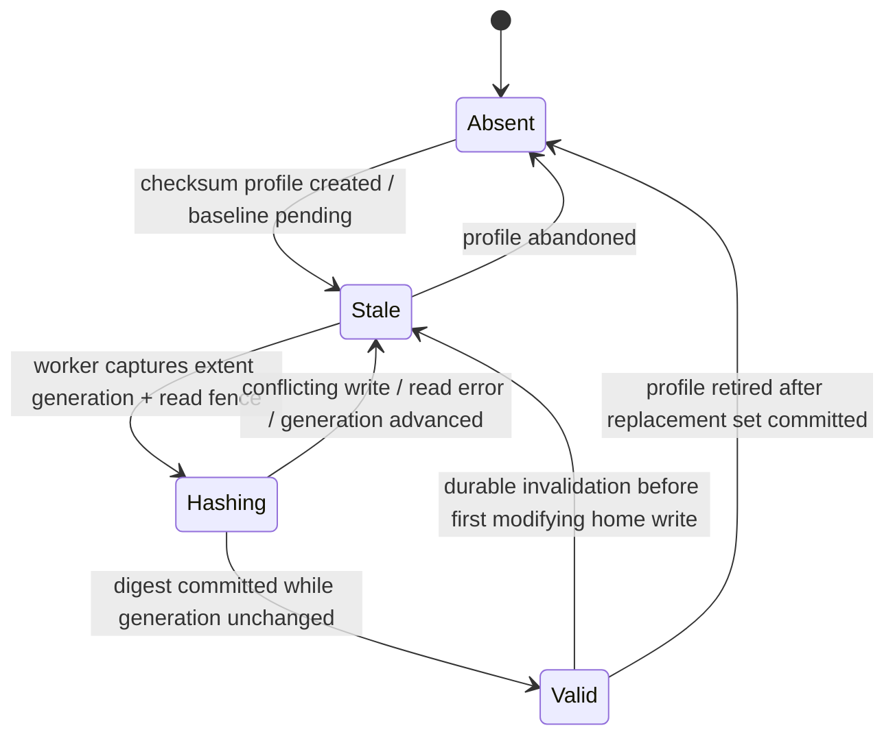

`VALID` means the digest matches the named target, extent, profile, topology, and content generation. `STALE` means no digest is trusted for current bytes. `ABSENT` means no evidence exists.

## 13.3 Invalidation before mutation

The first write that touches a `VALID` checksum extent SHALL atomically commit, in `array.sqlite3`:

```text
region R -> DIRTY
checksum extent C -> STALE
stale/mutation generation -> G+1
```

Only then may data or parity home mutation begin. If several data/parity checksum extents are affected, all previously valid records become stale in the same durable recovery transaction as the dirty intent.

Subsequent writes while an extent remains stale need not rehash or commit another invalidation unless they cross a still-valid extent or require another durable region transition.

## 13.4 Asynchronous checksum revalidation

```mermaid
sequenceDiagram
    autonumber
    participant W as Integrity worker
    participant C as Extent coordinator
    participant X as Executor
    participant S as Data/P/Q target
    participant R as array.sqlite3

    W->>C: capture mutation generation M + target write watermark Wm
    C-->>W: snapshot token; no unresolved writer at capture
    W->>X: FlushSet(target, through Wm) or reuse covering fence
    X->>S: durable flush through Wm
    S-->>X: target fence evidence F
    X-->>W: F covers Wm
    W->>X: ReadSet(full checksum extent)
    X->>S: read extent after fence
    S-->>X: bytes/status
    X-->>W: complete bytes
    W->>W: compute digest
    W->>C: acquire commit guard; compare generation to M and validate F
    alt unchanged, no unresolved writer, and F still covers M
        W->>R: install VALID(digest, M, fence ref F)
        R-->>W: durable recovery generation
    else generation/fence no longer valid
        W-->>W: discard result; extent remains STALE
    end
```

A stable read is insufficient: the bytes used for a `VALID` digest must first be covered by a durable target-store fence. The worker may reuse a previously persisted fence certificate that covers its captured watermark; otherwise it issues a target flush. The coordinator prevents a writer from crossing its durable invalidation boundary between the final generation/fence check and digest commit. A crash before commit leaves the extent stale. A crash after commit is safe because the referenced bytes were durable and any later writer must durably invalidate the record before mutation.

Target-specific integrity may become valid while parity remains dirty; the two state dimensions stay independent. A full-overwrite operation that already has the entire final checksum extent in trusted buffers MAY compute and commit the digest without rereading, but only after the target bytes are durably fenced and the corresponding generation rules are satisfied.

## 13.5 Parity cleanliness and integrity coverage are separate

Example status:

```text
parity:
  CLEAN

integrity:
  profile: BLAKE3-256 / 4 MiB
  current: 99.997%
  stale_extents: 18
  absent_extents: 0
```

`parity = CLEAN` means the write-hole protocol proves durable data and parity correspond. It does not mean all bytes have current independent hashes. Asynchronous hashing therefore does not become mandatory synchronous write amplification.

A virtual `FLUSH` need not wait for stale extents to be rehashed. It must wait for their invalidation records and parity protocol obligations.

## 13.6 Scrub and verified repair

A scrub:

1. reads the named extent from data and parity targets;
2. verifies current digests where available;
3. evaluates P/Q equations;
4. classifies each input as verified-good, known-bad, missing, stale/unknown, or unreadable;
5. computes a candidate correction only when sufficient verified-good evidence determines one unique result;
6. before touching the original, proves the candidate satisfies the bad shard's expected current digest and every applicable parity equation;
7. writes the verified candidate through the normal dirty/invalidation/fence protocol, preferably to a replacement/safe target when practical;
8. rehashes and verifies the repaired extent after durability;
9. records an auditable decision/evidence summary.

Automatic repair is forbidden when multiple candidate corrections satisfy available evidence or when the only “proof” is that parity disagrees.

## 13.7 Checksum-set migration

Checksum profiles migrate by parallel sets:

```text
active set v1: BLAKE3-256 / 4 MiB
building set v2: BLAKE3-256 / 1 MiB
    ↓ complete and verify v2
atomically select v2 as active
    ↓ retain v1 for rollback window
retire v1
```

Migration does not alter user payload or parity math. Every write durably invalidates affected `VALID` records in **all** retained or building sets that could later become active; profile switching can never resurrect a digest that escaped invalidation. Interrupted migration leaves the old active set authoritative and the new set incomplete/stale. Selection is a recovery-state transaction and occurs only after the new set meets the declared coverage/evidence gate.

## 13.8 Loss of checksum evidence

Losing `array.sqlite3` or all checksum backups:

- does not alter data bytes;
- does not prevent complete parity verification when all data survive;
- removes historical evidence that could identify which shard was previously corrupt;
- prevents automatic repair of unexplained mismatches;
- requires a new checksum baseline after parity/topology is re-established.

A small checksum-set ID, profile, generation, or Merkle/root digest MAY appear in a parity envelope or exported manifest, but the full extent table does not by default.

# 14. Pool namespace semantics

A Rust pool filesystem, if built, is a separate specification. Union-filesystem behavior contains many edge cases unrelated to parity.

## 14.1 Required rules

- A new regular file is assigned to one member at creation and remains there until an explicit mover/rebalance operation.
- Directory entries are merged deterministically.
- Placement considers free space, minimum-free threshold, health, tier/protection class, path affinity, and exclusions.
- Existing-parent affinity is preferred but configurable.
- Duplicate names/type conflicts across members are surfaced in diagnostics; visibility winner and write behavior are deterministic.
- Hard links cannot cross member filesystems.
- Reflink and `copy_file_range` use same-member fast paths and cross-member copy fallback.
- ACLs, xattrs, ownership, timestamps, sparse files, locks, open-unlinked files, directory fsync, mmap, and failure behavior are specified/tested.
- There is no authoritative persistent inode database in the first release.

## 14.2 Cross-member rename

POSIX rename is atomic only within one lower filesystem.

- **Strict mode (initial default):** return `EXDEV` when a rename would cross members.
- **Compatibility mode (later):** durable copy, file fsync, destination-directory fsync/rename, source unlink, and source-directory fsync with a recoverable transfer record. It is not represented as one lower-filesystem atomic operation.

The mover uses the same durable transfer primitive rather than inventing another protocol.

## 14.3 Inode identity and cache

- Internal identity combines slot/generation with lower inode/generation.
- FUSE-visible inode values may be session-scoped handles backed by a rebuildable map.
- Member replacement invalidates relevant handles through topology generation.
- Negative-entry and attribute cache lifetimes are explicit.
- Writeback cache, direct I/O, and passthrough are evaluated as separate modes; current `fractal-fuse` treats passthrough and writeback cache as mutually exclusive [E2].

## 14.4 FUSE passthrough validation

FUSE passthrough can direct eligible read/write/splice/mmap operations to a registered lower file without routing those data operations through userspace [E7]. The likely backing file here may itself live on gocryptfs, another FUSE filesystem. A mandatory spike validates:

- gocryptfs as a passthrough backing filesystem;
- FUSE stacking-depth limits;
- mmap, splice, direct I/O, file locking, truncate, and fsync;
- backing-ID lifetime and unmount races;
- capability drop after registration;
- accounting/security behavior;
- performance against mergerfs and conventional FUSE.

If passthrough is unsupported or fragile, keep mergerfs or accept a measured copy path. Do not redesign parity around it.

# 15. Encryption, staging tier, and NixOS integration

## 15.1 Encryption layering

Parity should normally protect ciphertext so rebuilds do not require decryption keys.

Supported stack examples:

```text
physical data partition
-> ublk parity virtual member
-> conventional filesystem containing gocryptfs ciphertext
-> gocryptfs clear mount
-> pool namespace
```

or later:

```text
physical data partition
-> ublk parity virtual member
-> dm-crypt/LUKS
-> conventional filesystem
-> pool namespace
```

`dwvd` sees opaque blocks. It does not know filenames, plaintext, or keys. Direct recovery of an encrypted physical member uses the ordinary encryption layer’s tools.

## 15.2 NVMe staging/cache tier

An NVMe staging member excluded from parity is an **unprotected tier**. The namespace and status UI must not imply equal protection.

Initial recommendation:

- keep staging outside `dwvd` parity;
- use explicit placement/tier policy;
- the mover copies to a protected member, fsyncs file and destination directory, changes visibility atomically where possible, then removes the staging copy;
- persist mover state so a crash cannot delete the only complete copy;
- report protection state per job/file where practical;
- do not reuse the staging device as the only acknowledged parity journal. Fast and safe are separate properties.

## 15.3 Desired configuration versus array truth

The NixOS module declares service policy and expected identity constraints. It does not own mutable replacement state. Recommended policy inputs include:

- expected array UUID and allowed slot roles;
- acceptable discovery identifiers/paths;
- queue, memory, background QoS, and feature caps;
- certified filesystems and mount options;
- recovery policy and whether unprotected all-data-present service is allowed;
- mount paths and consumer dependencies;
- secret paths for layers above `dwvd`.

`array.sqlite3` topology generations decide current assignments and dirty state; agreeing parity envelopes provide bootstrap/session evidence. A mismatch causes assembly refusal or explicit operator action, not automatic mutation during activation.

## 15.4 Mount namespaces and unit ordering

`dwvd` SHALL have a mount namespace distinct from clients of its ublk devices [E11]. This should be enforced in the daemon and tested under systemd; relying on an incidental unit setting is insufficient.

Recommended boot chain:

1. Make `/persist` and required secrets available.
2. Load/probe `ublk`, io_uring, and optional FUSE features.
3. Discover physical members by stable identity; suppress automount.
4. Start `dwvd` in its own mount namespace; validate `array.sqlite3`, parity envelopes, identity evidence, and geometry.
5. Recover/replay/resynchronize required state.
6. Expose all virtual member devices as a coherent array group.
7. Run filesystem checks according to policy and mount member filesystems.
8. Start per-member decryption mounts.
9. Start mergerfs or `dwv-poold`.
10. Start SMB/NFS/Jellyfin/download consumers.

Shutdown reverses the chain:

1. stop consumers;
2. unmount pool;
3. unmount clear/encrypted member layers;
4. unmount member filesystems;
5. issue a global array fence, durable recovery checkpoint, and parity-session clean transition;
6. stop ublk devices and `dwvd`;
7. release physical members.

Power-cut and daemon-kill VM tests must prove that unit shutdown cannot self-deadlock or report a clean array before the final fence/checkpoint is durable.

## 15.5 Hardware durability certification

The safety claim depends on the complete storage path. Certification records:

- logical/physical block sizes and alignment;
- whether volatile write cache is enabled;
- support/behavior of flush and FUA through SATA/SAS/NVMe, USB bridges, HBAs, and expanders;
- write-cache policy after reboot or drive replacement;
- power-loss protection where claimed;
- behavior on cable pull, controller reset, timeout, and medium error;
- whether SMART/health data identifies the same observed device used by the current assignment evidence.

A UPS is beneficial but does not replace the write-hole protocol or truthful device flushes.

# 16. Technology decisions

## 16.1 Rust

**Status: ACCEPTED.**

Use stable Rust unless a narrowly justified OS adapter requires otherwise. Enforce checked offset/length arithmetic, isolated reviewed `unsafe`, no panics across data-plane boundaries, deterministic golden fixtures, dependency/license auditing, Miri/sanitizers where applicable, and a portable non-SIMD reference codec. Rust memory safety is not media crash safety.

## 16.2 ublk and `libublk-rs`

**Status: ublk PROVISIONAL PRIMARY LINUX FRONTEND; library VALIDATE.**

ublk is a mainline generic userspace block-device framework whose devices use the Linux block layer/blk-mq and io_uring request transport [E3]. This is the correct Linux abstraction for placing ordinary filesystems and encryption above DiskWeave.

`libublk-rs` is an adapter candidate, not architecture. OS-030 compares it with minimal alternatives for UAPI coverage, recovery, namespace behavior, limits, resource use, and maintenance. ublk-specific types end at `dwv-frontend-ublk`.

## 16.3 io_uring and async runtime

**Status: PROVISIONAL LINUX BACKEND.**

io_uring is the likely Linux raw-store executor. Synchronous `pread`/`pwrite`, threaded file, and simulated executors remain valid implementations of the same semantics. Tokio, compio, smol, or a custom driver is selected by benchmark and lifetime clarity. No runtime type enters portable contracts or formats.

## 16.4 `procmachines`

**Status: LEADING PROVISIONAL TRANSACTION IMPLEMENTATION.**

Retain only if OS-009 proves semantic equivalence, deterministic fault testing, acceptable allocation/locking/CPU cost, and maintainability. Its procedural Sans-I/O model and no-runtime requirement are attractive; its exchange/polling/runtime characteristics and small ecosystem are measured rather than assumed [E4].

## 16.5 SQLite

**Status: PROVISIONAL RECOVERY-STATE AND MANAGEMENT IMPLEMENTATION.**

SQLite is the preferred implementation for both authority classes through separate ports/files:

- `array.sqlite3` implements `RecoveryStateStore` and is crash-critical during operation;
- `control.sqlite3` is a discardable management projection.

SQLite offers mature transaction behavior, migrations, tooling, and a stable cross-platform application format [E18]. Journal mode, synchronization level, checkpointing, connection topology, page size, and Rust binding remain executable ADRs. SQLite documents different power-loss durability behavior across synchronization/journal configurations and relies on truthful OS/hardware syncs [E19][E20].

SQLite does not atomically include independent raw data/parity writes. DiskWeave’s external durability protocol remains mandatory. The schema is hidden behind semantic interfaces and export/rebuild tooling so a future database can replace it.

## 16.6 Parity-device envelope

**Status: PROVISIONAL / FORMAT-EXPERIMENTAL.**

A small redundant superblock-like envelope is likely preferable to completely bare parity because it can identify role/profile/payload boundaries, preserve P/Q coding positions, detect incompatible software, and provide a coarse session certificate. Linux MD’s versioned metadata/data offsets and Btrfs’s redundant known-location superblocks demonstrate the operational role of such structures without prescribing DiskWeave’s format [E22][E23].

The envelope is not a filesystem or transaction database. OS-007 must compare bare, envelope, and envelope-plus-bitmap profiles before format freeze.

## 16.7 FSKit, macFUSE, and DiskImages

**Status: VALIDATE MACOS ADAPTERS.**

FSKit supports user-space filesystem modules, not a documented generic userspace block frontend [E15]. The initial spike exposes a minimal fixed-size seekable virtual raw file and asks DiskImages to attach it. macFUSE is the fallback. DriverKit/SCSI emulation is deferred unless the bridge cannot meet coherence, synchronization, or usability goals.

Backing payload files and exported raw-file endpoints remain distinct. Sparse behavior, size stability, detach/recovery, and sync propagation are measured rather than assumed.

## 16.8 FUSE and `fractal-fuse`

**Status: REJECTED AS PARITY BOUNDARY; OPTIONAL ELSEWHERE.**

FUSE may implement an optional namespace or macOS bridge. `fractal-fuse` and FUSE-over-io_uring do not define the parity engine, persistent data, or transaction protocol.

## 16.9 Parity and checksum libraries

**Status: REFERENCE SEMANTICS ACCEPTED; OPTIMIZED LIBRARIES VALIDATE.**

Portable reference XOR/P/Q and BLAKE3 profile semantics produce golden vectors. SIMD, ISA-L, `reed-solomon-simd`, BLAKE3 crates, or later accelerators are replaceable implementations. Persisted profiles specify math and digest semantics, never library identities.

## 16.10 Serialization and control API

**Status: SEMANTIC VERSIONING ACCEPTED; ENCODING PROVISIONAL.**

Parity envelopes favor a fixed header plus bounded canonical body. Exported recovery manifests and traces use documented versioned semantic formats. The local control protocol may use JSON, CBOR, protobuf-like encoding, or another bounded schema, but wire, SQLite, and parity-envelope formats are independent and never derived from Rust memory layout.

# 17. macOS portable reference implementation

## 17.1 Goal and claim boundary

> DiskWeave’s portable core supports a functional macOS file-backed array whose virtual data members host real APFS filesystems, including degraded reads, metadata-loss recovery, and rebuild.

This proves that parity, recovery-state, integrity, range, and rebuild semantics are independent of ublk/io_uring. It does **not** certify Linux request semantics, real-drive caches, actual power loss, or a production macOS storage product.

## 17.2 Candidate architecture

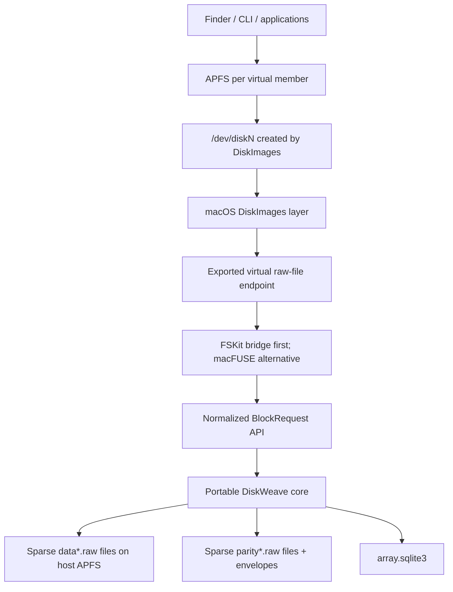

FSKit is a tiny filesystem transport here, not parity logic. The exported filesystem contains one fixed-size seekable proxy file per stable slot. DiskImages attaches the proxy as a virtual disk. OS-020 must prove the path before it is treated as viable.

## 17.3 Backing and exported endpoints must be distinct

Recommended development layout:

```text
/tmp/dwv-demo/
  backends/
    data0.raw
    data1.raw
    data2.raw
    parity0.raw
  state/
    array.sqlite3
    control.sqlite3
    recovery-manifest.json       # optional exported backup fixture

/Volumes/DiskWeaveBridge/slots/
  <slot-0-uuid>.raw              # proxy endpoint, not backends/data0.raw
  <slot-1-uuid>.raw
  <slot-2-uuid>.raw
```

No `.dwv-member` sidecar is required for data files. Attaching or modifying `backends/data0.raw` while DiskWeave is active bypasses parity and is forbidden. The bridge exports proxy files whose operations enter the normalized API.

Payload files SHOULD be ordinary sparse host-APFS files where hole-as-zero semantics are stable. The OpenSpec verifies apparent/allocated size, hole reads, truncation denial, clone/copy behavior, file-ID changes, and direct attachment after shutdown. `.sparseimage`/`.dmg` is not DiskWeave member semantics.

## 17.4 FSKit/macFUSE/DiskImages feasibility questions

OS-020 must answer with executable evidence:

- Can DiskImages attach a seekable proxy file hosted by the candidate filesystem extension?
- Which read/write, mmap/page-cache, locking, resize, close, and synchronization operations occur?
- How do APFS/DiskImages sync requests map to FSKit/macFUSE operations and host-file `fsync`?
- Can the bridge invalidate stale pages after backend failure/recovery?
- What happens when a backing member disappears while the proxy remains open?
- Can the proxy report stable size and deny truncate, hole-punch, and direct bypass?
- Are entitlements, signing, installation, automation, and minimum OS versions acceptable?
- Does macFUSE provide more predictable semantics, and at what deployment cost?
- Is performance sufficient for correctness development and demonstrations?

If neither bridge meets coherence/synchronization needs, the ADR compares DriverKit/SCSI emulation or narrows the live macOS goal. Driver development is not the default.

## 17.5 macOS durability profile

Until sync mapping is characterized, live macOS arrays use `portable-demo`:

- functional block and recovery semantics are exercised;
- `dwv-sim` supplies rigorous daemon-crash/power-loss schedule coverage;
- live tests cover process kill, restart, detach, and host-file synchronization;
- no claim is made that host APFS + DiskImages faithfully models physical FUA/controller cache/power removal;
- “clean” means clean under the declared file-backend contract, not hardware-certified production durability.

## 17.6 APFS degraded-read, metadata-loss, and rebuild acceptance sequence

```mermaid
sequenceDiagram
    autonumber
    actor U as Test/operator
    participant D as dwvd + macOS frontend
    participant A0 as APFS slot 0
    participant A1 as APFS slot 1
    participant A2 as APFS slot 2
    participant P as Parity + array.sqlite3

    U->>D: create data0/1/2.raw, parity0.raw, array.sqlite3
    D-->>U: expose 3 proxy raw files; attach as /dev/diskN
    U->>A0: format/mount APFS and write files
    U->>A1: format/mount APFS and write files
    U->>A2: format/mount APFS and write files
    D->>P: parity updates, dirty/integrity checkpoints
    U->>D: simulate loss of data1.raw
    D-->>A1: continue proven-clean reads via reconstruction
    U->>A1: verify files and APFS traversal
    U->>D: provide replacement data1-new.raw
    D->>D: rebuild stable slot 1; verify hashes/parity
    D-->>U: rebuild verified; stop cleanly
    U->>U: attach replacement directly without DiskWeave
    U->>A1: mount APFS and verify content/metadata
```

Required automated scenarios:

1. Create three sparse data files, one parity file with experimental envelope, and `array.sqlite3`.
2. Expose three proxy raw files; attach, format APFS, and mount.
3. Write ordinary files through Finder/CLI plus mmap/database/fsync-heavy workloads.
4. Verify clean stop/restart, parity equations, and checksum state.
5. Remove one backing data file while its virtual slot remains present; continue read-only APFS access through reconstruction.
6. Rebuild into a replacement sparse file and verify it through DiskWeave.
7. Stop DiskWeave, independently attach the rebuilt raw file, mount APFS, and compare content/metadata hashes.
8. Restore the all-data-present state, delete `array.sqlite3`, and exercise exhaustive metadata-loss verification without rewriting matching parity.
9. Inject one parity mismatch with checksum evidence present; verify selective repair identifies the correct target.
10. Repeat with checksum evidence absent; verify DiskWeave refuses to overwrite either side without explicit data-authoritative rebaseline.
11. Duplicate a data file so filesystem UUIDs match; verify identity assessment reports `AmbiguousClone` and writable assembly fails.
12. Delete `control.sqlite3`; verify service safety and data operation are unaffected after projection rebuild.

The milestone fails if it requires DiskWeave metadata inside a data image, aliases backing/export endpoints, silently selects a clone, rewrites ambiguous mismatches, changes slot identity, or cannot mount the rebuilt image independently.

# 18. Alternatives considered

## 18.1 File-aware FUSE parity

Rejected as the primary product because it moves the correctness boundary to filesystem semantics and likely creates an authoritative extent/namespace format. FUSE remains valid for optional namespace and bridge adapters.

## 18.2 Linux MD RAID4/5/6 or device-mapper RAID

Kernel RAID is mature and includes write-hole mitigations, but it exposes one striped block device whose filesystem spans members. It does not preserve one independently mountable conventional filesystem image per data disk. MD’s journal/PPL, reshape, testing, and failure handling remain important design references [E5].

## 18.3 ZFS, Btrfs, and bcachefs

These can unify pooling, integrity, and redundancy but replace the per-member filesystem/data-layout invariant. They are good alternatives for users who do not require that invariant, not implementations of DiskWeave.

## 18.4 SnapRAID plus mergerfs

This preserves independent filesystems and offers strong offline/snapshot-style parity, but changes since the last sync are not real-time protected [E6]. It is a migration source, comparison baseline, and fallback.

## 18.5 NBD or other portable block frontends

NBD can be a development or remote frontend and should remain possible through the normalized API. For local Linux production, ublk has a more direct blk-mq/io_uring model and explicit server recovery [E3].

## 18.6 `dm-user`, BDUS, and out-of-tree bridges

These add upstream/deployment or maintenance uncertainty without a demonstrated advantage over ublk. They may be revisited if ublk fails a required conformance gate.

## 18.7 DriverKit/SCSI emulation on macOS

A true virtual storage driver could provide a cleaner block boundary than a virtual-file/DiskImages bridge. It also carries much greater implementation, entitlement, signing, compatibility, and safety surface. It is deferred until the FSKit/macFUSE bridge spike identifies a concrete blocker that a driver would solve.

## 18.8 Custom kernel module or MD personality

A kernel implementation might reduce copies and integrate deeply with the block layer, but it dramatically raises review, deployment, and failure-impact cost. Consider only after the userspace protocol is proven and a measured bottleneck cannot be fixed through adapters.

## 18.9 One monolithic custom filesystem

Explicitly rejected because it abandons the principal recoverability invariant and creates the largest permanent on-disk trench.

# 19. Security and operational hardening

- Verify observed data/parity identity, protected length, geometry, topology generation, parity-envelope profile, and recovery DB generation before any write.
- Linux raw stores are claimed all-or-nothing with exclusive opens, udev permissions, device cgroups, mount namespaces, and least privilege. This does not claim defense against malicious host root.
- macOS resolves canonical paths and file IDs, rejects path swaps, locks backing files, and prevents proxy/backing aliasing.
- `dwvd` never mounts or consumes its own virtual members in its mount namespace.
- Initialize, replace, reset-topology, trust-data rebaseline, wipe, coding-position, and force-assemble operations require explicit array/store IDs and automation-safe confirmation tokens.
- Ambiguous clones are never auto-resolved by “first device found,” mtime, path order, or majority of duplicated UUIDs.
- The control socket uses local permissions and peer credentials. No unauthenticated network control API is in scope.
- Parity-envelope, exported-manifest, SQLite, control-protocol, and trace parsers are hostile-input code with bounds, checked arithmetic, feature handling, fuzzing, and deterministic failure.
- `array.sqlite3` is opened with safe VFS/path handling, integrity checks, backups/exports, and no untrusted extension loading.
- Normalized traces exclude payload bytes and clear paths by default. Fixtures use deterministic generated data; retaining real payload requires explicit encrypted opt-in.
- Metrics/logs carry IDs, offsets, lengths, digest-set IDs or redacted prefixes, and errors—not user bytes or full content digests by default. Full digests remain in protected recovery state or explicit diagnostic exports. Namespace paths are opt-in and separately protected.
- Encryption keys remain in dm-crypt/LUKS, gocryptfs, APFS, or another upper layer.
- Resource limits cover file descriptors, threads, rings, locked memory, buffers, SQLite growth/WAL, trace volume, retries, and background jobs.
- Watchdogs understand irreversible transactions and recovery; they do not kill a healthy daemon merely because a flush, SQLite checkpoint, or rebuild is slow.
- SMART/hardware monitoring integrates with established tools; DiskWeave consumes evidence but does not replace `smartd`.
- Builds pin dependencies, audit `unsafe`, record SBOM/licenses, and isolate young dependencies behind replaceable adapters.

# 20. Observability and operator model

Structured status/events SHALL expose:

- array UUID, topology epoch, lifecycle, parity consistency, integrity coverage, availability, redundancy, access mode, recovery-metadata health, and safety profile;
- stable slot UUID, coding position, assignment instance/generation, observed identity evidence, and clone/conflict assessment;
- parity-device UUID/role, payload boundaries, envelope copy generations, feature compatibility, and session state;
- frontend type/version, limits, queue topology, duplicate-delivery/recovery mode, or macOS bridge mode;
- store capability claims, probe/certification evidence, geometry, volatile cache, and flush/FUA results;
- request/transaction/action IDs, range, stage, abandonment, irreversible-boundary status, and terminal durability classification;
- operation-slot use, buffer generations, child completion/uncertainty, drain latency, and backpressure;
- range/integrity-lock wait/hold time, fairness, and hot ranges;
- RMW versus reconstruct-write selection, physical I/O amplification, and drive activation;
- dirty regions/age/generations, checkpoint latency, `array.sqlite3` health/generation/commit latency, and recovery progress;
- parity-envelope session transitions and reasons a clean certificate was accepted/rejected;
- integrity profile, current/stale/absent counts, hash queue age, parity/hash mismatch classification, and repair evidence;
- build/check/scrub/rebuild progress and authoritative versus management-projected job state;
- `procmachines` versus reference-machine counters in validation builds;
- trace fixture/version/privacy mode and replay divergence;
- `control.sqlite3` projection lag/rebuild status;
- optional namespace placement/conflict and FUSE fast-path metrics.

Every event includes array UUID, topology epoch, event/request/transaction ID, and monotonic plus wall-clock time where available. Payload bytes are never logged.

Operator commands include illustrative semantics:

```text
dwv status --json
dwv explain-state
dwv members --evidence
dwv capabilities --probe
dwv check [--quick]
dwv verify --exhaustive
dwv scrub
dwv rebuild
dwv recover metadata
dwv recover metadata --trust-data        # explicit destructive/rebaseline decision
dwv inspect <device-or-file>
dwv inspect-parity-envelope
dwv inspect-dirty
dwv plan replace|add|remove|resize|reset-topology|force-assemble
dwv export recovery-manifest
dwv rebuild-control-db
dwv trace capture|sanitize|replay
dwv report disaster-recovery
```

`dwv check --quick` reports sampled diagnostic confidence and can never set `CLEAN`. Destructive commands support machine-readable dry runs and emit expected IDs, topology generation, ranges, persistent-format changes, evidence used, and rollback limits.

# 21. Verification strategy

Storage correctness is established through complementary tiers. A macOS workstation can perform most core development without a local Linux VM; Linux CI and bare metal cover interfaces and physical durability that file-backed tests cannot.

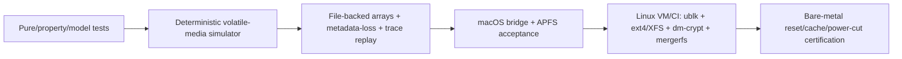

Passing one tier never substitutes for the next tier’s distinct claim.

## 21.1 Pure, property, and fuzz tests

- XOR/P/Q golden vectors across offsets, lengths, coding positions, tails, and known-erasure sets.
- Incremental update equals full recomputation.
- Every tolerated known-erasure set reconstructs exact bytes.
- Shorter-member tails contribute zeros.
- Physical enumeration/replacement cannot change math when logical topology is unchanged.
- Arbitrary request splitting/coalescing produces identical semantic/durable outcomes.
- Lock/RMW/dirty/checksum/batch changes do not reinterpret parity bytes.
- Identity fixtures cover clone UUIDs, missing serials, bridge changes, capacity/geometry changes, and conflicting assignments.
- Parity-envelope, manifest, trace, and SQLite semantic migrations round-trip and reject malformed/unknown incompatible input.
- Checksum state never becomes valid for the wrong content generation.
- SQLite/control deletion and recovery behavior obey authority boundaries.

## 21.2 First-class deterministic volatile-media simulator

`dwv-sim` maintains:

```text
durable_media
volatile_acknowledged_writes
pending_operations
completion_delivery
fault_model
recovery_database_durable_state
parity_envelope_copies
```

It models read, write, flush, FUA-like write, write-zeroes, optional discard, reordering, torn/short I/O, EIO, latent corruption, disappearance/reappearance, SQLite commit failure, parity-envelope tear, daemon crash, controller reset, and power loss.

A daemon crash discards process/machine/slot state but may leave device volatile writes capable of persistence. Power loss discards volatile state and resolves/torn-persists pending writes according to the configured model.

The harness interrupts after every:

- semantic action/result;
- child completion permutation;
- SQLite dirty/integrity commit;
- home write subset;
- store fence;
- SQLite clear/checkpoint;
- parity-session envelope DIRTY/CLEAN and DB ACTIVE/CLOSED handshake transitions;
- topology prepare/DB-commit/envelope-commit/publication;
- checksum target-fence/hash snapshot/read/commit;
- frontend abandonment/duplicate delivery.

Primary parity invariant:

> If a range is reported clean, removing any tolerated known-failed members from durable simulated media still permits exact reconstruction of every protected byte in that range.

Integrity invariants:

- a `VALID` digest matches the exact durable bytes and named content generation and references fence evidence covering those bytes;
- no schedule can durably commit a digest for bytes that disappear on power loss;
- a writer never mutates a previously valid extent before durable invalidation;
- a stale/absent digest is never used to identify a good repair source;
- losing checksum evidence cannot trigger an automatic ambiguous repair.

Session-certificate invariant:

> No reachable crash/power-loss state may leave a matching DB/envelope session validly `CLEAN/CLOSED` if any writable-session home mutation is not covered by a durable global fence and recovery checkpoint. Any missing or mismatched session half resolves to `DIRTY/UNKNOWN`.

Minimal failing schedules are serialized and become regression fixtures before fixes land.

## 21.3 Transaction-machine equivalence

OS-009 drives explicit and `procmachines` implementations with identical generated schedules/results. Compare permitted terminal states, normalized actions, clean/dirty decisions, operation-slot obligations, allocations, CPU, latency, and scaling. Mutation tests ensure the harness detects skipped invalidation, premature clear, stale token reuse, and ignored uncertain completion.

## 21.4 SQLite durability evaluation

For representative recovery transactions, test candidate journal/sync/checkpoint configurations under:

- process kill before/during/after commit;
- simulator-injected sync failure and torn files;
- VM hard reset;
- full filesystem and disk-full conditions;
- corrupted WAL/journal/database pages;
- stale backup/manifest restore;
- later bare-metal power interruption.

The selected mode must preserve atomic recovery-state transitions under its certified storage path. Performance is measured after correctness.

## 21.5 Portable file-backed arrays

On macOS and Linux without ublk:

- create ordinary data files, parity file/envelope, `array.sqlite3`, and `control.sqlite3`;
- run healthy writes, flushes, parity build/verify, checksum invalidation/revalidation, degraded reads, rebuild, restart recovery, and metadata-loss recovery;
- inject short/torn/store/DB/envelope faults;
- prove direct attach/read of healthy and rebuilt data payloads;
- verify matching parity regions incur zero repair writes during metadata-loss scans;
- verify ambiguous mismatches are not overwritten.

## 21.6 macOS APFS integration

Cover Section 17 plus process kill, bridge restart, DiskImages detach/reattach, backing disappearance, sync-heavy workloads, stable size, clone ambiguity, DB deletion/recreation, and direct rebuilt-payload mount. Characterize but do not overclaim power-loss durability.

## 21.7 Normalized block-trace capture and replay

Trace after frontend normalization and before planning. Include:

- provenance and OS/filesystem versions;
- slot, range, operation, flags, ordering/fence IDs;
- submission/completion concurrency and abandonment;
- generated payload seed/pattern or digest, not raw bytes by default;
- initial topology/capabilities and expected final data/parity hashes;
- expected dirty/integrity/recovery states.

Capture ext4, XFS, dm-crypt, mergerfs-driven workloads, databases, fio/fsx, sparse files, and media access. Replay on simulator/macOS and validate final payload, parity, integrity validity, and recovery state.

## 21.8 Linux VM/CI integration

- ublk UAPI/limits, queue/tag behavior, backpressure, recovery, and no unsafe reissue;
- operation-slot/io_uring buffer and cancellation/drain lifetime;
- mount-namespace deadlock regression;
- FLUSH, FUA/preflush, write-zeroes, and discard-disabled/aware behavior;
- ext4/XFS, fsx/selected xfstests, mmap, sparse/truncate/fallocate, journal stress;
- dm-crypt/LUKS, gocryptfs, mergerfs, udev, duplicate UUID prevention;
- NixOS/systemd boot/shutdown/recovery and loss of host recovery state;
- `dm-flakey`, `dm-dust`, disconnect/reset, kill/restart, and unclean VM power-off;
- format upgrade/downgrade/unknown feature and direct data recovery;
- normalized trace capture.

## 21.9 Bare-metal destructive certification

On disposable SATA/SAS/NVMe/USB storage and intended HBAs/bridges:

- probe cache and actual flush/FUA behavior;
- compare cache enabled/disabled and power-loss-protected devices;
- process death, cable pull, reset, timeout, delayed error, and controlled power cuts;
- parity-session clean/dirty envelope transitions under cuts;
- SQLite configuration under cuts on intended system storage;
- replacement/rebuild with repeated interruption;
- compare observed persistence to simulator models;
- publish supported/unsupported paths and evidence.

A UPS is helpful but does not replace the protocol or truthful flushes.

## 21.10 Formal model

Before Gate D, model at least one dirty region with overlapping slot writes, durable intent/integrity invalidation, ordinary versus durable completion, store fences, clear/checkpoint, DB failure, daemon crash, and power loss. The model SHALL prove no false-clean state and no home mutation before durable intent.

Before journal/PPL, P/Q degraded recovery, topology concurrency, or degraded writes, extend the model with uncertain/duplicate completion, parity-envelope session transitions, topology epochs, member loss, replay, and the new protocol's records. TLA+, Stateright, or an equivalent explicit-state model is acceptable. Named model invariants map bidirectionally to simulator tests and retained counterexamples.

## 21.11 Performance/resource tests

Measure direct stores, SQLite intent/clear, parity-envelope session writes, frontend passthrough, single parity, dirty checkpoints, hashing, degraded reconstruction, filesystem/encryption/mergerfs, macOS bridge, journal modes, and optional namespace. Report throughput, p50/p95/p99, CPU, allocations, lock contention, context switches, syscalls, I/O amplification, RSS/locked memory, SQLite/WAL growth, queue saturation, drive activation, and `procmachines` overhead.

# 22. Phased implementation and OpenSpec program

The program attacks silent corruption, persistence, and permanent-format risk before Linux throughput. OpenSpecs MAY split into smaller dependency-preserving units; they SHALL NOT merge a correctness boundary into a performance task.

## 22.1 Dependency overview

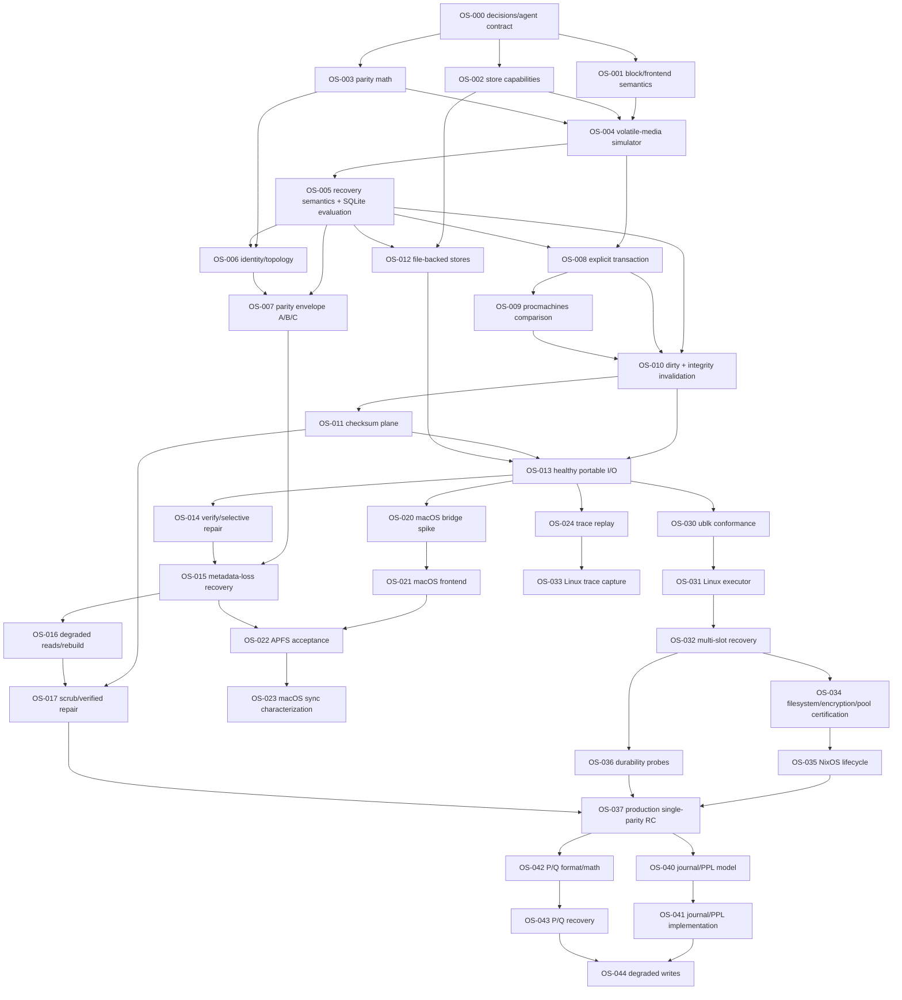

## 22.2 Phase 0 — Source of truth, portable contracts, and executable media

| OpenSpec | Dependencies | Concrete outcome | Minimum executable acceptance | Unlocks |
|---|---|---|---|---|
| **OS-000 — Architecture contract, terminology, ADR/decision register, and agent workflow** | none | Repository-local source of truth matching this revision; machine-readable OpenSpec dependency/status index | architecture lint finds no undefined normative term/decision ID; every accepted/provisional/validation/tunable/user decision is indexed; agent stop/continue tests reviewed | all |
| **OS-001 — Normalized block request and frontend-event semantics** | OS-000 | Portable request/event/error/order/durability model and adapter conformance harness | generated request sequences round-trip; abandon/flush/FUA semantics have deterministic oracle; no OS/runtime types in public crate graph | OS-004, OS-013, OS-020, OS-030 |
| **OS-002 — Random-access store, operation-slot, and capability/safety-profile contracts** | OS-000 | Store completion, partial/uncertain evidence, capability probes, and bounded resource interfaces | fake adapters prove reject/adapt behavior for every capability combination; stale operation-slot generation test fails safely | OS-004, OS-012, OS-031 |
| **OS-003 — XOR reference model, geometry, and golden vectors** | OS-000 | Byte-range XOR with heterogeneous lengths, explicit slots, and future P/Q seam | randomized incremental update equals full recomputation; every single known erasure reconstructs exact bytes; checked arithmetic fuzz passes | OS-004, OS-006, OS-008 |
| **OS-004 — Deterministic volatile-media simulator and schedule minimizer** | OS-001–003 | Durable/volatile/pending/completion/DB/envelope fault model with serialized reproducers | exhaustive bounded one-range schedules distinguish daemon crash/power loss; injected invariant mutation is detected; minimizer reproduces seed-free fixture | OS-005, OS-008, OS-010 |
| **OS-005 — Recovery-state semantics, SQLite prototype, and durability evaluation** | OS-004 | `RecoveryStateStore`, candidate SQLite schema/migrations/export, journal/sync/checkpoint ADR | crash matrix across candidate modes; process/VM reset fixtures; DB integrity/corruption handling; semantic export; deletion does not affect direct data readability; selected mode documented | OS-007, OS-010, OS-012 |
| **OS-006 — Anchorless topology and identity-evidence model** | OS-003, OS-005 | Stable slot/coding/assignment topology and deterministic evidence assessor | clone UUID, missing serial, USB bridge, replacement, capacity change, and ambiguous candidates fixtures; writable assembly rejects every ambiguous case | OS-007, OS-015, OS-032 |
| **OS-007 — Parity envelope profiles A/B/C and independent decoder** | OS-005–006 | FORMAT-EXPERIMENTAL comparison of bare, redundant envelope, and envelope+bitmap; exact-capacity policy ADR | torn/A-B/unknown feature/migration tests; independent decoder; capacity proof; session-certificate crash model; no profile selected stable without evidence | OS-015, Gate C |
| **OS-008 — Explicit reference transaction machine** | OS-003–005 | Small auditable first-write/already-dirty/checkpoint/abandonment machine emitting normalized actions | every transition has pre/post invariant assertions; crash after each action yields only allowed durable states | OS-009–010 |
| **OS-009 — `procmachines` transaction implementation and evidence comparison** | OS-008 | Equivalent procedural implementation plus selection ADR and exit plan | permitted terminal states/action traces match reference under faults; allocation/CPU/latency/concurrency benchmark; mutation tests; select/fallback recorded | OS-010 |

**Phase 0 gate:** a coding agent can execute contracts, simulator schedules, SQLite experiments, identity fixtures, and both transaction machines without Linux-specific code or user decisions.

## 22.3 Phase 1 — Portable conservative single parity and integrity

| OpenSpec | Dependencies | Concrete outcome | Minimum executable acceptance | Unlocks |
|---|---|---|---|---|
| **OS-010 — Dirty-region protocol and atomic integrity invalidation** | OS-005, OS-008–009 | First-write, already-dirty, flush/clear, crash recovery, and session-dirty semantics | explicit-state model plus simulator crashes after every DB/home/fence transition never report false clean or valid stale digest; no home write after failed intent commit; model counterexamples replay in simulator | OS-011, OS-013 |
| **OS-011 — Data/P/Q checksum model and asynchronous generational revalidation** | OS-010 | BLAKE3-256/extent prototype, records, hash workers, profile migration seam | concurrent write/hash schedules never install wrong-generation digest; power loss never preserves a `VALID` digest for vanished target bytes; full-overwrite optimization equivalence; metadata-size/throughput benchmark; profile ADR | OS-013, OS-017 |
| **OS-012 — Portable file-backed stores, SQLite stores, locking, and capability probes** | OS-002, OS-005 | Sparse/regular file stores, `array.sqlite3`, `control.sqlite3`, process locking, identity observations | exact/short/EIO/flush fixtures; backing/export alias rejection; direct-image equality; control DB deletion/rebuild | OS-013, OS-020 |
| **OS-013 — Healthy portable read/write path** | OS-010–012 | End-to-end normalized requests through selected transaction machine, operation slots, file stores, parity, DB, and hashes | randomized workloads match reference images; kill/restart schedules recover; bounded memory/slots; abandonment drains safely | OS-014, OS-020, OS-024, OS-030 |
| **OS-014 — Exhaustive parity verification and evidence-gated selective repair** | OS-013 | Full scan with no-write matching path and repair classifier | matching array produces zero parity writes; bad parity/data identified with hashes; hashless mismatch produces report and no write; quick sampling cannot set clean | OS-015, OS-017 |
| **OS-015 — Metadata-loss matrix and recovery implementation** | OS-006–007, OS-014 | Every Section 12.5 case encoded as plan, test, CLI dry run, and recovery action | delete/corrupt/stale DB scenarios; clean-envelope fast path remains gated; all-data recovery builds new DB; clone/topology ambiguity fails closed; mismatch policy honored | OS-016, OS-022 |
| **OS-016 — Degraded reads and offline resumable rebuild** | OS-015 | Known-erasure reads, dirty-range refusal, replacement assignment, resumable rebuild, direct attach | all clean known-erasure ranges decode exactly; dirty/unknown ranges refuse; interrupted rebuild resumes; replacement image byte-equals reference and mounts independently | OS-017, OS-022 |
| **OS-017 — Checksum scrub and verified repair** | OS-011, OS-014, OS-016 | Full scrub classifier, verified data/parity repair, migration of checksum sets | automatic repair occurs only with unique verified solution; beyond-tolerance/conflicting evidence preserves media; repaired digest/equation verified after crash schedules | OS-037 |

**Phase 1 gate:** portable file-backed single parity survives modeled crashes, separates parity/integrity state, recovers from DB loss with all data, performs safe degraded reads/rebuild, and never overwrites an ambiguous mismatch.

## 22.4 Phase 2 — macOS functional reference and trace replay

| OpenSpec | Dependencies | Outcome | Executable acceptance | Unlocks |
|---|---|---|---|---|
| **OS-020 — FSKit/macFUSE/DiskImages raw-file feasibility** | OS-012–013 | Smallest seekable fixed-size proxy and comparative ADR | attach, block I/O trace, sync/cache/disconnect behavior, entitlements/automation, backing/export separation; choose bridge or document blocker | OS-021 |
| **OS-021 — macOS DiskWeave frontend** | OS-020 | Stable-slot proxy files translating to normalized requests | APFS sees fixed geometry; backpressure/abandonment; clean detach/restart; path/file-ID swap tests | OS-022 |
| **OS-022 — APFS degraded, metadata-loss, clone, and rebuild acceptance** | OS-015–016, OS-021 | Automated Section 17 demonstration | all 12 scenarios pass; rebuilt image mounts independently; ambiguous clone/mismatch never auto-selected/repaired | OS-023 |
| **OS-023 — macOS synchronization/durability characterization** | OS-022 | Exact `portable-demo` contract and unsupported semantics | sync-heavy kill/restart tests; operation trace mapping; no production claim beyond evidence | Gate F |
| **OS-024 — Normalized trace fixture/replay engine** | OS-013 | Versioned privacy-safe traces validating payload/parity/integrity/recovery final state | deterministic generated-data replay, minimization, schema migration, simulator/macOS equivalence | OS-033 |

## 22.5 Phase 3 — Linux frontend and production single parity

| OpenSpec | Dependencies | Outcome | Executable acceptance | Unlocks |
|---|---|---|---|---|
| **OS-030 — ublk UAPI/library feasibility and conformance** | OS-001–002, OS-013 | one/multiple ordinary Linux block devices and adapter ADR | queue/tag/limits/flags/recovery tests; mount namespace regression; bounded resource baseline; no parity-format coupling | OS-031 |
| **OS-031 — Linux operation-slot/raw-store executor** | OS-002, OS-030 | io_uring/fallback executor with generational buffers and structured uncertainty | CQE reorder/duplicate/cancel/drain tests; sanitizer/Miri where applicable; no reuse before terminal completion | OS-032 |
| **OS-032 — Multi-slot ublk array group and daemon recovery** | OS-006, OS-015, OS-031 | all-or-nothing assembly, coherent virtual slots, process restart/quiescence | wrong/clone member refusal; no automatic unsafe reissue; kill/restart with dirty recovery; bounded queues/shards | OS-034, OS-036 |
| **OS-033 — Linux normalized trace capture** | OS-024, OS-030 | sanitized traces from real stacks | ext4/XFS/dm-crypt/mergerfs/database/fio fixtures replay identically on simulator/macOS | regression suite |
| **OS-034 — ext4/XFS, encryption, mergerfs certification** | OS-032–033 | certified upper-stack matrix and direct recovery | fsx/selected xfstests, mmap/fsync/sparse, LUKS/gocryptfs, duplicate UUID prevention, performance report | OS-035 |
| **OS-035 — NixOS/systemd lifecycle** | OS-034 | declarative policy, discovery, namespaces, boot/shutdown/recovery units | automated clean/unclean boot drills; global session clean transition; no self-deadlock; configuration never rewrites topology | OS-037 |
| **OS-036 — Linux and hardware durability probes** | OS-005, OS-007, OS-032 | capability evidence and supported path classifier | loop/dm/VM probes then disposable SATA/SAS/NVMe/USB; flush/FUA/SQLite/envelope behavior captured | OS-037 |
| **OS-037 — Production single-parity release candidate** | OS-017, OS-035–036 | supported-kernel/filesystem/hardware matrix, security/observability/performance closeout | sustained verified workloads, recovery drills, resource bounds, zero false-clean states, portable recovery tool release | Gate H, OS-040, OS-042 |

## 22.6 Phase 4 — Advanced recovery, dual parity, and degraded writes

| OpenSpec | Dependencies | Outcome | Acceptance | Unlocks |
|---|---|---|---|---|
| **OS-040 — Journal versus PPL ADR and formal model** | OS-037 | selected or rejected optimization based on write/recovery/degraded needs | model duplicates, loss, replay, wraparound, checksum updates, and media failure; benchmark amplification | OS-041 |
| **OS-041 — Journal/PPL implementation** | OS-040 | bounded replay/checkpoint implementation | torn records, repeated crash, power cuts, migration, bounded startup scan, independent inspection | OS-044 |
| **OS-042 — P/Q codec and stable profile candidate** | OS-003, OS-007, OS-037 | fully specified field/coefficient/ordering profile and parity-envelope semantics | cross-implementation golden vectors, migration/rebuild plan, no library identity in format | OS-043 |
| **OS-043 — P/Q metadata-loss, degraded read, and two-member rebuild** | OS-015–016, OS-042 | coding-position-aware recovery matrix implementation | one/two known erasure tests; lost-position refusal; all-data new-topology rebuild | OS-044 |
| **OS-044 — Degraded writes** | OS-041, OS-043 | explicitly modeled missing-data/missing-parity write protocols | formal/simulator/hardware schedules, rebuild reconciliation, duplicate delivery, no beyond-tolerance mutation | later availability release |
| **OS-045 — Online build/check/scrub/rebuild** | OS-041, OS-044 | concurrent maintenance with foreground I/O | cursor/write-race model, QoS, repeated interruption, no mixed topology | operations maturity |
| **OS-046 — Optional application-level recovery replicas** | OS-037 | conservative replica protocol only if deployment evidence needs it | dirty union, clean proof, membership changes, divergent histories, failure-domain validation | stronger metadata profile |

## 22.7 Phase 5 — Optional namespace product

| OpenSpec | Outcome |
|---|---|
| **OS-050 — Namespace semantics contract** | deterministic union behavior, conflicts, errors, cache/mmap/fsync semantics |
| **OS-051 — Pure whole-file placement/conflict model** | property-tested placement and no cross-member file striping |
| **OS-052 — Conventional FUSE adapter and conformance** | correct copy path without parity coupling |
| **OS-053 — FUSE passthrough/alternative transport benchmark** | evidence-based optimization decision |
| **OS-054 — Safe mover/rebalance and tier protection** | durable copy/fsync/rename/unlink workflow with protection-state reporting |

The optional namespace program cannot delay or weaken parity/recovery gates.

# 23. Release and acceptance gates

## Gate A — Architecture and decision-authority gate

- accepted/provisional/validation/tunable/user decisions are indexed and internally consistent;
- data-member no-metadata invariant has no contradictory layout/example;
- every core boundary has a semantic interface and failure policy;
- downstream-agent stop/continue rules and OpenSpec dependency graph are executable repository artifacts.

## Gate B — Semantic core and simulator gate

- normalized requests/stores/capabilities/topology/parity reference math pass property/fuzz tests;
- simulator distinguishes daemon crash/power loss and minimizes schedules;
- explicit and `procmachines` transaction machines have an evidence-backed selection/fallback ADR;
- no Linux/macOS/SQLite implementation type defines core semantics.

## Gate C — Recovery-state and experimental-format gate

- SQLite durability configuration is selected by executable crash evidence, not assumption;
- identity-evidence resolver rejects clone/ambiguous cases;
- parity profiles A/B/C are compared, exact-capacity policy is explicit, and independent decoder exists;
- parity-envelope bytes remain FORMAT-EXPERIMENTAL and protect no irreplaceable data.

## Gate D — Portable write-safe single-parity gate

- the explicit-state model and first-write, already-dirty, flush/clear, abandonment, DB failure, and restart schedules never report false clean;
- checksum invalidation precedes every relevant home mutation;
- healthy file-backed workloads match reference data/parity images;
- resource bounds are enforced.

## Gate E — Integrity and metadata-loss gate

- exhaustive verification performs zero writes for matching regions;
- quick sampling cannot establish clean;
- every `VALID` digest is tied to durable target-store fence evidence, including power-loss schedules;
- hash-backed selective repair identifies the bad shard and prevalidates the candidate before mutation;
- hashless mismatch is preserved and not overwritten;
- every metadata-loss matrix case has an executable plan/test;
- all-data-present recovery creates a new DB/topology/parity baseline without proprietary data dependence.

## Gate F — macOS APFS portability gate

- real APFS members work through the selected bridge;
- degraded read and rebuild complete;
- rebuilt raw data file mounts independently;
- DB deletion/recovery, clone ambiguity, and mismatch policy scenarios pass;
- live macOS durability limitations are explicit.

## Gate G — Linux ublk conformance gate

- ublk request flags, ordering, limits, queue/tag recovery, operation-slot lifetime, namespaces, and no-unsafe-reissue behavior pass;
- ext4/XFS/dm-crypt/mergerfs workloads pass certified tests;
- Linux traces replay on portable implementations.

## Gate H — Hardware and parity-session certificate gate

- intended storage paths truthfully satisfy required flush/FUA behavior under destructive tests;
- SQLite mode and parity-envelope DIRTY/CLEAN transitions survive controlled power cuts;
- no tested cut leaves all envelopes clean across uncovered home mutation;
- external-write release and uncertain-chain-of-custody paths disable the clean fast path;
- supported/unsupported hardware matrix is published.

Only after Gate H MAY a parity-envelope clean certificate skip exhaustive verification after DB loss.

## Gate I — Stable format 1

- data payload remains formatless to DiskWeave;
- parity payload/profile, parity envelope, exported manifest, and recovery schema candidates have independent decoders and golden fixtures;
- unknown-feature, downgrade, exact-capacity, interrupted migration, and damaged-copy behavior is proven;
- a full restore drill starts with ordinary data payloads plus whatever parity/recovery evidence survived;
- migration/rollback documentation exists for every frozen semantic field;
- the product can explain how data is recovered if DiskWeave software disappears.

# 24. Decision, validation, tuning, and format register

Each OpenSpec SHALL reference the relevant IDs. Agents may not silently change an accepted decision or freeze a format candidate.

## 24.1 Accepted decisions

| ID | Decision |
|---|---|
| **D-001** | DiskWeave is a portable parity block engine, not a custom filesystem. |
| **D-002** | Each healthy data payload remains an ordinary independently readable image. |
| **D-003** | Data members contain no required DiskWeave metadata, sidecar, or partition. |
| **D-004** | ublk/FSKit/io_uring/SQLite/`procmachines` remain behind replaceable seams. |
| **D-005** | Stable slot/coding/topology identity is independent of physical enumeration. |
| **D-006** | Multiple identity observations are assessed; clone ambiguity blocks writes. |
| **D-007** | Logical transaction and backend I/O-resource lifetimes are separate. |
| **D-008** | First writable protocol uses durable dirty intent and home-store fences. |
| **D-009** | Checksum invalidation is durably committed before protected mutation. |
| **D-010** | Data, P, and Q are checksum targets; parity cleanliness and integrity coverage are separate. |
| **D-011** | Sampling never establishes `CLEAN`. |
| **D-012** | Automatic repair requires a unique result from verified-good evidence. |
| **D-013** | `array.sqlite3` loss never destroys intact data; all-data recovery can create a new topology/baseline. |
| **D-014** | The first safe release prohibits writes when any required data/parity role is unavailable. |
| **D-015** | Permanent granularities remain independent. |
| **D-016** | A full verification scan is distinct from parity rewrite; matching regions require no writes. |
| **D-017** | Backing and exported endpoints cannot alias while active. |
| **D-018** | The simulator, macOS reference, Linux CI, and hardware certification prove distinct claims. |
| **D-019** | No format v1 without independent recovery tools and migration evidence. |
| **D-020** | Routine implementation decisions are delegated to agents under Section 25. |
| **D-021** | A checksum becomes `VALID` only for a named content generation covered by durable target-store fence evidence. |

## 24.2 Provisional implementation choices

| ID | Preferred choice | Exit seam / evidence |
|---|---|---|
| **P-001** | ublk Linux frontend | normalized frontend API; OS-030 ADR |
| **P-002** | `libublk-rs` | adapter boundary; conformance/maintenance comparison |
| **P-003** | io_uring Linux store executor | `RandomAccessStore`/operation-slot boundary |
| **P-004** | `procmachines` transaction machine | explicit reference oracle; OS-009 |
| **P-005** | SQLite `array.sqlite3` | `RecoveryStateStore`; OS-005 |
| **P-006** | separate SQLite `control.sqlite3` | management projection port; deletion/rebuild |
| **P-007** | BLAKE3-256, ~4 MiB extents | integrity profile IDs and parallel migration |
| **P-008** | parity profile B: redundant small envelope | OS-007 A/B/C comparison |
| **P-009** | FSKit + DiskImages macOS bridge | frontend API; macFUSE/DriverKit ADR |
| **P-010** | mergerfs namespace | independent namespace plane |

## 24.3 Validation decisions

| ID | Question | Required evidence | Agent authority |
|---|---|---|---|
| **V-001** | SQLite WAL/rollback, sync, checkpoint, page/connection settings | crash/VM reset/performance matrix | choose and continue |
| **V-002** | parity bare/B/B+bitmap profile | simulator, capacity, latency, recovery comparison | choose B unless evidence favors another and compatibility is explicit |
| **V-003** | parity reserve size/locations | damage, capacity, future-field bounds | choose before format freeze |
| **V-004** | exact-capacity import policy | real device geometry and UX prototype | escalate only if product semantics differ materially |
| **V-005** | parity-session clean fast path | simulator + hardware power cuts | enable only after Gate H |
| **V-006** | `procmachines` production use | semantic equivalence + benchmark | choose/fallback and continue |
| **V-007** | FSKit/macFUSE bridge | functional/sync/cache spike | choose and continue; escalate only if macOS goal must narrow |
| **V-008** | queue/ring/zero-copy topology | Linux workload/resource benchmarks | choose bounded defaults |
| **V-009** | checksum extent/profile | metadata/CPU/repair benchmarks | choose and preserve migration seam |
| **V-010** | journal vs PPL | formal model and hardware benchmark | choose only when needed |
| **V-011** | P/Q field/coefficient profile | cross-implementation vectors/migration | format decision; escalate if incompatible alternatives remain tied |
| **V-012** | application-level recovery replicas | deployment failure evidence | defer unless ordinary redundant storage is insufficient |

## 24.4 Tunable policies

| ID | Tuning area | Required behavior |
|---|---|---|
| **T-001** | queue/shard/slot/buffer counts | bounded default, 8/16/32-member resource report |
| **T-002** | RMW/batch/lock/checkpoint sizes | independent, benchmarked, observable |
| **T-003** | hash/scrub/rebuild concurrency | foreground-priority QoS and resumability |
| **T-004** | SQLite cache/connections/maintenance | bounded growth and latency telemetry |
| **T-005** | trace/log/history retention | privacy-safe bounded defaults |
| **T-006** | retry/timeouts | no blind retry of uncertain non-idempotent operations |

## 24.5 Explicit user decisions

| ID | Decision |
|---|---|
| **U-001** | authorize destructive member assignment/replacement/reset/rebaseline |
| **U-002** | choose stable redundancy product profile when alternatives have user-visible capacity/availability tradeoffs |
| **U-003** | opt into weaker exact-capacity bare-parity profile, if shipped |
| **U-004** | opt into future degraded/unprotected writes |
| **U-005** | approve an incompatible change to a promised stable format |

## 24.6 Permanent-format candidates

| ID | Candidate | What freezes | Constraint / migration / interrupted behavior |
|---|---|---|---|
| **F-001** | XOR parity mapping | byte correspondence, zero-tail rules | immutable math; optimized implementation replaceable; new codec requires rebuilt/parallel parity |
| **F-002** | P/Q profile | field, polynomial, symbol order, coefficients | cross-implementation vectors; new profile requires explicit migration/rebuild |
| **F-003** | parity payload boundaries | logical-to-physical offset/length | changing offset requires copy/rebuild; never silently shortens protection |
| **F-004** | parity envelope | header/features/body/copy selection/session certificate | A/B staged migration; newest valid committed copy; old read-only behavior defined |
| **F-005** | exported recovery manifest | topology/profile/evidence semantic schema | versioned reader; no raw SQLite pages; old manifests remain inspectable |
| **F-006** | `array.sqlite3` semantic schema | recovery concepts/generations, not table ABI | transactional migrations, backup/export, all-data rebuild path |
| **F-007** | integrity profile | algorithm/digest/extent semantics | parallel checksum sets and atomic active-set switch |
| **F-008** | journal/PPL | record/order/replay semantics | dual-reader/checkpoint migration; interrupted state remains replayable |
| **F-009** | normalized trace | dev/test event semantics | fixture migration; never user-array compatibility truth |

Data payload bytes and `control.sqlite3` are deliberately absent from the permanent DiskWeave format list.

# 25. Autonomous implementation-agent operating contract

This section is normative. It defines how a capable coding agent SHALL turn this architecture into OpenSpecs, implementation, tests, evidence, and subsequent work without repeatedly asking the product owner to resolve routine engineering choices.

The architecture is a control document, not merely background reading. The implementation agent SHALL preserve its semantic decisions even when a local library API suggests a simpler but incompatible design.

## 25.1 Source-of-truth order

When sources disagree, use this precedence:

1. accepted invariants and decisions in Sections 1–24;
2. the active OpenSpec's explicit semantic contract;
3. accepted ADRs and recorded executable evidence;
4. reference models, golden vectors, and simulator oracles;
5. implementation code and comments;
6. library examples, convenience APIs, and historical prototypes.

An implementation detail SHALL NOT override a higher-level invariant merely because code already exists. When implementation evidence falsifies an architectural assumption, the agent SHALL preserve the failing evidence, draft an ADR and architecture amendment, and use the escalation rules in Section 25.8.

## 25.2 Dependency-driven execution loop

```mermaid
flowchart TD
    A[Read architecture, decision register, gates] --> B[Select next dependency-ready OpenSpec]
    B --> C[Write or refine executable OpenSpec]
    C --> D[Implement smallest vertical slice]
    D --> E[Unit + golden-vector tests]
    E --> F[Property / fuzz / reference-model tests]
    F --> G[Deterministic simulator fault schedules]
    G --> H[Integration tests available on current OS]
    H --> I[Performance and resource checks where required]
    I --> J[Record ADRs, evidence, regressions, residual risks]
    J --> K{Every acceptance criterion passes?}
    K -- No --> L[Minimize failure; add regression before fix]
    L --> D
    K -- Yes --> M[Mark OpenSpec complete and update gate evidence]
    M --> N{Another dependency-ready OpenSpec?}
    N -- Yes --> B
    N -- No --> O[Report blocked dependency or reached gate]
```

The agent SHALL prefer the smallest end-to-end slice that exercises a semantic contract and its failure behavior over broad scaffolding with no executable safety oracle.

## 25.3 OpenSpecs are executable contracts

Every OpenSpec SHALL contain the following twenty sections in this order. A section may state “not applicable” only with a reason.

```markdown
# OS-XYZ: Title

## 1. Architecture decisions and target gate
## 2. Concrete outcome
## 3. Prerequisites
## 4. Exact scope and non-scope
## 5. Semantic APIs and contracts
## 6. State ownership and lifecycle
## 7. Persistent-state impact
## 8. Irreversible and durability boundaries
## 9. State and sequence diagrams
## 10. Concurrency and resource rules
## 11. Failure matrix
## 12. Deterministic simulator cases
## 13. Property, model, and fuzz tests
## 14. Integration tests
## 15. Observability, security, and operator behavior
## 16. Performance and resource bounds
## 17. Executable acceptance criteria
## 18. Forbidden outcomes
## 19. Migration and compatibility consequences
## 20. Next OpenSpecs unlocked
```

### 25.3.1 Required content of each section

**1. Architecture decisions and target gate**

- cite all relevant D/P/V/T/U/F IDs;
- identify the release gate and exact evidence this OpenSpec contributes;
- state whether any provisional or validation decision will be resolved.

**2. Concrete outcome**

Describe an observable engineering or user outcome, not merely “add crate” or “create module.” Example: “A crash-scheduled partial parity write recovers to `DIRTY` and is never reported `CLEAN`.”

**3. Prerequisites**

List completed OpenSpecs, required tools, reference vectors, capability probes, and environment constraints. The agent SHALL not begin implementation when a correctness-critical predecessor is absent; it MAY create missing predecessor OpenSpecs and continue in dependency order.

**4. Exact scope and non-scope**

Separate portable, simulator, macOS, Linux, and hardware claims. Explicitly defer unrelated optimizations and user-visible features.

**5. Semantic APIs and contracts**

Specify inputs, outputs, stable error classes, ordering, idempotence, generation rules, and invariants. Rust-like examples MAY illustrate semantics but SHALL not freeze private struct layout, crate types, runtime futures, or database tables.

**6. State ownership and lifecycle**

Identify ownership of:

- semantic transaction state;
- topology snapshots;
- recovery-state transactions;
- operation slots and child I/O;
- actual buffers and frontend tags;
- kernel/backend completion uncertainty;
- persistent records;
- logs and metrics.

For every resource, state when it becomes reusable. Frontend cancellation is never sufficient by itself to reclaim in-flight backend resources.

**7. Persistent-state impact**

Identify every durable semantic field or byte range read or written. State its authority class, rebuild path, schema/format version, compatibility behavior, and whether it is FORMAT-EXPERIMENTAL. “Uses SQLite” is not a sufficient description; define the recovery semantics independent of tables.

**8. Irreversible and durability boundaries**

Name each transition after which rollback is no longer safe. State the required preconditions and durability fence. At minimum, any write-path OpenSpec SHALL answer:

```text
Before first home-media mutation:
    dirty intent is durable
    affected current integrity evidence is durable STALE
    topology snapshot is still authorized

Before reporting durable completion:
    the request's required data/parity writes satisfy the declared fence

Before CLEAN:
    every required home write is durable
    recovery metadata records the checkpoint durably
    no unresolved generation or topology conflict exists
```

**9. State and sequence diagrams**

Provide Mermaid diagrams whenever ordering, failure, concurrency, or recovery would otherwise be inferred from scattered prose. Diagrams SHALL use the same state names and actions as the API contract.

**10. Concurrency and resource rules**

Specify range-conflict behavior, snapshot/epoch checks, bounded queues, maximum live slots, buffer limits, background-work throttling, retry policy, and starvation/fairness expectations. Numeric values may be tunable; boundedness and safety behavior are not.

**11. Failure matrix**

Define behavior for every applicable condition:

- short read/write;
- EIO or equivalent backend error;
- timeout;
- uncertain persistence or completion;
- delayed, out-of-order, duplicate, or stale completion;
- device disappearance and reappearance;
- frontend abandonment;
- daemon crash;
- host crash or power loss;
- recovery-database I/O failure, corruption, absence, or staleness;
- parity-envelope absence, tear, corruption, or disagreement;
- identity ambiguity;
- topology-generation mismatch;
- unsupported capability or format feature.

The default for uncertainty is conservative: retain `DIRTY`/`UNKNOWN`, stop writes where needed, and refuse automatic repair rather than infer success.

**12. Deterministic simulator cases**

Enumerate fault schedules at every meaningful suspension and durability transition, expected durable state after recovery, and the invariant oracle. Each discovered simulator failure SHALL be stored as a minimized reproducible seed or explicit schedule.

**13. Property, model, and fuzz tests**

Define generators, shrinking/minimization, reference comparison, mutation bounds, and safety properties. Tests SHALL compare semantic outcomes, not merely successful return values.

**14. Integration tests**

Identify tests runnable on the current host plus separately gated macOS, Linux, or hardware tests. A skipped platform test SHALL remain visible as unmet evidence rather than silently passing.

**15. Observability, security, and operator behavior**

Specify stable event names/classes, metrics, diagnostics, privacy/redaction, permission requirements, fail-closed messages, and any destructive confirmation. Operators SHALL be told what is known, unknown, and required next.

**16. Performance and resource bounds**

State measurable ceilings or baselines where relevant: allocations/request, memory/member, descriptors, operation slots, queue occupancy, database growth, flush count, write amplification, and background bandwidth. Optimization SHALL not weaken a safety invariant.

**17. Executable acceptance criteria**

Every criterion SHALL identify a command/test, fixture or generated input, and expected result. Avoid “robust,” “safe,” or “fast” without an observable threshold or invariant. A criterion that depends on later hardware evidence SHALL identify the gate that remains closed.

**18. Forbidden outcomes**

List unsafe results that tests must prove absent. Examples:

- reports `CLEAN` after a schedule that leaves durable data/parity inconsistent;
- accepts a clone-ambiguous assignment writable;
- treats a stale digest as current or commits `VALID` for bytes not covered by a durable target fence;
- reuses an operation slot before stale completions are impossible;
- repairs a mismatch without uniquely verified-good source evidence;
- changes a data payload layout;
- leaks frontend/runtime/database types across the core seam.

**19. Migration and compatibility consequences**

Describe upgrade, downgrade, interrupted migration, read-only fallback, rebuild/scan requirements, and independent recovery-tool support. Any new permanent byte format remains FORMAT-EXPERIMENTAL until the corresponding gate passes.

**20. Next OpenSpecs unlocked**

List exact successor IDs and the evidence they may now assume. Completion SHALL update the dependency index rather than rely on conversational memory.

### 25.3.2 OpenSpec sizing and splitting

The Section 22 entries are dependency work packages, not permission to create monolithic changes. An agent SHALL split a work package into ordered child OpenSpecs when any of these is true:

- it contains more than one independently testable irreversible/durability boundary;
- it resolves multiple unrelated validation decisions;
- it introduces more than one independently migratable permanent format;
- its acceptance criteria cannot all run until a large unrelated subsystem exists;
- a portable semantic change and an OS adapter can be accepted separately;
- failure minimization and review would be materially clearer with a smaller state space.

A child OpenSpec SHALL retain the parent decision/gate references and use a stable repository-local suffix or child ID recorded in the dependency index. Splitting must preserve a vertical executable outcome; it must not produce layers of interfaces with no caller, oracle, or failure test.

## 25.4 Definition of complete

An OpenSpec is complete only when all of the following are true:

- every acceptance criterion is executable and passes in the required environments;
- all required negative/forbidden outcomes are tested;
- simulator/property failures discovered during implementation have minimized regression fixtures;
- no invariant was weakened to satisfy an implementation;
- any provisional choice resolved by evidence has an ADR recording alternatives, measurements, and reversal seam;
- persistent changes have migration/interruption tests and independent decoding where required;
- resource bounds are measured, not guessed, when the OpenSpec claims a bound;
- observability identifies the relevant recovery state without requiring debug builds;
- documentation, decision register, and dependency index reflect the implemented semantics;
- unmet Linux/hardware evidence remains an explicit closed gate rather than being inferred from macOS or simulation success.

Passing the happy path alone is never completion for a durability, recovery, integrity, identity, or operation-lifetime OpenSpec.

## 25.5 Self-testing and defect workflow

When a test or implementation exposes a defect, the agent SHALL:

1. preserve the original failure input, fault schedule, trace, topology, and seed;
2. minimize it while retaining the safety violation;
3. add a failing regression test before changing the implementation;
4. classify the cause as implementation defect, OpenSpec ambiguity, architecture contradiction, capability mismatch, or invalid test oracle;
5. fix the lowest layer that actually violated the contract;
6. rerun the local regression, related property/model suites, and every gate affected by the change;
7. record an ADR or architecture correction when the evidence changes a prior assumption;
8. retain the regression permanently unless the represented format/feature is intentionally removed with migration.

The agent SHALL NOT:

- delete or weaken a test solely because it is difficult to satisfy;
- redefine `CLEAN`, `VALID`, “durable,” or “reconstructable” to match observed broken behavior;
- add an unbounded retry that hides uncertain completion;
- serialize the whole system merely to avoid specifying ownership unless the reference implementation intentionally does so and performance is not being claimed;
- bypass the reference model because two production implementations agree with each other;
- treat a process-kill test as a power-loss test;
- use real user payloads in retained trace fixtures by default.

## 25.6 Autonomous decision rules

Implementation agents are expected to decide and continue in the following cases without asking the product owner:

- internal module, trait, private struct, test-fixture, and error-type organization;
- a provisional library choice whose replacement seam is already required;
- SQLite table/index details consistent with `RecoveryStateStore` semantics;
- queue depth, worker counts, shard count, batch size, cache size, and other tunables after measuring bounded defaults;
- implementation of an accepted algorithm against published/golden vectors;
- choice between equivalent retry/backoff/logging mechanics that does not change durability or user-visible semantics;
- a validation decision where evidence clearly selects one option and the selected option does not freeze an incompatible user format;
- deferring an optimization that is not required by the current gate;
- tightening safety by conservatively refusing a state the architecture does not prove safe.

The agent SHALL record meaningful choices in ADRs, but ADR creation is not a reason to pause implementation.

## 25.7 Preferred behavior when evidence is incomplete

When evidence is incomplete, the agent SHALL choose among these actions in order:

1. implement the smallest deterministic experiment, model, benchmark, or capability probe;
2. select the best-supported reversible option and continue;
3. retain both implementations behind a seam when comparison is still needed;
4. choose the conservative read-only/refuse/dirty behavior when safety evidence is absent;
5. defer a nonessential feature while preserving the accepted architecture.

Lack of evidence is not permission to infer optimistic durability, identity, or repair semantics.

## 25.8 Product-owner escalation criteria

The agent SHALL stop and request a product decision only when at least one of these conditions holds:

- two viable choices have materially different user-visible capacity, availability, recoverability, or compatibility guarantees and architecture/evidence does not select one;
- a proposed change would create or alter a promised stable on-disk format incompatibly;
- proceeding requires destructive action against non-disposable user data or explicit trust/rebaseline authority;
- the safest available choice would seriously defeat the stated product goal rather than merely defer performance or convenience;
- evidence remains genuinely tied after a reasonable executable comparison and the choice is expensive to reverse;
- legal, licensing, privacy, or distribution obligations require an owner decision.

The agent SHALL NOT escalate because a crate has multiple reasonable APIs, a table needs an index, a benchmark needs a threshold derived from the current baseline, or a tunable lacks a user preference.

An escalation request SHALL contain:

- the exact U/F/V decision IDs involved;
- the smallest product-level question;
- measured evidence and rejected alternatives;
- the conservative default if no answer is supplied;
- migration/reversal consequences.

## 25.9 Required project evidence artifacts

The implementation program SHALL maintain version-controlled, machine-readable or plainly parseable artifacts for:

- OpenSpec dependency/status index;
- ADR index linked to decision IDs;
- release-gate evidence matrix;
- golden parity/checksum/format vectors;
- minimized simulator and property-test regressions;
- normalized trace fixtures and privacy provenance;
- format/schema versions and migration compatibility matrix;
- supported capability profiles and probe results;
- platform/hardware certification matrix.

Exact filenames and serialization are provisional. The semantic content and version-control history are required.

## 25.10 Handoff between agents

Before yielding work to another agent, the current agent SHALL leave:

- the active OpenSpec and exact acceptance status;
- commands needed to reproduce all relevant tests/benchmarks;
- unresolved failures with minimized inputs;
- ADRs created or pending;
- formats or schemas touched;
- gates advanced or still blocked;
- the next dependency-ready OpenSpec;
- no correctness-critical state that exists only in chat history or an uncommitted scratch file.

A new agent should be able to resume by reading the repository artifacts and this architecture, not by reconstructing intent from prior conversations.

# 26. Disaster-recovery stories and acceptance scenarios

This section expresses recovery in operator terms. It is normative wherever it states what DiskWeave may certify or repair. Implementation details may change; the certainty boundary may not.

## 26.1 Common recovery principles

Every disaster-recovery flow SHALL follow these rules:

1. stop or refuse writable assembly before examining uncertain state;
2. preserve original devices/files and metadata when practical; do not “repair” the only evidence in place;
3. distinguish **discovering a candidate topology**, **verifying parity equations**, **identifying a bad shard**, and **authorizing repair**;
4. use complete verification or trustworthy durable protocol evidence for `CLEAN`; sampling is diagnostic only;
5. leave matching parity regions untouched;
6. repair a mismatch automatically only when current independent evidence uniquely identifies the bad bytes and the remaining verified-good shards suffice;
7. require explicit operator trust/rebaseline authority when choosing data as truth without such evidence;
8. create a new recovery-state generation and explain which historical certainty was lost;
9. never modify conventional data-member layout merely to restore DiskWeave metadata.

```mermaid
flowchart TD
    A[Recovery begins read-only] --> B[Inventory data, parity, DB, manifests, identity evidence]
    B --> C{Writable topology unambiguous?}
    C -- No --> D[Refuse writes; forensic/operator-assisted mapping]
    C -- Yes --> E{Trustworthy clean certificate and required evidence?}
    E -- Yes --> F[Reconstruct recovery DB; validate certificate inputs]
    E -- No --> G[Exhaustive verification of uncertified address space]
    G --> H{Equation matches?}
    H -- Yes --> I[Record verified region; no parity write]
    H -- No --> J{Unique bad shard proven by current hashes?}
    J -- Yes --> K[Repair/rebuild to safe target; verify result]
    J -- No --> L[Preserve mismatch; require explicit trust/rebaseline or forensic recovery]
    F --> M[Assemble according to surviving redundancy]
    I --> M
    K --> M
```

## 26.2 “My OS disk died, but all array disks survived.”

### Preconditions

- every data payload survives;
- parity devices may or may not survive;
- the host copies of `array.sqlite3`, `control.sqlite3`, policy files, and keys may be lost;
- data-member filesystems remain conventional.

### Recovery procedure

1. Install a compatible DiskWeave release or the independent recovery tool.
2. Open all candidate devices read-only and collect identity evidence.
3. Decode every valid parity-device envelope and any exported recovery manifest or backup.
4. Build topology candidates. Reject writable assembly if clones or conflicting assignments leave more than one plausible mapping.
5. Recover encryption keys separately when a payload is LUKS/APFS-encrypted; DiskWeave parity does not replace them.
6. If all required parity envelopes carry an independently validated, agreeing `CLEAN` session certificate for the same topology/verified generation, reconstruct `array.sqlite3` from that certificate and verify the certificate's identity/capability assumptions.
7. Otherwise, exhaustively scan all uncertified parity equations.
8. Record matching regions without rewriting them. Handle mismatches under Section 26.6.
9. Create a fresh `array.sqlite3`, a new recovery-state instance/generation, and a new `control.sqlite3` as needed.
10. Export a new recovery manifest and re-establish the recommended metadata backup profile before writable assembly.

### Guaranteed outcome

All healthy data payloads can be attached directly with ordinary tooling even if DiskWeave cannot yet certify the array. With all data present, DiskWeave can always define a new logical topology and create a new parity baseline. If no trustworthy array identity survives, this is a **new array UUID/lineage**, not a claim to have recovered the old history. Loss of the OS disk may cost history, degraded availability, and scan time; it SHALL NOT make intact data unreadable.

### Acceptance test

A test SHALL delete every host-local DiskWeave file, preserve only ordinary data payloads and candidate parity devices, then demonstrate:

- direct read-only mounting of every data payload;
- clone-safe identity assessment;
- zero parity writes for matching regions during exhaustive verification;
- fresh recovery-state creation;
- explicit handling of any unmatched region without guessing.

## 26.3 “I lost `array.sqlite3`, but all data and parity survived.”

### What survives

- user bytes and filesystems;
- parity payload bytes;
- possibly parity-device envelopes and exported manifests;
- possibly no current per-extent checksum index.

### Recovery procedure

1. Freeze writes and preserve copies of the remaining parity metadata and payloads.
2. Recover the topology from parity envelopes/manifests plus observed identity evidence, or create a new topology when all data are present and historical identity is unnecessary.
3. Use the parity-session clean certificate only if Gate H has enabled that optimization and every required copy agrees.
4. Otherwise read every uncertified data/parity region and recompute the equation.
5. For each match, record verified evidence in the new recovery database without writing parity.
6. For each mismatch, apply Section 26.6; do not assume parity is wrong.
7. Build a new checksum baseline only for content actually read under a stable generation. Label it as a new baseline, not recovered historical proof.
8. Create a fresh database identity/generation and retain an audit record that historical recovery/checksum evidence was lost.

### Certification semantics

A complete equation scan can prove that the current surviving bytes satisfy the configured parity equation. It does not, by itself, prove which copy is historically correct when an equation fails, nor detect every corruption pattern that happens to remain code-consistent. Matching regions require no writes. A **full scan** is therefore not synonymous with a **full parity rebuild**.

## 26.4 “I lost `array.sqlite3` and one data disk.”

This is the most important distinction between mathematical reconstruction and certifiable reconstruction.

### Single XOR parity

- XOR can algebraically produce one candidate missing-data image from surviving data and P.
- With the missing image unavailable, DiskWeave cannot exhaustively compare the original equation against all original operands.
- The candidate is automatically certifiable only when surviving trustworthy recovery evidence proves the relevant regions were clean for the recovered topology and the surviving operands satisfy required integrity evidence.
- If the parity-session state is `DIRTY`, unknown, torn, conflicting, or not yet validated for this optimization, v0 SHALL NOT claim guaranteed degraded reconstruction. It MAY expose an explicitly forensic candidate output that is never mounted writable and is labeled unverified.

### P/Q parity

- Historical coding positions are required to interpret Q.
- With one erasure and known positions, P and Q may produce independent algebraic checks on a candidate; this is useful evidence but does not automatically replace the clean/checksum protocol under arbitrary latent corruption.
- v0 SHALL require a trustworthy clean certificate or adequate current integrity evidence before automatic degraded service. A future OpenSpec may define a stronger code-theoretic certification policy after a formal fault model and cross-implementation tests.

### Operator outcome

If certification evidence is absent, DiskWeave SHALL explain:

- that a candidate may be mathematically reconstructable;
- why historical correctness cannot be guaranteed;
- which metadata/checksum evidence is missing;
- how to export a forensic reconstruction to a separate target;
- why in-place writable assembly is refused.

It SHALL NOT silently convert “can solve an equation” into “these are certainly the user's original bytes.”

## 26.5 “Two disks have identical filesystem UUIDs because one is a clone.”

A filesystem UUID or PARTUUID is one observation, not a slot identity.

DiskWeave SHALL:

1. collect all available evidence: filesystem UUID, PARTUUID, WWN, serial, transport path, capacity, geometry, payload fingerprint samples or manifests where permitted, and prior assignment evidence;
2. identify the duplicated values and report an `AmbiguousClone` assessment;
3. refuse writable assembly and refuse destructive replacement/rebuild selection;
4. allow explicit read-only inspection of each candidate under distinct temporary identifiers;
5. require operator assignment or stronger evidence before creating a new assignment instance;
6. persist the resolution as a new topology generation without modifying the data payload.

A “first disk discovered wins” or device-name ordering rule is forbidden.

## 26.6 “The parity equation disagrees.”

An equation mismatch proves inconsistency, not culpability.

| Current evidence | Safe automatic action |
|---|---|
| all data extent hashes valid; parity hash invalid | regenerate the bad parity extent, preferably to a recoverable target; verify before committing |
| exactly one data hash invalid; all other required data and parity hashes valid; redundancy sufficient | reconstruct that data extent to a replacement/safe target; verify digest and equation |
| one shard missing and every source used for reconstruction has current valid evidence plus a trusted clean protocol state | reconstruct and verify according to configured tolerance |
| two or more suspects but P/Q plus hashes uniquely identify a correction within the declared fault model | perform only the repair authorized by the P/Q integrity OpenSpec |
| hashes absent/stale/conflicting, or more than one correction is plausible | no automatic repair; preserve evidence and report integrity fault |
| every stored digest validates but parity math fails | suspect codec/profile/topology/software error; refuse repair and writable assembly |

When current hashes are unavailable, the operator MAY explicitly choose a new baseline policy such as “trust all present data and regenerate parity.” That is a destructive loss of forensic evidence and requires U-001 confirmation. DiskWeave SHOULD default to writing a new parity target or preserving an image of the old parity rather than overwriting the only inconsistent copy.

## 26.7 “The checksum database was lost.”

When checksum records exist only in `array.sqlite3`, losing that database loses historical integrity evidence, not user data.

DiskWeave can still:

- mount each intact data payload independently;
- verify complete parity equations when all operands are present;
- reconstruct the recovery schema;
- read every extent and build a new checksum set;
- label the new set with a fresh generation and provenance.

DiskWeave can no longer use the lost digests to identify which shard was corrupt before the loss. Equation agreement alone does not restore that historical fact. A new checksum baseline proves what bytes were observed at baseline creation; it does not prove those bytes were never previously corrupted.

Acceptance tests SHALL distinguish:

```text
parity = CLEAN
integrity coverage = ABSENT / 0%
```

from:

```text
parity = CLEAN
integrity coverage = CURRENT / 100%
```

and SHALL permit asynchronous rebuilding of the latter without relabeling parity dirty.

## 26.8 “DiskWeave software disappears forever.”

The stable-format release gate SHALL make this scenario survivable without trusting the original daemon binary.

### Healthy data

Each healthy data member is an ordinary block image. The operator can attach the raw partition/file with standard block, encryption, and filesystem tools. No DiskWeave header or trailer must be skipped. Normal filesystem and encryption prerequisites still apply.

### Parity

Parity is not a conventional filesystem and is not independently user-readable. A stable DiskWeave release SHALL publish:

- the parity payload mapping and zero-tail rules;
- P/Q codec profile identifiers and coefficient rules;
- parity-envelope encoding, copy-selection, checksums, and feature-bit behavior;
- exported recovery-manifest schema;
- checksum profile semantics;
- complete golden vectors;
- a portable independently reviewable `dwv-recover`/reference implementation capable of inspecting, verifying, and regenerating parity without the production daemon.

If parity metadata is missing but all data survive, the documented math is sufficient to create a new parity set. If data are missing, recovery depends on preserved topology/coding information and trustworthy consistency/integrity evidence; no documentation can recreate evidence that was never durably retained.

### Acceptance gate

Before format v1, a clean environment SHALL recover fixture arrays using only published format/schema documentation, golden vectors, the independent recovery tool, ordinary filesystem utilities, and the devices/files themselves. The recovery tool MAY read supported `array.sqlite3` versions through a separately reviewable implementation of the documented semantic schema; it SHALL NOT depend on production-daemon private structs, Rust serialization layouts, or undocumented SQL details.

At least two drills are required: one with `array.sqlite3` absent and all data present, proving rebuildability; and one where surviving recovery state materially improves a degraded recovery, proving that the documented database reader preserves rather than discards useful evidence.

## 26.9 Disaster-recovery outcome summary

| Scenario | Automatic result | Work required | Certainty lost |
|---|---|---|---|
| all data + parity; DB lost; trusted clean certificate | reconstruct DB without full scan after Gate H | identity/certificate validation | management/history and any unreplicated hashes |
| all data + parity; DB lost; no trusted certificate | exhaustive equation scan; leave matches untouched | full read, selective evidence-driven repair | historical checksums and prior dirty history |
| all data survive; parity lost | create new topology/parity baseline | full data read and parity write | prior parity/checksum history unless backed up |
| one data missing + P; DB lost | candidate algebraically reconstructable; auto-certify only with trusted evidence | forensic export or refuse if evidence absent | clean history/topology/checksums may be decisive |
| one data missing + P/Q; DB lost | requires coding positions; cross-check possible; v0 still evidence-gated | verify surviving evidence or forensic recovery | same, plus coding-position dependence |
| two data missing + P/Q; DB lost | mathematically possible only with correct positions and trustworthy surviving state | evidence-gated rebuild to separate targets | no automatic guarantee without clean/integrity proof |
| identity clone ambiguity | read-only inspection only | explicit mapping/stronger evidence | none; writes intentionally unavailable |
| parity candidate ambiguous | refuse writable/degraded assembly | operator-assisted identification or new parity baseline with all data | historical parity identity |
| one valid recovery DB replica survives | use only after freshness/topology validation; conservatively merge safety state | repair redundancy and verify | history from lost replicas |
| recovery replicas disagree | resolve safety toward `DIRTY`/`UNKNOWN`; never elect optimistic `CLEAN` | reconciliation/exhaustive verification | optimistic checkpoint evidence |

# 27. Final recommendation

Proceed with DiskWeave as a **portable, parity-protected block engine whose data members remain conventional and independently recoverable**. The architecture is viable only if implementation order continues to prioritize false-clean prevention, recovery evidence, integrity diagnosis, and permanent-format restraint over peak throughput.

The recommended execution sequence is:

1. establish terminology, invariants, decision authority, and executable OpenSpec mechanics;
2. define portable block/store/capability contracts and reference parity math;
3. build the deterministic volatile-media simulator before relying on real storage behavior;
4. prototype recovery-state semantics and SQLite durability configurations behind `RecoveryStateStore`;
5. implement evidence-based topology without data-member anchors;
6. compare the explicit reference transaction machine with `procmachines` under identical traces and faults;
7. prove durable dirty-region plus checksum-invalidation ordering;
8. implement file-backed healthy read/write, exhaustive verification, selective evidence-driven repair, and metadata-loss recovery;
9. add degraded reads, rebuild, scrub, and verified repair with conservative v0 availability rules;
10. demonstrate real APFS members, degraded reads, rebuild, direct independent attachment, and database-loss behavior on macOS;
11. replay normalized Linux traces against the portable engine;
12. add the ublk/io_uring production shell without changing core or stored semantic contracts;
13. certify ext4, XFS, dm-crypt, mergerfs, lifecycle, NixOS, and real-device durability;
14. freeze format v1 only after exact-capacity policy, independent decoding, migration, metadata-loss, and destructive power-cut gates pass;
15. add journal/PPL optimization, P/Q, degraded writes, and any custom namespace as separately justified features.

The likely persistent baseline is:

```text
ordinary data payloads with no DiskWeave bytes
+
simple P/Q payloads with a tiny redundant parity-device envelope
+
array.sqlite3 as rebuildable protocol/recovery state
+
control.sqlite3 as disposable management history
+
a versioned exported recovery manifest and independent recovery tool
```

That baseline is intentionally not yet format v1. The parity envelope must prove that its identification, recovery, and software-evolution benefits outweigh its capacity and protocol cost; the exact-capacity import profile must be explicit; and the session `CLEAN` certificate must remain an optimization disabled until exhaustive crash and power-loss evidence supports it.

The central implementation discipline is:

> **Never convert missing evidence into optimistic state.**

A mismatch is not a diagnosis. A solvable parity equation is not automatically a certified historical byte stream. A completed syscall is not necessarily durable media. A dropped task is not a canceled kernel operation. A matching sample is not `CLEAN`. A convenient database transaction does not atomically include independent disks.

With those distinctions made executable in the simulator, OpenSpecs, state machines, and release gates, DiskWeave can deliver the desired Unraid-like experience without creating a proprietary data-member format or binding correctness to a young Rust crate, one operating system, one database engine, or one I/O transport.

# Appendix A. Evidence notes

These sources support technology characterization and validation targets. They do not replace DiskWeave's own executable proofs.

**[E1] Linux kernel FUSE-over-io_uring documentation.** The transport is an evolving FUSE interface and does not change the product-level distinction between filesystem and block semantics.  
[Linux FUSE io_uring documentation](https://docs.kernel.org/filesystems/fuse/fuse-io-uring.html)

**[E2] `fractal-fuse`.** A modern Rust FUSE implementation useful for namespace-adapter experiments; its defaults and evolving kernel transport are implementation concerns rather than the parity boundary.  
[`fractal-fuse` source](https://github.com/fractalbits-labs/fractalbits/tree/main/crates/fs_server/fractal-fuse)

**[E3] Linux kernel ublk documentation.** ublk is a generic userspace block-device framework built around blk-mq request queues and io_uring command transport. It is the preferred Linux adapter, not a portable-core contract.  
[Linux ublk documentation](https://docs.kernel.org/block/ublk.html)

**[E4] `procmachines` documentation.** The crate implements procedural Sans-I/O state machines using async functions and external driving. Its ownership/exchange mechanics must be measured against the explicit reference machine rather than presumed safe or too slow.  
[`procmachines` repository](https://github.com/smallware-io/procmachines)

**[E5] Linux MD write-hole documentation.** Partial Parity Log and RAID cache documentation describe parity inconsistency after interrupted multi-device writes and log-before-home/checkpoint concepts.  
[Linux MD Partial Parity Log](https://docs.kernel.org/driver-api/md/raid5-ppl.html)  
[Linux MD RAID4/5/6 cache](https://www.kernel.org/doc/html/latest/driver-api/md/raid5-cache.html)

**[E6] SnapRAID manual.** SnapRAID demonstrates independently readable member filesystems and parity-based recovery, but protects synchronized snapshots rather than every real-time block change.  
[SnapRAID manual](https://www.snapraid.it/manual)

**[E7] Linux FUSE passthrough documentation.** Passthrough is a possible namespace optimization and does not turn FUSE into a block-parity abstraction.  
[Linux FUSE passthrough](https://docs.kernel.org/filesystems/fuse/fuse-passthrough.html)

**[E8] `reed-solomon-simd`.** The library illustrates high-performance erasure coding and explicitly notes the need for hashes to identify corrupted shards. A particular crate never defines DiskWeave's persisted codec profile.  
[`reed-solomon-simd`](https://github.com/AndersTrier/reed-solomon-simd)

**[E9] Completion-I/O buffer documentation.** Completion-based I/O requires stable buffer ownership and explicit cancellation/completion handling; logical task cancellation cannot be assumed to reclaim in-flight memory.  
[Compio buffer documentation](https://docs.rs/compio-buf/latest/compio_buf/)  
[Compio runtime documentation](https://docs.rs/compio/latest/compio/runtime/)

**[E10] kernel.org release information.** Kernel support policy is an operational input to the Linux compatibility baseline and must be rechecked at release time.  
[kernel.org releases](https://www.kernel.org/category/releases.html)

**[E11] `libublk-rs`.** The Rust project provides ublk helpers/examples and documents lifecycle and mount-namespace concerns relevant to a production adapter.  
[`libublk-rs`](https://github.com/ublk-org/libublk-rs)

**[E12] Linux ublk feature evolution.** Batch, recovery, and zero-copy-related mechanisms are optional adapter optimizations and must not leak into the core contract.  
[Current Linux ublk documentation](https://docs.kernel.org/block/ublk.html)

**[E13] Android `dm-user` documentation.** This is a useful alternative userspace block-path comparison, not the selected upstream Linux frontend.  
[Android Virtual A/B `dm-user`](https://source.android.com/docs/core/ota/virtual_ab#dm-user)

**[E14] Linux `open(2)`.** `O_EXCL` on a block device is useful as one local accidental-concurrency fence; it is not multi-host fencing and does not defend against hostile privileged access.  
[Linux `open(2)` manual](https://www.kernel.org/doc/man-pages/online/pages/man2/openat.2.html)

**[E15] Apple FSKit documentation.** FSKit enables user-space filesystem modules on macOS; it is not documented as a generic userspace block-device API, so the raw-file/DiskImages bridge remains a spike.  
[Apple FSKit](https://developer.apple.com/documentation/fskit)

**[E16] Apple FSKit synchronization operations.** The API exposes volume synchronization concepts, but their end-to-end mapping through DiskImages and APFS must be measured.  
[Apple FSVolume operations](https://developer.apple.com/documentation/fskit/fsvolume/operations)

**[E17] Apple disk-image documentation.** Apple exposes raw/file-backed disk-image concepts; attachability, sparse behavior, cache invalidation, disconnect, and flush propagation for the proposed frontend still require an executable probe.  
[Apple DiskImageKit](https://developer.apple.com/documentation/diskimagekit)  
[Apple virtual disk-image attachment](https://developer.apple.com/documentation/virtualization/vzdiskimagestoragedeviceattachment)

**[E18] SQLite as an application file format.** SQLite provides a mature transactional, cross-platform, inspectable application format and migration tooling, making it a strong recovery/control-state candidate behind semantic ports.  
[SQLite as an application file format](https://sqlite.org/appfileformat.html)

**[E19] SQLite synchronous and journal configuration.** SQLite's durability behavior depends on journal mode, `synchronous` setting, checkpoint behavior, filesystem, and hardware truthfulness; therefore DiskWeave must select a configuration through executable crash and power-loss evaluation rather than by name alone.  
[SQLite PRAGMA documentation](https://sqlite.org/pragma.html#pragma_synchronous)

**[E20] SQLite atomic commit and failure assumptions.** SQLite documents its commit protocol and the OS/hardware assumptions whose violation can corrupt a database. Those guarantees do not atomically include unrelated data/parity devices.  
[SQLite atomic commit](https://sqlite.org/atomiccommit.html)  
[How to corrupt an SQLite database](https://sqlite.org/howtocorrupt.html)

**[E21] SQLite testing.** SQLite's own crash/power-failure testing practices support treating fault injection as part of storage engineering rather than an optional unit-test layer.  
[How SQLite is tested](https://sqlite.org/testing.html)

**[E22] Linux MD superblock/data-offset precedent.** Linux MD uses versioned metadata formats and configurable data offsets, demonstrating the operational value of small bootstrap metadata on storage that is already array-owned. DiskWeave does not copy MD's format.  
[Linux MD administration documentation](https://docs.kernel.org/admin-guide/md.html)  
[`mdadm(8)`](https://man7.org/linux/man-pages/man8/mdadm.8.html)

**[E23] Btrfs superblock-mirror precedent.** Btrfs places redundant superblock copies at known physical offsets, illustrating generation/checksum-based recovery from localized damage. DiskWeave uses this only as precedent for the role of redundant parity metadata.  
[Btrfs on-disk format](https://btrfs.readthedocs.io/en/latest/dev/On-disk-format.html)

**[E24] BLAKE3.** BLAKE3 has a parallel design and a default 256-bit output, making it a strong provisional integrity candidate. DiskWeave persists an algorithm/profile identifier rather than crate identity.  
[BLAKE3 reference project](https://github.com/BLAKE3-team/BLAKE3)

# Appendix B. Architecture decision summary

| Area | Baseline semantic decision | Replaceable implementation |
|---|---|---|
| User data | Conventional per-member block payload with no required DiskWeave bytes | ext4, XFS, LUKS, APFS, other filesystems/encryption |
| Namespace | Independent layer above member filesystems | mergerfs first; optional `dwv-poold` later |
| Frontend boundary | Normalized requests/events and explicit ordering/durability intent | ublk, FSKit/macFUSE bridge, simulator, future adapters |
| Storage boundary | `RandomAccessStore` plus explicit capabilities/completions | raw device, sparse file, simulator, future backend |
| Transaction semantics | Coarse actions, durable state transitions, explicit reference oracle | `procmachines` or explicit machine |
| Backend lifetime | Bounded operation slots and generational resource ownership | io_uring, threaded file I/O, platform executor |
| Topology | array/slot/coding/assignment/epoch identities plus observed evidence | discovery probes and operator UI |
| Crash safety | durable dirty intent + integrity invalidation before home mutation | later journal/PPL acceleration |
| Recovery state | semantic `RecoveryStateStore`; loss never makes intact data proprietary | SQLite preferred; future alternative implementation |
| Management state | disposable/reconstructible projection | `control.sqlite3` preferred |
| Parity storage | direct codec payload at defined offsets | raw extent or regular/sparse file |
| Parity bootstrap | likely tiny redundant versioned envelope; FORMAT-EXPERIMENTAL until gates pass | bare compatibility profile or future encoding |
| Integrity | data/P/Q extent digests with generational validity | BLAKE3-256/~4 MiB provisional; migratable profiles |
| Clean proof | complete verification or trusted durable protocol evidence | session certificate only after Gate H |
| Metadata-loss recovery | scan/verify without rewriting matches; evidence-driven selective repair | acceleration through envelope/backups |
| macOS | real APFS file-backed reference array | FSKit + DiskImages first; macFUSE fallback |
| Linux | ordinary block devices above portable core | ublk/libublk-rs/io_uring provisional |
| Testing | deterministic simulator + reference models + tiered integration | specific fuzz/property/framework tooling |
| Stable recovery | published formats, golden vectors, independent recovery tool | production daemon remains replaceable |

# Appendix C. Glossary

**Array UUID:** Identity of a DiskWeave protection set across topology generations.  
**Assignment instance:** A particular physical payload's assignment to a stable logical slot, with its own generation/UUID.  
**Coding position:** Explicit coefficient/index used by P/Q mathematics; never inferred from device discovery order.  
**Data payload:** Exact conventional block image presented as one virtual member; contains no required DiskWeave metadata.  
**Parity payload:** Directly addressable P/Q codec output over the protected logical address space.  
**Parity-device envelope:** Tiny redundant, versioned bootstrap/recovery metadata reserved on a DiskWeave-owned parity extent; not a transaction database.  
**Recovery state:** Crash- and correctness-relevant topology, dirty, checkpoint, integrity-validity, and rebuild state represented by `RecoveryStateStore`.  
**`array.sqlite3`:** Preferred provisional physical implementation of recovery state; important during operation but rebuildable when sufficient data/evidence survive.  
**Management state:** Non-correctness-critical history, inventory, UI, SMART, statistics, and caches.  
**`control.sqlite3`:** Preferred management-state projection; deletion has no safety consequence.  
**Exported recovery manifest:** Versioned semantic backup/interchange representation; never raw SQLite pages.  
**Identity evidence:** Observed PARTUUID, filesystem UUID, WWN, serial, capacity, geometry, transport, fingerprints, or prior manifest facts used collectively to assess a candidate.  
**Ambiguous clone:** Two or more candidates share identity observations such that writable assignment cannot be uniquely established.  
**Stable logical slot:** Persistent virtual member identity independent of current hardware and OS enumeration.  
**Topology epoch:** Immutable mapping/coding generation captured by every transaction and checked before irreversible transitions.  
**Normalized block request:** Frontend-neutral read/write/flush/discard operation with stable request ID, range, flags, ordering, and durability intent.  
**Semantic action:** Coarse transaction request such as `PersistDirtyAndInvalidateIntegrity`, `ReadSet`, or `FlushSet`; never an SQE/CQE.  
**Operation slot:** Bounded executor-owned record retaining buffers, child I/O, tags, and uncertainty until terminal reconciliation.  
**Frontend abandonment:** The requester no longer requires a response; backend durability and resource-lifetime obligations remain.  
**Dirty region:** Persisted recovery unit for which clean correspondence is not currently proven.  
**Indeterminate:** Evidence cannot distinguish completion/persistence outcomes; conservative dirty/reconciliation behavior applies.  
**Parity `CLEAN`:** Durable protocol or exhaustive verification proves parity corresponds to current durable data for the declared topology/tolerance.  
**Integrity `VALID`:** Digest belongs to the exact current content generation of its checksum extent.  
**Integrity `STALE`:** A durable record states that a prior digest no longer authorizes diagnosis/repair for current content.  
**Integrity `ABSENT`:** No current digest evidence exists.  
**Checksum extent:** Independent persisted integrity unit, not derived from the write/RMW/lock/dirty granularities.  
**Verification scan:** Reads and recomputes equations/evidence over an address range; does not imply writing matching parity.  
**Selective repair:** Writes only a uniquely diagnosed bad shard/extent and verifies the result.  
**Rebaseline:** Explicitly chooses a surviving source of truth and creates new parity/integrity evidence, potentially destroying forensic evidence.  
**Write hole:** Interrupted multi-store mutation leaves parity inconsistent with durable data and may produce incorrect degraded reconstruction.  
**Safety profile:** Required capability/evidence set governing demo, simulation-certified, production-read-only, or production-write-safe operation.  
**FORMAT-EXPERIMENTAL:** Persistent bytes may be used only for disposable data and carry no compatibility promise.  
**Schema trench:** Code, data, or operational state whose replacement would require widespread rewrites or long-lived migration support.

# Appendix D. Implementation handoff checklist

Before implementing or completing an OpenSpec, an agent SHALL be able to answer:

- Which D/P/V/T/U/F IDs and release gate does this work advance?
- Is every prerequisite OpenSpec complete, or has the missing predecessor been created and scheduled first?
- What exact user-visible or engineering outcome proves this is more than scaffolding?
- Which semantics are portable, simulator-only, macOS-specific, Linux-specific, or hardware-certified?
- Do any ublk, io_uring, FSKit, macFUSE, SQLite, runtime, codec-crate, or `procmachines` types cross their permitted seam?
- What owns semantic state, topology snapshots, recovery transactions, actual buffers, frontend tags, child I/O, and uncertain completions?
- When can each operation slot, buffer, range authorization, and frontend tag be reused safely?
- What is the first irreversible transition, and what durable facts must precede it?
- What exact evidence authorizes `CLEAN`, checksum `VALID`, degraded reconstruction, automatic repair, and topology replacement? Does every `VALID` digest reference target durability evidence?
- What happens on short I/O, EIO, timeout, uncertain/duplicate/stale completion, disappearance, abandonment, daemon crash, host power loss, DB loss/corruption, envelope conflict, identity ambiguity, and topology mismatch?
- Does any operation silently infer that acknowledged means durable or that task drop means I/O cancellation?
- Which persistent bytes or semantic schema fields change? How are upgrade, downgrade, interrupted migration, and independent decoding handled?
- Does every data payload remain directly attachable with no DiskWeave offset/header knowledge?
- Can `array.sqlite3` loss be recovered according to the matrix, and can `control.sqlite3` be deleted safely?
- Does a parity mismatch remain unresolved unless independent current evidence identifies a unique bad shard?
- Are backing stores and exported virtual endpoints impossible to alias while active?
- Are queues, operation slots, buffers, descriptors, memory, retries, and background bandwidth bounded at representative array widths?
- Which simulator schedules and property generators exercise every meaningful durability transition?
- Has every discovered failure been minimized and added as a regression before the fix?
- Which normalized traces are required, and is retained data synthetic or privacy-safe?
- Which commands make each acceptance criterion executable, and what unsafe result is explicitly forbidden?
- What ADR/evidence supports any selected provisional or validation choice?
- What claims remain blocked on Linux or hardware despite portable/macOS success?
- What would become expensive or impossible to change after users store large arrays under this decision?
- Which exact OpenSpecs become dependency-ready after completion?
- Could a new agent resume solely from committed architecture/OpenSpec/ADR/test artifacts without chat history?

