<!-- dwv:active-architecture-roadmap -->

**Decision posture:** **ACCEPTED** decisions are buildable commitments; **PROVISIONAL** choices are preferred but replaceable; **VALIDATE** items require executable evidence; **TUNABLE** choices are delegated to implementation agents; **USER-DECISION** items are the deliberately small set that require product-owner input; **FORMAT-EXPERIMENTAL** bytes may protect only disposable data.

Current required product behavior is canonical only under `openspec/specs/*/spec.md`. Every statement, status label, table, diagram, `MUST`, and `SHALL` in this document is non-canonical roadmap intent or rationale until represented by a current canonical requirement. This roadmap guides future architecture, coherence, dependency ordering, validation strategy, milestone planning, and the reserved `OS-NNN` work-item namespace; it does not silently override a conflicting canonical requirement. Divergence among this roadmap, current specifications, and implementation may be a deliberate refinement, accidental architectural loss, unresolved change, or obsolete roadmap intent and must be surfaced and reconciled explicitly.

> **Executive verdict**
>
> DiskWeave SHALL be built as a **portable parity-protected virtual block storage engine**, not as a custom filesystem. It exposes one virtual block image per stable data slot while preserving one conventional, independently understandable filesystem image per healthy data member. Linux ublk is the preferred production frontend; macOS file-backed operation is a genuine portability target; the semantic core is independent of ublk, io_uring, FSKit, macFUSE, SQLite, `procmachines`, any async runtime, and any particular parity or checksum crate.
>
> Data payloads contain no required DiskWeave metadata. Array identity and assignments are established from durable recovery state plus multiple identity observations; ambiguous clones fail closed. Recovery state is operationally authoritative while the array is writable, but losing it never makes intact data proprietary. A small redundant parity-device envelope may improve discovery and disaster recovery, while the parity payload itself remains simple and directly addressable.
>
> Crash consistency is a protocol, not a consequence of Rust ownership. Durable dirty intent and integrity invalidation precede dependent media mutation; FLUSH, FUA, volatile caches, partial completion, uncertain completion, daemon death, power loss, and resource draining are explicit semantics. Checksums form an independent integrity plane, and automatic repair requires a uniquely supported result from verified-good evidence.
>
> The architecture preserves a narrow reusable media substrate: role-neutral stores and capabilities, topology-independent coding primitives, operation-slot ownership, backend adapters, deterministic low-level media faults, and evidence plumbing. The block request model, logical slots, positional parity mapping, dirty-region protocol, `array.sqlite3` recovery semantics, and whole-file namespace placement are deliberately product-specific. This boundary improves replaceability, deterministic testing, and dependency direction without introducing allocator, object, per-item protection-policy, or universal-transaction machinery that the specified product does not need.
>
> This document is also a future-work control artifact. It records intended semantic contracts, state transitions, failure policy, verification properties, OpenSpec structure, release gates, autonomous decision guidance, and recovery stories so a capable implementation agent can progress without repeatedly inventing or re-litigating ordinary storage semantics. Current canonical specifications remain authoritative for behavior already required.

## Decision at a glance

| Area | Decision | Status |
|---|---|---|
| Product | Portable block parity beneath conventional per-member filesystems | **ACCEPTED** |
| Data-member recovery | Healthy data payloads remain directly understandable with ordinary tooling | **ACCEPTED** |
| Namespace | mergerfs first; any custom namespace remains separately replaceable | **ACCEPTED** |
| Portable API | Normalized block requests, semantic actions/results, operation slots, stores, and recovery semantics | **ACCEPTED** |
| Linux frontend | ublk preferred; library, queues, rings, buffers, and zero-copy remain replaceable | **PROVISIONAL** |
| macOS frontend | Virtual raw files attached through DiskImages; FSKit first, macFUSE alternative | **VALIDATE** |
| Transaction orchestration | `procmachines` candidate compared against an explicit reference machine | **PROVISIONAL** |
| Resource lifetime | Executor-owned operation slots retain buffers/submissions until terminal evidence | **ACCEPTED** |
| Crash safety | Persistent dirty/integrity intent first; journal/PPL only after evidence | **ACCEPTED** |
| Recovery state | `array.sqlite3` preferred behind `RecoveryStateStore`; not existential to intact data | **PROVISIONAL IMPLEMENTATION / ACCEPTED SEMANTICS** |
| Parity format | Simple payload; small redundant envelope likely, still FORMAT-EXPERIMENTAL | **PROVISIONAL** |
| Integrity | Data and parity checksums are first-class and generation-bound | **ACCEPTED** |
| Store boundary | Physical stores are role-neutral; topology owns logical role bindings | **ACCEPTED** |
| Codec boundary | Explicit profiles, positions, and shards; no device discovery or array topology | **ACCEPTED** |
| Simulation | `dwv-sim` remains the authoritative durability/failure oracle | **ACCEPTED** |
| Verification | Property-first layered evidence; no verifier-shaped product architecture | **ACCEPTED** |
| Stable format | No format v1 before independent decode/recovery, migration, and crash gates | **ACCEPTED** |

# 1. Purpose and scope

This document specifies the intended complete DiskWeave conventional-member block-parity architecture as the active roadmap and design rationale. It is not a change memo, migration note, implementation-status report, or replacement for current canonical requirements. A downstream agent should use it to derive and reconcile executable OpenSpecs, implementation decisions, failure behavior, and evidence requirements against current repository state.

DiskWeave targets these user-visible properties:

- heterogeneous data members contribute independent capacity;
- a regular file lives wholly on one conventional member filesystem rather than being striped across members;
- each healthy data member contains an ext4, XFS, LUKS, APFS, or other ordinary block image that remains independently recoverable;
- one parity store initially, and optionally two after a later P/Q gate, protects corresponding logical byte ranges in real time;
- healthy reads normally touch only the selected data member;
- a known-missing member may be read through reconstruction only when consistency, topology, and integrity evidence support that result;
- writes update data, parity, recovery state, and integrity validity through an explicit durability protocol;
- mergerfs or another replaceable namespace layer presents a pooled tree without becoming parity or recovery truth;
- Linux is the production target, while portable file-backed operation and real macOS APFS integration prove separation from the Linux frontend;
- deterministic simulation, normalized traces, property/model evidence, independent recovery tools, and platform-specific tests bound every safety claim.

DiskWeave is not a backup system. Parity does not protect against deletion, malware, operator error, encryption-key loss, theft, fire, enclosure-wide destruction, malicious raw writes, stale external snapshots, or more simultaneous failures than the selected protection profile tolerates.

## 1.1 Fundamental product boundary

DiskWeave chooses **block-level parity beneath conventional filesystems**.

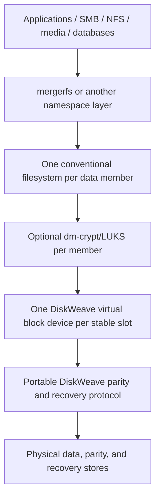

This differs from a file-aware parity filesystem. A file-aware design would have to own or precisely emulate namespace, allocation, inode identity, metadata durability, rename, mmap, hard links, xattrs, ACLs, sparse extents, reflinks, fsync, directory ordering, and crash recovery. FUSE is not rejected as inherently slow or defective; it is rejected as the primary parity boundary because that boundary would turn DiskWeave into a custom filesystem.

The optional namespace plane may use FUSE, and the macOS frontend may use a filesystem bridge to expose raw files. Neither makes filesystem semantics part of the parity core.

## 1.2 Recovery contract

The defining recovery promise is:

> A healthy data payload remains a conventional byte image. DiskWeave may be absent, broken, or permanently unavailable without making that payload proprietary.

Consequences:

- direct read-only attachment of a stopped healthy data payload is supported;
- direct read-write access outside DiskWeave invalidates parity and integrity evidence and requires an explicit new baseline;
- no data payload carries a required DiskWeave header, trailer, sidecar, hidden tail, GPT metadata partition, or in-filesystem marker;
- loss of `control.sqlite3` has no safety consequence;
- loss of `array.sqlite3` blocks ordinary writes and may remove degraded availability, but all surviving data can be inspected directly and, when all data survive, can form a newly certified topology and parity baseline;
- published format documentation and a slow portable reference tool must be sufficient to inspect parity envelopes, verify equations, rebuild parity, and export candidates without the production daemon.

## 1.3 Reusable-boundary rule

DiskWeave intentionally distinguishes a lower media substrate from the block-parity product protocol:

```text
reusable media substrate:
    coding primitives
    random-access stores and backend capabilities
    operation-slot resource ownership
    backend adapters and completion evidence
    low-level deterministic media/fault model
    trace and evidence envelope utilities

DiskWeave block-parity protocol:
    BlockRequest and logical slots
    positional parity mapping
    global parity-address coordination
    dirty/integrity generations
    array.sqlite3 recovery semantics
    degraded-read, scrub, repair, and rebuild policy
    whole-file namespace placement
```

The substrate SHALL avoid product roles that do not belong there. The protocol SHALL remain specific and auditable rather than becoming a generic storage framework. A proposed abstraction is accepted only when it has a concrete accepted consumer, improves clarity or correctness, and does not delay storage-safety work.

## 1.4 Excluded product families and features

DiskWeave does not own a filesystem namespace, extent allocator, inode/object graph, snapshot or reflink model, or per-item redundancy policy. Any product that introduces those responsibilities requires its own architecture, recoverability contract, on-disk format, migration/coexistence plan, independent tools, and release gates. This architecture reserves no API, crate, command, persistent field, or implementation milestone for such a product.

# 2. Decision authority and product invariants

## 2.1 Decision classifications

- **ACCEPTED:** build around the semantic decision. Do not ask the product owner again unless new executable evidence invalidates its premise.
- **PROVISIONAL:** implement the preferred option behind a defined seam, test it, record an ADR, and continue when acceptance criteria pass.
- **VALIDATE:** build the named spike, benchmark, simulator experiment, or model. Select the best-supported safe option unless alternatives change user-visible semantics or freeze an incompatible format.
- **TUNABLE:** choose a conservative bounded default, measure it, expose configuration when useful, and do not request routine user input.
- **USER-DECISION:** a product-semantic, destructive, availability, compatibility, or irreversible-format choice that engineering evidence cannot resolve alone.
- **FORMAT-EXPERIMENTAL:** persistent bytes may change without migration and SHALL protect only disposable fixtures or arrays explicitly accepted as experimental.
- **DEFERRED:** outside the applicable release gate.
- **REJECTED:** conflicts with an accepted invariant unless the architecture itself is reopened.

The words **SHALL**, **SHOULD**, and **MAY** express the strength of intended roadmap commitments. They become current required product behavior only through canonical specifications under `openspec/specs/`. Rust-like examples specify semantic shape, not stable ABI, private fields, crate names, or runtime structure.

## 2.2 Architectural product invariants

1. **Independent data-member readability.** A data payload SHALL remain a byte-for-byte conventional block image. DiskWeave SHALL NOT require a header, trailer, sidecar, GPT metadata partition, hidden tail reservation, or in-filesystem marker on it.
2. **No file striping.** A regular file SHALL live wholly on one member filesystem. A namespace layer may merge directories but SHALL NOT split file extents among members.
3. **Parity below filesystems.** DiskWeave protects the complete member image, including filesystem metadata and ciphertext produced above the virtual member.
4. **No authoritative namespace database.** The parity core SHALL NOT require paths, inode numbers, extent maps, xattrs, directory state, or namespace indexes.
5. **Portable semantic core.** Core parity, durability, integrity, recovery, rebuild, scrub, and format semantics SHALL run without ublk, io_uring, FSKit, macFUSE, Tokio, SQLite, or `procmachines` types in their public contracts.
6. **Fail closed on uncertainty.** Dirty or indeterminate state SHALL NOT become clean or qualify for degraded reconstruction merely because one outcome is likely.
7. **Stable logical identity.** Array UUID, logical slot UUID, coding position, physical-store identity, assignment generation, and topology epoch are distinct concepts.
8. **Multiple identity observations.** No single PARTUUID, filesystem UUID, WWN, serial, path, file ID, or capacity is infallible. Ambiguous clones block writable assembly.
9. **Logical and physical lifetimes differ.** Dropping a future, transaction machine, request, or frontend connection SHALL NOT reclaim resources while submitted backend I/O may still complete.
10. **Bounded resources.** Queue depth, operation slots, buffers, range locks, retries, trace retention, parser allocation, and background work are bounded and observable.
11. **Independent granularities.** Logical block, codec symbol, RMW extent, lock quantum, dirty region, checksum extent, journal alignment, and batch extent remain distinct.
12. **Block durability is a protocol.** FLUSH, FUA/preflush, volatile caches, ordering, partial completion, daemon death, power loss, and uncertain completion are modeled and tested.
13. **One active writer.** Writable assembly establishes an all-or-nothing writer claim over required recovery, data, and parity stores before exposing virtual members.
14. **Recovery state is operationally authoritative, not existential to intact data.** Losing `array.sqlite3` blocks writes and may remove degraded availability, but intact data remains ordinary and can form a new baseline.
15. **Checksums are independent evidence.** Parity cleanliness and integrity coverage are separate dimensions. Automatic repair requires a unique correction supported by verified-good evidence.
16. **Sampling is diagnostic only.** Probabilistic checking never establishes `CLEAN`.
17. **No backing/export alias.** A frontend-exported endpoint is never the same writable path or handle as its backing payload while DiskWeave is active.
18. **Abandonment is not rollback.** Requester disinterest changes result delivery, not the obligations of work that crossed an irreversible boundary.
19. **Consequential work remains owned.** Every correctness-relevant operation reaches terminal completion, explicit reconciliation, or a durable recovery handoff before its resources are reclaimed.
20. **Claims are evidence-tier specific.** Simulator, file-backed, macOS, Linux-kernel, and destructive-hardware evidence establish different claims.
21. **Recoverability tooling precedes format stability.** Independent decode, verify, rebuild, export, and migration-interruption tools exist before format v1.
22. **Verification tools do not define the product.** A verifier, deterministic scheduler, simulator runtime, or fuzzer may not force a general effect system, runtime conversion, public semantic rewrite, or persistent-format change.
23. **Physical stores are role-neutral.** A `RandomAccessStore` is an addressable persistence endpoint with capabilities and identity observations. Data/parity role, slot, filesystem meaning, and coding position belong to a topology binding.
24. **Codec primitives are topology-neutral.** Coding math operates on explicit profiles, positions, and byte shards. It does not discover devices, inspect array topology, choose placement, or persist assignments.
25. **The executor is role-neutral.** Operation slots own buffers, submissions, completion evidence, and drain state; they do not encode parity-layout or namespace policy.
26. **Persistence durability and logical protection policy are different concepts.** The former is current block-request semantics. The latter is not added to current APIs without a concrete product feature that realizes it.
27. **Format families are explicit.** Persistent decoders SHALL distinguish the DiskWeave block-parity family from unknown or separately designed formats and SHALL refuse incompatible writable interpretation.
28. **No speculative substrate.** No allocator, coding-group manager, object graph, universal transaction framework, protection-policy hierarchy, or placeholder crate is created without a current executable use.
29. **Direct writes invalidate evidence.** Out-of-band writes, stale snapshot restoration, or payload rollback cannot be hidden by a prior clean certificate.
30. **A clean certificate is bounded evidence.** It proves completion of the declared managed protocol under its hardware and ownership assumptions, not absence of latent corruption or hostile later mutation.

## 2.3 Provisional implementation choices

- ublk as the Linux block frontend;
- io_uring as the Linux raw-I/O executor;
- `procmachines` as a candidate transaction implementation, with an explicit reference machine retained;
- SQLite behind `RecoveryStateStore` for `array.sqlite3`;
- a small redundant parity envelope around a simple parity payload;
- BLAKE3-256 at a benchmark-selected independent checksum extent;
- FSKit first, with macFUSE as an alternative, for a macOS virtual-raw-file bridge;
- mergerfs as the initial namespace layer;
- module- or crate-level separation of substrate from protocol, without requiring churn when existing dependencies already satisfy the rule.

## 2.4 Validation decisions

- exact parity-envelope profile, reserve size, copy-selection, and exact-capacity policy;
- SQLite journal, synchronization, checkpoint, page-size, and connection topology;
- `procmachines` versus explicit production machine;
- macOS DiskImages/FSKit/macFUSE coherence and synchronization semantics;
- ublk library, queue count, queue depth, ring topology, registration, and zero-copy options;
- P/Q finite-field profile, coefficient assignment, payload mapping, and migration;
- journal/PPL value, checksum metadata placement, and degraded-write protocol;
- any harmful store/slot/role, codec/topology, executor/protocol, or simulator/protocol coupling found by repository inspection;
- application-level recovery replicas only when deployment requirements justify them.

## 2.5 Tunable policy delegated to agents

Queue/ring counts, operation-slot pools, worker counts, buffer sizes, lock quantum, checkpoint cadence, dirty-memory thresholds, checksum concurrency, scrub/rebuild bandwidth, SQLite cache/busy settings, trace limits, parser limits, and observability retention receive bounded defaults and benchmarks rather than routine user questions.

## 2.6 Explicit user/product decisions

User input is required for:

- authorizing destructive import, replacement, topology reset, force assembly, or data-authoritative rebaseline;
- opting into a weaker exact-capacity bare-parity compatibility profile;
- enabling future degraded or deliberately unprotected writes;
- changing a promised stable format incompatibly;

## 2.7 Explicit non-goals for the first production write-safe release

- A product that owns namespace, allocation, inode/extent structures, snapshots, or reflinks.
- Per-file or per-subtree erasure coding or independently placed coding groups.
- Shared multi-host or multi-initiator arrays.
- Read striping across data members.
- More than single parity in the first production release.
- Online reshape without an explicit quiesced protocol.
- Degraded writes or unprotected writes.
- Automatic repair of an unexplained parity mismatch.
- DiskWeave metadata on conventional data payloads.
- Correctness dependent on zero-copy, registered buffers, SIMD, FUSE-over-io_uring, or a particular runtime.
- Production power-loss claims for file-backed macOS arrays.
- Placeholder APIs or crates without a concrete accepted consumer.

# 3. Architectural layering and dependency rules

This section defines the narrow abstractions DiskWeave preserves and the broader abstractions it rejects. Each rule improves the specified block-parity product directly by keeping responsibilities auditable, replaceable, and deterministically testable.

## 3.1 Physical store versus logical member

A physical store is a byte-addressable endpoint with identity observations and I/O capabilities. A logical slot is the stable identity of one virtual conventional data-member image. Data role, P/Q role, coding position, and payload window are bindings in a topology snapshot.

The distinction prevents accidental assumptions such as:

- one opened file descriptor always equals one array member;
- a backend is permanently “data” or “parity”;
- the backend knows the filesystem above it;
- device enumeration determines coding position;
- executor buffers must be typed by array role.

It also improves current replacement, simulator, file-backed, and identity-clone tests. No wrapper or crate split is required when current code already keeps these concepts separate.

## 3.2 Codec versus topology

The codec receives a profile, explicit coding positions, shard buffers, ranges, and tail rules. The block protocol decides which slots and stores form that coding operation. This permits independent golden vectors, permutation tests, optimized implementations, and future P/Q migration without making codec code responsible for discovery, storage access, or recovery policy.

The current positional parity layout remains unchanged. Topology-neutral math is not permission to create arbitrary coding groups now.

## 3.3 Executor versus storage protocol

The executor owns consequential I/O resources and terminal evidence. The block protocol owns why those operations exist and which durable state follows. This split keeps pinned buffers, queue tags, cancellation/drain, and completion aggregation out of transaction-machine lifetimes while keeping write-hole and recovery decisions out of generic backend code.

A generic executor does not imply a universal transaction language. DiskWeave explicitly rejects a framework that tries to encompass in-place parity writes, namespace moves, allocation protocols, and every possible storage transaction through one state vocabulary.

## 3.4 Low-level simulator versus protocol fixture

The deterministic media model owns durable bytes, acknowledged volatile writes, pending operations, persistence order, completion delivery, faults, crash, and power loss. The DiskWeave protocol fixture owns logical slots, parity equations, recovery DB semantics, envelope state, checksum generations, and repair policy.

This is a dependency rule, not a mandate for a new crate. Separating the concepts lets the simulator test more production-adjacent code and makes fault behavior easier to audit even if no other storage protocol ever consumes it.

## 3.5 Durability versus placement and protection policy

`DurabilityIntent` answers when a block request may be acknowledged relative to stable persistence. Whole-file namespace placement chooses one eligible conventional member according to current path, affinity, health, tier, and free-space policy.

A policy describing how many replicas or parity shards an object should receive would require an allocator and a different persistence/recovery model. DiskWeave therefore does not put `Mirror2`, `EC4+2`, `ProtectionClass`, or equivalent unused semantics into `BlockRequest`, `RandomAccessStore`, operation slots, current traces, or recovery schemas.

## 3.6 Whole-file placement is not an allocator

The current pure decision is:

```text
path + size hint + parent affinity + eligible slots + health/tier/free-space rules
    -> one logical slot for the whole file
```

It should be deterministic, explainable, and independently tested. It need not mimic extent allocation, maintain free-space trees, compose coding groups, or expose a more general allocator API.

## 3.7 Two-sided architecture test

A proposed lower-layer change fails for **excessive coupling** when backend/store APIs require slot IDs, codecs require array topology, operation slots encode parity roles, or low-level media faults import `array.sqlite3` and dirty-region types.

A proposed change fails for **speculative generality** when it adds unused object IDs, protection-policy hierarchies, allocators, arbitrary coding-group persistence, generalized transaction DSLs, or reserved on-disk fields.

The accepted region is deliberately narrow: current clarity, current testability, clean dependency direction, and no new user-visible semantics.

# 4. Fundamental architecture and product boundary

## 4.1 Linux production stack

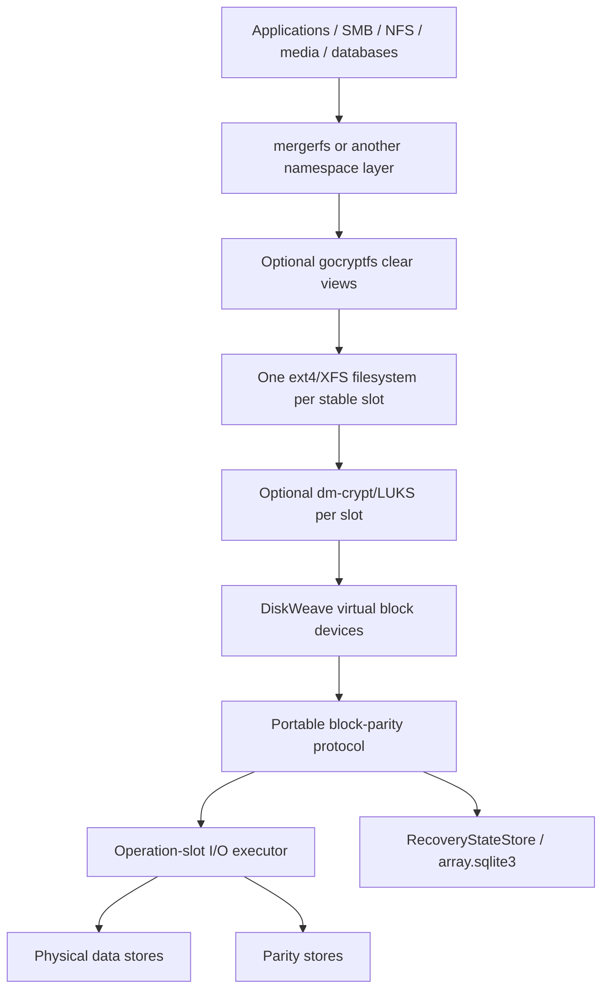

The ordering is semantic. gocryptfs may instead present clear views above lower ciphertext directories; dm-crypt sits immediately above each DiskWeave virtual member. In all supported arrangements, DiskWeave protects opaque block bytes and does not hold encryption keys.

## 4.2 Frontend-neutral portable core

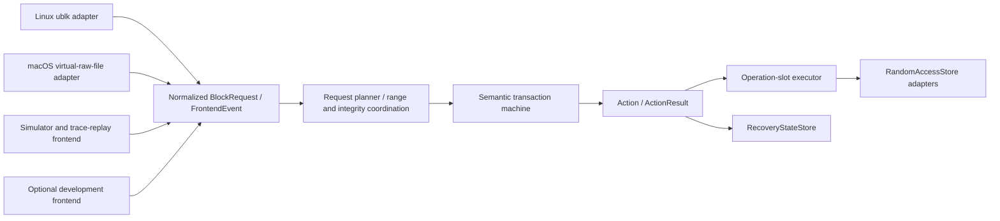

The core sees stable slot IDs, ranges, buffer tokens, ordering/durability intent, topology epochs, capabilities, semantic results, and recovery evidence. It never sees ublk queue tags, io_uring SQEs/CQEs, FSKit object IDs, file descriptors, task handles, or SQLite rows.

## 4.3 Parity plane and namespace plane

The **parity plane** (`dwvd` and portable libraries):

- exposes one virtual block image per stable slot;
- maps writes to data and parity stores;
- persists dirty and integrity-invalid state;
- performs healthy and degraded reads;
- verifies, scrubs, repairs, and rebuilds;
- owns topology and recovery semantics;
- reports exact availability, consistency, integrity, and evidence state.

The **namespace plane**:

- mounts each conventional member filesystem;
- presents a merged directory tree;
- chooses a destination member for a new whole file;
- defines cross-member rename, conflict, and mover behavior;
- never interprets parity bytes or clears recovery state.

The planes may share a CLI, repository, telemetry envelope, and deployment module, but remain separately restartable and replaceable.

## 4.4 Reusable substrate and product protocol

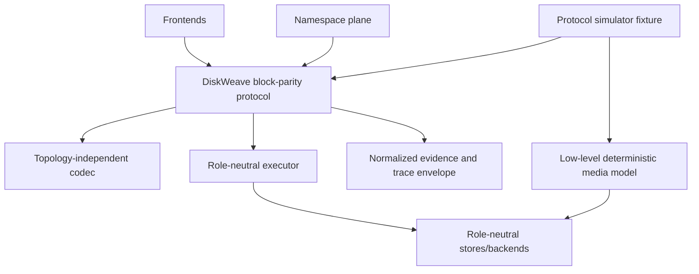

Dependencies point downward. The substrate cannot import logical slots, positional parity regions, recovery DB records, namespace paths, or product status types merely for convenience.

## 4.5 Direct recovery and rollback properties

- Stopping DiskWeave removes virtual endpoints but leaves each healthy data payload as an ordinary image.
- Direct read-only attachment is supported for inspection and recovery.
- Direct read-write attachment outside DiskWeave invalidates parity and integrity evidence. Re-entry requires an explicit external-write/rebaseline workflow.
- Removing mergerfs or another namespace layer leaves individual member filesystems accessible.
- Losing `control.sqlite3` loses only reconstructible management state.
- Losing `array.sqlite3` loses active protocol and historical checksum evidence, but does not change the bytes or mountability of healthy data payloads.
- Losing DiskWeave software permanently still permits direct data recovery and parity regeneration from documented semantics.

## 4.6 Coherent exposure and lifecycle

Virtual members form one array group. `dwvd` SHALL NOT expose a writable subset while other required roles fail assembly. Start, quiesce, recover, and stop transitions apply to the group, even though individual healthy reads normally touch one member.

Writable exposure requires:

1. recovery-state lock and schema validation;
2. physical identity and geometry assessment;
3. exclusive claims for every required data/parity store;
4. topology/envelope/generation agreement;
5. required recovery of dirty or indeterminate state;
6. frontend capability negotiation;
7. no unresolved incompatible format or migration.

Failure releases all partial claims and exposes no writable block devices.

# 5. Component, process, and dependency boundaries

Names below are illustrative. Responsibilities and prohibited dependencies are architectural roadmap commitments. Existing crates MAY combine rows when dependency direction remains clear; this roadmap does not require churn merely to match proposed names.

## 5.1 Reusable media substrate

| Responsibility | Likely home | Must not depend on |
|---|---|---|
| Pure coding primitives and reference/optimized implementations | `dwv-codec` | array discovery, slot bindings, StoreId, SQLite, frontends |
| Random-access store operations, identity observations, durability capabilities | `dwv-store` | namespace paths, fixed data/parity role, recovery schema |
| Bounded operation slots, buffers, child-I/O fanout, terminalization, drain | `dwv-executor` | positional parity policy, dirty-region rules, namespace objects |
| Backend implementations and capability probes | file/sim/Linux/macOS backend modules | codec choice, recovery decision, placement policy |
| Durable/volatile bytes, persistence order, completion delivery, crash/power faults | low-level layer in `dwv-sim` | `BlockRequest`, SQLite rows, dirty/checksum records |
| Deterministic IDs, bounded evidence envelope, witness/provenance utilities | trace/evidence modules | a specific frontend scheduler or product status enum |

## 5.2 DiskWeave block-parity protocol

| Component | Responsibility | Deliberately product-specific |
|---|---|---|
| `dwv-core` | stable IDs, normalized requests, topology snapshots, status/error taxonomy | logical slots and block semantics |
| `dwv-range` | splitting, global parity-address locks, RMW/reconstruct-write planning | common logical offsets across slots |
| `dwv-durability` | dirty/fence/checkpoint/session protocol | in-place multi-store parity writes |
| `dwv-integrity` | checksum profile, generations, validity, scrub/repair evidence | array-wide data/parity checksum targets |
| `dwv-recovery` | topology, identity assessment, metadata-loss and degraded-read policy | `array.sqlite3` semantic state |
| `dwv-recovery-sqlite` | SQLite implementation of `RecoveryStateStore` | schema/migrations behind semantic adapter |
| `dwv-transaction-ref` | explicit transaction oracle and fallback | current semantic actions |
| `dwv-transaction-proc` | `procmachines` implementation of the same protocol | current semantic actions |
| `dwv-format` | parity envelope, manifest, normalized trace codecs | DiskWeave block-parity format family |
| `dwv-sim` protocol fixture | deterministic product state and recovery oracle | parity/SQLite/integrity semantics above media model |

## 5.3 Frontends, control, namespace, and deployment

| Component | Responsibility | Must not define |
|---|---|---|
| `dwv-frontend-ublk` | Linux request/tag/limit/recovery translation | parity math or stored format |
| `dwv-backend-linux` | raw I/O, io_uring/fallback, CQE ownership, probes | namespace or recovery schema |
| `dwv-frontend-macos` | virtual raw-file operations and synchronization translation | parity format or SQLite rows |
| `dwv-control` | assembly, identity assessment, topology transactions, jobs, local protocol | kernel buffer internals |
| `dwv-control-sqlite` | reconstructible `control.sqlite3` projection | dirty/clean authority |
| `dwv-pool-core` / `dwv-poold` | whole-file placement and namespace semantics | raw parity, extent allocation, recovery DB authority |
| `dwvd` | process composition and privileged lifecycle | path placement policy |
| `dwv` | CLI, inspector, plans, evidence rendering | unplanned ad hoc raw mutation |
| `dwv-nixos` | probes, units, namespaces, mounts, desired policy | mutable assignment generations |

## 5.4 Dependency direction

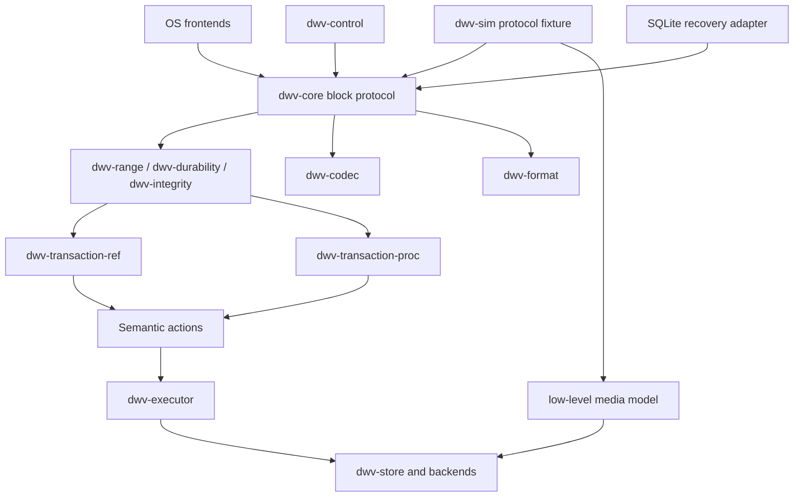

Dependency checks SHOULD enforce:

- codec has no topology, store, frontend, recovery, or namespace dependency;
- store/executor have no slot, parity-role, or recovery-schema dependency;
- low-level simulator media types instantiate without protocol fixtures;
- frontend adapters depend on normalized contracts, not vice versa;
- SQLite adapters implement semantic stores and do not leak row/table types;
- no production crate depends on a test scheduler or model checker.

## 5.5 Process and privilege model

- `dwvd` is the dedicated parity process. Namespace pooling runs separately.
- Linux assembly resolves identity evidence, takes the recovery-state writer lock, exclusively opens required stores with the strongest practical semantics, validates the complete set, and only then creates ublk devices.
- Claims are all-or-nothing. Partial claims are released before failure is reported.
- `O_EXCL` is a useful local accidental-concurrency fence, not multi-host fencing or protection from hostile root.
- `dwvd` runs in a mount namespace distinct from consumers mounting its virtual devices, preventing self-deadlock during flush/unmount paths.
- macOS file-backed operation uses canonical paths, stable file IDs, locks, immutable payload sizes, and backing/export alias rejection.
- The hot data plane performs no SMART polling, network UI work, schema migration, or unbounded callback execution.
- Administrative operations use a versioned local protocol; Rust enums and SQLite table layout are not wire formats.

## 5.6 Authority and persistence classes

DiskWeave has three persistence domains plus declarative policy:

1. **Declarative desired policy:** allowed devices, expected array identity, resource caps, safety profile, mount paths, and service ordering. It is not current topology truth.
2. **Ordinary data payloads:** conventional images with no required DiskWeave bytes.
3. **DiskWeave recovery state:** `array.sqlite3`, parity envelopes, exported manifests, and later journal/PPL state. It authorizes safe service and recovery.
4. **Reconstructible management state:** `control.sqlite3`, logs, SMART/performance history, friendly names, job history, UI settings, and caches.

The conceptual “three persistence domains” exclude declarative configuration because desired policy does not become array truth merely by changing a file.

## 5.7 Unsafe and parsing boundaries

All `unsafe` code, kernel UAPI translation, direct buffer registration, raw descriptor ownership, and FFI SHALL be isolated in narrow adapters with explicit invariants. Persistent/trace parsers are separate hostile-input boundaries with allocation, recursion, count, and length limits. A convenience deserializer may not allocate based on untrusted counts before validating the declared envelope.

# 6. Physical stores, logical topology, and identity

## 6.1 Orthogonal identifiers

| Concept | Meaning | Authority |
|---|---|---|
| `ArrayUuid` | identity of one DiskWeave array lineage | recovery state / parity envelope |
| `PhysicalStoreId` | identity of one opened persistence endpoint or assignment instance | control/substrate |
| identity observations | PARTUUID, filesystem UUID, WWN, serial, file ID, capacity, geometry, transport facts | discovery evidence |
| `LogicalSlotUuid` | stable virtual data-member image identity | topology |
| `ParityRole` | P, Q, or later semantic parity role | topology |
| `CodingPosition` | explicit coefficient/index consumed by codec | topology/profile |
| `AssignmentId` / generation | one binding of a physical store to a logical role | topology |
| `TopologyEpoch` | immutable mapping generation captured by work | topology/recovery state |
| recovery generation | durability/checkpoint generation | recovery state |
| checksum-set generation | identity of one integrity profile/baseline | integrity state |

A physical store is not permanently “slot 3,” “data,” “P,” “Q,” “ext4,” or “encrypted.” A topology snapshot binds a store and payload window to a role for a particular epoch.

## 6.2 Topology snapshot

Illustrative semantic shape:

```rust
struct TopologySnapshot {
    array_uuid: ArrayUuid,
    epoch: TopologyEpoch,
    assignments: Vec<Assignment>,
    protection_profile: ArrayProtectionProfileId,
    protected_length: u64,
}

struct Assignment {
    assignment_id: AssignmentId,
    assignment_generation: u64,
    role: LogicalRole,
    store: PhysicalStoreId,
    payload: ByteRange,
    expected_identity: IdentityExpectation,
    observed_identity: IdentityAssessment,
}

enum LogicalRole {
    Data { slot: LogicalSlotUuid },
    Parity { role: ParityRole, position: CodingPosition },
}
```

The real implementation may normalize tables, use maps, or split role types. The semantic requirements are:

- every admitted operation captures one immutable snapshot;
- all address calculations refer to the snapshot's payload windows and protected length;
- a replacement creates a new assignment generation without changing the stable logical slot;
- physical enumeration or map iteration order cannot affect coding position;
- a topology transition never mutates a snapshot already used by admitted work.

## 6.3 Identity observations and assessment

Discovery collects multiple independent observations where available:

```rust
struct IdentityObservations {
    canonical_path: Option<PathEvidence>,
    hardware_wwn: Option<String>,
    hardware_serial: Option<String>,
    partition_uuid: Option<Uuid>,
    filesystem_uuid: Option<Uuid>,
    file_id: Option<FileIdentity>,
    capacity: u64,
    logical_block_size: u32,
    physical_block_size: u32,
    transport: Option<TransportEvidence>,
}
```

The assessment result is explicit:

| State | Meaning | Writable action |
|---|---|---|
| `ConfidentMatch` | evidence uniquely matches the expected assignment | permit after other checks |
| `ChangedButExplainable` | expected replacement/move is supported by an authorized topology transaction | permit only in that transaction |
| `AmbiguousClone` | two or more candidates plausibly satisfy one assignment | refuse |
| `InsufficientEvidence` | identity cannot be established at required confidence | refuse or explicit operator-assisted recovery |
| `ConflictingAssignment` | one candidate appears assigned to incompatible roles/generations | refuse |
| `Missing` | no candidate present | degraded/read-only policy only |

No weighted “confidence score” silently crosses a write threshold. The accepted evidence rule is deterministic, explainable, versioned in policy where needed, and included in `dwv members --evidence` output.

## 6.4 Failure-domain observations

Desired policy and discovery MAY attach labels such as enclosure, controller, HBA, host port, chassis, rack, power source, tier, or locality. They are evidence supplied by configuration or probes, not guaranteed physical truth.

Current uses include:

- warning when data and parity share an asserted failure domain;
- validating a replacement target against policy;
- scheduling background work with device locality/health information;
- explaining topology risk.

These labels do not create a current extent allocator or per-object protection policy.

## 6.5 Physical-store access rules

Before writable exposure:

1. resolve candidate paths to stable opened handles;
2. record identity observations from the opened object, not only from a pre-open path;
3. validate capacity, block geometry, alignment, payload bounds, and parity-envelope interpretation;
4. acquire exclusive claims for every required data, parity, and recovery store;
5. re-check identity after claims where the platform permits;
6. compare topology epoch, assignment generation, and parity-envelope generation;
7. reject overlap between payload windows unless an explicit backend owns and enforces disjoint subranges;
8. prevent host automount or direct writable attachment to claimed payloads.

A path rename alone does not change identity. A device disappearance/reappearance is a lifecycle event and requires revalidation; a new object at the same path is not trusted as the old store.

## 6.6 Topology transactions

Add, replace, remove, resize, coding-profile change, and recovery-rebaseline are explicit transactions with plans bound to:

- array UUID;
- source topology epoch;
- expected assignment IDs/generations;
- exact old and proposed payload geometry;
- required quiescence level;
- recovery and rollback boundaries;
- verification evidence required before promotion.

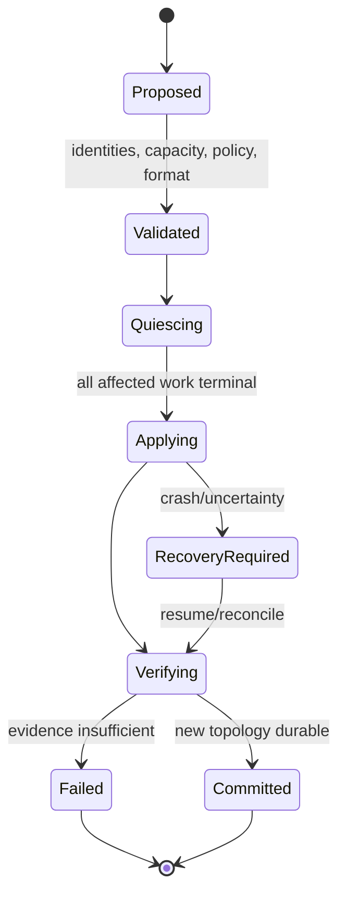

Promotion of a replacement happens only after the rebuilt payload, parity equation, expected checksum evidence, and topology commit are durably verified. The old source remains unchanged when the operation is refused or uncertain unless its loss is the initiating failure.

## 6.7 Status is multidimensional

Avoid one giant array-state enum. Report at least:

- lifecycle: stopped, assembling, recovering, serving, quiescing, faulted;
- access: none, read-only, read-write;
- availability: healthy, degraded, unavailable;
- parity: clean, dirty, indeterminate, mismatched, rebuilding;
- integrity: current/stale/unknown/bad coverage;
- redundancy: configured tolerance and currently available tolerance;
- topology epoch and recovery generation;
- safety profile and evidence tier.

A degraded array may be parity-clean for unaffected proven ranges; an all-data-present array may be unavailable for writes because recovery state is missing. Keeping dimensions separate prevents misleading status shortcuts.

# 7. Geometry, coding, and granularity

## 7.1 Protected geometry

For each data slot, virtual byte offset zero maps to payload byte zero. For a protected logical range `[O, O + L)`, parity is computed from the corresponding logical range of every participating data slot. A shorter member contributes logical zero beyond its payload end.

For single XOR parity:

```text
P[O:L] = D0[O:L] XOR D1[O:L] XOR ... XOR Dn[O:L]
```

where a read beyond a data payload's declared length yields zero for parity math, not a backend read.

Requirements:

- all offset/length addition uses checked arithmetic;
- the requested range must fit the virtual slot and selected backend transfer limits;
- the maximum protected length is no greater than usable parity payload;
- no tail is silently left unprotected;
- parity payload offset, length, alignment, and envelope reserve are explicit;
- partial final logical blocks and checksum extents have deterministic zero/tail rules;
- optimized and reference codecs produce identical bytes for every supported profile.

## 7.2 Independent granularities

| Granularity | Purpose | Persistence |
|---|---|---|
| frontend logical block | advertised request alignment/minimum | frontend/device contract |
| physical block | backend alignment and tear assumptions | capability evidence |
| codec symbol | P/Q mathematical symbol width | coding profile |
| RMW working extent | runtime merge and I/O strategy | usually tunable |
| range-lock quantum | concurrency serialization | runtime tunable unless protocol later depends on it |
| dirty region | persistent recovery unit | recovery format/semantics |
| checksum extent | integrity evidence unit | integrity profile |
| journal/PPL extent | future log/replay unit | deferred format |
| batch extent | executor/throughput unit | runtime tunable |

No implementation may derive all values from one `BLOCK_SIZE` constant. Persist only values required to interpret bytes or recovery state.

## 7.3 Topology-independent codec contract

Illustrative semantic interface:

```rust
trait Codec {
    fn profile(&self) -> CodecProfile;

    fn encode(
        &self,
        range: RelativeRange,
        data: &[ShardRef],
        parity: &mut [ShardMut],
    ) -> Result<(), CodecError>;

    fn update(
        &self,
        range: RelativeRange,
        old_data: &[PositionedShardRef],
        new_data: &[PositionedShardRef],
        parity: &mut [PositionedShardMut],
    ) -> Result<(), CodecError>;

    fn reconstruct(
        &self,
        range: RelativeRange,
        shards: &mut [ShardState],
        missing: &[CodingPosition],
    ) -> Result<(), CodecError>;
}
```

The codec receives:

- an explicit algorithm/profile ID and parameters;
- explicit coding positions;
- initialized bounded buffers;
- ranges relative to those buffers;
- deterministic tail/zero-extension rules.

It does not:

- open stores;
- know `PhysicalStoreId` or `LogicalSlotUuid`;
- discover topology;
- choose a write strategy;
- acquire locks;
- persist assignments;
- decide whether a shard is trustworthy;
- authorize repair.

The caller constructs a coding operation from a topology snapshot and verified evidence.

## 7.4 Single parity baseline

The first write-safe production profile is bytewise XOR parity. It has these semantics:

- one known missing data shard can be reconstructed if every other required shard and parity range is available and the range is proven safe;
- XOR is commutative, so historical ordering among surviving data members does not affect the P equation when all data are present;
- a parity mismatch alone identifies no bad shard;
- one missing data shard plus stale/unknown parity or an unexplained second bad shard is outside guaranteed recovery;
- checksum evidence is used to diagnose, not to change XOR math.

Golden vectors include zero-length rejection/handling, unaligned subranges, all-zero inputs, one-byte tails, maximum supported offsets, heterogeneous lengths, incremental update equivalence, and reconstruction under every allowed missing position.

## 7.5 Dual P/Q parity

P/Q is deferred until the following are frozen by a dedicated OpenSpec:

- field and polynomial;
- symbol size and byte order;
- coefficient assignment and maximum positions;
- treatment of absent/short tails;
- P and Q payload mapping;
- coding-position persistence and recovery;
- independent implementations and golden vectors;
- migration or complete parity-rebuild procedure;
- degraded-read/write behavior for every missing-role combination.

Unlike XOR P, Q depends on historical coding positions. Metadata-loss recovery cannot assume data-member order is irrelevant once redundancy has already been consumed.

## 7.6 Write strategies

The planner may select:

**Read-modify-write (RMW)**

```text
read old target data + old parity
compute parity delta
write new target data + new parity
```

Useful for small writes and wide arrays because it avoids reading every data member, but it depends on trustworthy old target/parity reads.

**Reconstruct write**

```text
read all unaffected data for the range
combine with new target data
write target + freshly computed parity
```

Useful when RMW inputs are unavailable/suspect or for large aligned writes, but activates more devices and consumes array-width buffers.

Strategy selection is a pure plan based on range size/alignment, array width, known health/evidence, backend costs, and bounded resources. Both strategies produce identical logical and parity bytes and use the same dirty/integrity durability protocol.

## 7.7 Request splitting and coalescing

A parent request may split at:

- virtual member end;
- backend payload end;
- logical/physical alignment;
- maximum transfer;
- range-lock boundary;
- dirty-region boundary;
- checksum-extent boundary;
- journal/PPL boundary when enabled;
- buffer/batch budget.

Splitting or coalescing SHALL preserve ordering, stable-completion intent, exact error/uncertainty evidence, and final durable bytes. Parent success requires every required child result; secondary child errors remain observable even when one frontend error is selected.

## 7.8 Add, remove, replace, and resize

- **Add data slot:** create/assign a new conventional payload, establish identity, build/update parity for its protected range under a quiesced or explicitly reconciled protocol, verify, then commit topology.
- **Replace data slot:** rebuild the stable logical slot onto a new physical assignment, verify independently, then promote.
- **Remove data slot:** requires quiescence, removal of all user data by the namespace/mover layer, parity recomputation under the new topology, and a committed topology epoch.
- **Resize:** capacity increase or decrease is explicit. Shrink requires proving no protected bytes exist beyond the new length. Increase requires parity-capacity validation and baseline build.
- **Add/change parity:** build to a separate target where practical, verify, and commit the new profile/topology only after success.

No topology operation silently reinterprets existing parity bytes under a new coding position or protected length.

# 8. Persistent state, parity format, and schema governance

DiskWeave deliberately owns a small set of persistent semantics. It does not have one monolithic “disk format.”

## 8.1 Ordinary data payloads

Data payloads contain no required DiskWeave metadata. They may contain ext4, XFS, LUKS, APFS, or another certified conventional block image. Virtual byte zero maps to payload byte zero.

An imported payload may consume the entire existing partition/image. DiskWeave must not prepend a header, append a hidden trailer, reserve an unannounced tail, or create a sidecar required for direct readability.

## 8.2 Recovery state and authority

DiskWeave recovery state includes:

- array UUID and topology assignments;
- coding positions and profile;
- topology and assignment generations;
- dirty and indeterminate regions;
- durability/checkpoint generations and active session state;
- checksum profiles, generations, validity, and digests;
- correctness-critical build/rebuild/recovery cursors;
- future journal/PPL records and checkpoints;
- migration state required for safe interpretation.

`array.sqlite3` is the preferred implementation behind a semantic `RecoveryStateStore`. It is operationally authoritative while writable service is active. It is not a filesystem transaction that encompasses data and parity stores, and it is not existential to intact data.

Deleting or losing the recovery DB immediately blocks new writes. It may remove proof required for degraded reads and automatic repair. It does not alter data bytes or make a healthy payload unreadable.

## 8.3 Recovery-state semantic mutation contract

`RecoveryStateStore` persists protocol facts that authorize or forbid later actions. Its contract is a language-neutral mutation vocabulary, not a CRUD API and not a promise of one SQL transaction per named operation.

Illustrative semantic shape:

```rust
trait RecoveryStateStore {
    fn load_array(&self) -> Result<RecoveredArrayState, RecoveryError>;

    fn transact(
        &self,
        expected: RecoveryPredicates,
        mutations: &[RecoveryMutation],
    ) -> Result<DurableRecoveryCommit, RecoveryError>;
}

enum RecoveryMutation {
    BeginWritableSession(SessionIntent),

    MarkRegionDirty(DirtyMutation),
    MarkIntegrityStale(IntegrityInvalidation),
    RecordHomeFence(HomeFenceRecord),
    RecordUncertainCompletion(UncertainMutation),
    CommitCheckpoint(CheckpointProof),
    MarkRegionClean(CleanTransition),
    InstallIntegrityDigest(IntegrityInstallation),

    CloseWritableSession(SessionClose),

    PrepareTopology(TopologyPlan),
    CommitTopology(TopologyCommit),
    AbortOrReconcileTopology(TopologyResolution),

    RecordMaintenanceCheckpoint(MaintenanceCheckpoint),
    RecordRebuildProgress(RebuildCheckpoint),
    RecordRepairPlan(RepairPlanRecord),
    RecordRepairResult(RepairResultRecord),
}
```

The exact grouping and naming are replaceable. These semantic rules are not:

1. **Before dependent home-media mutation:** the region's new mutation generation, `DIRTY` state, and every overlapping checksum transition to `STALE` SHALL become durable as one atomic recovery-state decision. A partial commit that exposes only some of those facts is invalid.
2. **Already-dirty writes:** generation advancement and any newly required integrity invalidation SHALL be durable before the new home effect. An older checkpoint cannot clear a newer generation.
3. **Fence recording:** `RecordHomeFence` may cite only persistence evidence matching the exact physical-store incarnation, capability context, topology epoch, ordering watermark, and mutation generation. Recording a fence does not itself make a region clean.
4. **Uncertainty:** a lost, timed-out, or otherwise uncertain completion SHALL preserve or strengthen `DIRTY`/`INDETERMINATE` state. Uncertainty is removed only by a defined reconciliation, replay, exhaustive verification, or verified rewrite—not by retrying an optimistic metadata update.
5. **Checkpoint and clean:** `CommitCheckpoint`/`MarkRegionClean` SHALL atomically bind the exact covered region generations to a sufficient set of durable store-fence evidence. They are permitted only after all covered writers are terminal or durably handed to recovery, and compare-and-set predicates SHALL reject a changed topology, assignment, session, or mutation generation.
6. **Integrity installation:** `InstallIntegrityDigest` is permitted only when target identity, checksum profile, content generation, and cited target-store durability evidence still match. A successful read or an unrelated flush is insufficient.
7. **Writable sessions:** `BeginWritableSession` is durable before writable exposure. `CloseWritableSession` is permitted only after the required global checkpoint and evidence set are durable; parity-envelope session transitions follow Section 8.9.
8. **Topology:** `PrepareTopology` is durable before any new mapping is exposed or used for irreversible effects. `CommitTopology` occurs only after required quiescence, verification, and promotion evidence. `Abort` is valid only before irreversible effects; otherwise recovery reconciles the prepared plan explicitly.
9. **Maintenance, rebuild, and repair:** progress that determines safe resume, source selection, target verification, or promotion SHALL be persisted before releasing the corresponding correctness obligation. Historical progress or UI presentation may remain reconstructible management state.
10. **Idempotence and conservatism:** mutations carry stable operation/plan IDs and expected generations. Exact replay is idempotent; conflicting replay refuses. `DIRTY`, `INDETERMINATE`, stale integrity, and prepared-but-unresolved topology dominate older optimistic state.

Recovery state that authorizes writable assembly, degraded reconstruction, `CLEAN`, checksum `VALID`, repair execution, or replacement promotion is not reconstructible from `control.sqlite3`. If that authority is absent or conflicting, DiskWeave refuses the stronger action or rebuilds evidence through the explicit recovery flows. SQL text, table names, row IDs, page numbers, connection handles, and transaction-engine internals remain outside this contract.

## 8.4 SQLite choice and executable configuration

SQLite is preferred because crash-safety maturity, durability semantics, boring operations, inspectability, cross-platform behavior, schema migration, and tooling matter more than pure-Rust implementation alone.

`RecoveryStateStore` keeps the choice reversible. The SQLite OpenSpec compares at least redb, LMDB/libmdbx, RocksDB/LSM, and a purpose-built WAL/bitmap on:

1. crash-safety maturity;
2. durability semantics;
3. operational boringness;
4. inspection/recovery tooling;
5. cross-platform behavior;
6. schema migration;
7. implementation simplicity;
8. representative performance and write amplification.

Journal mode, synchronization level, checkpoint policy, page size, connection topology, busy handling, backup strategy, and filesystem placement are executable decisions. Tests cover process kill, simulated/VM reset, database corruption, disk-full/ENOSPC, I/O error, partial migration, and later physical power loss. A successful SQLite commit means only that the selected SQLite/VFS/storage contract was met; the home-store durability protocol remains separate.

Recommended deployment profiles:

```text
basic:       one array.sqlite3 on ordinary system storage
recommended: array.sqlite3 on mirrored/redundant system storage
stronger:    redundant system storage + periodic independent semantic export/backup
future:      application-level synchronous replicas only if requirements justify them
```

If application-level replicas are added, disagreement resolves conservatively (`CLEAN < DIRTY/UNKNOWN`), and replica-set membership changes receive their own modeled protocol.

## 8.5 Reconstructible management state

`control.sqlite3` or an equivalent projection may contain:

- discovery inventory and health history;
- SMART observations;
- performance history and aggregates;
- event/job/scrub/rebuild history;
- friendly names and UI state;
- cached indexes and report materializations;
- non-correctness-critical scheduling state.

Deleting it SHALL have no safety consequence. It can be rebuilt from current discovery, authoritative recovery state, and retained event sources. A correctness-critical maintenance cursor belongs in recovery state, not only in the management projection.

## 8.6 Parity payload

Parity payload is simple codec output at defined logical offsets. It is not stored as SQLite BLOB rows and is not wrapped in a production filesystem by default.

Storing parity in SQLite is rejected because it adds page/B-tree overhead, WAL or rollback-journal amplification, sequential-I/O indirection, database coupling, and still cannot atomically include writes to independent data devices.

A default layout such as XFS containing `parity.bin` and `array.sqlite3` is rejected because filesystem/database overhead reduces usable parity capacity and adds an extra recovery dependency. Excess space on a larger parity device may host optional backups, but correctness cannot require it.

## 8.7 Parity-device envelope

Because parity stores are already DiskWeave-owned, a small redundant envelope may identify and interpret them without compromising data-member readability.

Conceptually:

```text
DiskWeave parity extent
├── metadata copy A near head
├── simple parity payload
└── metadata copy B near tail
```

Candidate semantic fields:

```text
magic and format-family identifier
format major/minor and feature bits
array UUID
parity-store UUID and role
codec profile and parameters
parity payload offset/length
protected logical geometry
committed topology generation
compact topology/coding-position recovery information
expected recovery-manifest or DB generation
last managed clean/verified generation
array-session state: DIRTY / CLOSED_CLEAN / UNKNOWN
copy generation and migration state
checksums over all encoded metadata
```

The envelope is bootstrap and recovery metadata, not the per-write transaction database. It SHALL NOT contain arbitrary key/value state, history, SMART data, a full checksum index, a general WAL, an allocator, a filesystem, or user namespace metadata.

Copies use bounded encoding, checksums, deterministic newest-valid-committed selection, compatible/read-only/incompatible feature bits, and explicit torn/disagreeing behavior. One damaged copy never licenses optimistic interpretation of the other without generation and checksum validation.

Copy selection and migration obey these semantic rules:

- validate each copy independently, including header, bounds, feature compatibility, payload geometry, array/parity identity, migration state, and checksum;
- select the highest **committed and complete** generation only when its semantic identity agrees with the claimed physical parity store;
- equal-generation disagreement, an unknown incompatible feature, an incomplete migration, or ambiguous identity causes read-only recovery or refusal rather than timestamp-based guessing;
- migration writes and durably verifies a non-selected copy before committing/activating the new generation, while retaining a previously committed readable copy until activation is durable;
- after interruption, selection returns to the newest fully committed compatible generation or refuses. A half-written newer copy never supersedes an older committed copy.

## 8.8 Envelope profile comparison

| Option | Capacity overhead | Normal-write cost | DB-loss recovery | Complexity | Status |
|---|---:|---|---|---|---|
| A. Bare parity + external recovery state | none beyond alignment | lowest | usually exhaustive scan; weakest topology/profile recovery | lowest | compatibility candidate |
| B. Redundant small envelope + external recovery state | modest reserve | session/topology updates only | identifies parity/profile/topology; may accelerate a trusted clean-close case | moderate | likely baseline |
| C. B + authoritative coarse dirty bitmap | small bitmap plus redundant updates | participates in first-dirty hot path | may limit verification after DB loss | highest | adopt only after model/benchmark |

Option C is not selected merely because the bitmap is small. Its authoritative update ordering, flushes, torn pages, replica disagreement, and write amplification must outperform the simpler alternative in realistic disaster-recovery value.

## 8.9 Session certificate and anti-rollback limit

A coarse envelope handshake may be:

```text
before writable exposure:
    all required parity envelopes durably record DIRTY(session S)
    array.sqlite3 durably records ACTIVE(session S)

clean shutdown/checkpoint:
    quiesce admitted writes
    durably flush required data and parity stores
    array.sqlite3 durably records CLOSED(session S, fence proof)
    all required parity envelopes durably record CLOSED_CLEAN(session S)
```

A `CLOSED_CLEAN` envelope proves completion of DiskWeave's managed close protocol under the declared store/hardware contract. It does **not** prove that data payloads were not subsequently written out of band, that an older store snapshot was not restored, that a clone was not substituted, or that latent corruption is absent.

Skipping a full scan after DB loss requires trusted ownership continuity or equivalent stronger anti-rollback evidence plus matching topology, identity, and all required parity envelopes. Otherwise the clean envelope supplies interpretation/topology evidence but exhaustive verification remains required.

## 8.10 Exact-capacity imports

A reserve reduces usable parity:

```text
usable_parity_payload = physical_parity_extent - reserved_envelope_bytes
largest_protected_data_payload <= usable_parity_payload
```

Before an envelope becomes mandatory for stable arrays, an OpenSpec SHALL choose and test explicit policies:

1. require parity storage slightly larger than the largest protected payload;
2. provision newly created data payloads with a matching capacity margin;
3. support a deliberately weaker bare-parity exact-capacity profile;
4. reject the configuration.

DiskWeave never truncates protection or ignores a data tail silently. Reserve size remains modest and justified by concrete fields and migration room, not speculative gigabytes.

## 8.11 Metadata-loss verification and selective repair

With all data present and `array.sqlite3` missing:

1. discover candidate stores without writing;
2. assess identity ambiguity;
3. recover topology/profile information from valid parity envelopes or a semantic recovery manifest where possible;
4. otherwise construct an explicit proposed new topology from operator-selected data payloads;
5. exhaustively compare parity equations for every region not covered by trustworthy durable evidence;
6. leave matching ranges unchanged;
7. classify mismatches as ambiguous unless independent checksums identify a unique bad shard;
8. repair only with sufficient verified evidence, or require an explicit data-authoritative rebaseline/new parity target;
9. verify the resulting payload and parity by readback;
10. build a new checksum baseline and `array.sqlite3` under a new recovery generation or array lineage as appropriate.

A full verification scan is a full read, not necessarily a full rewrite. When all equations match, zero parity bytes need be rewritten.

## 8.12 Exported recovery manifest

A semantic export may back up:

- array/topology IDs and assignments;
- identity expectations and observations;
- codec/profile/payload geometry;
- recovery/checksum generations and profile descriptors;
- parity-envelope digests/generations;
- explicit statement of what dynamic dirty/checkpoint state is or is not captured.

It is versioned, bounded, documented, and independently readable. It is not a copy of SQLite pages and cannot claim a clean state newer than the durability evidence it contains.

## 8.13 Format governance

DiskWeave owns only these compatibility semantics:

| Format | Purpose | Migration rule |
|---|---|---|
| data payload | no DiskWeave format | ordinary direct tooling; no migration |
| parity payload mapping/profile | interpret P/Q bytes | rebuild/parallel parity for incompatible profile |
| parity envelope | discovery, topology/profile recovery, session evidence | staged A/B generation; old-reader behavior defined |
| `array.sqlite3` semantic schema | recovery concepts and generations | transactional migrations plus semantic export/rebuild path |
| exported recovery manifest | offline interchange | versioned documented readers |
| checksum profile | algorithm/digest/extent/generation semantics | parallel build, verify, atomic select, retire |
| normalized trace/scenario | deterministic regression | versioned fixture migration; never array truth |
| future journal/PPL | replay protocol if adopted | dual-reader/checkpoint migration and interrupted replay |

All custom formats use explicit endianness, bounded lengths/counts, checked offsets, semantic algorithm IDs, feature bits, content checksums, golden fixtures, fuzzing, unknown-feature behavior, and independent decoding. They never persist Rust discriminants, crate identities, memory addresses, ublk tags, SQLite page numbers, SIMD widths, or scheduler-specific state.

Format v1 is prohibited until exact-capacity behavior, corrupted/torn copies, downgrade, unknown features, interrupted migration, independent recovery, and disaster drills pass.

# 9. Portable semantic contracts

The interfaces in this section are intended **semantic shapes**, not frozen Rust APIs or substitutes for current canonical specifications. Implementations may use traits, callbacks, polling, async functions, generators, channels, or synchronous adapters when observable behavior and ownership remain equivalent.

## 9.1 Normalized block requests

```rust
struct BlockRequest {
    request_id: RequestId,
    slot: LogicalSlotUuid,
    topology_epoch: TopologyEpoch,
    op: BlockOp,
    range: ByteRange,
    buffer: Option<BufferToken>,
    ordering: OrderingIntent,
    durability: DurabilityIntent,
}

enum BlockOp {
    Read,
    Write,
    Flush { scope: FlushScope },
    WriteZeroes,
    Discard,
}

enum FlushScope {
    OrderingDomain {
        domain: OrderingDomainId,
        through_sequence: u64,
    },
    WholeArrayCheckpoint,
}

struct OrderingIntent {
    domain: OrderingDomainId,
    sequence: u64,
    preflush: bool,
}

enum DurabilityIntent {
    WriteBackPermitted,
    StableBeforeCompletion,
}

enum FrontendEvent {
    Abandon { request_id: RequestId },
    Quiesced { frontend_id: FrontendId },
    Lost { frontend_id: FrontendId },
}
```

Semantics:

- sequence numbers are monotonic within an ordering domain and are assigned at admission, so a flush has an exact closed set of prior mutations;
- a flush captures all admitted mutations through its declared sequence/scope; later admissions are not prerequisites and cannot change the captured set;
- `preflush` requires prior covered writes to reach the flush boundary before any dependent home-media effect of the new write;
- `StableBeforeCompletion` requires affected data/parity writes to pass a certified durability fence before success is delivered;
- a plain write may complete before physical durability only under an advertised write-back cache contract;
- abandonment changes result delivery, not transaction or resource obligations;
- stale epoch, overflow, unsupported flags, alignment, or out-of-bounds requests fail before media mutation;
- `WriteZeroes` is semantically a parity-protected zero write even if optimized;
- `Discard` is initially unsupported unless deterministic post-discard read/parity behavior is defined for the complete stack. It is never passed only to a data member.

No ublk queue/tag, io_uring user data, file descriptor, FSKit object ID, task handle, SQLite row, or executor pointer appears in the normalized request.

## 9.2 Frontend responsibilities

A frontend SHALL:

- translate operation flags without silent weakening or strengthening;
- preserve ordering, preflush, stable-completion, and flush-scope evidence;
- advertise only geometry/limits/capabilities the core and backend satisfy;
- apply bounded backpressure before allocating unbounded resources;
- retain frontend request/tag state until the operation slot says final delivery/release is safe;
- map semantic errors, refusal, unsupported, and uncertainty deterministically;
- report abandonment, quiescence, frontend loss, duplicate/reissue risk, and recovery behavior explicitly;
- prevent direct writable aliases of exported payloads.

The frontend may stop waiting for an abandoned result, but it cannot declare backend work canceled or reclaim its resources without terminal executor evidence.

## 9.3 Random-access store

```rust
trait RandomAccessStore {
    fn id(&self) -> PhysicalStoreId;
    fn bounds(&self) -> ByteRange;
    fn capabilities(&self) -> StoreCapabilities;
    fn identity_observations(&self) -> IdentityObservations;

    async fn read_at(
        &self,
        range: ByteRange,
        buffer: BufferToken,
    ) -> StoreCompletion;

    async fn write_at(
        &self,
        range: ByteRange,
        buffer: BufferToken,
        intent: StoreWriteIntent,
    ) -> StoreCompletion;

    async fn flush(&self, fence: StoreFence) -> StoreCompletion;
}
```

The store has no `data_slot`, `parity_role`, `filesystem_type`, `coding_group`, or `protection_class` method. A backend may represent a whole device, partition, file, subrange/window, or deterministic simulated medium. Overlapping windows require explicit ownership/exclusivity enforcement.

## 9.4 Store capabilities and evidence

| Capability | Why it matters |
|---|---|
| logical/physical block size | validation, alignment, RMW |
| minimum/optimal alignment | safe splitting and performance |
| maximum transfer and queue constraints | bounded child I/O |
| durable flush | checkpoint/clean proof |
| FUA or proven emulation | stable completion |
| ordering guarantees | fence construction |
| atomic/torn-write granularity | fault model and metadata design |
| discard and read-after-discard | parity-aware discard policy |
| write-zeroes semantics | optimized zero path |
| sparse allocation | file-backed capacity behavior only |
| direct-I/O support | cache behavior and benchmark |
| volatile-cache model | meaning of ordinary completion |
| stable identity evidence | assembly and replacement |
| cancellation/drain semantics | operation-slot lifetime |
| failure-domain/health/tier observations | topology validation and scheduling |

Capabilities include an evidence level such as `declared`, `probed`, or `certified`, the probe version, and relevant hardware path. A boolean from an OS API is not automatically a production durability certificate.

Safety profiles are semantic:

- **simulation-certified:** deterministic backend satisfies the modeled contract;
- **portable-demo:** functional semantics exist, but physical power-loss durability is unclaimed;
- **production-read-only:** identity and read semantics are accepted, but write durability is insufficient;
- **production-write-safe:** frontend, store, recovery-state, ordering, and hardware evidence satisfy the selected protocol;
- **trusted ownership continuity:** no out-of-band write or rollback has occurred since the named clean close, or equivalent anti-rollback evidence exists.

### 9.4.1 Persistence and fence evidence

DiskWeave treats durability as evidence with scope, not as a boolean attached to a successful I/O. An illustrative semantic shape is:

```rust
struct PersistenceEvidence {
    store: PhysicalStoreId,
    store_incarnation: StoreIncarnationId,
    ordering_domain: StoreOrderingDomainId,
    submitted_through: StoreWatermark,
    capability_snapshot: CapabilitySnapshotId,
    safety_profile: SafetyProfileId,
    certainty: PersistenceCertainty,
    boundary_id: DurableBoundaryId,
}

enum PersistenceCertainty {
    ProvenDurable,
    Failed,
    Uncertain,
}

struct FenceSet {
    topology_epoch: TopologyEpoch,
    expected_recovery_generation: RecoveryGeneration,
    required: Vec<PersistenceEvidence>,
}

struct StoreCompletion {
    requested: ByteRange,
    completed: ByteRangeSet,
    outcome: StoreOutcome, // complete, short, failed, or uncertain
    persistence: Option<PersistenceEvidence>,
}
```

These fields are intended semantic requirements for future architecture, not a frozen Rust layout or an override of current canonical specifications. The store ordering domain is the executor/backend domain whose submissions a fence actually covers; request planning maps frontend ordering requirements into corresponding store watermarks. A backend may return equivalent evidence in another representation, and a recovery checkpoint may persist a bounded reference to the evidence rather than copying an in-memory object. `persistence = None` is the default for an ordinary successful write unless a certified stable-write mechanism proves more.

Roadmap rules:

1. An ordinary read/write completion proves only its declared completion result. It is not durable evidence unless the operation used a certified stable-write mechanism or is covered by a later proven fence.
2. Persistence evidence is scoped to one physical-store incarnation and one submitted-through ordering boundary. It cannot prove persistence for another store, a later write, or a replacement object at the same path.
3. Evidence is meaningful only under the capability snapshot and safety profile that produced it. A cache-mode, backend, capability, assignment, or topology change requires revalidation; evidence from one context cannot silently authorize another.
4. A successful virtual `FLUSH`, stable/FUA-equivalent completion, recovery checkpoint, region `CLEAN`, checksum `VALID`, and session `CLOSED_CLEAN` SHALL cite or logically derive from a sufficient `FenceSet` for every required effect.
5. Failed or uncertain fence completion cannot be rounded to success or presumed rollback. Affected state remains `DIRTY`/`INDETERMINATE`, and the operation is reconciled or recovered explicitly.
6. A frontend cannot strengthen backend semantics. It may expose only durability behavior supported by the complete frontend/store/recovery/hardware contract.
7. The conservative implementation may fence the whole array and record one aggregate checkpoint. More precise per-domain, per-store, or per-region watermarks are compatible optimizations, not permanent format assumptions.

A `FenceSet` is a proof composition over required stores and watermarks, not a cryptographic certificate unless a later format explicitly defines one. OS-002 owns the store/capability evidence vocabulary; OS-010 owns its recovery-protocol use; OS-013 integrates it into healthy I/O; OS-036 certifies real Linux/hardware meaning.

## 9.5 Request planning and decomposition

For a request:

1. validate slot, bounds, epoch, access state, operation flags, and capability profile;
2. assign/capture ordering-domain sequence and flush dependencies;
3. split at member end, payload end, alignment, transfer, lock, dirty, checksum, and journal boundaries;
4. acquire global parity-address guards in ascending order;
5. reserve transaction admission, operation slots, buffers, and bounded scratch;
6. construct a pure plan mapping logical ranges to `PhysicalStoreId`, physical ranges, coding positions, and evidence requirements;
7. drive the transaction machine through semantic actions;
8. let the executor fan out child operations and aggregate exact results;
9. reach terminal durable state or durable recovery handoff;
10. drain every submitted child before token/resource reuse;
11. deliver or suppress frontend completion according to abandonment state.

A write to two different data slots at the same logical offset races on the same parity bytes; therefore lock keys are global parity-address ranges, not `(slot, offset)` pairs.

## 9.6 Semantic transaction actions

```rust
enum Action {
    AcquireRange(RangeRequest),
    PersistDirtyAndInvalidateIntegrity(MutationIntent),
    ReadSet(ReadSetPlan),
    ComputeParity(CodecPlan),
    WriteSet(WriteSetPlan),
    FlushSet(FlushPlan),
    CommitCheckpointOrClear(CheckpointProof),
    ReleaseRange(RangeGuardId),
}

struct ActionResult {
    action_id: ActionId,
    outcome: SemanticOutcome,
    child_outcomes: Vec<ChildOutcome>,
    uncertainty: Option<UncertaintyEvidence>,
    buffers: Vec<BufferToken>,
    fence_evidence: Vec<PersistenceEvidence>,
}
```

One action may describe many child store operations. The executor may run them concurrently and returns per-child status plus a semantic aggregate. Persistence evidence is present only for boundaries actually proven under Section 9.4.1; absence of evidence is not inferred success. Individual CQEs or platform callbacks never enter the transaction-machine public contract.

## 9.7 Operation slots and terminal outcomes

An operation slot owns:

- initialized/pinned buffers and generational tokens;
- frontend queue/tag mapping;
- child-operation descriptors and fanout;
- submitted backend operations and completion bookkeeping;
- cancellation requests, duplicate/lost completion handling, and drain evidence;
- result-delivery interest;
- terminalization and reclamation eligibility.

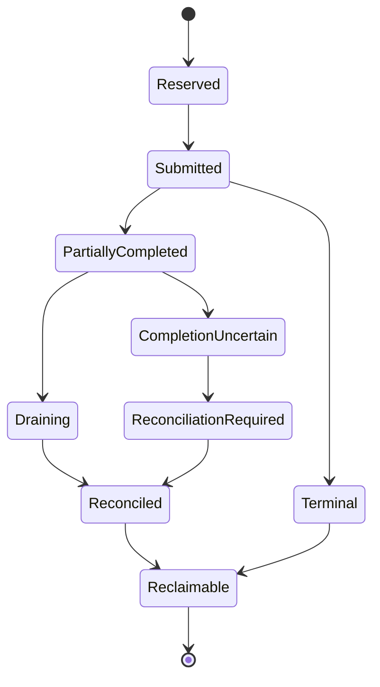

Terminal protocol outcomes distinguish at least:

```text
CompletedAndDelivered
CompletedDeliverySuppressed
FailedBeforeMutation
FailedDirty
CompletionIndeterminate
RecoveredAndReconciled
DurablyHandedToRecovery
```

A task exit or dropped machine is not one of these outcomes.

## 9.8 Deterministic authority ports

Correctness-sensitive portable code SHOULD receive narrow explicit authority for effects that must replay:

```rust
trait Clock { fn now(&self) -> LogicalTime; }
trait IdSource { fn next_id(&mut self, kind: IdKind) -> StableTestableId; }
trait FaultOracle { fn decision(&mut self, point: FaultPoint) -> FaultDecision; }
trait EvidenceSink { fn record(&mut self, event: SemanticEvent) -> Result<(), EvidenceError>; }
```

These are not a general effect system. Production adapters may use normal OS facilities; tests supply deterministic implementations. Ambient logging, wall time, randomness, and UUID generation may remain outside correctness decisions when they do not affect replay.

## 9.9 Simulator operations and faults

The low-level simulator supports operations such as:

```text
Read
Write
Flush
StableWrite / FUA-like write
WriteZeroes
Discard (only under a declared model)
DaemonCrash
PowerLoss
ControllerReset
```

Faults include:

```text
EIO / short I/O
delay / out-of-order completion
duplicate completion / lost completion
torn durable subranges
reordered persistence
latent durable corruption
store disappearance / reappearance
recovery-state commit failure or uncertainty
parity-envelope copy tear/corruption
restore older durable snapshot
out-of-band payload write
```

The simulator keeps durable media, volatile acknowledged writes, pending operations, completion delivery, recovery artifacts, envelope copies, clock/ID state, and fault schedule distinct. Daemon crash destroys process state but does not automatically erase device volatile caches; power loss applies the configured persistence/tear model and discards volatile state.

## 9.10 Normalized traces and reproducer bundles

The normalized trace sits after frontend normalization and before request planning. It may contain:

- schema and product-format family;
- initial topology/capability fixture;
- slot, operation, offset, length, ordering, durability, and sequence;
- generated data pattern/seed/hash rather than user bytes;
- semantic actions/results, checkpoints, integrity decisions, refusal, uncertainty, and terminal obligations;
- injected fault/crash events;
- expected final data/parity/integrity/recovery/topology state;
- expected terminal operation/obligation state, including delivery suppression, drain/reconciliation, durable recovery handoff, and any remaining uncertainty;
- producer provenance and tool versions.

The expected terminal state names exact topology/recovery generations and whether each consequential operation slot is reclaimed, still draining, reconciled, or durably represented in recovery state. A trace cannot declare success merely because frontend delivery ended.

A reproducer bundle retains both the normalized semantic scenario and producer-specific evidence such as fuzz input, scheduler seed/path, model-checker counterexample, or simulator schedule. The semantic trace is the portable regression artifact; exact scheduler interleavings remain tool/version scoped.

# 10. Crash-consistency protocol

This section defines the initial conservative in-place parity protocol. Journal/PPL optimization may replace mechanics later only when it preserves the same or stronger externally observable guarantees.

## 10.1 Write-hole invariant

Data and parity writes on independent stores are not atomic. Rust memory safety and RAII do not protect against power loss, controller reset, lying caches, partial completion, daemon death, or lost completion.

Primary invariant:

> If DiskWeave reports a range `CLEAN`, the durable state of the declared data, parity, and required recovery evidence is sufficient to reconstruct every protected byte for every known failure set within the selected protection profile.

Any range for which that proposition cannot be established is dirty or indeterminate.

## 10.2 Region and mutation state

A persistent dirty record conceptually contains:

- array/topology/session generation;
- dirty-region ID/range;
- mutation generation;
- parity/checksum profile IDs;
- affected checksum extents and their new stale generations;
- active/terminal mutation bookkeeping required for checkpoint safety;
- highest durable home-store fence known for the region;
- indeterminate or recovery-required evidence.

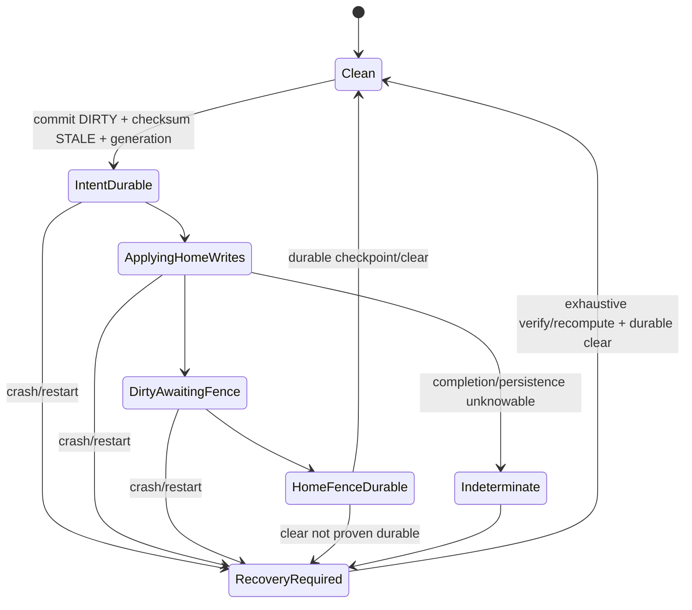

A clean record never wins a conflict with dirty/unknown evidence. Mutation generations prevent an older worker or checkpoint from clearing newer dirtiness.

## 10.3 First write to a clean region

Before the first dependent home-media mutation:

```text
dirty intent is durable
all overlapping checksum evidence is STALE for the new generation
topology snapshot and identity remain valid
range guard is held
operation resources are owned
```

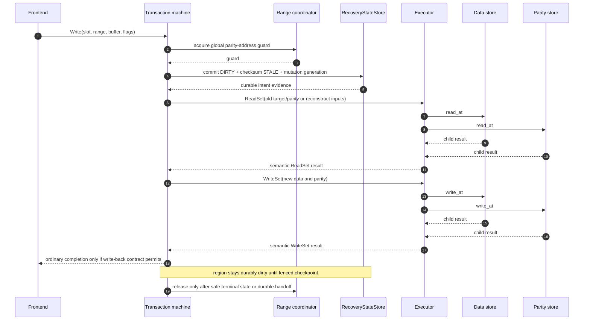

If the durable intent commit fails or is uncertain, no dependent home write is submitted. If a home write has been submitted and its result is uncertain, the range remains indeterminate and the operation slot drains/reconciles.

## 10.4 Subsequent write to an already-dirty region

A later write may avoid a new first-dirty transition only when:

- the durable dirty record covers the region, current topology, and active session;
- every affected checksum extent is already stale or atomically advanced for the new mutation generation;
- the writer registers before a checkpoint captures the region;
- range locking prevents mixed parity updates;
- the mutation generation prevents stale clear;
- the recovery store has enough evidence to conservatively recover after a crash.

An in-memory dirty cache is an optimization. It cannot substitute for the durable dirty record after restart.

```mermaid
sequenceDiagram
    autonumber
    participant T as Transaction machine
    participant L as Range/checkpoint coordinator
    participant R as RecoveryStateStore
    participant E as Executor
    participant S as Data/parity stores

    T->>L: register writer for region and generation G+1
    L-->>T: guard excludes captured checkpoint
    T->>R: advance mutation generation; ensure affected checksums STALE
    R-->>T: durable coverage evidence
    T->>E: read/compute/write semantic set
    E->>S: child reads and writes
    S-->>E: completion or uncertainty
    E-->>T: semantic result
    Note over T,R: region remains DIRTY; no clean transition occurs here
    T->>L: unregister after terminal result or durable recovery handoff
```

Only the redundant first-dirty transition may be skipped. Generation advancement, integrity invalidation, checkpoint exclusion, resource ownership, and uncertainty handling remain mandatory.

## 10.5 Write planning and media mutation

The planner chooses RMW or reconstruct-write. Before writing, all required input reads must be complete and trustworthy for that strategy. EIO or checksum conflict in an RMW input may force reconstruct-write or refusal; it may not be ignored.

Partial child completion is recorded per store/range. A successful data write plus failed parity write and a successful parity write plus failed data write both remain dirty. DiskWeave does not attempt to claim rollback unless it has a separately proven undo protocol.

## 10.6 Flush, checkpoint, and clean

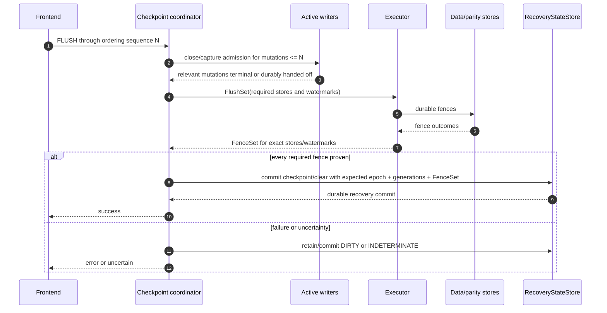

Before `CLEAN`:

```text
all covered mutations are terminal or safely reconciled
required data and parity writes are durably fenced
FenceSet covers the exact store incarnations and submitted-through watermarks
recovery-state checkpoint atomically binds that evidence to exact region generations
no unresolved mutation-generation conflict exists
no topology transition can reinterpret the range
```

A successful frontend flush is delivered only after that recovery-state commit is durable. If the home-store fence succeeded but the checkpoint commit failed or is uncertain, the bytes may be durable but the region remains dirty/indeterminate. The first implementation may use an array-wide fence. Per-domain/per-store/per-region watermarks are later optimizations only after equivalence evidence.

## 10.7 Stable-before-completion and preflush

A stable/FUA-like request completes only after its affected data and parity operations produce sufficient `PersistenceEvidence` under the active capability context. The region may remain conservatively dirty until a later recovery-state checkpoint; stable frontend completion proves the requested home-store boundary, while metadata cleanup and `CLEAN` are separate facts.

A preflush request first fences all prior covered writes in its ordering domain. It then performs the new write under its own durability intent. Unsupported FUA/preflush is never silently downgraded; the frontend advertises a truthful limit or returns unsupported/error.

## 10.8 Abandonment, cancellation, and shutdown

```mermaid
sequenceDiagram
    participant F as Frontend
    participant O as Operation slot
    participant T as Transaction
    participant K as Backend I/O
    participant R as Recovery state

    F->>O: submit
    O->>T: start
    T->>K: submit child I/O
    F--xO: requester abandons or frontend disappears
    Note over O,T: suppress delivery; retain ownership
    K-->>O: completion / drain / uncertainty
    O->>T: semantic terminal evidence
    alt protocol reaches a safe terminal state
        T-->>O: terminal
    else recovery handoff required
        T->>R: durably record recovery requirement
        R-->>T: committed
        T-->>O: terminal via durable handoff
    end
    O-->>O: release buffers, tags, permits
```

Cancellation is a request to the backend, not proof of cancellation. Shutdown:

1. stops new frontend admission;
2. captures/quiesces ordering domains;
3. drains or reconciles submitted operations;
4. commits dirty/indeterminate evidence for unresolved work;
5. performs a global checkpoint when possible;
6. only then tears down frontends and releases physical claims.

A watchdog must understand these states and not kill a healthy daemon merely because a real flush/recovery is slow.

## 10.9 Recovery-state failure

- Failure before durable intent: reject write; no home mutation was permitted.
- Uncertain intent commit: do not mutate home stores; require recovery-store reconciliation before service.
- Failure recording a post-write result or home-fence evidence: home state may have changed or may already be durable; keep/establish dirty/indeterminate evidence through the safest surviving path and stop writes if authority is unavailable. Never recreate the missing proof from an ordinary completion alone.
- Recovery DB corruption or loss while serving: stop admitting writes, retain operation resources until terminal or emergency durable handoff, quiesce frontends, and transition to recovery-required.
- Disk full/ENOSPC in recovery storage is a correctness failure, not a management warning.

## 10.10 Parity-envelope session certificate

The optional coarse envelope state improves disaster recovery but does not replace fine-grained recovery state. `CLOSED_CLEAN` is written only after all required home-store fences and recovery-state close commit succeed.

A valid certificate plus matching identity/topology may support scan-free DB recreation only under trusted ownership continuity or equivalent anti-rollback evidence. Without that, exhaustive verification is required. The certificate never establishes current checksum coverage or absence of latent corruption.

## 10.11 Recovery invariant tests

The simulator interrupts after every meaningful boundary:

- before/after dirty+stale commit;
- each input read and child completion permutation;
- each subset of data/parity writes becoming durable;
- fence submission/completion/uncertainty;
- checkpoint/clear commit;
- envelope DIRTY/CLOSED transitions;
- abandonment, daemon crash, reset, and power loss.

Permitted restart outcomes are old durable state plus matching parity, new durable state plus matching parity, a replayable journal state when later enabled, all-data-present dirty resynchronization, or refusal of unsafe degraded service. False clean is forbidden.

# 11. Concurrency, ownership, and resource bounds

## 11.1 Transaction versus executor lifecycle

The transaction machine owns:

- semantic stage and transaction ID;
- immutable topology snapshot;
- acquired range guards;
- buffer **tokens**, not buffer memory;
- action requests and semantic results;
- dirty/integrity/recovery intent;
- frontend delivery interest.

The executor/operation slot owns:

- actual initialized or pinned buffers;
- ublk tags or other frontend resource mappings;
- submitted backend operations and completion tracking;
- child fanout, aggregation, and secondary errors;
- cancellation attempts and drain state;
- completion uncertainty and reconciliation evidence;
- token generation and final reclamation.

No state-machine or runtime task lifetime changes this division.

## 11.2 Transaction-machine contract

A transaction machine is externally driven:

```rust
trait TransactionMachine {
    fn next_action(&mut self) -> MachinePoll<Action>;
    fn apply_result(&mut self, result: ActionResult) -> Result<(), MachineError>;
    fn terminal(&self) -> Option<TerminalDecision>;
}
```

The machine is deterministic for the same initial state and action-result sequence. It cannot perform ambient I/O, query mutable topology, access wall time/randomness used for correctness, or free executor resources.

## 11.3 `procmachines` and explicit reference machine

`procmachines` remains the leading provisional implementation because procedural top-to-bottom Sans-I/O code and explicit suspension points can improve readability, deterministic driving, and fault injection. It orchestrates coarse semantic actions; it never receives individual CQEs.

A small explicit enum/transition machine remains:

- the semantic oracle;
- an independent comparison implementation;
- the production fallback if the dependency is unavailable, unsafe, unmaintained, or materially expensive;
- a source of normalized action traces and mutation tests.

The representative comparison covers:

- success, EIO, short I/O, delay, and out-of-order child completion;
- recovery-state failure and uncertainty;
- frontend abandonment before and after irreversible boundaries;
- daemon crash and power loss at every suspension point;
- stale slot-token reuse and exactly-once terminalization;
- premature clean/checkpoint and skipped integrity invalidation mutations;
- allocations, lock operations, CPU/request, latency, memory, and concurrent scaling;
- dependency/license health, auditability, and replacement/fork cost.

The two implementations need not emit identical incidental batching, but must permit the same durable outcomes and make the same clean/dirty/integrity/refusal decisions after trace normalization.

## 11.4 Admission and operation slots

Every request reserves bounded admission before irreversible work. Admission includes:

- transaction permit;
- required range-lock capacity;
- operation slot(s);
- input/output/scratch buffers;
- child descriptor budget;
- recovery-state transaction capacity where known;
- trace/evidence budget or an explicit bounded drop policy that cannot hide required terminal events.

If resources are unavailable, the request waits or fails before dirty intent/home mutation. Resource exhaustion after intent follows normal dirty/recovery policy; it is never treated as rollback.

Generational tokens prevent use-after-reuse. A token contains slot/index plus generation; lookup validates both. Reclamation increments generation before reuse. Loom or a focused deterministic model is appropriate if custom atomics implement this lifecycle.

## 11.5 I/O shards and queue topology

An I/O shard owns bounded frontend queues, operation slots, buffers, backend completion contexts, and executor state. It performs no management/UI work.

The architecture freezes neither one global ring nor one ring per CPU/member. Initial HDD profiles should prefer modest concurrency and explicit caps on:

- total threads;
- rings/completion contexts;
- registered/pinned memory;
- queue depth;
- file descriptors;
- concurrent reconstruct writes;
- in-flight recovery-state commits.

Queue topology, affinity, batch I/O, fixed buffers, automatic registration, and zero-copy are benchmarked adapter policy. Throughput improvements cannot weaken completion ownership or ordering evidence.

## 11.6 Range coordination

Locks are keyed by aligned global parity-address intervals. Writes take exclusive guards. Degraded reads take guards sufficient to avoid observing mixed data/parity mutation. Healthy reads may bypass guards only after simulator/integration evidence proves ordinary block semantics for that path.

Rules:

- acquire multiple ranges monotonically to prevent deadlock;
- lock entries are ephemeral/ref-counted and sharded, not persistent actors;
- topology snapshots are captured before or consistently with range admission;
- a guard is not held while waiting for unrelated long-duration background resources;
- lock quantum is tunable unless a later format explicitly depends on it;
- foreground work has tested priority/fairness over scrub/rebuild.

## 11.7 Checkpoint concurrency

A checkpoint captures a precise set of mutation generations or ordering watermarks. A writer either registers before capture and is awaited, or is admitted after capture and remains dirty for a later checkpoint. There is no gap in which a write mutates home media but belongs to neither set.

Checksum revalidation follows the same generation discipline: it captures a content generation and durable fence watermark, computes, then commits only if neither changed.

## 11.8 Shutdown and draining

Shutdown has explicit bounded states:

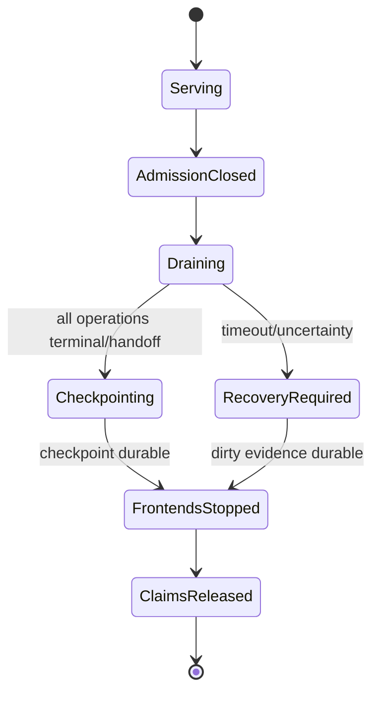

A shutdown timeout may suppress graceful success, but it may not free in-flight resources or mark the array clean. Process termination remains a crash event covered by recovery semantics.

## 11.9 Memory and resource budget

```text
frontend queue depth × frontend buffers
+ operation slots × per-slot buffers/descriptors
+ reconstruct concurrency × array width × batch extent
+ dirty/checksum/journal working sets
+ simulator and trace buffers
+ background-job buffers
+ namespace buffers
+ database connections/caches
```

At representative 8-, 16-, and 32-member profiles, releases report maximum RSS, pinned/locked memory, thread/ring counts, descriptors, queue depth, reconstruct scratch, and worst-case recovery work. Admission rejects or waits before mutation rather than allocating without bound.

## 11.10 Background QoS

Build, check, scrub, checksum revalidation, rebuild, trace capture, and mover work have separate concurrency and bandwidth budgets. They are resumable and pausable where correctness permits. Foreground latency wins under a documented fairness policy; starvation tests ensure background correctness work eventually progresses under declared assumptions.

# 12. Failure and degraded-operation semantics

## 12.1 Known erasure versus unknown corruption

A **known erasure** is a store/range explicitly unavailable or failed. Coding math can reconstruct it when enough other verified shards survive.

An **unknown corruption** is a present shard whose bytes may be wrong. A parity mismatch alone does not identify it. Checksums or other independent evidence must locate a unique bad shard before automatic repair.

DiskWeave never turns an unknown corruption into a convenient known erasure without evidence.

## 12.2 Healthy reads

Healthy reads normally issue one data-store read. They return bytes only when:

- slot/range/epoch validation succeeds;
- the physical assignment remains valid;
- the backend result is complete and not uncertain;
- no current integrity policy requires blocking on known corruption;
- concurrency rules prevent observing an invalid mixed update.

A healthy read need not consult parity. Optional checksum-on-read policy is independent and may report a detected integrity fault rather than silently reconstructing unless repair/read-fallback semantics are explicitly proven.

## 12.3 Degraded reads

A degraded read:

1. identifies the known missing/bad target range;
2. captures a topology snapshot and sufficient range guards;
3. verifies the range is clean or otherwise replayably safe under surviving recovery evidence;
4. verifies enough surviving shards and required checksum evidence for the configured claim;
5. reads surviving data/parity ranges;
6. reconstructs into an executor-owned buffer;
7. validates the candidate against expected digest when available;
8. returns the candidate without modifying source media.

```mermaid
sequenceDiagram
    autonumber
    participant F as Frontend
    participant C as Degraded-read coordinator
    participant R as Recovery/integrity evidence
    participant E as Executor
    participant S as Surviving stores

    F->>C: read missing slot/range
    C->>R: request topology, clean/replay, and integrity evidence
    alt evidence certifies the reconstruction set
        R-->>C: certified sources and expected digest
        C->>E: read surviving coding set
        E->>S: bounded parallel reads
        S-->>E: child results
        E-->>C: verified source buffers
        C->>C: reconstruct and validate candidate
        C-->>F: return bytes; do not mutate source media
    else dirty, indeterminate, ambiguous, or insufficient evidence
        R-->>C: refusal reason and missing evidence
        C-->>F: refused / blocked / uncertain
    end
```

Dirty or indeterminate ranges are refused unless a later journal protocol proves replay. A present checksum-bad source is excluded only when the evidence uniquely identifies it and remaining redundancy suffices.

## 12.4 Degraded writes

The first production release prohibits writes whenever a required data or parity role is unavailable. This avoids inventing durable representation for writes to an absent slot, replay ordering, and compounding failures.

A future degraded-write OpenSpec must separately define every missing-role case, durable representation of new logical bytes, interaction with checksum generations, rebuild replay, additional device loss, and refusal boundaries. It requires formal/model, simulator, Linux, and destructive-hardware gates.

## 12.5 Device disappearance and return

- A disappearance marks the assignment unavailable and invalidates new admissions using that store.
- Submitted operations drain to known failure or uncertainty; their slots remain owned.
- The array transitions to read-only degraded service only if configured and every requested range can be certified.
- A reappearing object is rediscovered and identity-assessed; same path is insufficient.
- A returned original store may contain stale or partially persisted bytes. It is not promoted until reconciliation verifies its assignment generation and content.
- A replacement is a new assignment generation even when it occupies the same physical bay/path.

## 12.6 Check, scrub, repair, and rebuild terminology

- **Check:** compare parity equations and/or integrity evidence without modifying source media.
- **Quick diagnostic:** sampled/non-exhaustive indication only; never establishes clean.
- **Scrub:** exhaustive read and classification using parity plus checksum evidence; read-only unless a separately authorized repair plan executes.
- **Repair:** correct a uniquely identified bad shard/range according to an identity- and generation-bound plan.
- **Rebaseline:** explicitly choose current data as authority and establish new parity/checksum evidence when history cannot identify the old truth.
- **Rebuild:** reconstruct an absent logical slot or parity role into a separate target and verify it before promotion.

Operation completion and array cleanliness are separate machine-readable outcomes.

## 12.7 Repair plan contract

A repair plan contains:

- array UUID and topology epoch;
- source and target assignment IDs/generations;
- exact ranges;
- fault classification and supporting digest/equation evidence;
- expected source digests and candidate target digest;
- required available stores and capabilities;
- expiry/staleness conditions;
- separate-target requirement or explicitly justified in-place action;
- verification steps and promotion boundary.

Execution revalidates every precondition. A stale plan refuses. Target write failure or interruption leaves source untouched and the target unpromoted. The target is read back, digested, and checked against parity before any replacement transaction commits.

## 12.8 Rebuild flow

```mermaid
sequenceDiagram
    autonumber
    actor U as Operator/job
    participant C as Control/rebuild coordinator
    participant R as RecoveryStateStore
    participant E as Executor
    participant S as Surviving stores
    participant T as Replacement target

    U->>C: start/resume rebuild plan
    C->>R: validate plan, topology, cursor generation
    loop bounded chunk
        C->>E: read surviving coding set
        E->>S: reads
        S-->>E: results
        E-->>C: verified inputs
        C->>E: reconstruct + write target
        E->>T: write and durable fence
        T-->>E: result
        E-->>C: target fence evidence
        C->>E: read back target chunk
        E-->>C: bytes/digest
        C->>R: durable verified cursor/checkpoint
    end
    C->>R: commit promotion-ready evidence bound to plan/topology/target/fences
    C-->>U: target verified; separate topology promotion required
```

Promotion revalidates the plan ID, source topology epoch, target assignment identity, completed cursor, target `FenceSet`, readback digest/equation evidence, and absence of newer conflicting work. The topology commit and new assignment generation become durable before the replacement is exposed as the stable slot. A crash before that commit leaves a resumable/unpromoted target; it never creates two writable owners of one slot.

Concurrent foreground writes during rebuild are deferred until an explicit reconciliation protocol exists. The conservative baseline quiesces or restricts service appropriately.

## 12.9 Metadata-loss recovery matrix

| Surviving evidence | Mathematical possibility | Certified action |
|---|---|---|
| All data + P; DB lost | verify XOR and build new state | exhaustive verification; zero writes where equations match; ambiguous mismatches require hashes/operator choice |
| All data + P + Q; DB lost | verify both equations if profile/positions known | recover from envelopes/manifest or establish new baseline; do not guess Q positions |
| All data; parity lost | all user data directly available | create new array lineage/topology as needed; rebuild parity and checksums |
| One data missing + P; DB lost | XOR candidate possible | certify only with trustworthy topology, clean/ownership, and integrity evidence; otherwise forensic separate-target candidate/refusal |
| One data missing + P + Q; DB lost | candidates possible if positions known | same evidence requirement; P/Q may diagnose some patterns but does not restore missing history automatically |
| Two data missing + P + Q; DB lost | possible only with exact profile/positions and trustworthy survivors | refuse guaranteed recovery without sufficient surviving authoritative evidence |
| All DiskWeave metadata lost; all data survive | user data intact | operator selects data payloads, create new UUID/slots/positions, build new parity/checksum baseline |
| Identity ambiguous or parity candidate ambiguous | equations may be computable | read-only inspection/forensic export; refuse writable assembly |
| One valid DB backup/export survives | may restore topology/generations | validate against stores/envelopes; conservatively retain dirty evidence; repair current DB |
| Recovery replicas disagree | uncertainty | dirty/unknown wins; do not elect optimistic clean state |
| Checksum evidence lost | parity can still be verified with all data | rebuild checksum baseline; historical corruption-localization certainty is lost |

The matrix is a product contract, not merely operator guidance.

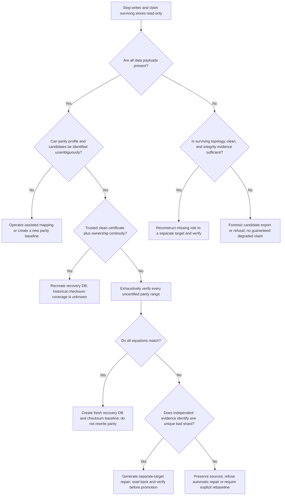

## 12.10 Failure-policy matrix

| Failure | Required semantic result |
|---|---|
| short read/write | exact completed subrange recorded; parent fails/dirty; never treat as full success |
| EIO before mutation | fail/refuse without new home mutation |
| EIO after any mutation | retain dirty/recovery-required evidence |
| timeout or lost completion | `INDETERMINATE`; drain/reconcile; never assume failure or success |
| duplicate completion | detect by generational child ID; terminalize once |
| store disappears | stop new admissions; drain submitted work; re-evaluate service state |
| frontend abandons | suppress delivery; continue terminal ownership |
| daemon crash | restart from durable store/recovery evidence; process memory is gone |
| power loss | volatile state lost per capability model; recover conservatively |
| recovery DB corrupt/missing | block writes; use backup/export/envelope/all-data verification paths |
| parity envelope copies disagree | select only under deterministic valid-generation rule; otherwise format/recovery fault |
| identity or topology mismatch | refuse writable assembly; offer explicit plan/inspection |
| integrity evidence stale/unknown | no automatic corruption repair from that evidence |

## 12.11 Topology replacement acceptance

A replacement is complete only when:

- the target's physical identity and capacity are accepted;
- every protected range has been reconstructed/copied;
- target data checksum and parity equation pass by readback;
- recovery cursor and completion are durable;
- topology promotion is committed under a new assignment generation/epoch;
- stale source/target paths cannot both be exposed as the same slot;
- interruption at every chunk/promotion boundary is resumable or safely restartable.

# 13. Integrity plane

## 13.1 Parity and integrity are independent

Parity answers whether shards satisfy a redundancy equation. It cannot identify which present shard is wrong. Integrity checksums provide independent evidence for exact content generations.

Expose separate status:

```text
parity: CLEAN
integrity:
    99.997% CURRENT
    18 extents STALE
    0 known BAD
```

`CLEAN` does not require every checksum current. `VALID` checksum evidence does not by itself prove parity clean.

## 13.2 Checksum targets and profile

Checksum every data slot and every parity role. A checksum profile persists semantic fields:

```rust
struct ChecksumProfile {
    profile_id: ChecksumProfileId,
    algorithm_id: AlgorithmId,
    digest_length: u16,
    extent_size: u64,
    generation: ChecksumSetGeneration,
}
```

BLAKE3-256 and approximately 4 MiB extents are provisional starting points, not stable decisions. Benchmark throughput, storage overhead, scrub locality, small-write invalidation, rebuild granularity, and database growth. Persist no crate identity.

Checksum extent remains independent from logical block, RMW, lock, dirty-region, journal, and batch sizes.

## 13.3 Checksum record semantics

```rust
struct ChecksumRecord {
    target: IntegrityTarget,
    extent: ByteRange,
    content_generation: u64,
    state: ChecksumState,
    digest: Option<Digest>,
    durable_fence: Option<FenceReference>, // reference to Section 9.4.1 evidence
    profile: ChecksumProfileId,
}

enum ChecksumState {
    Valid,
    Stale,
    Building,
    Unknown,
    Bad,
}
```

`VALID` means:

- digest was calculated from the named target extent and content generation;
- the target-store fence proves those exact bytes durable;
- no conflicting mutation advanced the generation before the validity commit;
- profile and target identity still match.

A checksum of bytes only acknowledged into a volatile cache cannot become valid merely because the read returned them. `FenceReference` identifies evidence for the target store incarnation and content watermark; it is not a generic “last flush” timestamp and cannot be borrowed from another target, topology epoch, capability context, or generation.

## 13.4 Invalidation before mutation

The first write affecting an extent durably commits:

```text
region -> DIRTY
checksum extent -> STALE for generation G+1
mutation/content generation -> G+1
```

before dependent data or parity mutation. Full-overwrite buffers may calculate a candidate digest immediately, but it becomes valid only after durable target fence and generation revalidation.

## 13.5 Asynchronous revalidation

```mermaid
sequenceDiagram
    autonumber
    participant W as Integrity worker
    participant R as RecoveryStateStore
    participant E as Executor
    participant S as Target store

    W->>R: capture target/extent/content generation + required fence watermark
    R-->>W: generation G, watermark F
    W->>E: obtain/reuse durable target fence through F
    E->>S: flush/fence if required
    S-->>E: fence evidence
    E-->>W: durable through F
    W->>E: read extent
    E->>S: read_at
    S-->>E: bytes
    E-->>W: stable read result
    W->>W: calculate digest
    W->>R: commit VALID only if generation still G and fence covers it
    alt unchanged
        R-->>W: committed VALID
    else changed or topology moved
        R-->>W: reject; remain STALE and retry later
    end
```

The worker does not hold a parity range guard while waiting for unrelated scheduling. It captures and rechecks generation around the read/commit window.

## 13.6 Scrub and fault classification

For each extent, scrub may compare:

- expected data digests;
- expected P/Q digests;
- current computed digests;
- parity equations;
- known device errors/erasures;
- topology and assignment generations.

Possible classifications include:

```text
Clean
DataCorruption(target)
ParityCorruption(target)
KnownErasure(target)
AmbiguousMismatch
MultipleSuspects
ConflictingEvidence
EvidenceStale
EvidenceAbsent
ReadFailure
```

Classification is read-only. It does not imply repair authorization.

## 13.7 Automatic repair rule

Automatic repair is allowed only when all surviving evidence yields exactly one correction consistent with:

- current valid digests for required source shards;
- coding equation(s);
- known topology/coding positions;
- exact target assignment/generation;
- sufficient current redundancy;
- a readback digest and parity-equation verification of the candidate.

Examples:

| Evidence | Action |
|---|---|
| one data digest bad; all others including parity valid | reconstruct data to separate target and verify |
| P digest bad; every data digest valid | recompute P to separate target and verify |
| parity mismatch; no current digests | report ambiguous; no automatic overwrite |
| two data digests bad under single parity | beyond automatic correction |
| stale digest for a purported source | source is unverified; refuse or obtain new evidence |
| target write/readback fails | leave source unchanged; target unpromoted |

## 13.8 Checksum loss and migration

Losing the only checksum index loses historical evidence, not data. With all data present, DiskWeave can verify parity and build a new checksum baseline, but it cannot retroactively identify which side of a pre-existing mismatch was historically correct.

Checksum-profile migration:

```text
active set v1
    -> create v2 BUILDING
    -> scan and fence each target extent
    -> verify v2 coverage
    -> atomically select v2
    -> retain/retire v1 according to rollback policy
```

Any mutation invalidates applicable records in every active/building set so a profile switch cannot resurrect a digest that escaped invalidation.

## 13.9 Integrity storage

The full integrity index belongs in recovery state, provisionally `array.sqlite3`, not in parity envelopes. Small envelope summaries such as profile ID, checksum-set generation, or digest of an exported manifest may be useful, but complete per-extent tables scale with every protected member and should not consume parity payload capacity by default.

# 14. Namespace and placement semantics

## 14.1 Namespace boundary

The initial namespace layer is mergerfs or another conventional whole-file pool over mounted member filesystems. It is not part of parity correctness and may be replaced without changing parity payloads or recovery state.

An optional Rust namespace service must define ordinary filesystem semantics independently: lookup, create, rename, unlink, fsync, mmap behavior, xattrs, ACLs, hard links, directory enumeration, caching/invalidation, conflicts, and crash behavior. It cannot infer these from the block engine.

## 14.2 Pure whole-file placement

A placement decision should be a deterministic pure function over a snapshot:

```rust
struct PlacementInput {
    path: NormalizedPath,
    size_hint: Option<u64>,
    parent_slot: Option<LogicalSlotUuid>,
    candidates: Vec<CandidateSlot>,
    policy: PlacementPolicySnapshot,
}

struct PlacementDecision {
    selected: LogicalSlotUuid,
    matched_rule: RuleId,
    rejected: Vec<RejectionReason>,
    tie_break: TieBreakEvidence,
}
```

Candidate facts may include free space, reserved space, health, access state, tier, parent affinity, path rules, minimum-free policy, and deterministic tie-break input. The decision chooses one member for the whole file.

Policy evaluation and mutable filesystem action remain separate. The namespace layer revalidates the selected member before create and reports a truthful race/error rather than silently choosing a different member with unrecorded policy.

## 14.3 Required namespace rules

A namespace implementation must specify:

- duplicate path conflict resolution;
- directory merging and type conflicts;
- create placement and minimum-free behavior;
- parent affinity and existing-file update location;
- cross-member rename copy/commit/delete behavior;
- hard-link constraints across filesystems;
- symlink treatment;
- ownership, mode, ACL, xattr, and timestamp behavior;
- fsync for file and containing directories;
- sparse files and preallocation;
- mmap and cache invalidation;
- behavior when a member becomes unavailable;
- visibility during mover/rebalance;
- machine-readable explanation of placement/refusal.

The parity core does not resolve these.

## 14.4 Cross-member rename and mover

A cross-member move is not an atomic native rename. A safe mover:

1. records a resumable job bound to source identity/path/version;
2. creates a destination temporary file on the selected protected member;
3. copies content and required metadata;
4. fsyncs destination file and required directories;
5. verifies size/digest and destination protection state;
6. changes namespace visibility under the documented conflict policy;
7. removes the source only after the destination is durably complete and visible;
8. records terminal completion.

A crash must never delete the only complete copy. When atomic visibility across filesystems is impossible, the namespace contract exposes the bounded intermediate/recovery behavior.

## 14.5 Staging and tiers

A fast staging device may hold newly written files before movement to protected members. The namespace/status model SHALL distinguish:

```text
unprotected staging
copying
protected destination verified
source retirement pending
protected
```

Acknowledging an unprotected staged file does not imply parity protection. A staging device is not reused as the only acknowledged parity journal. Fast acknowledgement and durable protection are separate product properties.

## 14.6 Placement policy is not protection policy

Path/tier placement rules currently select one conventional member. They do not request mirror count, erasure width, metadata replication, or independent coding groups. Names and telemetry should not imply protection differences that the block array does not realize.

No allocator abstraction is introduced. Extent allocation, per-item redundancy, and coding-group placement are outside this architecture and do not alter the namespace contract specified here.

# 15. Encryption, tiers, and deployment

## 15.1 Encryption layering

Supported patterns include:

**dm-crypt/LUKS per virtual slot**

```text
member filesystem
    -> dm-crypt/LUKS
    -> DiskWeave virtual block device
```

DiskWeave protects ciphertext blocks. Each data payload remains an encrypted conventional image mountable with its key and ordinary tooling.

**gocryptfs per member**

```text
clear merged view
    -> gocryptfs clear view per member
    -> ciphertext directory on conventional member filesystem
    -> DiskWeave virtual block device
```

DiskWeave remains unaware of keys and filenames. Deployment documents which layer mergerfs sees and ensures namespace caching/rename semantics are tested.

Key loss is outside parity recovery. Secrets are never stored in parity envelopes, recovery manifests, traces, or logs.

## 15.2 Tier and staging policy

Tier, health, locality, and free-space observations may guide namespace placement and maintenance scheduling. They do not change parity semantics or authorize bypassing protection.

A tier transition uses the safe mover flow in Section 14.4. A file is reported protected only after destination data is durably stored, parity/checkpoint semantics cover it, and any required integrity verification succeeds.

## 15.3 Declarative configuration versus array truth

NixOS or other deployment configuration may specify:

- expected array UUID and allowed stores/identity constraints;
- frontend and backend selection;
- safety profile and allowed read-only degradation;
- queue, memory, checkpoint, trace, and background QoS caps;
- certified filesystem/encryption/mount options;
- mount paths and consumer dependencies;
- recovery DB, backup, and secret locations.

Configuration does not own mutable slot assignment, dirty state, topology epoch, or recovery generation. A mismatch causes refusal or an explicit `dwv plan` transaction, not automatic topology mutation during service activation.

## 15.4 Linux boot chain

Recommended ordering:

1. make recovery storage and required secrets available;
2. load/probe ublk, io_uring, filesystem, and device capabilities;
3. discover candidate physical stores and suppress automount;
4. start `dwvd` in its isolated mount namespace;
5. acquire all claims and validate identity/topology/format/capabilities;
6. recover/reconcile dirty or indeterminate state;
7. expose the coherent virtual-member group;
8. run filesystem checks according to policy and mount member filesystems;
9. establish encryption/clear views;
10. start mergerfs or other namespace layer;
11. start SMB/NFS/media/download consumers.

A consumer cannot start merely because one member appeared.

## 15.5 Shutdown chain

1. stop consumers;
2. unmount merged namespace;
3. unmount clear/encrypted views;
4. unmount member filesystems;
5. close frontend admission and drain/reconcile operations;
6. perform global durable checkpoint when possible;
7. stop virtual devices;
8. release physical and recovery-state claims.

VM and later hardware tests prove that shutdown cannot self-deadlock or report clean before the final required fence/checkpoint.

## 15.6 Mount namespaces and automount prevention

`dwvd` SHALL not share the consumer mount namespace in a way that causes daemon exit/unmount flushes to depend on itself. udev/systemd policy prevents physical data payloads from being automounted or opened read-write while claimed. Virtual devices have stable DiskWeave-owned paths such as `/dev/diskweave/<array>/<slot>` independent of `/dev/sdX` enumeration.

## 15.7 Hardware durability certification

Production write-safe certification records the complete storage path:

- logical/physical block sizes and alignment;
- volatile write-cache state and reboot behavior;
- flush/FUA behavior through SATA/SAS/NVMe, USB bridges, HBAs, and expanders;
- power-loss protection claims;
- controller reset, timeout, cable pull, and medium-error behavior;
- identity/SMART association with the same physical store;
- firmware/driver/kernel versions for the evidence.

A UPS is useful but does not replace write-hole protection or truthful flush semantics.

# 16. Technology decisions

Technology choices are subordinate to the semantic contracts and formats above.

## 16.1 Rust

**Status: ACCEPTED.**

Use stable Rust unless a narrowly justified platform adapter requires otherwise. Enforce checked arithmetic, minimal isolated `unsafe`, no panics across data-plane/parser boundaries, dependency/license auditing, deterministic fixtures, Miri/sanitizers where applicable, and a portable non-SIMD reference codec. The compiler does not make multi-device writes crash-atomic.

## 16.2 ublk

**Status: PROVISIONAL PRIMARY LINUX FRONTEND.**

ublk has the right Linux abstraction: ordinary block devices integrated with blk-mq and userspace request transport. It permits ext4/XFS, dm-crypt, mergerfs, and other block consumers above DiskWeave.

`libublk-rs`, a direct UAPI adapter, queue count/depth, recovery mode, registered buffers, batch I/O, and zero-copy are implementation choices. An early conformance spike measures UAPI coverage, kernel support, resource use, server recovery, tag lifetime, and mount-namespace behavior. ublk types end at the adapter.

## 16.3 io_uring and async runtime

**Status: PROVISIONAL LINUX BACKEND.**

io_uring is the likely raw-device executor. Synchronous/pread-pwrite and deterministic adapters remain available for tests/fallback. Tokio, compio, another runtime, or a small ring driver is selected by measured resource lifetime and performance. Runtime types do not enter semantic contracts or formats.

## 16.4 `procmachines`

**Status: LEADING PROVISIONAL TRANSACTION IMPLEMENTATION.**

Retain only if the representative comparison proves semantic equivalence, deterministic fault-test ergonomics, acceptable contention/allocation/latency, maintainability, and dependency health. Its procedural Sans-I/O style is valuable; it provides none of DiskWeave's crash, parity, cancellation, or buffer-lifetime guarantees by itself.

## 16.5 SQLite

**Status: PROVISIONAL RECOVERY-STATE IMPLEMENTATION.**

SQLite is preferred behind `RecoveryStateStore` because of maturity, transactions, migrations, inspection, and cross-platform behavior. Configuration is selected through executable crash/durability evidence. `control.sqlite3` remains reconstructible. SQLite cannot atomically encompass independent data/parity devices.

## 16.6 FSKit, macFUSE, and DiskImages

**Status: VALIDATE MACOS FRONTEND.**

FSKit is the first bridge candidate; macFUSE is an alternative. The bridge exposes fixed-size seekable virtual raw files that DiskImages may attach as `/dev/diskN`. Feasibility must prove file operation coverage, cache coherence, synchronization mapping, disconnect behavior, stable size, signing/entitlements, and APFS usability. DriverKit/SCSI emulation is deferred until a concrete bridge blocker justifies it.

## 16.7 FUSE and namespace implementations

**Status: OPTIONAL NAMESPACE/BRIDGE TECHNOLOGY.**

FUSE is not the parity boundary. Conventional FUSE, passthrough, or newer transports may implement a custom namespace or macOS bridge if conformance and benchmarks justify them. `fractal-fuse` or another crate remains replaceable and cannot define parity semantics.

## 16.8 Codec and checksum libraries

**Status: IMPLEMENTATION-REPLACEABLE.**

Start with transparent reference XOR and checksum implementations. Optimized/SIMD libraries must match independent golden vectors and tail rules. Future P/Q format parameters are specified independently of Intel ISA-L, `reed-solomon-simd`, or another crate. BLAKE3 is a semantic algorithm choice only if selected by the integrity-profile OpenSpec.

## 16.9 Serialization and local control protocol

**Status: VALIDATE.**

Parity envelopes favor a fixed bounded header plus a documented bounded body/TLV or standard encoding. Recovery manifests and traces use versioned semantic schemas. The local administrative protocol may use JSON, CBOR, protobuf-like encoding, or another bounded format. Wire, SQLite, and disk schemas are independent.

## 16.10 Verification tools

Kani, proptest, cargo-fuzz/libFuzzer, TLA+/PlusCal/TLC, Stateright, Shuttle, Loom, and Turmoil are evidence mechanisms, not runtime or architecture dependencies. Equivalent tools are acceptable when they prove the same property and record bounds, assumptions, counterexamples, and non-claims. Asupersync concepts may inform independently expressed ownership rules; no dependency, copying, execution, testing, or benchmarking is permitted without license clearance.

# 17. macOS portable reference implementation

## 17.1 Goal and claim boundary

Project goal:

> DiskWeave's portable core supports a functional macOS file-backed array whose virtual data members host real APFS filesystems, including proven-clean degraded reads and rebuild.

This proves portability of block semantics, parity/recovery/integrity logic, file stores, operation ownership, and frontend separation. It does not certify Linux ublk/io_uring behavior, real drive caches, FUA, controller reset, or physical power loss.

## 17.2 Candidate architecture

```mermaid
flowchart TB
    APP[Finder / CLI / applications] --> APFS[APFS per virtual member]
    APFS --> DEV[/dev/diskN from DiskImages]
    DEV --> DI[macOS DiskImages layer]
    DI --> EXP[Exported fixed-size virtual raw file]
    EXP --> FE[FSKit bridge first; macFUSE alternative]
    FE --> BR[Normalized BlockRequest API]
    BR --> CORE[Portable DiskWeave protocol]
    CORE --> DATA[Sparse data*.raw backing files]
    CORE --> PAR[parity*.raw or envelope-backed files]
    CORE --> DB[array.sqlite3]
```

FSKit/macFUSE is a transport only. The exported filesystem needs a very small surface: fixed-size seekable raw files, synchronization, open/close/locking, and error/disconnect semantics required by DiskImages. DiskWeave parity logic remains below the normalized request boundary.

## 17.3 Backing and exported endpoints

Recommended disposable layout:

```text
/tmp/dwv-demo/backends/
  data0.raw
  data1.raw
  data2.raw
  parity0.raw
  array.sqlite3
  control.sqlite3

/Volumes/DiskWeaveBridge/slots/
  <slot-0-uuid>.raw
  <slot-1-uuid>.raw
  <slot-2-uuid>.raw
```

The exported files are proxies, not hard links, aliases, or directly exposed backing handles. Opening a backing file read-write while active bypasses parity and is forbidden.

Backing data files should be ordinary sparse host-APFS files where hole-as-zero behavior is characterized. `.dmg` or `.sparseimage` may be adapter experiments but do not become DiskWeave payload semantics.

Tests verify apparent versus allocated size, hole reads, fixed size, truncate/hole-punch rejection through the exported endpoint, clone/copy behavior, direct read-only attach after shutdown, and canonical path/file-ID protection.

## 17.4 Feasibility questions

The frontend spike answers with executable evidence:

- Can DiskImages attach a seekable file hosted by the candidate bridge?
- Which reads, writes, `fsync`/synchronize calls, mmap/page-cache interactions, locks, and size queries occur?
- How are APFS/DiskImages flush and stable-write expectations represented?
- Can stale cached pages be invalidated after backend failure/recovery?
- What happens when a backing store disappears while the virtual raw file remains open?
- Can the bridge report fixed size and deny truncate, unsupported discard, and bypass paths?
- What signing, entitlement, installation, and minimum-OS requirements apply?
- Does macFUSE provide a more predictable contract at acceptable deployment cost?
- Is performance sufficient for correctness/demo use?

If neither bridge can preserve coherence and synchronization, a later ADR may compare DriverKit or narrow the macOS claim. It does not silently pretend success.

## 17.5 macOS durability profile

Until synchronization is characterized, live macOS arrays use `portable-demo`:

- functional read/write/flush behavior is tested;
- process kill and clean restart are tested;
- `dwv-sim` supplies exhaustive crash/power-loss protocol evidence;
- host APFS/DiskImages behavior is not presented as physical durability certification;
- clean means clean under the declared file-backend contract.

## 17.6 APFS degraded-read, metadata-loss, and rebuild sequence

```mermaid
sequenceDiagram
    autonumber
    actor U as Test/operator
    participant D as dwvd + macOS frontend
    participant A0 as APFS slot 0
    participant A1 as APFS slot 1
    participant A2 as APFS slot 2
    participant P as Parity + recovery state

    U->>D: create data0/1/2.raw, parity0.raw, array.sqlite3
    D-->>U: expose 3 virtual raw files; attach as /dev/diskN
    U->>A0: format/mount APFS and write files
    U->>A1: format/mount APFS and write files
    U->>A2: format/mount APFS and write files
    D->>P: parity updates, dirty/integrity checkpoints
    U->>D: make data1.raw unavailable
    D-->>A1: serve proven-clean reads by reconstruction
    U->>A1: verify files and APFS traversal
    U->>D: provide data1-new.raw
    D->>D: rebuild stable slot 1; verify digest/parity
    D-->>U: target verified; promote and stop cleanly
    U->>U: attach replacement backing directly
    U->>A1: mount APFS and verify content/metadata
```

Required automated scenarios:

1. Create three sparse data files, one parity file with experimental envelope/profile, and `array.sqlite3`.
2. Expose three proxy raw files; attach, format APFS, and mount.
3. Write ordinary files through Finder/CLI plus mmap, database, sparse, and fsync-heavy workloads.
4. Verify clean stop/restart, parity equations, checksums, and direct backing hashes.
5. Remove one backing data file while its virtual slot remains present; continue read-only APFS access only for proven-clean ranges.
6. Rebuild into a separate replacement sparse file, verify by readback, and promote.
7. Stop DiskWeave, independently attach the rebuilt backing image, mount APFS, and compare content/metadata hashes.
8. Restore all data, delete `array.sqlite3`, and perform exhaustive metadata-loss verification without rewriting matching parity.
9. Inject one parity mismatch with current checksum evidence; verify unique classification and separate-target repair.
10. Repeat without current checksum evidence; verify refusal or explicit rebaseline, never automatic overwrite.
11. Duplicate a data image so filesystem/file identities conflict; verify `AmbiguousClone` and writable refusal.
12. Delete `control.sqlite3`; verify service safety is unaffected and the projection rebuilds.
13. Kill the daemon at each available semantic transition and verify restart state/claim boundaries.
14. Export/render/replay the scenario through normalized trace where the frontend events are representable.

The milestone fails if it requires DiskWeave metadata in a data image, aliases backing/export endpoints, guesses a clone, rewrites ambiguous mismatches, changes slot identity silently, claims physical durability, or cannot independently mount the rebuilt image.

# 18. Alternatives and product-family boundaries

## 18.1 File-aware FUSE parity

Rejected as the primary product because it would move the correctness boundary to filesystem semantics: namespace, allocation, inode identity, metadata ordering, mmap, xattrs, hard links, rename, fsync, and recovery. FUSE remains valid for an optional namespace implementation or frontend bridge.

## 18.2 Linux MD RAID4/5/6 and device-mapper RAID

Kernel RAID is mature and provides valuable references for write-hole mitigation, journals/PPL, reshape, failure handling, and testing. It exposes one striped block device whose filesystem spans members, so it does not preserve DiskWeave's independent conventional filesystem per data member.

## 18.3 ZFS, Btrfs, and bcachefs

These systems integrate filesystem, allocator, integrity, and redundancy. They may be better products for users who do not require independently readable member filesystems. They do not implement DiskWeave's selected product boundary.

Their separation of durability, data/metadata protection, placement classes, checksums, and scrub is useful design evidence. DiskWeave does not copy their on-disk formats, policy names, or transaction machinery.

## 18.4 SnapRAID plus mergerfs

This combination preserves separate filesystems and supplies mature snapshot-style parity. Changes since the last sync are not continuously protected. It remains a comparison baseline, migration source, and operational fallback rather than DiskWeave's real-time protocol.

## 18.5 NBD and other userspace block frontends

NBD may be useful for development, remote experiments, or compatibility through the normalized frontend contract. ublk remains preferred for local Linux production because of its direct block-layer integration and userspace server-recovery model. Frontend selection cannot affect parity format.

## 18.6 DriverKit or virtual SCSI on macOS

A true virtual storage driver may provide a cleaner block boundary than a virtual-file/DiskImages bridge. It also carries substantially greater entitlement, signing, deployment, compatibility, unsafe-code, and failure-impact cost. It is deferred unless the bridge spike identifies a concrete blocker that a driver solves.

## 18.7 Custom Linux kernel module or MD personality

A kernel implementation could reduce copies or integrate deeply with the block layer, but raises review, deployment, crash-impact, and maintenance cost. Consider it only after the userspace protocol is proven and a measured bottleneck cannot be addressed through adapters.

## 18.8 Parity inside SQLite or a parity filesystem

Rejected as the default for the capacity, write-amplification, sequential-I/O, recovery-dependency, and multi-device-atomicity reasons in Section 8. A file-backed parity store remains valid for portable tests because `RandomAccessStore` abstracts the medium; that does not make a filesystem-wrapped layout the production format.

## 18.9 Monolithic universal storage framework

Rejected. Store I/O, resource ownership, coding math, parity transaction semantics, namespace placement, and allocation protocols have different invariants. Combining them into a generic object graph or transaction DSL would spend complexity without reducing DiskWeave correctness risk.

## 18.10 Separate namespace-and-allocation product boundary

Any product that owns filesystem namespace, extent allocation, snapshots, reflinks, or per-item redundancy falls outside this architecture. It may reuse role-neutral stores, coding primitives, operation ownership, low-level media simulation, or evidence infrastructure only where those contracts remain independently useful.

Such a product requires its own user problem, recovery promise, format, migration/coexistence story, correctness strategy, independent tooling, and release gates. It does not inherit the conventional-member guarantee that every healthy data payload is independently mountable. Current APIs and formats SHALL reserve no fields, crates, feature flags, commands, or milestones for it.

# 19. Security and operational hardening

## 19.1 Store access and role binding

- A backend handle grants access to a physical store, not authority to interpret it as a slot or parity role.
- Topology binding is validated against identity evidence, geometry, assignment generation, topology epoch, and envelope/profile state.
- Data, parity, and recovery claims are acquired all-or-nothing before writable exposure.
- Linux uses exclusive opens, udev permissions, device cgroups, mount namespaces, and least privilege where practical. This does not defend against malicious host root or multi-host access.
- File-backed modes use canonical paths, file IDs, lock files/handles, open-handle revalidation, and backing/export alias rejection.
- Physical payloads are protected from automount and direct writable access while claimed.

## 19.2 Administrative safety

Initialize, import, replace, force-assemble, topology reset, external-write release, rebaseline, format migration, and destructive repair require:

- explicit array/store/slot IDs rather than path alone;
- expected topology and assignment generations;
- a machine-readable dry run;
- an automation-safe confirmation token bound to the plan digest;
- explicit statement of source preservation, rollback limits, and capacity consequences;
- an audit event recording the irreversible boundary.

A command retries only when its plan remains current. “Force” never means guess identity or suppress incompatible-format checks.

## 19.3 Hostile inputs

Treat as hostile:

- parity envelopes and damaged copies;
- recovery manifests and migrations;
- `array.sqlite3` files from unknown/stale hosts;
- normalized traces and reproducer bundles;
- model counterexamples and fuzz corpora;
- filesystem/partition labels and identity strings;
- local control-protocol messages;
- imported configuration and policy expressions.

Parsers enforce bounded length, count, recursion, string size, allocation, and time; checked offset arithmetic; explicit duplicate/conflict policy; deterministic generation selection; incompatible-feature refusal; and no panics or uncontrolled resource consumption. Fuzzing includes malformed length prefixes, integer boundaries, recursive nesting, duplicate fields, unknown versions, decompression bombs where compression exists, and partial/truncated input.

## 19.4 Control plane

The local control socket uses filesystem permissions and peer credentials. A network control API is outside the first release. Read-only inspection is separated from mutation authority. Long-running jobs use stable IDs, idempotent resume/cancel semantics, and persisted correctness-critical cursors.

An operator UI cannot clear dirty state, promote a rebuild, or select a clone by editing `control.sqlite3`.

## 19.5 Data and telemetry privacy

- Payload bytes and cleartext paths are excluded from logs/traces by default.
- Semantic traces use generated seeds, hashes, zero/pattern markers, and ranges.
- Real-content capture requires explicit opt-in, encryption, retention limits, and an evidence disclosure.
- Metrics distinguish physical store, logical slot, assignment, and coding position without logging data.
- Namespace paths are separately configurable and protected.
- Encryption keys remain above DiskWeave and never enter envelopes, manifests, or traces.

## 19.6 Resource and denial-of-service limits

Limits cover file descriptors, threads, rings, pinned memory, queue depth, operation slots, parser allocation, trace volume, SQLite growth, job count, retries, and background bandwidth. Bounds apply before admitting untrusted or remote-derived work. A full array or full recovery filesystem transitions safely to blocked/dirty rather than looping or deleting history silently.

## 19.7 Dependency and supply-chain posture

Young dependencies remain behind small adapters. Builds pin versions, record licenses/SBOMs, audit `unsafe`, run dependency advisories, and document replacement/fork paths for correctness-sensitive dependencies. A dependency may not define a persistent semantic because its type is convenient.

Asupersync is treated only as a source of independently restated general ideas under the project's licensing restrictions. No code, tests, benchmarks, or derived implementation are imported without legal approval.

# 20. Observability and operator model

## 20.1 Required state dimensions

Status and events report independent dimensions:

```text
product_family: diskweave-block-parity
lifecycle: stopped | assembling | recovering | serving | quiescing | faulted
access: none | read-only | read-write
availability: healthy | degraded | unavailable
parity: clean | dirty | indeterminate | mismatched | rebuilding
integrity: current coverage + stale/unknown/bad extents
redundancy: configured profile + currently available tolerance
topology_epoch: E
recovery_generation: G
safety_profile: simulation | portable-demo | production-read-only | production-write-safe
ownership_continuity: trusted | unproven | violated
```

A successful command does not imply clean state. Machine-readable outcomes distinguish operation completion, verified clean, mismatch, refusal, blocked, unsupported, malformed/incompatible, and uncertain/indeterminate.

## 20.2 Identity and topology observability

Every relevant event includes where applicable:

- array UUID;
- physical `StoreId` and identity-evidence summary;
- logical slot UUID or parity role;
- assignment ID/generation and coding position;
- topology epoch and recovery/session generation;
- payload geometry and relevant granularities;
- transaction/action/operation-slot/frontend request IDs;
- exact range and ordering/fence domain;
- terminal outcome or durable recovery handoff.

`dwv members --evidence` explains why a candidate is confident, explainable, ambiguous, insufficient, conflicting, or missing. It never hides a clone decision behind an opaque score.

## 20.3 Durability and integrity observability

Expose:

- dirty/indeterminate range count, bytes, age, and generations;
- active writer and checkpoint watermarks;
- recovery DB commit latency/failures and storage capacity;
- per-store fence latency and uncertainty;
- persistence-evidence store incarnation, submitted-through watermark, capability snapshot, boundary ID, and certainty;
- parity envelope copy/session state and disagreements;
- checksum profile, current/stale/unknown/bad coverage;
- revalidation retries and generation conflicts;
- check/scrub classifications and repair-plan evidence;
- rebuilt/verified chunks and promotion readiness.

## 20.4 Resource and concurrency observability

Expose bounded-use metrics for:

- operation slots, buffer-token generations, permits, and peak occupancy;
- frontend queues, I/O shards, pending children, and drain latency;
- range-lock waits/holds, contention, and hot ranges;
- foreground/background admission and bandwidth;
- threads, rings, file descriptors, pinned memory, RSS, and scratch;
- trace drops/truncation under configured bounds;
- simulator explored schedules/faults and minimized fixture IDs.

## 20.5 Namespace observability

Placement decisions report:

- normalized path/rule match;
- candidate logical slots;
- exclusions from health, access, free-space, tier, affinity, or policy;
- selected slot and deterministic tie-break;
- whether a move or cross-member rename requires copy semantics;
- current protection status of staging/destination.

They do not imply per-file redundancy not realized by the array.

## 20.6 Operator commands

The existing `dwv` command family remains the operator and acceptance surface. Representative semantic capabilities:

```text
dwv status --json
dwv explain-state
dwv members --evidence
dwv capabilities --probe
dwv check [--quick]
dwv scrub
dwv rebuild
dwv recover
dwv inspect <store-or-file>
dwv inspect-dirty
dwv plan replace|add|remove|resize|force-assemble|rebaseline
dwv trace export|render|replay
dwv rebuild-control-db
dwv report disaster-recovery
```

Actual syntax evolves compatibly through OpenSpecs. `--quick` remains diagnostic and cannot mark clean. Destructive commands print exact IDs, generations, ranges, target/source roles, format effects, and rollback limits in their dry-run output.

## 20.7 Continuous `dwv demo` acceptance

`dwv demo` is the continuous portable vertical-slice surface:

```text
init
  -> healthy read/write/flush/reopen
  -> baseline and read-only scrub
  -> induced data/parity fault and evidence classification
  -> verified repair or conservative refusal
  -> degraded read and resumable rebuild
  -> recovery-metadata-loss handling
  -> trace export, rendering, and deterministic replay
```

The demo routes through the real portable core, transaction/recovery logic, integrity plane, file stores, simulator/trace contracts, and CLI result semantics. It may use disposable fixtures and fault adapters, but not hard-coded parallel mock outcomes.

# 21. Verification and deterministic evidence strategy

DiskWeave asks what properties must be established and then chooses independent evidence mechanisms. No single tool proves the product, and no testing library defines production architecture.

## 21.1 Evidence layers

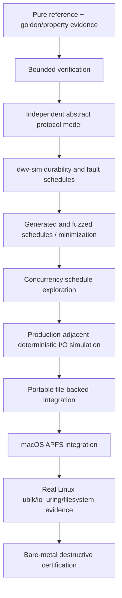

The diagram is a claim hierarchy, not a mandatory serial queue. A layer is introduced when its target component and claim exist. Pure tests, `dwv-sim`, file stores, and the continuous `dwv demo` path remain the portable foundation.

## 21.2 Verification-property index

| ID | Required property |
|---|---|
| **VP-001** | Parity/coding math is exact for the declared profile and erasure set. |
| **VP-002** | Address, range, capacity, alignment, and metadata-location arithmetic is checked. |
| **VP-003** | Durable dirty intent and integrity invalidation precede dependent home mutation. |
| **VP-004** | No execution or recovery path reports false `CLEAN`. |
| **VP-005** | Uncertain completion remains uncertain until reconciled; it never becomes implicit success or rollback. |
| **VP-006** | `VALID` integrity evidence names the exact durable content generation it covers. |
| **VP-007** | Consequential work remains owned through terminal completion, reconciliation, or durable handoff. |
| **VP-008** | Recovery is conservative, deterministic, and idempotent for the declared evidence. |
| **VP-009** | Topology and physical-role binding cannot drift underneath admitted work. |
| **VP-010** | Persistent, control, and trace formats are bounded and hostile-input safe. |
| **VP-011** | Failures retain reproducible producer evidence and a semantic replay artifact where representable. |
| **VP-012** | Product claims never exceed the evidence tier. |
| **VP-013** | Store APIs and executor resources do not acquire permanent data/parity/filesystem roles. |
| **VP-014** | Codec implementations are independent of discovery, physical identity, topology containers, and placement. |
| **VP-015** | Persistent decoders reject unknown/incompatible product-format families rather than guessing. |
| **VP-016** | Production abstractions have a concrete accepted consumer and do not encode speculative behavior. |

Every proof, model, schedule, fuzz corpus, simulator scenario, integration test, and benchmark names the VP properties it supports, its bounds/assumptions, retained witness, and explicit non-claims.

## 21.3 Pure/reference, property, and fuzz evidence

Use ordinary deterministic tests and `proptest`-style generation for:

- XOR and future P/Q golden vectors;
- incremental update equals full recomputation;
- reconstruction for every tolerated known-erasure set;
- heterogeneous tails and zero extension;
- split/coalesce equivalence and ordering preservation;
- topology replacement/reorder invariance under stable identities;
- range-lock ordering and generation-safe checkpoint behavior;
- checksum invalidation/fence/validity semantics;
- identity ambiguity and clone fixtures;
- pure namespace rule matching and deterministic member selection;
- store-role permutation and codec independence.

Use `cargo-fuzz`/libFuzzer or a materially equivalent engine for hostile envelopes, manifests, trace parsers, schema migration, range encodings, and serialized schedules. Structured generators should create semantically valid operation/fault/crash/topology schedules through `dwv-sim`; byte fuzzers target parser safety and unexpected combinations.

Property/fuzz evidence finds examples and shrinks/minimizes them. It does not prove arbitrary domains, real concurrency, or hardware durability.

## 21.4 Bounded verification

Kani or an equivalent bounded verifier is appropriate for small stable high-consequence components:

- capacity and offset arithmetic;
- logical/physical mapping;
- alignment and range predicates;
- parity-envelope location/copy calculations;
- bounded parity-update equivalence;
- generational token checks;
- isolated unsafe resource helpers when they exist.

Each harness states:

- the exact proposition;
- real production preconditions;
- finite bounds and why they are meaningful;
- reachability/coverage evidence;
- solver resource limits;
- what is not proven.

Do not attempt application-wide verification, async/concurrency proof through Kani, or reduce production domains solely to make a proof finish. Fixed/bounded arithmetic lemmas plus property/fuzz scale evidence are preferable to pathological `Vec` or large-loop harnesses.

## 21.5 Abstract transaction/recovery model

Maintain one deliberately small primary model for VP-003 through VP-008.

**Current VE-002 decision:** use the parameterized Quint model in
`models/quint/RecoveryProtocol.qnt` as the one primary executable
authority for the bounded abstract transaction/recovery relation. Its
independent source/action relation makes nondeterministic loss, explicit
reconciliation, safety, reachability, counterexample mutation, and witness
coverage visible in one small model. The former PlusCal/TLA+/TLC and Rust
checker are historical provenance; Stateright remains an unselected
alternative, not a second model.

The active `repair-ve002-quint-authority` change proposes a bounded repair
of this relation: terminal ownership remains held until explicit release,
released ranges can begin a new obligation, pre-mutation intent rejection has
an owned aborted outcome, and durable home reconciliation requires complete
represented mutation coverage. Its finite evidence, two-seed Quint Connect
projection of the mapped Rust lifecycle, and delegated-source review behavior
remain target evidence until the change is verified and synced; they do not
currentize the requirements or authorize a second model.

The comparison considers:

- independence from production code and types;
- nondeterministic crash, power, device-loss, and recovery expression;
- safety, reachability, and any liveness/fairness requirements;
- state-space control and symmetry;
- counterexample readability and translation to `dwv-sim`;
- mutation tests for model effectiveness;
- tooling maintenance, CI, license, and team ergonomics;
- model drift cost.

The first model covers abstract dirty intent, integrity invalidation, home mutation, durable versus uncertain completion, fences, checkpoint/clean, consequential-work ownership, crash, power loss, device loss, and idempotent conservative recovery. It does not mirror Rust fields, SQLite tables, buffer contents, queue internals, or full array scale.

Record finite bounds, omitted facts, symmetry, fairness, and environmental assumptions. Safety and liveness are separate. “Recovery eventually completes” is meaningful only under stated assumptions such as quiesced new writes, terminal device responses, no further faults, and scheduler fairness.

Seed bad-model mutations for premature clean, skipped invalidation, uncertainty collapsed to success/failure, lost obligation, stale generation accepted, and device loss increasing certainty. Counterexamples should become simulator scenarios when representable.

## 21.6 `dwv-sim`: authoritative domain simulator

`dwv-sim` owns executable DiskWeave durability semantics:

- durable versus volatile bytes;
- pending operations and completion delivery;
- recovery DB commits and failures;
- parity-envelope copies and session state;
- dirty/checksum generations;
- topology epochs and identity changes;
- repair authorization and refusal;
- operation obligations;
- daemon crash versus power loss.

The lower media model is protocol-neutral in dependency direction; the protocol fixture interprets its outcomes. This does not require replacing `dwv-sim` or splitting crates when existing code already has the seam.

Primary simulator invariant:

> If a range is reported clean, removing every tolerated known-failure set from the durable simulated stores still permits exact reconstruction of the protected durable bytes.

Additional invariants include no durable `VALID` checksum for bytes lost by a power schedule, no source overwrite on ambiguous repair, no operation-slot resource reuse before terminal evidence, and no topology remap of admitted work.

## 21.7 Common failure-artifact pipeline

```mermaid
flowchart LR
    G[generated / fuzzed / model / scheduler input] --> X[failure]
    X --> MIN[semantic minimization]
    MIN --> TR[normalized DiskWeave scenario/trace]
    TR --> RE[deterministic dwv-sim replay]
    RE --> REG[permanent regression fixture]
    REG --> INT[optional portable or Linux semantic translation]
```

The normalized scenario is common only when it preserves the relevant semantics. The original fuzz input, scheduler witness, model counterexample, or tool trace remains in the reproducer bundle because normalization may omit information.

A bundle records expected terminal data, parity, integrity, recovery, topology, and operation-obligation state; generator seed; tool/schema version; bounds; assumptions; and non-claims. Linux replay recreates workload/fault intent, not an identical kernel schedule.

## 21.8 Concurrency schedule exploration

Use Shuttle or an equivalent controlled scheduler for larger reproducible interleavings involving:

- multiple transaction/operation slots;
- child completion bookkeeping;
- abandonment, quiescence, shutdown, and draining;
- foreground/background jobs;
- device-state and topology publication;
- checksum workers and checkpoints.

Use Loom only for tiny custom synchronization or atomic lifecycle mechanisms where exhaustive exploration within its modeled semantics is worth maintenance: exactly-once terminalization, stale-token rejection, permit accounting, lock-entry reclamation, or shutdown counters.

Normal deterministic tests remain preferred for straightforward mutex-protected code. A passing scheduler test is bounded evidence, not a proof of all Rust, kernel, or hardware schedules.

## 21.9 Production-adjacent deterministic I/O simulation

Once executor/resource-lifecycle code exists, Turmoil or a materially better alternative may complement `dwv-sim` by exercising production-adjacent filesystem and simulated-`io_uring` paths under deterministic scheduling:

- successful-but-not-durable writes;
- `fsync` boundaries;
- crash and torn writes;
- delayed/error/uncertain completions;
- operation ownership through terminal state;
- selected Linux-shaped adapter logic on macOS where actually supported.

The implementing agent first verifies that a narrow test adapter fits the existing store/executor seam. No runtime conversion or semantic refactor is justified solely for the tool.

This does not prove real Linux io_uring, ublk/blk-mq, fixed buffers, ext4/XFS/APFS, dm-crypt, controller caches, FUA, reset/disconnect, or physical power loss.

## 21.10 Platform evidence tiers

| Layer | Establishes | Does not establish |
|---|---|---|
| Pure/model/bounded | declared mathematical or abstract finite properties | full implementation or environment behavior |
| `dwv-sim` | DiskWeave protocol outcomes under modeled media/completion faults | real kernel/device semantics |
| Portable file-backed | actual portable implementation, schemas, recovery, traces | native block frontend or physical durability |
| macOS APFS | real conventional filesystem behavior through selected bridge | Linux or hardware power-loss guarantees |
| Linux CI/VM | ublk UAPI, queue/tag/lifetime, ext4/XFS/dm-crypt/mergerfs, lifecycle | actual device-cache truth under power cut |
| Bare metal | selected controller/device reset, cache, FUA/flush, disconnect, and power-cut behavior | untested hardware paths |

## 21.11 Boundary evidence

Dependency and focused tests SHOULD establish:

- store/executor code has no logical-slot, parity-role, recovery-schema, or namespace dependency;
- codec code has no topology/store/frontend/recovery dependency;
- low-level media simulation instantiates without DiskWeave protocol fixtures;
- protocol depends on substrate, never the reverse;
- persistent decoders reject unknown/incompatible format family/features;
- the same store adapter can serve different fixture roles without behavior changes;
- no production API contains an unconsumed allocator, protection policy, object graph, or coding-group abstraction.

These are architecture guards, not a separate formal-verification program.

# 22. OpenSpec decomposition and implementation ordering

## 22.1 Ordering principle

Attack silent corruption, durability, uncertainty, recovery, and permanent-format risk before throughput optimization. Dependency order is semantic; implementation agents inspect actual completed/active work and do not restart conformant milestones.

Numeric `OS-###` identifiers assigned in this active architecture roadmap are reserved identities for the corresponding roadmap work. They are not a general sequential namespace for unrelated OpenSpec changes. Work that does not implement the corresponding roadmap item uses a descriptive unnumbered OpenSpec change ID.

```mermaid
flowchart TD
    O000[OS-000 decisions + agent contract] --> O001[OS-001 block/frontend semantics]
    O000 --> O002[OS-002 stores/capabilities]
    O000 --> O003[OS-003 codec math]
    O001 --> O004[OS-004 deterministic simulator]
    O002 --> O004
    O003 --> O004
    O004 --> O005[OS-005 recovery semantics + SQLite]
    O003 --> O006[OS-006 identity/topology]
    O005 --> O006
    O005 --> O007[OS-007 parity envelope]
    O006 --> O007
    O004 --> O008[OS-008 explicit transaction]
    O005 --> O008
    O008 --> O009[OS-009 procmachines comparison]
    O005 --> O010[OS-010 dirty/integrity protocol]
    O008 --> O010
    O009 --> O010
    O010 --> O011[OS-011 checksum plane]
    O002 --> O012[OS-012 file stores]
    O005 --> O012
    O010 --> O013[OS-013 healthy portable I/O]
    O011 --> O013
    O012 --> O013
    O013 --> O014[OS-014 verify/selective repair]
    O007 --> O015[OS-015 metadata-loss recovery]
    O014 --> O015
    O015 --> O016[OS-016 degraded read/rebuild]
    O011 --> O017[OS-017 scrub/verified repair]
    O016 --> O017
    O013 --> O020[OS-020 macOS bridge spike]
    O020 --> O021[OS-021 macOS frontend]
    O021 --> O022[OS-022 APFS acceptance]
    O015 --> O022
    O013 --> O024[OS-024 normalized trace]
    O013 --> O030[OS-030 ublk conformance]
```

## 22.2 Phase 0 — contracts, math, simulation, recovery state, and transaction evidence

| OpenSpec | Required executable result |
|---|---|
| **OS-000** | Terminology, invariants, D/P/V/T/U/F and VP registers, gate map, and implementation-agent contract. |
| **OS-001** | Normalized block operations, frontend events, ordering/flush/FUA/abandonment semantics, limits, and conformance fixtures. |
| **OS-002** | Role-neutral `RandomAccessStore`, capabilities/evidence levels, persistence/fence evidence vocabulary, identity observations, safety profiles, and adapter tests. |
| **OS-003** | Reference XOR math, checked geometry, future P/Q seam, independent golden/property vectors, and topology-free dependency tests. |
| **OS-004** | Deterministic durable/volatile/pending/completion simulator, crash/power distinction, fault schedules, minimization, and core invariants. |
| **OS-005** | `RecoveryStateStore` mutation vocabulary, guarded atomic groups, session/topology/maintenance semantics, SQLite alternatives/configuration evidence, migration/corruption behavior, and control-state separation. |
| **OS-006** | Anchorless topology/identity-evidence model, clone refusal, immutable snapshots, assignment generations, and transition plans. |
| **OS-007** | Bare/envelope/envelope+bitmap parity-profile comparison, exact-capacity accounting, independent decoder, hostile/torn/disagreeing copies, migration, and measured choice/fallback. |
| **OS-008** | Small explicit parity-write transaction oracle with normalized actions, failures, crash schedules, and terminal states. |
| **OS-009** | Real pinned `procmachines` implementation of the same protocol, trace/state equivalence, mutation detection, resource benchmark, and selection/fallback ADR. |

No Phase 0 format is stable unless its format gate explicitly passes.

## 22.3 Phase 1 — conservative portable single parity and integrity

| OpenSpec | Required executable result |
|---|---|
| **OS-010** | Dirty-region, checksum invalidation, mutation generations, scoped home-fence evidence, guarded checkpoint/clean, abandonment, uncertainty, and recovery protocol. |
| **OS-011** | Data/P/Q checksum targets, profile/generation records, durable-fence validity, asynchronous revalidation, migration, and repair-evidence semantics. |
| **OS-012** | File-backed data/parity stores, locks, stable identity, sparse/capability characterization, recovery/control DB placement, and injected failures. |
| **OS-013** | End-to-end healthy read/write/flush/reopen through normalized requests, transaction machine, executor, stores, recovery, integrity, and bounded resources. |
| **OS-014** | Exhaustive parity verification, mismatch classification, independent evidence, zero-write matching ranges, and evidence-gated selective candidate generation. |
| **OS-015** | Formal metadata-loss matrix, all-data recovery, envelope/manifest use, clone/parity ambiguity, new-baseline workflow, and safe refusal. |
| **OS-016** | Proven-clean degraded reads, resumable separate-target rebuild, target readback verification, and topology promotion. |
| **OS-017** | CLI scrub, data/parity/ambiguous/conflicting classification, identity/generation-bound repair plans, source preservation, failure/interruption/stale-plan evidence. |

## 22.4 Phase 2 — macOS reference and normalized traces

| OpenSpec | Required executable result |
|---|---|
| **OS-020** | FSKit/macFUSE/DiskImages fixed-size virtual-file feasibility, operation/sync/cache/disconnect trace, entitlements, and ADR. |
| **OS-021** | macOS frontend translating virtual-file operations to normalized requests with fixed size, backpressure, alias prevention, and clean detach/restart. |
| **OS-022** | Full APFS healthy/degraded/rebuild/direct-attach/metadata-loss/clone/mismatch acceptance suite. |
| **OS-023** | macOS synchronization and durability characterization with exact `portable-demo` claims and unsupported semantics. |
| **OS-024** | Bounded versioned privacy-safe trace export/render/replay through `dwv demo`, deterministic final states, malformed/oversized rejection, migration, and minimized failures. |

## 22.5 Phase 3 — Linux production frontend and deployment

| OpenSpec | Required executable result |
|---|---|
| **OS-030** | ublk UAPI/library feasibility, supported kernels, operation/flag/limit/recovery conformance, resource baseline, and mount-namespace proof. |
| **OS-031** | Linux operation-slot/io_uring executor, generational buffers, fanout, CQE aggregation, cancellation/drain/uncertainty, and fallback adapter. |
| **OS-032** | Coherent multi-slot ublk group, all-or-nothing assembly, quiescence, daemon recovery, and no unsafe reissue. |
| **OS-033** | Sanitized Linux trace capture from fio/fsx, ext4/XFS, dm-crypt, mergerfs, databases, sparse/media workloads, and fixture promotion. |
| **OS-034** | ext4/XFS, encryption, mergerfs, sparse/mmap/fsync, workload, UUID/automount, and direct-recovery certification. |
| **OS-035** | NixOS/systemd/udev/mount-namespace lifecycle, boot/shutdown/recovery ordering, resource caps, and failure drills. |
| **OS-036** | Linux and physical flush/FUA/cache/identity probes with persisted evidence and safety-profile gating. |
| **OS-037** | Production single-parity release candidate with sustained verified workloads, security/observability, and support matrix. |

## 22.6 Phase 4 — stronger durability, integrity, and redundancy

| OpenSpec | Required executable result |
|---|---|
| **OS-040** | Optional recovery-state replica protocol and replica-set transitions, only if required. |
| **OS-041** | Journal versus PPL ADR and formal/simulator model. |
| **OS-042** | Selected journal/PPL implementation, replay/checkpoint/migration, and destructive evidence. |
| **OS-043** | Expanded checksum/scrub/repair profiles and storage policy. |
| **OS-044** | Degraded writes with every missing-role case, durable absent-slot representation, replay/rebuild, and extra-failure policy. |
| **OS-045** | Dual P/Q field/profile/position/tail mapping, independent vectors/decoder, capacity, and migration. |
| **OS-046** | Online build/check/scrub/rebuild with concurrent-write reconciliation, resumable checkpoints, and QoS. |

## 22.7 Phase 5 — optional conventional namespace product

| OpenSpec | Required executable result |
|---|---|
| **OS-050** | Namespace semantics contract. |
| **OS-051** | Pure whole-file policy matching and logical-slot selection. |
| **OS-052** | FUSE adapter and filesystem conformance. |
| **OS-053** | Passthrough/transport benchmark and claim boundaries. |
| **OS-054** | Safe mover/rebalance, staging/protection states, and crash recovery. |

This remains a namespace over conventional member filesystems. It does not own extent allocation or per-item parity.

## 22.8 Additive verification evidence

- **VE-001:** bounded arithmetic and pure-component verification;
- **VE-002:** independent abstract transaction/recovery model;
- **VE-003:** concurrency schedule exploration;
- **VE-004:** production-adjacent deterministic I/O simulation;
- **VE-005:** sustained property/fuzz schedule and parser corpus.

These changes attach at dependency-ready points and do not automatically block unrelated portable delivery. Move one earlier only to resolve a concrete high-consequence uncertainty.

# 23. Release and acceptance gates

## Gate A — product and semantic seams

- Product boundary and independent-data-payload invariant are approved.
- Data payloads contain no required DiskWeave metadata.
- Store, slot, role, coding position, assignment, and epoch are distinct.
- Codec has no topology/store dependency; store/executor have no protocol-role dependency.
- Normalized request, recovery, operation-slot, capability, and evidence semantics are reviewed.
- No code writes non-disposable media.

## Gate B — simulator and transaction evidence

- Low-level media simulation distinguishes durable, volatile, pending, and completion state.
- Explicit and selected transaction implementations produce equivalent permitted outcomes under generated faults.
- False-clean, uncertainty, integrity-generation, topology, and consequential-ownership invariants pass.
- Seeded implementation/model mutations are detected.
- Counterexamples and generated failures retain deterministic replay artifacts.

## Gate C — experimental recovery and format evidence

- SQLite recovery semantics/configuration survive declared portable crash/corruption fixtures.
- Identity ambiguity fails closed.
- Parity-envelope profiles have independent decode, hostile-input tests, exact-capacity accounting, copy/session crash behavior, and migration tests.
- Every custom format identifies the DiskWeave block-parity family and handles unknown/incompatible features.
- All data remain disposable until FORMAT-EXPERIMENTAL is lifted by a later gate.

## Gate D — portable write-safe single parity

- Healthy file-backed read/write/flush/reopen uses real transaction, recovery, integrity, executor, and store paths.
- Crashes after every modeled transition never report false clean or install stale valid checksums.
- Abandoned requests drain/reconcile or transfer obligations durably.
- Dirty/indeterminate ranges never serve unsafe degraded data.
- Resource bounds pass representative 8/16/32-store profiles.

## Gate E — integrity and metadata-loss recovery

- Exhaustive verification performs zero writes for matching ranges.
- Sampling cannot establish clean.
- Hash-backed repair identifies a unique bad shard and verifies a separate candidate by readback.
- Hashless ambiguity preserves sources and refuses automatic mutation.
- Every metadata-loss matrix row has an executable plan and truthful classification.
- `array.sqlite3` and `control.sqlite3` loss have their documented distinct effects.

## Gate F — macOS APFS portability

- Real APFS member images operate through the selected bridge.
- Proven-clean degraded reads and replacement rebuild pass.
- Rebuilt payload attaches and mounts independently after shutdown.
- DB loss, clone ambiguity, mismatch, daemon-kill, and trace scenarios pass.
- macOS durability limitations remain explicit.

## Gate G — Linux ublk and filesystem conformance

- ublk request flags, queue/tag recovery, operation-slot lifetime, and no-unsafe-reissue behavior pass on supported kernels.
- ext4/XFS/dm-crypt/gocryptfs/mergerfs workloads and lifecycle pass.
- mount-namespace self-deadlock and automount regressions pass.
- Linux traces replay through the portable protocol.
- No Linux adapter type leaks into formats or portable contracts.

## Gate H — hardware durability certification

- Intended storage paths truthfully satisfy required flush/FUA/order behavior under destructive tests.
- Reset, disconnect, volatile cache, and power-cut outcomes match or safely exceed the simulator's conservative model.
- Envelope clean-session evidence cannot remain optimistically clean across an uncovered write session.
- Supported and unsupported hardware paths, firmware, controllers, bridges, and safety profiles are published.

## Gate I — stable DiskWeave block-parity format 1

- Data payloads remain ordinary and formatless to DiskWeave.
- Parity profile/envelope, recovery manifest/schema semantics, checksums, and traces have independent tools and golden fixtures.
- Unknown family/feature, downgrade, exact-capacity, interrupted migration, damaged-copy, stale-clone, and rollback behavior is proven.
- Disaster-recovery drills start from documented surviving evidence rather than private daemon structs.
- At least one independent implementation can inspect and rebuild from documented bytes.
- No stable field was added only to reserve an unimplemented product feature.

# 24. Decision, validation, tuning, and format register

## 24.1 Accepted decisions

| ID | Decision |
|---|---|
| **D-001** | DiskWeave is a portable parity block engine below conventional per-member filesystems, not a custom filesystem. |
| **D-002** | Each healthy data payload remains an ordinary independently readable image. |
| **D-003** | Data members contain no required DiskWeave metadata, sidecar, or partition. |
| **D-004** | ublk, FSKit, io_uring, SQLite, `procmachines`, runtimes, codecs, and checksum crates remain behind replaceable seams. |
| **D-005** | Array, slot, physical store, coding position, assignment, and topology epoch identities are distinct. |
| **D-006** | Identity uses multiple observations; clone/assignment ambiguity blocks writes. |
| **D-007** | Logical transaction and backend resource lifetimes are separate. |
| **D-008** | The first writable protocol uses durable dirty/integrity intent before home mutation and durable home fences before clear. |
| **D-009** | Data and every parity role are checksum targets; parity cleanliness and integrity coverage are separate. |
| **D-010** | A checksum is valid only for a named content generation covered by durable target-store fence evidence. |
| **D-011** | Sampling never establishes `CLEAN`. |
| **D-012** | Automatic repair requires a unique result from verified-good evidence and target readback. |
| **D-013** | `array.sqlite3` loss never destroys intact data; all-data recovery can establish a new topology/baseline. |
| **D-014** | The first production release prohibits writes when a required data/parity role is unavailable. |
| **D-015** | Runtime and persistent granularities remain independent. |
| **D-016** | Full verification is distinct from parity rewrite; matching ranges require no writes. |
| **D-017** | Backing and exported endpoints cannot alias while active. |
| **D-018** | Simulator, file-backed, macOS, Linux, and hardware evidence establish different claims. |
| **D-019** | No stable format without independent recovery tools and migration evidence. |
| **D-020** | Routine reversible implementation choices are delegated to agents. |
| **D-021** | Consequential work remains owned until terminal resolution, reconciliation, or durable recovery handoff. |
| **D-022** | Task/future/frontend disappearance is not rollback or a terminal outcome. |
| **D-023** | `dwv-sim` remains the domain simulator; general deterministic I/O runtimes only complement it. |
| **D-024** | Normalized semantic traces are the common portable regression artifact; producer witnesses remain tool-scoped and retained. |
| **D-025** | Verification tools may not force a general runtime/effect system, transaction rewrite, CLI redesign, or format change. |
| **D-026** | The primary abstract model is independent of production Rust, records bounds/fairness, and translates counterexamples to simulator scenarios; the VE-002 Quint canary is the current model authority and one maintained model is required. |
| **D-027** | Persistence durability and logical protection policy are distinct; current `BlockRequest` carries only durability semantics. |
| **D-028** | Physical stores are role-neutral; logical roles and coding positions are topology bindings. |
| **D-029** | Codec primitives consume explicit profiles/positions/shards and are independent of topology, stores, and placement. |
| **D-030** | Operation-slot/executor ownership is role-neutral. |
| **D-031** | The low-level durable/volatile/completion media model is independent of parity/SQLite policy; a physical crate split is optional. |
| **D-032** | Namespace placement is deterministic whole-file logical-slot selection, not an extent allocator or per-object protection mechanism. |
| **D-033** | Persistent formats identify the DiskWeave block-parity family and reject incompatible interpretation. |
| **D-034** | No speculative allocator, object graph, universal transaction framework, protection API, or placeholder crate is introduced without a concrete accepted consumer. |
| **D-035** | Any product that owns filesystem namespace or allocation and changes the recoverability contract requires a separate approved architecture and format; it is not a hidden mode of DiskWeave block parity. |

## 24.2 Provisional implementation choices

| ID | Preferred choice | Exit seam/evidence |
|---|---|---|
| **P-001** | ublk Linux frontend | normalized block/frontend contract |
| **P-002** | io_uring Linux executor | role-neutral store/executor and fallback adapter |
| **P-003** | `procmachines` transaction implementation | explicit oracle, semantic traces, benchmark, dependency exit plan |
| **P-004** | SQLite `array.sqlite3` | `RecoveryStateStore`, semantic export, all-data recovery path |
| **P-005** | Small redundant parity envelope | bare/envelope/bitmap comparison; exact-capacity and crash evidence |
| **P-006** | BLAKE3-256 integrity profile | semantic algorithm/profile fields and online migration |
| **P-007** | FSKit-first macOS raw-file bridge | frontend contract; macFUSE/other alternative |
| **P-008** | mergerfs initial namespace | separately replaceable namespace plane |
| **P-009** | Module-level substrate/protocol separation | split crates only when dependency evidence justifies it |
| **P-010** | Parameterized Quint model for the bounded abstract transaction/recovery relation | one-model maintenance, seeded mutation failure, deterministic traces, witness coverage, and explicit non-claims |

## 24.3 Validation decisions

| ID | Question | Required evidence |
|---|---|---|
| **V-001** | Which parity-envelope/reserve profile is justified? | OS-007 decoder, capacity, hostile/copy/session crash, benchmark |
| **V-002** | Which SQLite configuration meets the selected profile? | process/VM/hardware crash tests and ADR |
| **V-003** | Does `procmachines` earn production use? | OS-009 equivalence, mutation, resource, dependency evidence |
| **V-004** | Which macOS bridge correctly supports DiskImages/APFS? | OS-020–023 |
| **V-005** | Which ublk/io_uring topology is efficient and safe? | OS-030–036 |
| **V-006** | Which P/Q profile/mapping becomes stable? | independent vectors/decoder, migration, fault tests |
| **V-007** | Is journal/PPL worth its complexity? | abstract model, simulator, benchmark, destructive evidence |
| **V-008** | Is application-level recovery replication needed? | deployment availability requirements and modeled protocol |
| **V-009** | Do current store/codec/executor/simulator dependencies violate D-028–D-031? | repository dependency/type tests and minimal correction if found |
| **V-010** | Which checksum extent/profile is operationally best? | storage overhead, invalidation, scrub/rebuild, throughput benchmarks |
| **V-011** | What exact ownership-continuity evidence permits scan-free clean-envelope recovery? | threat model, identity/rollback fixtures, destructive tests |

## 24.4 Tunable policy

Queue/ring/shard counts, slot/buffer limits, lock quantum, RMW size, dirty/checkpoint cadence, checksum extent/workers, scrub/rebuild bandwidth, SQLite caches/connections, trace/parser limits, and observability retention are benchmarked defaults rather than product decisions.

## 24.5 Explicit user/product decisions

- destructive import, replacement, topology reset, force assembly, or rebaseline;
- weaker exact-capacity bare-parity compatibility profile;
- future degraded/unprotected-write behavior;
- incompatible stable-format change;

## 24.6 Permanent-format candidates

| ID | Candidate | What freezes | Constraint / migration / interrupted behavior |
|---|---|---|---|
| **F-001** | data payload mapping | virtual byte zero equals payload byte zero; no hidden metadata | changing requires a distinct migration/product; never reinterpret in place |
| **F-002** | identity semantics | array/slot/store/coding/assignment/epoch separation | preserve IDs or perform explicit quiesced migration |
| **F-003** | XOR parity mapping | byte correspondence and zero-tail rule | optimized implementation replaceable; new profile requires parity rebuild/parallel set |
| **F-004** | P/Q profile | field, polynomial, symbols, coefficients, positions, tails | independent vectors and explicit full migration |
| **F-005** | parity payload boundaries | physical offset/length/reserve | copy/rebuild for incompatible changes; never silently shorten protection |
| **F-006** | parity envelope | header/features/body/copy/session selection | staged A/B migration; last valid committed copy; old reader behavior defined |
| **F-007** | recovery-state semantics | dirty/integrity/checkpoint/topology generations | transactional SQLite migration, semantic export, all-data rebuild path |
| **F-008** | exported recovery manifest | topology/profile/evidence schema | documented versioned readers; no raw DB pages |
| **F-009** | integrity profile | algorithm, digest, extent, generation | parallel build/verify/select/retire |
| **F-010** | journal/PPL | record/order/replay semantics | deferred; dual reader/checkpoint migration if adopted |
| **F-011** | normalized trace/scenario | semantic event/replay schema | fixture migration; never array compatibility truth |
| **F-012** | product-format family discriminator | safe decoder dispatch/refusal | existing magic/profile may satisfy; never reuse across incompatible products |

Data payload bytes and `control.sqlite3` are deliberately absent from DiskWeave's custom stable-format list.

# 25. Autonomous implementation-agent and OpenSpec operating contract

This section guides how a capable implementation agent turns the roadmap into OpenSpecs, code, tests, evidence, and subsequent work without repeatedly asking the product owner to resolve routine engineering choices. It does not own current product semantics; `openspec/config.yaml` owns current OpenSpec-authoring rules.

The inspection order below assigns source roles; it is not a precedence stack that lets roadmap prose override current canonical requirements.

The roadmap is an active control document for future direction, not background reading. A library convenience, existing code shape, or passing unit test does not silently resolve a disagreement with either a current canonical requirement or an intended architectural invariant.

## 25.1 Authority and inspection order

Use these roles when sources disagree:

1. current files under `openspec/specs/*/spec.md` own current required product behavior;
2. active OpenSpec changes contain proposed or in-flight semantics and must identify any change to current requirements explicitly;
3. this active architecture roadmap guides future architecture, dependency order, validation strategy, and roadmap work;
4. executable evidence, independent reference models, golden vectors, and simulator oracles may confirm or falsify assumptions but do not silently rewrite requirements;
5. implementation code and comments show actual behavior but do not silently override current specifications;
6. archived changes, ADRs, verification records, prior architecture revisions, handoffs, and planning artifacts are historical evidence or rationale.

When this roadmap disagrees with a current canonical requirement, preserve the disagreement, inspect the implementation and evidence, and deliberately reconcile it through an explicit specification or roadmap change. Do not silently weaken a test, reinterpret an invariant, or treat implementation divergence as authoritative.

## 25.2 Dependency-driven execution loop

```mermaid
flowchart TD
    A[Read architecture, registers, gates, repository state] --> B[Select next dependency-ready OpenSpec]
    B --> C[Write/refine executable OpenSpec]
    C --> D[Implement smallest vertical slice]
    D --> E[Unit + golden/reference tests]
    E --> F[Property / fuzz / model evidence]
    F --> G[dwv-sim fault schedules]
    G --> H[Integration tests available on current OS]
    H --> I[Performance/resource checks where required]
    I --> J[Record ADRs, evidence, regressions, residual risks]
    J --> K{Every acceptance criterion passes?}
    K -- No --> L[Preserve/minimize failure; add regression]
    L --> D
    K -- Yes --> M[Verify/archive OpenSpec and update gate/status]
    M --> N{Another dependency-ready item?}
    N -- Yes --> B
    N -- No --> O[Report actual capability/platform blocker]
```

Prefer the smallest end-to-end slice that exercises a semantic contract and failure boundary over broad scaffolding with no executable oracle.

## 25.3 OpenSpecs are executable contracts

`openspec/config.yaml` defines current authoring and identifier rules. An active numbered change is valid only when it implements the matching `OS-NNN` row in this current active roadmap and declares exactly one matching `<!-- dwv:roadmap-node OS-NNN -->` marker. Archived numbered changes need not remain in future active roadmaps, but their numeric identities remain globally reserved and unique. Descriptive unnumbered changes do not imply roadmap implementation. For roadmap-numbered work, this roadmap recommends the following sections; deviations remain subject to the supported OpenSpec schema and must preserve an executable acceptance contract.

Authoring ownership is explicit: authors search current canonical specs before proposing or writing requirements or scenarios. One canonical owning requirement covers each invariant, state transition, authority decision, durability predicate, lifecycle rule, failure rule, and recovery decision. Duplicate independent normative ownership is drift to reconcile. Non-owners state only local refinement, composition, or adapter mapping, and scenarios test only that local behavior. Proposals classify affected ownership as preserved, semantics-preserving relocation, semantic change, or new; stable `req.*` IDs remain when materially owned semantics remain unchanged.

```markdown
# OS-XYZ: Title

## 1. Architecture decisions and target gate
## 2. Concrete outcome
## 3. Prerequisites and inspected repository state
## 4. Exact scope and non-scope
## 5. Semantic APIs and contracts
## 6. State ownership and lifecycle
## 7. Persistent-state and format impact
## 8. Irreversible and durability boundaries
## 9. State and sequence diagrams
## 10. Concurrency and resource rules
## 11. Failure and recovery matrix
## 12. Deterministic simulator cases
## 13. Property, model, bounded, and fuzz evidence
## 14. Integration and CLI tests
## 15. Observability, security, privacy, and operator behavior
## 16. Performance and resource bounds
## 17. Executable acceptance criteria
## 18. Forbidden outcomes
## 19. Migration, compatibility, rollout, and rollback
## 20. Next OpenSpecs unlocked
```

### 25.3.1 Required content

**1. Architecture decisions and target gate**

- cite relevant D/P/V/F and VP identifiers;
- identify the exact release gate and evidence contribution;
- name provisional/validation decisions resolved or left open.

**2. Concrete outcome**

Describe an observable result, not merely a crate/module. Example: “A crash after one home write restarts dirty and never serves degraded bytes from the range.”

**3. Prerequisites and inspected repository state**

- list required prior OpenSpecs/evidence;
- inspect current code/tests/CLI before claiming a seam absent;
- state whether behavior is new, incomplete, corrective, or already partly present;
- preserve references to superseded/archived work.

**4. Exact scope and non-scope**

State portable, macOS, Linux, hardware, format-experimental, and deferred boundaries. Name tempting adjacent work that is intentionally excluded.

**5. Semantic APIs and contracts**

Define inputs, outputs, preconditions, postconditions, error/refusal/uncertainty categories, and invariants. Where persistence or recovery is involved, name the evidence scope/watermark and recovery mutation(s) that authorize each state transition. Keep OS/library/private struct details outside unless the OpenSpec is specifically an adapter.

**6. State ownership and lifecycle**

For each resource/state, identify owner, transfer, terminal outcome, and reclamation condition: frontend request, transaction, range guard, operation slot, buffer token, backend I/O, recovery record, topology snapshot, job cursor, and trace witness.

**7. Persistent-state and format impact**

- name bytes/schema/semantic generations changed;
- state whether FORMAT-EXPERIMENTAL;
- bound lengths/counts/offsets and unknown-version behavior;
- define migration, downgrade, interrupted migration, independent decoder, and all-data rebuild implications;
- do not freeze a Rust/library representation.

**8. Irreversible and durability boundaries**

Identify exact point after which rollback cannot be assumed; required intent/invalidation before it; data/parity/recovery fences; the store incarnations, topology/generations, and ordering watermarks covered by persistence evidence; and the meaning of ordinary completion, stable completion, flush, crash, and power loss.

**9. State and sequence diagrams**

Use Mermaid when ordering, ownership, retries, crash recovery, or promotion is not obvious. Diagrams must agree with prose and tests.

**10. Concurrency and resource rules**

- lock/admission ordering and deadlock prevention;
- bounded queues, slots, buffers, memory, descriptors, retries, and background work;
- cancellation/drain and shutdown behavior;
- fairness/starvation assumptions;
- topology/checkpoint generation races.

**11. Failure and recovery matrix**

Cover relevant short I/O, EIO, timeout, uncertain/lost/duplicate completion, store disappearance, abandonment, daemon crash, power loss, recovery DB failure/corruption/loss, stale/unknown format, identity ambiguity, topology mismatch, ENOSPC, and target verification failure. Downstream code may not invent optimistic defaults.

**12. Deterministic simulator cases**

Name fault points, schedule bounds, initial/final durable state, clean/dirty/refusal expectations, and retained minimal witnesses.

**13. Property, model, bounded, and fuzz evidence**

Select evidence by VP property. State finite domains, generator validity, shrinking/minimization, mutation cases, corpus retention, and explicit non-claims. A named tool is replaceable by equivalent evidence.

**14. Integration and CLI tests**

Use real implementation paths. Include focused `dwv demo` scenario, neighboring regression paths, and full integrated workflow when prerequisites exist. Record exact commands, exit codes, machine-readable output, final hashes/state, and platform claim boundary.

**15. Observability, security, privacy, and operator behavior**

Define events/metrics, IDs/generations, explanation fields, destructive confirmations, parser/input threat model, payload/path privacy, and required audit evidence.

**16. Performance and resource bounds**

Give measurable limits/targets or explain why deferred. Report throughput/latency/CPU/I/O amplification plus bounded memory/threads/rings/descriptors at representative array widths when applicable.

**17. Executable acceptance criteria**

Each criterion has a command/test and unambiguous expected result. Replace “robust,” “safe,” and “performant” with falsifiable conditions.

**18. Forbidden outcomes**

List unsafe states that must never occur: false clean, stale checksum valid, ambiguous source overwritten, token reused early, partial group exposed, unsupported flag weakened, unbounded parser allocation, or stronger claim than evidence.

**19. Migration, compatibility, rollout, and rollback**

Define feature gating, old-reader behavior, read-only fallback, conversion sequence, rollback point, and data/evidence preserved on interruption.

**20. Next OpenSpecs unlocked**

Name precise successors and any remaining blocker. Completion should move the dependency graph, not merely add code.

## 25.4 OpenSpec sizing and splitting

An OpenSpec should produce one coherent vertical contract with one dominant irreversible boundary and a reviewable failure matrix. Split when:

- it changes unrelated persistent formats;
- it combines portable semantics with a large OS adapter;
- it contains independent product decisions;
- one part can be accepted/tested without the other;
- the simulator/model state becomes too broad to review;
- rollback/migration differs materially.

Do not split into type-only scaffolding with no observable behavior. Do not combine a correctness protocol, performance optimization, and platform deployment merely to reduce document count.

## 25.5 Definition of completion

An OpenSpec is complete only when:

- implemented behavior exists on the intended path;
- focused and neighboring regression tests pass;
- relevant simulator/property/model/fuzz evidence passes;
- CLI/integration evidence is recorded where applicable;
- machine-readable status and exit semantics are correct;
- docs/ADR/format fixtures match implementation;
- resource and performance bounds are measured when required;
- forbidden outcomes are tested;
- discovered defects have permanent reproducers;
- claim boundaries are honest;
- the change is verified and archived using repository conventions.

Compilation, a library unit test, a new type, or an archived directory alone is insufficient.

## 25.6 Defect and regression workflow

When any test, demo, fuzzer, scheduler, model, hardware run, or user report finds a correctness defect:

```text
preserve original witness
    -> minimize semantically where possible
    -> produce normalized scenario/trace when representable
    -> prove deterministic replay
    -> add failing permanent regression
    -> fix smallest coherent layer
    -> rerun focused + neighboring + integrated evidence
    -> qualify/supersede any old claim
```

Do not rewrite history. A previously completed OpenSpec is evidence, not immunity from a later discovered invariant violation. Use a corrective/successor OpenSpec or repository-native reopening mechanism that references the prior work.

## 25.7 Autonomous decision authority

Implementation agents may decide without user interaction:

- internal Rust/module organization behind accepted seams;
- bounded queue, slot, worker, cache, batch, and fixture defaults;
- SQLite tables/indexes and tested configuration consistent with semantic durability;
- test crate/harness organization;
- property strategies, fuzz dictionaries, seeds, and corpus layout;
- trace size limits and privacy-preserving fixture encodings;
- logging/metric names that preserve required semantics;
- one library/tool among equivalent choices that does not affect product semantics or stable formats;
- compatible bug fixes and refactors supported by regression evidence.

Agents SHOULD choose the conservative safe behavior when evidence is incomplete and record a validation item rather than ask about ordinary engineering taste.

## 25.8 Escalation criteria

Escalate only when evidence reveals:

- materially different user-visible semantics, availability, or recoverability promises;
- destructive migration or irreversible stable-format choice;
- a safe option that would substantially undermine the project's core goal;
- genuinely inconclusive alternatives with different compatibility/capacity consequences;
- need to abandon an accepted invariant;
- legal/license uncertainty that affects permitted implementation or distribution.

A library preference, crate layout, queue depth, benchmark tuning, test framework, or reversible schema/index choice is not normally a product-owner question.

## 25.9 Refactoring threshold

Refactor an existing seam only when inspection or executable evidence shows:

- concrete unsoundness or duplicated correctness logic;
- inability to own consequential work to terminal state;
- ambient capability preventing deterministic/fault testing;
- persistent implementation detail leaking into compatibility semantics;
- role/topology coupling that breaks current replacement/simulator/adapter behavior;
- unacceptable measured overhead with a safer equivalent design.

Do not refactor merely because a verifier, runtime, or hypothetical later feature prefers another shape.

## 25.10 Required repository evidence artifacts

Maintain, using repository conventions:

- architecture and decision register;
- dependency/status index;
- active/archived OpenSpecs and ADRs;
- golden binary/text fixtures and independent decoder output;
- `dwv demo` evidence log;
- simulator schedules and minimized regressions;
- fuzz corpora and producer witnesses;
- abstract model, bounds, mutation checks, and counterexample translations;
- bounded-verification harness propositions and results;
- platform/hardware capability evidence and support matrix;
- recovery drills and operator procedures.

Evidence records include tool/version, commands, environment, fixture IDs, expected/actual result, assumptions, non-claims, and relevant commit.

## 25.11 Cross-agent handoff

A handoff identifies:

- current gate and dependency-ready item;
- actual repository milestone state, not assumed state;
- implemented semantic behavior and remaining gaps;
- exact commands/evidence last run;
- active failures or minimized reproducers;
- decisions made and ADR links;
- formats/schema versions and migration state;
- platform-gated claims;
- next action and why it is unblocked.

A handoff should allow a new capable agent to continue without re-planning the architecture or asking the product owner to repeat settled decisions.

# 26. Disaster-recovery stories

These scenarios are product acceptance contracts. Recovery tools present plans and evidence in operator terms rather than requiring knowledge of private Rust or SQL implementation details.

## 26.1 OS/system disk lost; all array stores survive

1. Install compatible DiskWeave software and an independent inspector/reference tool.
2. Discover data/parity stores read-only.
3. Mount data payloads directly read-only if immediate file access is needed.
4. Decode parity envelopes and import an exported recovery manifest/backup when available.
5. Assess multiple identity observations and resolve any clones/conflicts explicitly.
6. Restore a valid `array.sqlite3` backup only after proving it matches topology/envelope generations, or create a new recovery DB.
7. If trusted clean/ownership evidence is insufficient, exhaustively verify parity; matching ranges are not rewritten.
8. Rebuild checksum baseline where historical evidence is missing.
9. Establish a new managed session/checkpoint and only then expose writable virtual members.
10. Reconstruct `control.sqlite3` from discovery/recovery state; historical UI/SMART data may be absent.

No data payload needs DiskWeave-specific tooling merely to mount it.

## 26.2 `array.sqlite3` lost; all data and parity survive

- Stop/block writes and claim stores read-only.
- Identify data and parity candidates; fail closed on ambiguity.
- Interpret parity profile/topology from valid envelopes or a recovery manifest where available.
- A matching `CLOSED_CLEAN` certificate permits scan-free recreation only under trusted ownership continuity or equivalent anti-rollback evidence.
- Otherwise scan every unproven region and compare parity equations.
- Leave matching ranges untouched.
- For mismatches, use surviving current checksums to classify a unique bad shard; without them, preserve both sides and require explicit rebaseline/new target.
- Verify any candidate repair by digest and parity readback.
- Create a fresh recovery DB/checksum baseline and managed session.

The common clean case can require a full read and zero parity writes.

## 26.3 `array.sqlite3` lost; parity lost; all data survive

All user data is directly available. The operator selects/validates data payloads, creates a new array lineage or explicit topology reset, assigns stable slots/coding positions, builds new parity into a separate target, verifies the complete equation, builds checksums, and creates new recovery state. Historical dirty and integrity evidence is irrecoverable, but user data is not.

## 26.4 `array.sqlite3` lost and one data member missing

XOR with surviving P can produce a mathematical candidate. DiskWeave certifies it only when surviving topology, coding profile, identity, managed clean/ownership, and integrity evidence are sufficient to establish historical correctness.

If evidence is insufficient:

- do not overwrite surviving stores;
- offer a forensic separate-target candidate with explicit uncertainty, or refuse guaranteed recovery;
- do not describe algebraic reconstruction as verified data;
- permit operator-authorized data recovery/export under a clearly weaker claim.

P/Q adds mathematical tolerance but also makes historical coding positions essential.

## 26.5 Duplicate filesystem/partition UUIDs

DiskWeave compares all available observations. Two clones that could satisfy the same assignment produce `AmbiguousClone`. Writable assembly fails. The operator may:

- inspect both read-only;
- compare external manifests, serial/WWN/file IDs, content/checksum evidence, and timestamps as non-authoritative clues;
- explicitly select a mapping and create a new assignment generation/rebaseline plan;
- preserve the unselected clone from automatic mutation.

## 26.6 Parity equation disagrees

```text
P != XOR(D0, D1, ...)
```

- Current data digests valid and P digest bad: compute P candidate to a separate target, verify readback/equation, then replace/promote.
- Exactly one data digest bad and all required other data/parity digests valid: reconstruct that data target and verify.
- Evidence stale, absent, multiple-suspect, or conflicting: report ambiguous integrity fault; do not guess.
- Operator may explicitly declare data authoritative and create a new parity baseline, but the command states that historical truth is being discarded.

## 26.7 Checksum index lost

Intact data remains intact. With all data present, parity can be exhaustively verified and a new checksum baseline built. What is lost is historical evidence that could identify the bad side of an existing mismatch or prove a past generation. DiskWeave must not retroactively label newly calculated digests as evidence that the old state was uncorrupted.

## 26.8 One recovery-state backup survives or replicas disagree

A surviving backup/replica is validated against array UUID, topology, assignment, envelope, schema, and commit generations. Dirty observations are conservatively retained/unioned. A clean record never overrides conflicting dirty/unknown evidence. Replica-set changes require an explicit protocol; copying the newest filesystem timestamp is not a safe election rule.

## 26.9 DiskWeave software disappears forever

- Mount every healthy data payload with ordinary filesystem/encryption tooling.
- Ignore/discard parity and adopt another protection system, or use published DiskWeave format documentation/reference tooling to verify or regenerate parity.
- The reference tool understands stable codec profiles, payload boundaries, envelopes, exported manifests, checksums, and recovery classifications without production-daemon structs.
- `control.sqlite3` is unnecessary.
- `array.sqlite3` may aid recovery if documented schema/export tooling exists, but healthy data access does not depend on it.

## 26.10 Unknown or incompatible format family

A tool expecting DiskWeave block parity refuses writable interpretation of an unknown family or incompatible feature. It may provide bounded metadata inspection and raw data direct access where safe, but never guesses payload offsets, codec, topology, or recovery semantics.

## 26.11 Recovery-drill release evidence

Before stable format:

- perform one drill with `array.sqlite3` absent and all data present;
- perform one degraded drill where surviving recovery evidence materially changes what can be certified;
- perform clone ambiguity and damaged-envelope drills;
- recover using only documented artifacts and independent tooling;
- record exact commands, read/write counts, rewritten ranges, final hashes, and claim boundaries.

# 27. Final recommendation and architecture self-review

Proceed with the DiskWeave block-parity architecture in this document:

1. keep conventional data payloads untouched and independently readable;
2. make topology and identity explicit and fail closed on ambiguity;
3. prove checked parity math and geometry independently;
4. keep stores, codecs, executor ownership, and low-level media simulation below product-specific protocol semantics;
5. use a conservative dirty/integrity durability protocol before optimizing write amplification;
6. treat checksums as generation-bound independent evidence and refuse ambiguous repair;
7. keep `array.sqlite3` operationally authoritative but recoverable when all data survive;
8. preserve a simple parity payload with only a justified bounded recovery envelope;
9. keep `dwv-sim`, normalized traces, and independent recovery tools first-class;
10. certify macOS, Linux, and hardware claims separately;
11. require executable OpenSpecs and autonomous evidence-driven implementation;
12. freeze format v1 only after real recovery and migration drills.

## 27.1 Self-review: accidental protocol coupling

The architecture fails if reusable lower layers acquire assumptions that:

- every physical store is permanently one logical member;
- data/parity role belongs to the backend;
- codec order comes from device enumeration;
- operation-slot reclamation follows transaction-future lifetime;
- low-level media faults require SQLite/dirty-region types;
- format decoding guesses product semantics.

Sections 5, 6, 7, 9, 11, and VP-013–VP-015 prevent these failures through dependency and executable tests.

## 27.2 Self-review: speculative architecture

The architecture also fails if implementation is complicated by unused:

- object or extent IDs;
- per-object protection hierarchies;
- allocators or coding-group managers;
- universal transaction frameworks;
- unimplemented foreign product-family superblock, namespace, allocator, or object-layout fields;
- placeholder crates or feature branches;
- generalized abstractions with no concrete accepted consumer.

Invariant 28, D-034, OpenSpec scoping, and the product-family boundary in Section 18 prevent this failure.

## 27.3 Completeness test

A capable implementation agent should be able to answer from this document:

- what DiskWeave is and is not;
- which state is authoritative;
- who owns every consequential resource;
- what must be durable before mutation and before clean;
- when degraded reconstruction and repair are permitted;
- how metadata loss, clone ambiguity, and software disappearance are handled;
- which interfaces are semantic versus replaceable implementation details;
- which tests and evidence support each claim;
- which decisions it may make autonomously;
- how to formulate and complete the next OpenSpec.

A provisional crate, database, frontend, runtime, queue topology, or optimization should be replaceable without changing stored user data or reinterpreting product semantics. Where that is not true, the coupling must be an explicit accepted semantic decision rather than an accident.

# Appendix A. Glossary

**Array protection profile:** Declared parity mechanism and tolerated known-member loss for the DiskWeave array. It applies to the array, not individual block requests.

**Assignment generation:** Version of one binding between a physical store and a logical slot/parity role.

**Backing payload:** Physical/file-backed byte range storing one data or parity image behind a virtual endpoint.

**Checkpoint:** Durable proof that a captured set of mutations has reached required home-store fences and recovery state has advanced accordingly.

**Clean:** The active protocol proves that durable data, parity, and required recovery evidence satisfy the latest covered generation. It is not a claim of no latent corruption.

**Coding position:** Explicit coefficient/index assigned by topology/profile for coding math; never inferred from device enumeration.

**Coding profile:** Semantic algorithm parameters required to interpret parity bytes, independent of crate identity.

**Coding set:** Protocol-selected positions and byte ranges for one coding operation. In DiskWeave it normally represents corresponding ranges of current slots.

**Consequential work:** Async/background work whose disappearance could change durable bytes, recovery truth, integrity evidence, availability, or resource safety.

**Control projection:** Reconstructible `control.sqlite3` management/history/UI state.

**Dirty region:** Persistent recovery unit that may contain an interrupted or not-yet-fenced mutation.

**Durability intent:** Request-level requirement defining when completion may be acknowledged relative to stable persistence.

**Evidence tier:** Scope of assurance supplied by model, simulator, file-backed, macOS, Linux, or hardware testing.

**Fence set:** Composition of scoped persistence evidence for every store incarnation and ordering watermark required by one flush, checkpoint, clean transition, integrity installation, or promotion.

**Exported endpoint:** Virtual block/file interface presented to a filesystem or OS frontend; never a writable alias of its backing payload.

**Format family:** Semantic discriminator used before decoding persistent bytes or traces.

**Identity assessment:** Deterministic classification of observed physical/file identity against an expected assignment.

**Indeterminate:** Available evidence cannot establish exact completion/persistence. Conservative dirty/reconciliation behavior applies.

**Integrity extent:** Independently sized region covered by one checksum record.

**Logical slot:** Stable identity for one virtual conventional data-member image.

**Mutation generation:** Monotonic generation preventing stale workers/checkpoints/checksums from authorizing a newer state.

**Normalized trace:** Frontend-neutral semantic sequence used for deterministic replay; not array compatibility truth.

**Operation slot:** Bounded executor-owned lifecycle for buffers, child operations, completion uncertainty, drain, and reclamation.

**Parity-address range:** Common logical byte range whose writes affect the same parity bytes across slots.

**Persistence evidence:** Scoped proof or uncertainty record describing what one store has made durable, through which ordering watermark, under which capability/safety context. Ordinary completion is not automatically persistence evidence.

**Physical store:** Role-neutral addressable persistence endpoint with capabilities and identity observations.

**Store incarnation:** One specifically identified and claimed physical/file-backed store instance. Evidence for an earlier incarnation cannot authorize a replacement object at the same path.

**Recovery mutation:** Guarded, idempotent semantic update to correctness-critical recovery state; examples include dirty/integrity intent, fence recording, checkpoint/clean, topology preparation, and verified rebuild progress.

**Recovery state:** Correctness-critical topology, dirty, integrity, checkpoint, and maintenance state, provisionally in `array.sqlite3` plus narrow parity envelopes.

**Rebaseline:** Explicitly establish present selected data as authority and create new parity/integrity evidence, discarding historical certainty.

**Rebuild:** Reconstruct a missing logical role to a separate target, verify, then promote via topology transaction.

**Reproducer bundle:** Normalized scenario plus producer witness, expected terminal state, versions, bounds, assumptions, and non-claims.

**Safety profile:** Required capability/evidence set governing simulation, demo, read-only, or production-write service.

**Stable-before-completion:** FUA/write-through semantic requiring affected home stores to pass a certified durable fence before success delivery.

**Topology epoch:** Immutable mapping generation captured by admitted work.

**Trusted ownership continuity:** Evidence/operational guarantee that no out-of-band payload write or store rollback occurred since a named clean close.

**Uncertainty evidence:** Exact reason a child/operation's completion or persistence cannot be established.

# Appendix B. Evidence and reference notes

The architecture uses the following families of primary references and tools as design evidence, not product dependencies:

- Linux ublk and io_uring documentation for userspace block request and completion semantics;
- Linux MD write-hole, PPL, and RAID journal documentation for parity durability precedents;
- Apple FSKit, DiskImages, and virtualization disk-image documentation for macOS bridge feasibility;
- SQLite documentation for journal, synchronization, WAL, migration, and storage-contract semantics;
- `procmachines` documentation/source for procedural Sans-I/O state machines;
- Quint documentation and CLI for the independent abstract model; former TLA+/PlusCal/TLC and Stateright material is historical or alternative guidance only;
- Kani for bounded Rust verification;
- Shuttle and Loom for distinct concurrency schedule-exploration scopes;
- Turmoil for deterministic filesystem and simulated-I/O experiments;
- `proptest` and `cargo-fuzz`/libFuzzer for generated and hostile-input evidence;
- OpenZFS, bcachefs, Btrfs, SnapRAID, and Linux MD only as comparative architecture/recovery references.

Specific tool versions, licenses, platform support, limitations, and commands belong in ADR/evidence records so this architecture does not become stale when a testing implementation changes.

# Appendix C. Implementation handoff checklist

Before implementing or changing a component, answer:

- Which D/P/V/F and VP entries apply, and which gate advances?
- What actual repository/OpenSpec/evidence state was inspected?
- Is this reusable substrate, DiskWeave protocol, frontend/backend, recovery, namespace, deployment, or verification work?
- Does any store, slot, role, coding position, assignment, or epoch concept become conflated?
- Does the codec see only explicit profile/position/shard semantics?
- Who owns actual buffers, permits, tags, child operations, uncertain completions, and shutdown draining?
- What is the irreversible boundary and durable recovery handoff?
- What must be durable before home mutation and before clean/checkpoint, and which store incarnations/watermarks/capability context does the evidence cover?
- What happens on short I/O, EIO, timeout, duplicate/lost completion, disappearance, abandonment, daemon crash, and power loss?
- What happens when `array.sqlite3` is corrupt/missing/stale or identity/topology evidence conflicts?
- Does any persistent artifact change? What freezes, how is it bounded/decoded/migrated, and what happens on interrupted migration?
- Does a conventional data payload remain directly readable when DiskWeave is stopped?
- Are backing and exported endpoints impossible to alias writable?
- Is every parser hostile-input bounded?
- What are maximum queues, slots, buffers, memory, threads, rings, descriptors, retries, and background bandwidth?
- Which `dwv-sim`, property, model, fuzz, scheduler, integration, and hardware cases prove the claimed properties?
- Is the original producer witness plus a normalized regression retained for failures?
- What does each evidence tier explicitly not prove?
- Is a new abstraction exercised by current accepted behavior, or is it speculative?
- Which exact `dwv demo` command and machine-readable result prove the vertical slice?
- What next OpenSpec becomes dependency-ready after completion?
