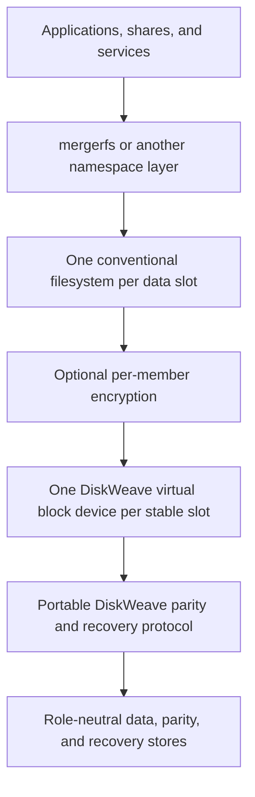
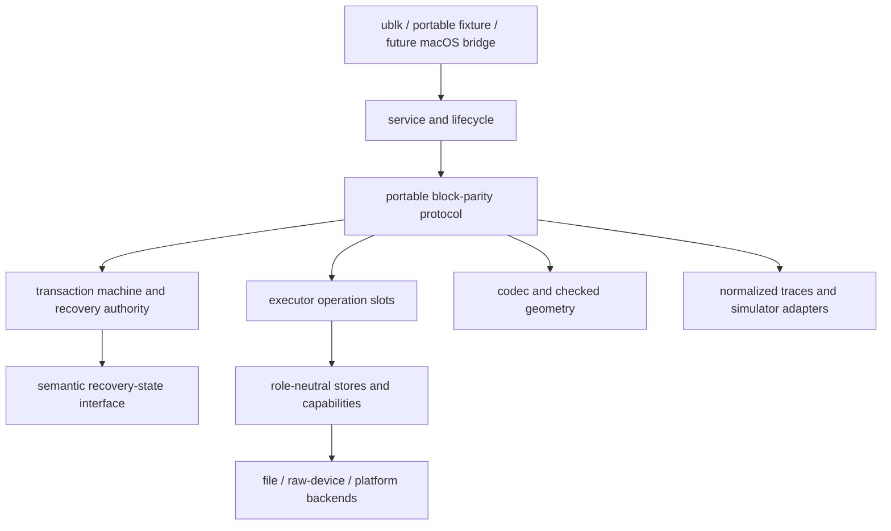
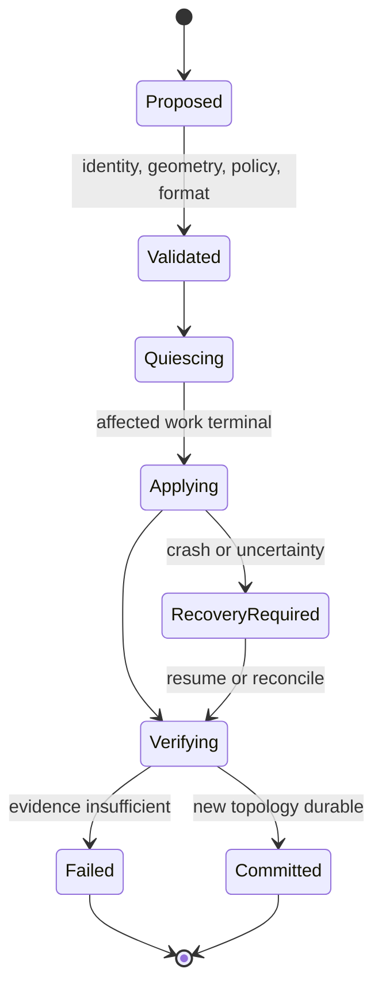
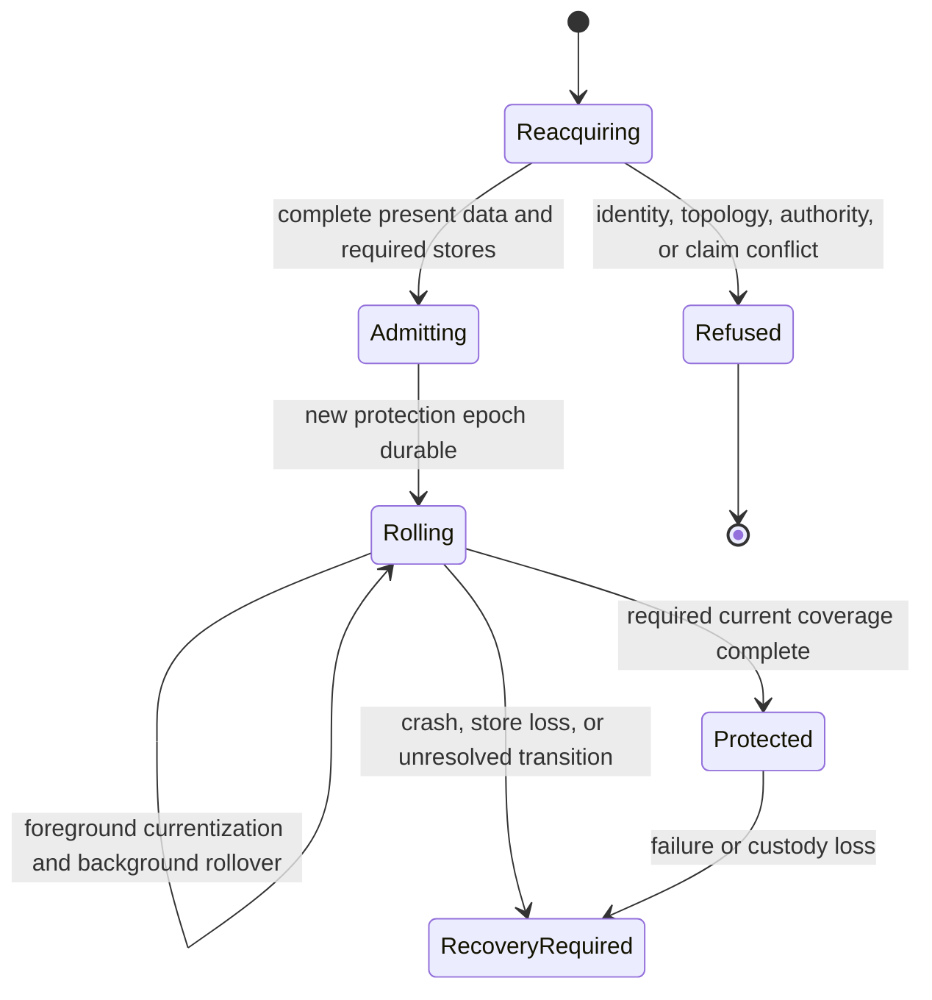
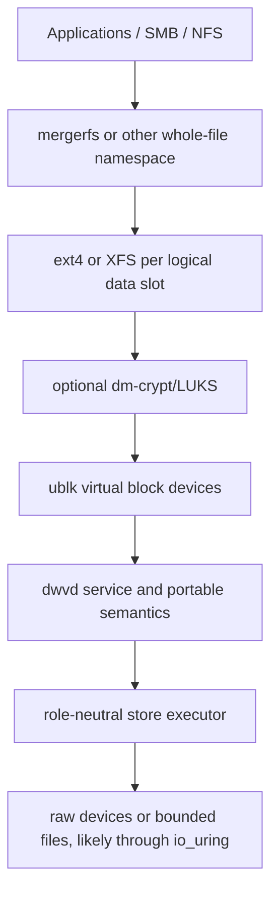

# DiskWeave Architecture v0.9

**Status:** Content-final non-authoritative candidate pending canonical OpenSpec reconciliation and activation  
**Version relationship:** Content-final successor to v0.9-beta3 and intended cumulative successor to the accepted v0.8 architecture after canonical reconciliation and activation; v0.8 remains active until that cutover, while earlier v0.9 candidates and the v0.9 architecture review are historical rationale  
**Audience:** OpenSpec authors, implementation agents, maintainers, recovery-tool authors, and reviewers  
**Product:** DiskWeave  
**CLI:** `dwv`  
**Daemon:** `dwvd`  
**Product boundary:** Conventional independently readable member filesystems protected by a portable block-parity engine

Current required product behavior remains canonical only under `openspec/specs/*/spec.md`. This candidate guides later reconciliation; it does not silently override a conflicting canonical requirement. The terms **must**, **must not**, **should**, and **may** express candidate architecture commitments, not current OpenSpec requirements or an implementation plan.

This document uses four decision postures:

- **Proposed architecture commitment:** a semantic decision that this candidate proposes v0.9 should preserve unless later evidence reopens it;
- **Provisional mechanism:** a preferred, replaceable implementation behind a stable semantic boundary;
- **Validation target:** a claim that requires platform or executable evidence before adoption;
- **Deferred profile:** a coherent future possibility that must not add present baseline obligations.

## Executive decision

DiskWeave remains a **portable parity-protected virtual block storage engine**, not a custom filesystem. It exposes one virtual block image per stable data slot while preserving one conventional, independently understandable filesystem or encrypted block image on each healthy data member. A replaceable namespace layer may merge those filesystems, but namespace and placement do not become parity or recovery authority.

v0.9 adds one missing correctness dimension: **protection authority is not implied by topology identity or by a parity equation that happens to match**. After a reboot, shutdown, detached-member interval, or other unproved custody gap, DiskWeave may still know which array and slots it is looking at. It does not automatically know that existing parity protects the bytes now present. It establishes typed store-scoped admission stabilization for visible pre-admission effects, starts a new protection epoch, permits read/write publication of the admitted present data without an exhaustive payload scan when the complete unambiguous writable topology is available, and establishes current protection by bounded range. Historical artifacts remain bound to the exact prior generations and roles they actually describe: some validate or authorize a historical claim, while retained parity, old data, or another copy may also supply reconstruction material.

The architecture therefore keeps separate:

1. array and topology lineage;
2. current writer ownership;
3. custody continuity;
4. range-local parity basis;
5. integrity evidence;
6. recovery meaning.

DiskWeave never uses historical or otherwise non-current parity as the incremental starting point for a protected current write. A first write to a range without current protection reads the required present data and calculates every required parity role from that present basis. Background work performs the same transition for untouched ranges.

Normal active-epoch degraded reads retain the accepted v0.8 known-erasure contract. A committed current parity basis, exact topology and generations, clean or replay-proven range state, one known erasure within the selected code tolerance, and admissible surviving sources authorize reconstruction under that declared failure model. A target checksum provides stronger independent validation but is not a universal prerequisite for every ordinary single-erasure read. By contrast, parity from a prior epoch can only produce a historical candidate; historical target or equivalent complete generation-specific evidence must justify the historical version claimed.

Unknown bytes remain explicit. Repair and rebuild preserve good sources and write separate targets before promotion. A mixture of current, historical, and unknown ranges is a salvage artifact, not a normal member. Loss of genuine information remains possible: an offline change that existed only on one member can be lost if that member fails before the change enters a current protection basis or another copy.

The central containment invariant is:

> **After DiskWeave recognizes a custody gap, a post-gap member change may affect accepted reconstruction of another member only after that change has entered a committed current protection basis for the coded range.**

This contains DiskWeave-caused amplification without claiming the impossible. Raw members cannot prove that privileged software did not bypass DiskWeave during an active epoch. Stronger continuity requires a non-bypassable managed-member proxy or a narrowly certified hardware or operating-system mechanism.

## Decision at a glance

| Area | v0.9 decision | Posture |
|---|---|---|
| Product | Portable block parity beneath conventional per-member filesystems or encrypted block images | Proposed architecture commitment |
| Data members | No required DiskWeave metadata in ordinary data payloads; healthy payloads remain directly understandable | Proposed architecture commitment |
| Namespace | Whole-file pooled namespace remains separate and replaceable; no file striping | Proposed architecture commitment |
| Portable core | Frontend-neutral block, store, transaction, integrity, recovery, and simulation semantics | Proposed architecture commitment |
| Authority | Lineage, writer ownership, custody continuity, protection basis, integrity evidence, and recovery meaning are separate claims | Proposed architecture commitment |
| Restart | Default reboot or shutdown creates a custody gap; complete unambiguous arrays may regain read/write present-data service without an exhaustive payload scan after writer claim and typed admission stabilization, through a new protection epoch | Proposed architecture commitment |
| Protection rollover | Per-range, per-parity-role transition from prior or unprotected basis to current basis, on first write and in the background | Proposed architecture commitment |
| Writes | Non-current parity is never an incremental basis for a protected current write | Proposed architecture commitment |
| Degraded reads | Current-basis known-erasure recovery preserves v0.8 authority rules; prior-basis recovery needs historical version evidence | Proposed architecture commitment |
| Integrity | Data and parity checksums remain generation-bound independent evidence; prior valid records may remain historical evidence | Proposed architecture commitment |
| Repair/rebuild | Sources remain unchanged; separate target, readback, verification, and explicit promotion | Proposed architecture commitment |
| Linux | ublk remains the preferred frontend; io_uring remains a replaceable backend mechanism | Provisional mechanism |
| macOS | Regular-file fixture and normalized trace are the current baseline; a live bridge remains a validation target, not a selected dependency | Validation target |
| Transaction engine | Explicit deterministic transaction machine remains the correctness oracle and current production baseline; procedural engine remains isolated comparison evidence | Provisional mechanism aligned with current ADR |
| Recovery state | Operationally authoritative store behind `RecoveryStateStore`; SQLite remains provisional | Proposed semantics / provisional mechanism |
| Parity envelope | Simple parity payload; two bounded redundant envelope copies remain the provisional format-experimental baseline | Provisional mechanism |
| Simulation | Deterministic semantic and media-fault evidence remains first-class and independent of production runtimes | Proposed architecture commitment |
| Stable format | No stable format claim before independent decode, recovery, migration, and crash evidence | Proposed architecture commitment |
| Stronger profiles | Managed members, shadow history, mediated standalone write sessions, and hardware continuity remain bounded future profiles | Deferred profiles |

## What happens to my bytes?

| Question | v0.9 answer |
|---|---|
| What happens to healthy surviving bytes? | DiskWeave leaves present data in place. It does not overwrite a surviving member merely because it differs from historical parity or a historical checksum. |
| What happens after reboot? | DiskWeave reacquires and claims the accepted topology, establishes typed stabilization for pre-admission effects on every required store, starts a new protection epoch, publishes the complete admitted present-data set read/write without an exhaustive payload scan, and rolls protection forward by bounded range. |
| What if a member changed outside DiskWeave? | The selected present bytes remain the admitted bytes served for that member; admission is not proof that they are semantically correct or historically continuous. A difference from history is reported as a difference, not automatically as corruption. The range becomes currently protected only after currentization. |
| What if a disk fails before rollover finishes? | Current ranges can reconstruct current bytes under the declared erasure model. Prior ranges may recover a named prior version when generation-specific evidence proves it. Other ranges remain unknown. Latest unprotected offline changes on the failed member may be lost. |
| Can an external change on one member corrupt reconstruction of another? | It cannot enter an accepted reconstruction merely through stale parity. Before currentization it remains outside current protection; after currentization it is part of the admitted current protection basis and cancels correctly in reconstruction. |
| Does parity prove which bytes are correct? | No. Parity proves an equation for a named basis. Integrity evidence and recovery state determine which version and sources the equation is allowed to support. |
| When am I protected again? | Protection coverage increases on first write and in the background. Status reports current parity coverage separately from integrity coverage and prior-version recoverability. |
| What if DiskWeave metadata is gone? | Surviving data remains ordinary. The v0.9 baseline has no executable prior-lineage recovery profile after authority loss; retained manifests, replicas, and similar artifacts remain inspection or historical-recovery candidates unless a later named profile defines complete producer, validator, freshness, rollback, and conflict semantics. An operator may instead explicitly adopt a complete selected present-data set into a new lineage without claiming historical continuity. |

# 1. Purpose, scope, and authority

This document defines the intended whole-system DiskWeave architecture. It carries forward the consequential architecture established through v0.8 and revises it where the v0.9 investigation found a real gap: reacquisition after present members may have diverged from the last protected state.

The architecture covers:

- the product, storage, and recovery model;
- frontend-neutral semantic contracts;
- physical-store, topology, identity, and authority boundaries;
- coding, parity, integrity, durability, and persistent recovery state;
- transaction and executor ownership;
- normal startup, custody gaps, and protection rollover;
- healthy and degraded I/O, scrub, repair, rebuild, restore, and salvage;
- namespace, deployment, Linux, and macOS boundaries;
- deterministic simulation, verification, evidence, and format governance;
- explicit non-goals and future-profile boundaries.

It deliberately does not allocate OpenSpec work, requirement IDs, milestones, crate structure, or reversible implementation choices. Current OpenSpecs remain product authority until later reconciliation adopts some or all of this architecture.

## 1.1 Product objective

DiskWeave targets these user-visible properties:

- heterogeneous data members contribute independent capacity;
- each regular file lives wholly on one conventional member filesystem rather than being striped across members;
- each healthy data member contains an ordinary block image such as ext4, XFS, LUKS, or APFS that remains independently recoverable;
- one parity role initially, and optionally P/Q under a separately defined coding profile, protects corresponding logical byte ranges in real time;
- healthy reads normally touch only the selected data member;
- writes update data, parity, recovery state, and integrity validity through one explicit durability protocol;
- a known-missing range is reconstructed only when topology, range state, source admissibility, and the relevant protection basis support the claim;
- mergerfs or another replaceable namespace layer may present a pooled tree without becoming parity truth;
- Linux is the production target, while portable file-backed operation and macOS evidence prove separation from the Linux frontend;
- deterministic simulation, normalized traces, independent recovery tools, and platform-specific tests bound every safety claim.

## 1.2 Version and claim boundary

v0.9 is warranted because v0.8 had no architectural state for a parity range that was authoritative for a prior protected generation but not yet authoritative for the present bytes. v0.8 could describe a clean or dirty managed session and could fail closed after authority loss, but it could not simultaneously provide:

- ordinary reboot as a common event;
- fast healthy read/write restart;
- ordinary raw members that can be written elsewhere;
- preservation of potentially legitimate present changes;
- historical recovery evidence;
- containment of stale-parity amplification.

v0.9 does not replace v0.8's portable storage architecture with a recovery subsystem. It adds protection epochs and range-local basis to the existing topology, recovery-state, integrity, transaction, and failure model.

## 1.3 Architecture claim discipline

Every consequential claim must identify:

- the fact being claimed;
- the evidence and authority that support it;
- the range, target, topology, generation, and store incarnation to which it applies;
- the weaker evidence that must not be confused with it;
- the failure or crash result when proof is missing.

A semantic state is not promoted because it is likely, because an equation matches, or because the optimistic result is operationally convenient.

# 2. Product, storage, and recovery model

## 2.1 Block parity beneath conventional filesystems

DiskWeave protects complete logical member images below their filesystems.



DiskWeave sees filesystem metadata, journals, allocation state, encrypted output, unused blocks visible at the block boundary, and ordinary file data as bytes. It does not infer filesystem intent. A block that differs from history may be a legitimate offline filesystem update, corruption, or both in different ranges.

A file-aware parity design would need to own or emulate namespace, allocation, inode identity, hard links, xattrs, ACLs, sparse extents, reflinks, rename, mmap, fsync, directory ordering, and crash recovery. DiskWeave intentionally does not take that responsibility. A namespace implementation may use FUSE, but FUSE is not the parity authority boundary.

## 2.2 Ordinary data-member contract

An ordinary data payload is a byte-for-byte conventional block image. DiskWeave requires no header, trailer, hidden tail, sidecar, GPT metadata partition, in-filesystem marker, or reserved metadata extent in that payload.

Consequences:

- a healthy stopped member may be attached read-only with ordinary filesystem or encryption tooling;
- loss of DiskWeave software does not make surviving data proprietary;
- data-member recovery does not depend on `control.sqlite3`;
- loss of authoritative recovery state can block ordinary writable assembly and degraded recovery without blocking direct inspection of surviving payloads;
- raw data members cannot self-report or prevent out-of-band writes;
- direct read/write access outside a mediated or certified continuity profile creates a custody gap and invalidates unqualified current-protection claims.

DiskWeave should publish format documentation and maintain an independent, slow reference tool able to inspect parity envelopes, verify equations, interpret exported recovery evidence, rebuild parity from complete data, and export recovery candidates without the production daemon.

## 2.3 Stable logical slots and whole-file namespace

DiskWeave exposes one virtual block image for each stable logical data slot. A conventional filesystem is created on that virtual member. Files remain whole on one member filesystem. The namespace layer may merge directory trees and select a member for a new file, but it does not stripe file extents or determine parity coding positions.

A stable logical slot may move from one physical store to another through an explicit replacement transaction. The namespace and filesystem continue to refer to the logical member; topology records which physical assignment currently implements it.

## 2.4 Separate persistence classes

DiskWeave distinguishes four persistence classes:

1. **Declarative desired policy.** Expected members, locators, names, and deployment choices help discover and present an array. They are not historical authority.
2. **Ordinary data payloads.** These contain the user-visible member images and remain directly understandable.
3. **Correctness-critical recovery state.** This records array and topology lineage, assignments, protection epochs and range basis, dirty and indeterminate state, integrity generations, checkpoints, and maintenance progress. It is operationally authoritative while the array is writable.
4. **Reconstructible management state.** UI history, cached discovery, performance observations, and similar control data may be recreated without changing storage truth.

`array.sqlite3` is the provisional implementation of correctness-critical recovery state behind a semantic `RecoveryStateStore` boundary. `control.sqlite3` is reconstructible management state and has no safety authority.

## 2.5 Recovery promise

The defining recovery promise remains:

> A healthy data payload remains a conventional byte image. DiskWeave may be absent, broken, or permanently unavailable without making that payload proprietary.

DiskWeave adds parity recovery only when it can name the version reconstructed and support that claim with the applicable authority and evidence. It does not silently trade ordinary data access for a stronger proprietary recovery format.

## 2.6 DiskWeave is not a backup or snapshot

Parity does not protect against deletion, malware, mistaken overwrite, encryption-key loss, theft, fire, enclosure-wide destruction, malicious privileged writes, stale external snapshots, or failures beyond the selected coding profile.

The ordinary-member baseline does not preserve a coherent old filesystem snapshot after current writes advance. Historical checksums preserve evidence, not bytes. A complete prior version remains recoverable only while enough old parity and old operands, an external copy, or an optional history mechanism still exists.

## 2.7 Product-family boundaries and non-goals

The baseline architecture does not own:

- a custom filesystem namespace;
- an extent allocator, inode or object graph, snapshot, reflink, or COW model;
- per-file or per-object protection policy;
- a distributed or multi-host writer protocol;
- tolerance of malicious administrators forging trusted recovery metadata;
- automatic repair from an unexplained parity mismatch;
- production degraded writes;
- a stable persistent format before independent recovery and migration evidence;
- a universal transaction, effect, allocator, or storage-framework abstraction;
- a mandatory managed-member container, shadow history, or special hardware profile.

A future product that assumes those responsibilities requires a separate approved architecture with its own recoverability contract, format, tools, coexistence and migration rules, and evidence gates. It is not a hidden mode of the DiskWeave block-parity product.

# 3. Architectural invariants

The following marked invariants are the stable constitutional units of this candidate. Their `arch.*` identities are intended to survive later architecture revisions when the same semantic contract continues. The `constrains` markers identify current canonical requirements that must be reviewed against the candidate; they do not make this candidate current product authority.

## Invariant: Conventional-member block parity remains the product boundary
<!-- dwv:arch-invariant arch.diskweave.conventional-member-block-parity -->
<!-- dwv:constrains req.architecture-contract.diskweave-protects-conventional-member-images-at-block-level -->
<!-- dwv:constrains req.architecture-contract.data-payloads-and-protection-metadata-remain-separate -->
<!-- dwv:constrains req.healthy-portable-io.portable-members-remain-ordinary-and-control-state-is-disposable -->

DiskWeave protects complete conventional member images below their filesystems; healthy data payloads need no DiskWeave metadata; regular files remain whole on one member filesystem; namespace placement is not parity or recovery authority.


## Invariant: Portable semantics use role-neutral substrates
<!-- dwv:arch-invariant arch.diskweave.portable-semantics-use-role-neutral-substrates -->
<!-- dwv:constrains req.architecture-contract.portable-semantics-are-independent-of-implementation-mechanisms -->
<!-- dwv:constrains req.store-operation-contracts.stores-report-exact-range-outcomes-and-persistence-evidence -->
<!-- dwv:constrains req.xor-reference-model.reference-vectors-and-the-future-p-q-seam-are-portable -->

Portable block, parity, durability, integrity, recovery, transaction, and evidence semantics do not depend on platform/runtime/database mechanisms; lower store, codec, and executor seams do not acquire DiskWeave topology, role, namespace, or recovery authority.


## Invariant: Authority dimensions remain distinct
<!-- dwv:arch-invariant arch.diskweave.authority-dimensions-remain-distinct -->
<!-- dwv:constrains req.architecture-contract.identity-and-topology-authority-are-explicit-and-conservative -->
<!-- dwv:constrains req.architecture-contract.durable-authority-and-uncertainty-are-not-inferred -->
<!-- dwv:constrains req.dirty-integrity-invalidation.dirty-and-integrity-session-dimensions-remain-independent -->
<!-- dwv:constrains req.checksum-plane.validity-is-generation-bound -->
<!-- dwv:constrains req.file-backed-stores.single-writer-ownership-and-endpoint-aliasing-are-explicit -->

Array/topology lineage, current writer ownership, custody continuity, range protection basis, integrity evidence, and recovery meaning are distinct claims; evidence for one does not authorize another.


## Invariant: Identity ambiguity fails closed
<!-- dwv:arch-invariant arch.diskweave.identity-ambiguity-fails-closed -->
<!-- dwv:constrains req.architecture-contract.identity-and-topology-authority-are-explicit-and-conservative -->
<!-- dwv:constrains req.anchorless-topology-identity.identity-evidence-is-assessed-from-multiple-observations -->
<!-- dwv:constrains req.anchorless-topology-identity.topology-validation-rejects-ambiguous-or-inconsistent-assignments -->
<!-- dwv:constrains req.anchorless-topology-identity.writable-assembly-fails-closed-on-unresolved-identity -->

No single path, identifier, physical observation, collection order, policy locator, or parity equation resolves ambiguous identity or assignment; unresolved evidence blocks writable assignment and destructive choice while preserving bounded inspection.


## Invariant: Writable service has one mediated writer
<!-- dwv:arch-invariant arch.diskweave.writable-service-has-one-mediated-writer -->
<!-- dwv:constrains req.file-backed-stores.single-writer-ownership-and-endpoint-aliasing-are-explicit -->
<!-- dwv:constrains req.macos-bridge-feasibility.backing-and-exported-endpoints-cannot-alias -->
<!-- dwv:constrains req.linux-ublk-frontend.assembly-and-shutdown-preserve-ownership-and-recovery-authority -->
<!-- dwv:constrains req.healthy-portable-io.portable-members-remain-ordinary-and-control-state-is-disposable -->
<!-- dwv:constrains req.normalized-block-semantics.adapters-expose-bounded-deterministic-conformance-behavior -->

Writable publication requires an all-or-nothing live writer claim over every required store, and no exported writable endpoint aliases or bypasses its backing payload while service is active.


## Invariant: Custody gaps open new protection epochs
<!-- dwv:arch-invariant arch.diskweave.custody-gaps-open-new-protection-epochs -->
<!-- dwv:constrains req.healthy-portable-io.assembly-and-request-admission-are-bounded-and-identity-safe -->
<!-- dwv:constrains req.operator-recovery.start-composes-admission-and-actual-publication -->
<!-- dwv:constrains req.store-operation-contracts.capability-evidence-determines-the-allowed-safety-profile -->
<!-- dwv:constrains req.store-operation-contracts.stores-report-exact-range-outcomes-and-persistence-evidence -->

When custody continuity cannot be proved, accepted lineage may survive but unqualified prior current-protection claims do not. Writable baseline admission requires exclusive current writer ownership and typed store-scoped stabilization of the admitted present state for every required store; only after those results are durably bound to a new protection epoch may read/write publication occur.


## Invariant: Unproved lineage requires explicit new lineage
<!-- dwv:arch-invariant arch.diskweave.unproved-lineage-requires-explicit-new-lineage -->
<!-- dwv:constrains req.metadata-loss-recovery.identity-and-topology-ambiguity-fails-closed -->
<!-- dwv:constrains req.metadata-loss-recovery.fresh-recovery-state-records-a-new-baseline-and-audit -->
<!-- dwv:constrains req.operator-recovery.declarative-array-policy-locates-but-does-not-authorize -->

Policy, expected identity, readable present data, and parity agreement cannot manufacture prior array lineage; without independent lineage authority, writable adoption of selected present data creates fresh array/topology identity and makes no prior-membership or historical-continuity claim.


## Invariant: Protection basis is range-local and role-specific
<!-- dwv:arch-invariant arch.diskweave.protection-basis-is-range-local-and-role-specific -->
<!-- dwv:constrains req.recovery-state-semantics.recovery-transactions-are-generation-checked-and-atomic -->
<!-- dwv:constrains req.recovery-state-semantics.semantic-export-and-health-are-independent-of-storage-engine-layout -->
<!-- dwv:constrains req.dirty-integrity-invalidation.dirty-and-integrity-session-dimensions-remain-independent -->
<!-- dwv:constrains req.degraded-read-offline-rebuild.degraded-read-eligibility-is-explicit-and-fail-closed -->

Each parity role's authority is independently classified per bounded range and exact topology/protection generation as current, prior, unprotected, or indeterminate; basis remains separate from dirty, integrity, availability, and maintenance state.


## Invariant: Current protection gates cross-member propagation
<!-- dwv:arch-invariant arch.diskweave.current-protection-gates-cross-member-propagation -->
<!-- dwv:constrains req.healthy-portable-io.writes-follow-the-reference-transaction-and-update-single-xor-parity -->
<!-- dwv:constrains req.degraded-read-offline-rebuild.degraded-read-eligibility-is-explicit-and-fail-closed -->

Non-current parity is never an incremental basis for a protected current write, and a post-gap member change may affect accepted reconstruction of another member only after that change enters a committed current basis for the coded range.


## Invariant: Recovery meaning is explicit and unmixed
<!-- dwv:arch-invariant arch.diskweave.recovery-meaning-is-explicit-and-unmixed -->
<!-- dwv:constrains req.degraded-read-offline-rebuild.known-erasure-reads-reconstruct-exact-requested-bytes -->
<!-- dwv:constrains req.degraded-read-offline-rebuild.rebuild-resumes-and-completes-only-after-full-verification -->
<!-- dwv:constrains req.operator-recovery.production-assessment-is-observational-and-multidimensional -->
<!-- dwv:constrains req.metadata-loss-recovery.the-metadata-loss-matrix-is-total-and-conservative -->

Recovered bytes are classified as exact current, exact historical for one named recovery point, or unknown; a normal current member or historical view cannot silently mix these meanings, and mixed/unknown output remains a separate non-normal artifact.


## Invariant: Historical evidence remains generation-bound
<!-- dwv:arch-invariant arch.diskweave.historical-evidence-remains-generation-bound -->
<!-- dwv:constrains req.checksum-plane.checksum-coverage-names-targets-and-extents -->
<!-- dwv:constrains req.checksum-plane.validity-is-generation-bound -->
<!-- dwv:constrains req.checksum-plane.invalidation-precedes-data-parity-write -->

Historical artifacts remain valid only for the exact target, range, topology, profile, and named generations they actually describe; they are never relabeled current. Artifact role is explicit: validator evidence may accept or reject candidate bytes without supplying them, while retained parity, old data, or another copy may supply reconstruction material only under its exact historical bindings and applicable authority.


## Invariant: Algebraic possibility is not authority
<!-- dwv:arch-invariant arch.diskweave.algebraic-possibility-is-not-authority -->
<!-- dwv:constrains req.architecture-contract.recovery-and-repair-never-promote-algebraic-possibility-to-authority -->
<!-- dwv:constrains req.evidence-boundaries.unknown-and-ambiguous-evidence-fail-closed -->
<!-- dwv:constrains req.degraded-read-offline-rebuild.degraded-read-eligibility-is-explicit-and-fail-closed -->
<!-- dwv:constrains req.parity-verification-repair.mismatch-classification-requires-independent-evidence -->

Known erasure is distinct from unknown corruption; matching or solvable parity cannot by itself authorize current/historical data, identify a bad source, clear uncertainty, or permit repair.


## Invariant: Recovery preserves source evidence
<!-- dwv:arch-invariant arch.diskweave.recovery-preserves-source-evidence -->
<!-- dwv:constrains req.degraded-read-offline-rebuild.offline-rebuild-writes-only-a-separate-replacement-target -->
<!-- dwv:constrains req.parity-verification-repair.selective-repair-is-separately-targeted-and-verified -->
<!-- dwv:constrains req.checksum-scrub-verified-repair.repairs-use-a-separate-target-and-verified-readback -->
<!-- dwv:constrains req.degraded-read-offline-rebuild.known-erasure-reads-reconstruct-exact-requested-bytes -->

Present surviving bytes and sole surviving recovery sources are not rewritten merely because they differ from history or because capacity reuse is convenient. Degraded reads do not mutate sources. Repair, rebuild, restore, currentization, and new-lineage adoption preserve good sources and the last artifact required by any retained recovery claim unless preservation responsibility has first moved to a separately verified retained copy, a durable claim-retirement transition is authorized by the selected retention profile, or a separate explicit abandonment action authorizes the loss.


## Invariant: Recovery claims do not outlive required material
<!-- dwv:arch-invariant arch.diskweave.recovery-claims-do-not-outlive-required-material -->

Before DiskWeave destroys or garbage-collects the last validator, reconstruction operand, or authority-bearing artifact required by an advertised recovery claim, it durably transfers preservation responsibility to an independently verified retained copy or durably narrows or retires that claim first. Crash recovery may conservatively underclaim recoverability; it must not preserve a plausible claim whose required material may already have been destroyed.


## Invariant: Crash safety is evidence-ordered
<!-- dwv:arch-invariant arch.diskweave.crash-safety-is-evidence-ordered -->
<!-- dwv:constrains req.dirty-integrity-invalidation.write-recovery-record-precedes-data-parity-write -->
<!-- dwv:constrains req.store-operation-contracts.store-write-watermarks-are-real-monotonic-evidence -->

Durable write-recovery records, integrity invalidation, transition records, and applicable generation changes precede dependent data/parity mutation; clean, current, or valid promotion requires exact matching generations and target-scoped durability evidence; missing or uncertain evidence remains conservative.


## Invariant: Abandonment does not end operation ownership
<!-- dwv:arch-invariant arch.diskweave.abandonment-does-not-end-operation-ownership -->
<!-- dwv:constrains req.normalized-block-semantics.frontend-lifecycle-events-have-explicit-abandonment-semantics -->
<!-- dwv:constrains req.store-operation-contracts.operation-slots-own-backend-lifetimes-and-generations -->

Cancellation or frontend abandonment changes result delivery only; work that may have crossed an irreversible boundary remains owned until exact terminal completion, durable recovery handoff, or explicit reconciliation permits reclamation.


## Invariant: Correctness resources are bounded and observable
<!-- dwv:arch-invariant arch.diskweave.correctness-resources-are-bounded-and-observable -->
<!-- dwv:constrains req.security-boundaries.hostile-inputs-and-resources-are-bounded-before-admission -->
<!-- dwv:constrains req.store-operation-contracts.resource-admission-and-identity-remain-bounded-and-explicit -->
<!-- dwv:constrains req.normalized-block-semantics.adapters-expose-bounded-deterministic-conformance-behavior -->
<!-- dwv:constrains req.linux-ublk-frontend.kernel-tags-and-operation-resources-remain-bounded-and-generation-safe -->
<!-- dwv:constrains req.evidence-boundaries.verification-artifacts-are-deterministic-and-bounded -->

Correctness-relevant work admits only within declared finite resource bounds; exhaustion, backpressure, or refusal is explicit before unsafe mutation, and required evidence is not silently discarded to free capacity.


## Invariant: Semantic granularities remain independent
<!-- dwv:arch-invariant arch.diskweave.semantic-granularities-remain-independent -->
<!-- dwv:constrains req.normalized-block-semantics.requests-have-validated-frontend-neutral-semantics -->
<!-- dwv:constrains req.store-operation-contracts.capability-evidence-determines-the-allowed-safety-profile -->
<!-- dwv:constrains req.xor-reference-model.xor-parity-uses-explicit-protected-geometry -->
<!-- dwv:constrains req.dirty-integrity-invalidation.dirty-region-coverage-is-complete-and-checked -->
<!-- dwv:constrains req.checksum-plane.checksum-coverage-names-targets-and-extents -->

Request, physical-store, codec/protection, dirty-region, checksum, lock, and batching geometries retain explicit independent meaning; equality or alignment in one is not authority to derive the others from one constant.


## Invariant: Claims remain evidence-tier specific
<!-- dwv:arch-invariant arch.diskweave.claims-remain-evidence-tier-specific -->
<!-- dwv:constrains req.evidence-boundaries.evidence-scope-is-explicit -->

Model, simulator, file-backed, platform-integration, and hardware evidence establish different facts; no lower evidence tier silently certifies a stronger platform or durability claim.


## Invariant: Format interpretation fails closed
<!-- dwv:arch-invariant arch.diskweave.format-interpretation-fails-closed -->
<!-- dwv:constrains req.architecture-contract.recovery-and-repair-never-promote-algebraic-possibility-to-authority -->
<!-- dwv:constrains req.recovery-state-semantics.semantic-schema-migrations-and-exports-are-versioned-independently-of-sqlite -->
<!-- dwv:constrains req.parity-envelope-profiles.envelope-profiles-remain-experimental-and-capacity-safe -->

Persistent readers require an identified format family, supported required features, bounded valid geometry, and unambiguous integrity before writable interpretation; unknown, incompatible, malformed, or conflicting state fails closed while safe bounded read-only inspection may remain possible.


## Invariant: Stable-format claims require independent recovery
<!-- dwv:arch-invariant arch.diskweave.stable-format-claims-require-independent-recovery -->

DiskWeave does not declare a stable persistent format until documented independent tooling can decode, inspect, recover, migrate through interruption, and exercise damaged/unknown cases without production-daemon private state.

## Anti-speculative architecture discipline

New generic machinery needs a concrete accepted consumer and must not obscure DiskWeave-specific authority, durability, or failure behavior. v0.9 does not add placeholder fields, APIs, crates, feature flags, persistent reserves, or generalized abstractions for managed members, shadow history, standalone sessions, degraded writes, or hardware continuity.

# 4. System layering, components, and ownership

## 4.1 Reusable media substrate and DiskWeave protocol

DiskWeave keeps a narrow reusable substrate below the product-specific parity protocol.

```text
reusable media substrate:
    checked coding and geometry primitives
    random-access stores, identity observations, and capabilities
    operation-slot resource ownership
    backend adapters and completion/durability evidence
    deterministic low-level media and fault model
    normalized trace and evidence-envelope utilities

DiskWeave block-parity protocol:
    normalized BlockRequest and stable logical slots
    immutable topology snapshots and positional parity mapping
    global parity-address coordination
    recovery, protection-epoch, dirty, and integrity generations
    degraded-read, scrub, repair, rebuild, and salvage policy
    whole-file namespace placement boundary
```

The lower layer does not acquire product roles merely to appear reusable. The product layer does not become a generic storage framework. A new abstraction belongs below the protocol only when it has a current consumer, makes ownership or correctness clearer, and remains role-neutral.

## 4.2 Major components

The architecture has these semantic components:

### Portable block and parity core

- validates normalized block requests;
- captures immutable topology and protection snapshots;
- splits requests at semantic boundaries;
- plans healthy, reconstruct, RMW, or fresh-basis operations;
- emits deterministic semantic actions;
- consumes normalized results;
- classifies terminal success, refusal, failure, or uncertainty.

### Coding and geometry

- implements checked XOR and later explicit coding profiles;
- handles zero-extension and heterogeneous member lengths;
- remains independent of physical discovery and recovery authority.

### Recovery and integrity authority

- owns topology, assignment, protection-epoch, range-basis, dirty, mutation, checksum, checkpoint, and maintenance state;
- validates generation-bound transitions;
- refuses optimistic recovery after incomplete or conflicting evidence.

### Executor and operation slots

- admits work only when bounded resources exist;
- owns buffers, submissions, child identities, completion records, fences, and drain state;
- keeps ownership after frontend abandonment or transaction-machine completion until backend effects are terminal or handed to recovery.

### Store adapters

- expose exact bounded reads, writes, zeroing, flushing, and capability evidence;
- translate platform completion into normalized outcomes without inventing durability.

### Frontends and service orchestration

- translate ublk, portable fixture, or future bridge requests into normalized semantics;
- enforce publication, quiescence, shutdown, and writer-claim lifecycle;
- do not define parity, recovery, or crash rules.

### Namespace and control plane

- expose whole-file pooled namespace and operator actions;
- remain replaceable and subordinate to storage authority.

### Simulation and evidence tooling

- exercise semantic actions, backend faults, crash points, concurrency schedules, trace replay, and independent recovery interpretation;
- remain separate from production mechanism choices.

## 4.3 Dependency direction

Dependencies point from product and platform edges toward portable semantic boundaries:



Platform types, database handles, runtime tasks, and transaction-library types do not cross into the public portable semantics. Persistent formats do not serialize private Rust layouts.

## 4.4 Process and privilege model

`dwvd` owns parity service and correctness-critical lifecycle. The namespace layer may be a separate process. Management and UI processes communicate through a bounded local control interface and do not obtain raw writable store handles.

Before writable publication, the service:

1. opens candidate stores through stable handles;
2. records identity observations from the opened objects;
3. validates geometry, capacity, alignment, and payload bounds;
4. claims every store required by the active service profile;
5. rechecks identity and non-aliasing where supported;
6. reconciles recovery and protection state;
7. prevents automount or direct writable aliases as far as the platform permits;
8. publishes virtual members only after the applicable admission state is durable.

Privilege should be split where practical, but privilege separation may not create two independent owners of recovery authority or store lifetime.

## 4.5 Transaction ownership versus physical ownership

The transaction machine owns semantic progress: which action is required next and what evidence allows a state transition. The executor owns physical lifetime: buffers, tags, backend submissions, completions, and fences.

Dropping a future, request object, frontend connection, or transaction-machine value never proves that submitted I/O did not occur. Cancellation is represented as an input or delivery decision. Any operation that may have mutated media remains owned until:

- exact terminal completion is known;
- uncertain completion is durably represented and scheduled for reconciliation; or
- a recovery handoff owns the remaining obligation.

## 4.6 Deterministic transaction machine

The portable transaction machine is explicit, deterministic, and externally driven. It emits semantic actions and consumes normalized results. It owns no ambient I/O, database connection, runtime, operation slot, buffer, or durability mechanism.

The explicit reference machine remains the correctness oracle and current production baseline. The isolated `procmachines` candidate is comparison evidence only. No architecture depends on adopting it, and it must not enter runtime or service paths without a later evidence-backed decision.

DiskWeave may use narrow typed authority ports at correctness boundaries. It does not introduce a general effect-system framework merely to encode ordinary I/O.

## 4.7 Unsafe and parsing boundaries

Unsafe code, ioctl bindings, kernel-facing memory registration, direct-I/O alignment, and persistent-format parsers stay in small auditable modules. Every parser has explicit size, count, recursion, allocation, checksum, feature, and compatibility bounds. Malformed metadata cannot allocate unbounded memory or trigger writable interpretation of an unknown format.

# 5. Stores, topology, identity, and authority

## 5.1 Physical store versus logical member

A physical store is a role-neutral addressable persistence endpoint. A logical member is an array role bound to a physical store by topology.

A store exposes:

- a stable opened handle for one store incarnation;
- bounded random-access operations;
- size and alignment;
- completion, flush, FUA, volatile-cache, discard, and zeroing capabilities;
- identity and failure-domain observations;
- exact outcomes, including partial and uncertain completion.

A topology binding gives that store meaning as a data slot, P role, Q role, recovery replica, or other accepted role. A backend never infers its role from path, device order, filename, or content pattern.

## 5.2 Orthogonal identifiers

The architecture distinguishes:

- **ArrayUuid:** one array lineage;
- **PhysicalStoreId:** one discovered store incarnation or accepted physical identity;
- **IdentityObservation:** serial, WWN, file ID, partition ID, filesystem UUID, capacity, path, enclosure, and similar evidence;
- **LogicalSlotUuid:** stable data-member identity visible to topology and frontend;
- **ParityRole:** P, Q, or another profile-defined role;
- **CodingPosition:** stable coefficient/position within a coding profile;
- **AssignmentId and assignment generation:** binding of one physical store to one logical role;
- **TopologyEpoch:** immutable logical membership and coding snapshot generation;
- **ProtectionEpoch:** one interval whose current-basis claims share an admitted custody and writer-ownership premise;
- **RangeBasisGeneration:** exact per-range/per-role protection transition generation;
- **Recovery generation:** recovery-state mutation/checkpoint authority;
- **Checksum-set and content generations:** integrity profile and target-content identity.

None substitutes for another. Replacing a physical disk retains the logical slot but creates a new assignment. Reordering discovery paths does not change coding positions. Starting a new protection epoch does not by itself create a new array lineage or topology epoch.

## 5.3 Immutable topology snapshots

Each admitted operation captures an immutable topology snapshot containing at least:

- array UUID and topology epoch;
- logical slots and parity roles;
- assignment IDs/generations and store incarnations;
- coding profile, positions, and protected lengths;
- parity payload bounds and envelope interpretation;
- required recovery and protection generations.

Plans and completions are rejected when the captured generations are stale. A topology transaction cannot reinterpret in-flight parity bytes under new positions or geometry.

## 5.4 Identity assessment

No single identity observation is infallible. DiskWeave compares multiple observations and returns a structured assessment such as exact accepted assignment, changed observation requiring review, missing store, replacement candidate, ambiguous clone, conflict, or unsupported identity evidence.

The assessment is deterministic and explainable. It is not an opaque confidence score. Two objects that could satisfy one assignment block writable assembly. The operator may inspect them read-only and create an explicit new assignment or lineage plan; DiskWeave does not choose the most convenient clone.

A path rename alone does not change identity. A disappearance and reappearance is a lifecycle event. A new object at the same path is not trusted as the old store.

## 5.5 Failure-domain observations

Controller, enclosure, power, transport, host, and physical-location observations inform placement warnings and redundancy reporting. They do not change coding math or turn inferred independence into a guarantee. Failure-domain claims state whether they are operator declarations, observed topology, or certified evidence.

## 5.6 Authority dimensions

DiskWeave treats these claims separately:

1. **Lineage authority:** which array, topology history, slots, assignments, and coding positions are accepted.
2. **Current writer ownership:** which process and host-side paths are allowed to mutate required stores now.
3. **Custody continuity:** whether all possible writes since a named protected point were mediated or prevented within a declared scope.
4. **Protection basis:** which exact data generation a parity role protects for a range.
5. **Integrity evidence:** which target bytes a digest or equivalent record describes.
6. **Recovery meaning:** whether candidate bytes represent the active current device, one named historical point, or an unknown mixture.

Evidence for one dimension does not authorize another. Policy can locate stores but cannot recreate lineage. A clean certificate can prove completion of a managed protocol but not absence of later external writes. A matching equation can prove current algebraic agreement but not historical continuity. A checksum can validate one target generation but cannot generate missing bytes.

## 5.7 Custody gaps

A **custody gap** is an interval for which DiskWeave cannot prove that all writes to the relevant raw members were mediated or prevented.

The default raw-member profile treats these as custody gaps:

- host shutdown or reboot;
- members detached from the controlled stack;
- direct read/write attachment outside DiskWeave;
- boot into another environment;
- loss of writer ownership or an untrusted ownership transition;
- return of a member after disappearance when continuity is not independently proved.

A daemon failure does not automatically imply a custody gap if host ownership remains enforceably continuous, but it does create crash-recovery obligations and may leave ranges dirty or indeterminate. Conversely, a clean shutdown certificate does not bridge a later powered-off interval.

A certified continuity profile may avoid a gap only when its evidence proves the exact stores, interval, write paths, persistence, anti-rollback properties, and failure behavior claimed. Automount prevention, an exclusive open, a device counter, or a host log is normally a useful detector or control, not proof of powered-off custody.

## 5.8 Array lineage versus content continuity

A custody gap does not automatically erase accepted array lineage. Durable recovery state and unambiguous store identity may still establish which array and topology are present. What is lost is the unqualified claim that the old current parity and integrity state still describe the bytes now on disk.

This distinction lets normal restart remain fast without pretending that identity proves content continuity.

## 5.9 Topology transactions

Add, replace, remove, resize, coding-profile change, and explicit lineage operations are planned transactions bound to:

- array UUID and source topology epoch;
- exact source and target assignments/generations;
- old and proposed payload geometry and coding positions;
- required quiescence and active protection epoch;
- recovery and rollback boundaries;
- verification evidence required before promotion.



A replacement is promoted only after its reconstructed or copied payload, integrity evidence, parity relationship, and topology commit are durably verified. Refusal or uncertainty does not mutate good sources unnecessarily.

## 5.10 Writer-claim lifecycle

Writable ownership is an all-or-nothing claim over the stores required by the active service profile. The claim must be crash-releasing: process death cannot leave an unverifiable permanent owner record that requires unsafe manual deletion, while a second live or ambiguous owner cannot be admitted merely because a timeout elapsed.

Operating-system handles, leases, reservations, and recovery records may contribute to the claim. Reacquisition after failure validates store identity, claim generation, and absence of a conflicting live writer. The baseline is single-host and does not define distributed fencing between independent hosts.

# 6. Geometry, coding, and protection basis

## 6.1 Protected geometry

For each data slot, virtual offset zero maps to payload offset zero. For a protected logical range `[O, O + L)`, parity is calculated from the corresponding logical range of every participating data slot. A shorter member contributes logical zero beyond its declared payload end.

For single XOR parity:

```text
P[O:L] = D0[O:L] XOR D1[O:L] XOR ... XOR Dn[O:L]
```

The architecture requires:

- checked offset and length arithmetic;
- explicit virtual and physical payload bounds;
- no silently unprotected tail;
- explicit parity envelope reserve and payload mapping;
- deterministic zero-extension and partial-tail rules;
- exact handling of unaligned and split transfers;
- identical output from optimized and independent reference codecs.

The maximum protected length cannot exceed usable parity payload capacity. Capacity import and growth policy must state whether exact capacity is required, whether a store may have unused trailing bytes, and how payload bounds are recovered independently.

## 6.2 Independent granularities

| Granularity | Purpose | Architectural status |
|---|---|---|
| frontend logical block | advertised request alignment and minimum | frontend contract |
| physical block | backend alignment and tear assumptions | store capability evidence |
| codec symbol | P/Q mathematical unit | coding profile |
| working extent | RMW or fresh-basis calculation unit | bounded tuning choice |
| range-lock quantum | conflicting-operation serialization | bounded tuning choice unless persisted semantics depend on it |
| protection range | range-basis transition and coverage accounting | recovery semantics |
| dirty region | persistent write-hole recovery unit | recovery semantics |
| checksum extent | integrity-evidence unit | integrity profile |
| journal/PPL extent | possible future replay unit | deferred format |
| executor batch | throughput and buffer unit | bounded tuning choice |

An implementation must not derive all of these from one `BLOCK_SIZE`. Only values required to interpret persistent bytes or recovery authority belong in durable format.

## 6.3 Topology-neutral codec contract

The codec receives an explicit algorithm/profile, coding positions, bounded initialized buffers, relative ranges, and deterministic tail rules. It may encode, update, or reconstruct shards. It does not:

- open or identify stores;
- discover topology;
- choose a write strategy;
- decide whether a source is trustworthy;
- authorize reconstruction or repair;
- acquire range guards;
- persist assignments or recovery state.

The caller constructs a coding operation from an immutable topology snapshot and separately admitted evidence.

## 6.4 Single-P baseline

Bytewise XOR remains the first production coding profile.

Under one coherent current basis, one known missing data shard can be reconstructed when:

- every other required data shard and P are available and readable;
- topology, assignment, coding position, and geometry are exact;
- the range is clean or replay-proven under current recovery state;
- no required survivor is excluded by current integrity evidence;
- concurrent writes cannot invalidate the captured basis.

A parity mismatch alone does not identify a bad shard. One missing shard plus an unreadable or independently excluded survivor is two erasures for that range and is outside single-P tolerance.

XOR is commutative for P, but logical slot identity and geometry still matter. Historical member order may be irrelevant to the equation when all data are present, yet it does not recreate assignment history, custody continuity, or a prior lineage.

## 6.5 P/Q profile boundary

P/Q remains deferred as a production profile until a dedicated architecture-to-spec reconciliation freezes:

- field and polynomial;
- symbol size and byte order;
- coefficient and coding-position assignment;
- maximum supported positions;
- short-member and tail rules;
- P and Q payload mapping;
- persistent position recovery;
- independent implementations and golden vectors;
- migration or complete parity-rebuild behavior;
- degraded operation for every missing-role combination.

v0.9 nevertheless fixes one authority rule now: P and Q may be combined for multi-erasure recovery only when both roles describe the same exact codeword identity: coding profile, topology, coding positions, protected range, and exact participating data-generation set or captured data snapshot. Each role retains independent basis, completion, and failure state; role-operation generations need not be numerically equal. P and Q that protect different data codewords are not two equations for one recovery problem.

A single available P or Q role may provide one equation where the coding profile defines that operation. It does not inherit the two-erasure claim. Missing or non-current parity roles cannot be silently omitted from a profile that promises them; any reduced-redundancy service state must be explicit.

## 6.6 Per-range protection basis

Each protected range has a basis category for each parity role.

### Current

The parity role was calculated or verified against the active protection epoch's admitted present data, and the exact range-basis transition and required durability evidence were committed. `Current` identifies the parity basis. It does not by itself mean:

- the range is clean after every later write;
- every checksum is valid;
- no latent media corruption exists;
- every configured parity role is current;
- custody has remained unbypassable beyond the declared profile.

### Prior

The parity role was authoritative for an exact earlier protected generation and has not been admitted as current for the present bytes. It may remain useful for a named historical recovery point. It is not an incremental write basis and is not current degraded-read authority.

Only a range that was previously authoritative and not already indeterminate may enter `Prior`. A repeated custody gap preserves the exact prior generation referenced for each range rather than relabeling arbitrary bytes as the latest history.

### Unprotected

No admitted parity authority exists for that role and range. This includes a fresh new lineage before initial parity build, intentionally reduced profiles, or historical evidence whose parity bytes are no longer available.

### Indeterminate

A crash, timeout, partial completion, conflicting recovery record, or unresolved transition means DiskWeave cannot name the exact parity basis. `Indeterminate` is not repaired by choosing `Prior` or `Current` optimistically. Reconciliation may recover one basis, prove a fresh current basis, or leave the range unavailable for protected claims.

## 6.7 Independent state dimensions

Protection basis does not replace existing state. For each relevant target and range, DiskWeave may need to report independently:

- basis: prior, current, unprotected, or indeterminate;
- mutation state: clean, dirty, replay-required, or indeterminate;
- integrity: valid, stale, building, unknown, or bad;
- availability: present, missing, unreadable, or excluded;
- topology and assignment generation;
- active maintenance or rebuild state;
- historical recovery-point availability;
- configured and currently usable redundancy.

A range can be current but dirty during a recoverable write. It can be prior with valid historical digests. It can be parity-current while its current checksum is stale. A single array-wide `clean` or `degraded` label cannot express these distinctions.

## 6.8 Write strategies and basis eligibility

The planner may use two equivalent coding strategies where their inputs are authoritative.

**Read-modify-write** reads old target data and old parity, applies the exact data delta, and writes new data and parity. It is eligible only when the target and every updated parity role have a trustworthy current basis for the exact range, the old target bytes are readable, and recovery state permits the incremental transition.

**Fresh-basis calculation** reads the present data operands required for the complete coded range, combines the request's new target bytes, and calculates all required parity roles from scratch. It is required when any role is prior, unprotected, or otherwise ineligible as an incremental basis. It is also available for large writes or when RMW inputs are suspect.

Both strategies use the same dirty, integrity, ownership, and durability protocol. They must produce identical final data and parity bytes for the same topology and request.

## 6.9 First protected write to a non-current range

A foreground write to a `Prior` or `Unprotected` range currentizes the affected protection unit before it can complete as protected. An `Indeterminate` range first attempts **proof-based reconciliation**: durable evidence must establish the exact surviving basis or permitted transaction outcome. If that proof cannot be established, a separately authorized **present-data rebaseline** may deliberately accept the complete readable present range as a fresh basis without claiming it is the intended interrupted-write result or historically correct. If neither path is authorized, the write is refused and the range remains indeterminate.

The currentization transition is:

1. acquire the exact topology snapshot and exclusive coded-range guard, including any advertised historical claims that depend on material the operation may overwrite;
2. reserve bounded operation and buffer resources;
3. read every required present data operand from the admitted epoch's stabilized or later-fenced generation, including unchanged bytes of a partially overwritten target range;
4. fail before data/parity mutation if a required operand cannot be read, stabilized, or admitted;
5. apply the requested bytes in memory and calculate every required parity role from that present data basis, without reading historical parity as an incremental input;
6. before data/parity mutation, durably transfer preservation ownership or durably narrow/retire any historical claim whose last required validator or reconstruction operand would be destroyed, and commit a durable transition record, dirty state, affected checksum invalidation, and new mutation/basis generations;
7. write data and parity through the normal crash-consistency protocol;
8. obtain target-specific durability evidence;
9. commit the exact range and roles as current only if generations, topology, ownership, recovery claims, preservation state, and fences still match.

The range unit is bounded so first-write latency is bounded. It need not equal a dirty region or checksum extent. A full-range overwrite may avoid reading overwritten target bytes, but it still needs all other current operands.

A failure before a durable transition record leaves the prior or unprotected basis unchanged. A failure after that record but before data/parity mutation may durably abort the transition and restore that basis; if abort completion is uncertain, the conservative transition record remains. If any data/parity mutation may have begun, the range remains dirty and may become indeterminate. The operation does not claim that old or new protection survived until restart reconciliation proves it.

## 6.10 Protection-role alignment

For a configured multi-role profile, currentization calculates the parity roles required for the active protection claim from one exact captured data codeword. Each role commits its own basis and completion generation. A crash may leave P current and Q indeterminate, but the array may then claim only the redundancy supported by independently usable roles; roles may be combined only when their recorded codeword identity proves the same participating data generations.

## 6.11 Topology change and protection basis

A topology or coding-position change creates new coding semantics. Existing parity ranges do not become current under the new topology merely because bytes can be read or an equation can be made to match. Add, remove, resize, or profile change must build or verify the affected ranges under the proposed topology and commit the new topology only at an explicit promotion boundary.

# 7. Persistent recovery state and format governance

## 7.1 Recovery-state authority

Correctness-critical recovery state records enough information to decide whether an operation may read, mutate, reconstruct, repair, checkpoint, or promote. Its semantic contents include:

- array UUID and accepted topology epochs;
- logical slots, parity roles, coding positions, assignments, and payload geometry;
- protection epochs and per-range/per-role basis generations;
- dirty, replay-required, and indeterminate regions;
- mutation and content generations;
- checksum profiles, records, validity, and historical generation bindings;
- writer-session, checkpoint, and durability evidence references;
- topology, repair, rebuild, rollover, scrub, and migration progress;
- conservative audit records for authority-changing operations.

The storage mechanism is replaceable. The semantic mutation contract is not.

## 7.2 Recovery-state mutation contract

A recovery-state operation is explicit about:

- expected array, topology, assignment, protection, recovery, mutation, and checksum generations;
- exact ranges and targets affected;
- state predicates required before mutation;
- whether the transition must be durable before media mutation;
- target-specific fence evidence required before clean/current/valid promotion;
- whether stale or duplicate application is rejected or idempotent;
- the conservative state after uncertain database completion.

No caller mutates private database rows and then infers semantic success from a generic transaction commit. The `RecoveryStateStore` exposes domain transitions whose preconditions and postconditions can be executed by an in-memory model and fault-injected implementation.

## 7.3 Recovery-state failure

Failure, corruption, or uncertain completion of correctness-critical recovery state stops new writes. Already submitted work remains owned and drains to exact completion or uncertainty. The array may continue bounded read-only service only where topology, range state, protection basis, and source evidence still authorize each read.

DiskWeave never reconstructs optimistic clean or current state from process memory after a crash.

## 7.4 Reconstructible management state

Cached discovery, UI history, SMART observations, performance metrics, namespace statistics, and command history that do not authorize storage actions belong outside correctness-critical recovery state. Their loss may reduce convenience or diagnostics but cannot alter what DiskWeave considers safe.

## 7.5 Parity payload

Parity bytes remain a simple directly addressable payload. They are not stored as SQLite BLOBs, hidden inside a custom filesystem, or coupled to production-daemon object layouts. A reference tool can calculate payload offsets from an explicit coding profile, topology, protected geometry, and envelope interpretation.

## 7.6 Parity-device envelope

A small bounded envelope may improve discovery and disaster recovery without making parity bytes opaque. The current provisional baseline is:

- **Profile A:** bare parity payload plus external recovery authority; compatibility and fallback interpretation;
- **Profile B:** two bounded redundant envelope copies around a simple parity payload; provisional format-experiment comparison baseline;
- **Profile C:** Profile B plus a coarse dirty-region bitmap; diagnostic until its reduced scan work justifies its additional durability participant and write amplification.

Envelope contents may include bounded format family/version, array and parity-role identity, payload geometry, topology/protection generation summaries, session/checkpoint evidence, compatible/required feature flags, and a checksum over the envelope body. They do not contain the full integrity index or authoritative namespace state.

Profile B remains format-experimental. Two copies improve torn-write assessment; they do not create quorum authority or prove custody continuity. Copy disagreement is resolved only by a deterministic valid-generation rule. Otherwise the envelope is a recovery fault.

## 7.7 Session certificate and anti-rollback boundary

A clean session certificate proves that the declared managed write protocol reached a named checkpoint under its stated store and durability assumptions. It does not prove:

- that no later external write occurred;
- that a stale snapshot was not restored;
- that the physical disk stayed attached to one host while powered off;
- that all bytes remain free from latent media corruption;
- that recovery metadata itself was not rolled back by an actor outside the threat model.

After a default raw-member custody gap, a clean certificate can identify the prior protected generation. It does not keep that generation current.

## 7.8 Exported recovery manifest

DiskWeave should export a bounded, documented recovery manifest that can be stored independently. It may identify array and topology lineage, assignments and observations, coding profile and positions, protected geometry, envelope/checksum profiles, recovery and protection generations, and signed or hashed references to larger evidence.

In the v0.9 baseline, an exported manifest is documented evidence for inspection and historical candidate construction, not executable prior-lineage authority after authority loss. A future named authority profile may assign that role only under its complete producer, independent-validator, provenance, freshness, replay/rollback, conflict, and failure contract. A copied configuration file, syntactically valid manifest, local digest, or apparently higher generation is not automatically an authority-bearing manifest.

## 7.9 Historical evidence retention

A checksum record that was valid for a prior content generation is not erased semantically merely because it ceases to describe current bytes. It may become a historical record bound to:

- exact target and range;
- array/topology/assignment generation;
- protection epoch or named recovery point;
- checksum profile and content generation;
- durability evidence that made the record valid.

Retention policy may garbage-collect old records when no supported recovery path refers to them, but it cannot relabel a newly calculated digest as evidence about an older generation.

## 7.10 Format families and compatibility

Persistent readers identify a format family and required/compatible feature set before interpreting writable state. Unknown family, unknown required feature, impossible geometry, unbounded count, checksum failure, or ambiguous copy state refuses writable use. Bounded read-only inspection may still expose safely identified fields and ordinary raw data payloads.

Early-development formats and schemas may change without backward-compatibility scaffolding, but each change must remain coherent across writers, readers, simulators, fixtures, reference tools, recovery logic, and tests. A clean break is preferable to a decoder that guesses.

## 7.11 Stable-format boundary

DiskWeave does not declare format v1 until evidence includes:

- independent decoding of every authoritative persistent structure;
- complete all-data recovery without the production daemon;
- degraded recovery where surviving evidence changes what can be certified;
- migration with interruption at every authority boundary;
- damaged, stale, conflicting, and unknown-feature fixtures;
- explicit downgrade and rollback rules;
- recovery drills from documented artifacts;
- hardware durability evidence for every production fast-path claim.

This is a compatibility and claim boundary, not an implementation milestone in this document.

# 8. Portable semantic contracts

## 8.1 Normalized block request

A frontend translates platform operations into a normalized request carrying at least:

- request and frontend-generation identity;
- logical slot and captured topology epoch;
- operation kind;
- checked byte range;
- optional generational buffer token with the exact read/write relationship;
- submission sequence and ordering intent;
- preflush, fence domain, FUA, flush, and stable-completion intent;
- cancellation or abandonment state as a delivery concern;
- the frontend publication generation needed to reject stale delivery.

The semantic operation set includes:

- `Read`;
- `Write`;
- `Flush`;
- `WriteZeroes` only with exact data/parity/integrity semantics;
- `Discard` only when the frontend, filesystem, backing store, parity profile, zero/read-after-discard behavior, crash protocol, and recovery meaning are defined.

Unsupported or ambiguous discard semantics fail explicitly rather than approximating deallocation as stable zeroes. Protection basis and logical protection policy are captured by the DiskWeave planner from current authority; they are not caller-selected `BlockRequest` durability flags.

## 8.2 Frontend responsibilities

A frontend owns:

- protocol-specific request parsing and validation;
- advertised geometry and operation capabilities;
- request identity and completion translation;
- platform queue and disconnect behavior;
- publication and withdrawal of exported endpoints;
- preservation of preflush/FUA/flush intent;
- refusal of operations the portable contract cannot support.

It does not own:

- topology truth;
- parity mapping;
- write-hole ordering;
- protection-basis transitions;
- degraded-read authority;
- recovery-state mutation;
- operation-slot reclamation.

## 8.3 Random-access store

A role-neutral store provides bounded exact-range operations and reports outcomes that distinguish:

- complete success;
- partial completion with exact completed subrange;
- definite failure before mutation;
- failure after possible mutation;
- timeout or lost completion with indeterminate effect;
- unsupported operation;
- stale or changed store incarnation.

Store capabilities describe alignment, transfer limits, flush, FUA, volatile write cache, write-zeroes, discard, stable-write semantics, read-after-write assumptions, and failure atomicity. Capabilities are evidence, not wishes. A backend that cannot establish a semantic guarantee must report the weaker capability.

## 8.4 Persistence evidence and fences

Ordinary I/O completion is not durability. Each store incarnation and ordering domain assigns real monotonic watermarks to accepted writes. Completion reports the assigned watermark; fence evidence reports the greatest accepted watermark actually synchronized, never a guessed, future, sentinel, or cross-store value.

A `PersistenceEvidence` or `FenceSet` is scoped to:

- one exact store incarnation;
- one capability profile and ordering domain;
- one accepted write watermark or explicitly named operation set;
- one fence operation and result;
- one topology/assignment context where applicable.

A fence for data slot A cannot certify parity P. A later generic flush timestamp cannot be borrowed to validate an earlier unknown write unless the backend semantics and captured watermark prove that relationship. FUA and preflush are translated according to the exact platform and store capabilities, not treated as magic labels.

A new protection epoch also needs a bounded **admission stabilization** boundary for pre-admission bytes. Before bytes observed after a custody gap may support a crash-resilient current basis, the active profile must establish that effects already visible through each claimed store are synchronized within that store's declared persistence model and that no prior owner or late operation can still mutate behind the new claim.

Admission stabilization is typed store-scoped evidence, not an accepted-write watermark. Its result binds at least one exact store incarnation and ordering/capability domain, the stabilization operation or certified property used, the scope of pre-admission effects it covers, and a successful, failed, unsupported, or uncertain outcome. A whole-store flush, file `fsync`, certified stable-media property, or equivalent mechanism may implement the contract only when its capability semantics support that scope. DiskWeave does not invent a write watermark for effects it did not submit, and it does not treat a successful open, a timestamp, or a generic flush detached from store incarnation and capabilities as proof.

The baseline writable profile requires a successful stabilization result for every required store and durably binds those results to the new protection epoch before publication. If any required store cannot establish the result, the service may offer bounded inspection or another explicitly weaker profile, but it cannot enter the baseline write-safe profile on the assumption that visible bytes are durable.

## 8.5 Request planning and decomposition

Planning is pure over a captured semantic snapshot. It validates ranges and chooses:

- healthy direct read;
- current-basis degraded read;
- refusal or explicit historical/salvage path;
- current-basis RMW;
- fresh-basis write/currentization;
- request splits and required range guards;
- exact recovery, integrity, and fence transitions.

A request may split at virtual or physical end, alignment, maximum transfer, lock quantum, protection range, dirty region, checksum extent, and bounded buffer budget. Splitting preserves ordering, stable-completion intent, exact child errors, and parent success rules. Parent success requires every required child; secondary failures remain observable.

## 8.6 Range coordination

Parity maps corresponding offsets from many data slots to shared parity addresses. Conflicting operations therefore coordinate globally by coded parity range, not merely by target data slot or backend queue.

The range coordinator:

- orders overlapping mutations and relevant reads;
- prevents background rollover from committing a stale data snapshot;
- prevents topology or protection-generation changes beneath a plan;
- supports bounded lock acquisition and deadlock-free ordering;
- does not hold broad guards while waiting on unrelated scheduling or operator action.

## 8.7 Semantic actions and results

The transaction machine emits explicit actions such as:

- acquire/release semantic range authority;
- reserve/release executor resources;
- read exact store ranges;
- commit a recovery-state record or transition;
- write data or parity;
- obtain target-specific fence evidence;
- verify generation and readback evidence;
- publish terminal outcome or recovery handoff.

Normalized results carry exact child identity, completed range, store incarnation, error class, uncertainty, and fence evidence. Wrong-order, stale-generation, duplicate terminal, or mismatched-child delivery is rejected rather than silently ignored.

## 8.8 Operation slots and terminal outcomes

An operation slot owns the exact canonical normalized request, frontend identities and tags, generational buffer token, child identities, physical resources, submitted watermarks, drain state, and child-I/O lifecycle for one admitted operation generation. Slot reuse requires proof that no late completion from the old generation can be mistaken for new work.

Terminal semantic outcomes distinguish at least:

- successful and durably complete;
- refused before irreversible work;
- failed with exact no-mutation evidence;
- failed after known partial mutation;
- indeterminate effect requiring reconciliation;
- frontend abandoned while backend obligations continue;
- recovery handoff durably established.

A single user-visible errno may summarize delivery, but the complete semantic outcome remains available to recovery state, traces, and diagnostics.

## 8.9 Deterministic authority ports

Time, randomness, identity observations, store capabilities, recovery-state results, and backend results enter through narrow deterministic interfaces where they affect correctness. Production adapters provide real effects. Models and simulators provide controlled results. This supports exact replay without turning all product code into a generalized effect system.

## 8.10 Normalized traces and reproducer bundles

A normalized trace records bounded semantic facts rather than private runtime objects or payload contents. It may include:

- request, operation-slot, topology, assignment, protection, and recovery generations;
- action/result kinds and ranges;
- basis and dirty-state transitions;
- store outcomes, uncertainty, and fence relationships;
- crash/fault injections;
- terminal classification and refusal reason;
- symbolic or hashed payload identities where content comparison is required.

Trace replay compares semantic outcomes and state transitions. The current canonical JSON trace is an evidence format, not automatically a stable user-data format. A failure bundle contains the minimal trace, seed or schedule, profile, topology, capabilities, and expected/actual classification needed for deterministic reproduction.

# 9. Writes, crash consistency, concurrency, and resource bounds

## 9.1 Write-hole invariant

DiskWeave must not report a region as clean or currently protected when a crash could have left data and parity from different admitted generations without replay evidence.

Durable write-recovery records and integrity invalidation precede dependent data/parity mutation. If a mutation would destroy the last material required by an advertised historical recovery claim, preservation transfer or durable claim retirement also precedes that mutation. Clean/current promotion follows target-specific durable completion and generation revalidation.

## 9.2 Region and mutation state

Persistent mutation state identifies at least:

- exact dirty or indeterminate regions;
- mutation generation;
- affected data and parity targets;
- previous and intended protection basis;
- invalidated integrity extents and content generations;
- required fence watermarks;
- transaction or recovery handoff identity.

Dirty means the prior clean equation cannot be relied on for ordinary degraded reconstruction until replay or verification. Indeterminate means DiskWeave cannot yet bound the exact completed mutation from durable evidence.

## 9.3 First write to a clean current range

For a range whose required parity roles are current and eligible for RMW, the conservative protocol is:

1. capture topology, assignments, protection epoch, range basis, mutation generation, and integrity generations;
2. acquire coded-range authority and bounded executor resources;
3. durably record the write-recovery record, invalidate affected current data/parity checksum records for the new content generation, and transfer preservation ownership or retire/narrow any historical claim whose last required material this mutation would destroy;
4. read the old target and parity inputs required by the selected strategy;
5. calculate new data and parity;
6. issue data/parity writes while retaining operation ownership;
7. obtain exact durability evidence for every mutated target required by the request;
8. commit resulting generations and any immediately provable checksum records;
9. leave the region dirty until recovery CLEAN semantics prove the complete covered set safe;
10. deliver stable success only when the request's declared durability contract is satisfied.

An implementation may combine database transitions or I/O where semantics remain identical. It may not move the write-recovery record after dependent data/parity mutation.

## 9.4 First write to a non-current basis

For a `Prior` or `Unprotected` range, the same crash protocol applies with the fresh-basis steps from Section 6.9. Historical parity is neither read nor trusted as the starting codeword. The operation must establish current protection for the complete affected protection range before returning protected success.

An `Indeterminate` range is not an ordinary first-write case. Proof-based reconciliation must first establish the exact surviving basis or permitted transaction outcome. If proof is unavailable, a separately authorized present-data rebaseline may accept the complete readable present data as a fresh basis without claiming historical equality or the intended interrupted-write result. If neither path is authorized, mutation remains refused. Starting another write never erases transition uncertainty.

A required source read failure before data/parity mutation refuses the write. This may surface as a filesystem write error; availability does not justify updating data without a safe parity basis under the baseline profile.

## 9.5 Subsequent writes to an already dirty current range

A dirty range may accept another write only when recovery state can distinguish the new mutation generation and conservatively recover all possible outcomes. The implementation may avoid repeating an already durable first-dirty transition, but it must still:

- invalidate newly affected integrity generations before their mutation;
- preserve exact operation and fence watermarks;
- prevent recovery CLEAN from covering incomplete later mutations;
- retain sufficient evidence after uncertain completion.

Optimizing dirty-region metadata write frequency must not let a later write escape the durable dirty envelope.

## 9.6 Failure and uncertain completion

| Event | Required result |
|---|---|
| read failure before mutation | refuse/fail without new data/parity mutation |
| short read | record exact completed bytes; do not use missing bytes as zero unless geometry defines logical zero beyond member end |
| write failure before any mutation is proved | fail with exact no-mutation result when the backend evidence supports it |
| short or failed write after possible mutation | retain dirty/recovery-required state and exact known subrange |
| timeout or lost completion | mark effect indeterminate; keep slot owned and reconcile |
| duplicate or late completion | match operation-slot generation and terminalize once |
| daemon death | restart from durable store and recovery evidence; process memory has no authority |
| power loss | apply declared volatile-cache and fence model; uncertainty wins |
| recovery-state uncertainty | stop new writes and reconcile conservatively |

An indeterminate transition cannot be resolved merely by observing that current parity happens to match after restart. Equation agreement may support a fresh current-basis verification, but it does not prove which interrupted writes completed or restore invalidated historical claims.

## 9.7 Flush, recovery CLEAN, and clean

A frontend flush or stable-completion request captures an exact set of admitted mutations and target watermarks. DiskWeave obtains required target-specific persistence evidence, then commits recovery `CLEAN` for the captured topology, protection epoch, range/mutation generations, and evidence scope.

A region becomes clean only when:

- every mutation in the recovery CLEAN set is terminal;
- required data and parity targets are durable through the captured watermarks;
- recovery-state transitions are durable;
- no later mutation is accidentally included;
- basis and topology generations still match;
- any required replay or envelope update is complete.

A recovery CLEAN commit does not prove later custody continuity or latent media integrity.

## 9.8 Cancellation, abandonment, and shutdown

Frontend cancellation or disconnect does not roll back issued media effects. The service may suppress delivery, but transaction and executor obligations continue.

Shutdown has explicit states:

1. stop new admissions;
2. quiesce frontends and namespace writers;
3. drain or hand off all admitted operations;
4. reconcile indeterminate completions where possible;
5. obtain required recovery CLEAN commits and close-session evidence;
6. withdraw exported endpoints;
7. release store claims only after writable aliases cannot remain.

A forced shutdown may end with dirty or indeterminate durable state. It must not write a clean close certificate merely because a timeout expired.

## 9.9 Admission and operation slots

Before crossing an irreversible boundary, an operation obtains all bounded resources it cannot safely acquire later, including:

- operation slot and child-ID capacity;
- required buffer budget;
- range-coordination capacity;
- recovery-state transaction capacity where needed;
- backend queue admission or a defined bounded waiting state.

This prevents a write from mutating data and then discovering that it cannot allocate the parity buffer, recovery record, or completion slot needed to finish safely.

## 9.10 Queue and executor topology

I/O shards, queues, rings, registered buffers, batching, and zero-copy are replaceable performance choices. They must preserve semantic ordering, exact child identity, range coordination, store incarnation, and terminal ownership.

The architecture does not require one runtime task per request or one queue per disk. It requires bounded observable queues and a drain protocol that handles late and out-of-order completions.

## 9.11 Recovery CLEAN concurrency

Recovery-clean commit may proceed concurrently with new work only when it captures a closed mutation set and cannot mark later writes clean. Protection rollover and checksum revalidation use the same generation discipline: capture, perform work, then commit only if topology, content, and range generations remain unchanged.

## 9.12 Memory and resource budget

The service publishes and enforces a memory budget covering at least:

- frontend queue requests;
- operation slots and child records;
- data/parity working buffers;
- degraded-read and rebuild buffers;
- range guards and waiters;
- database and format parser bounds;
- trace and failure-bundle retention;
- background rollover, scrub, checksum, rebuild, and mover work.

Admission failure is explicit and occurs before unsafe mutation. Resource pressure may reduce concurrency or pause background work; it does not weaken durability or evidence requirements.

## 9.13 Background quality of service

Protection rollover, checksum revalidation, scrub, rebuild, parity check, trace capture, and namespace mover work have separate bounded concurrency and bandwidth controls. Foreground latency wins under a documented fairness policy, but starvation tests must show that correctness work makes progress under declared load assumptions.

# 10. Lifecycle, startup, custody gaps, and protection rollover

## 10.1 Lifecycle dimensions

DiskWeave reports lifecycle, access, availability, protection, integrity, and redundancy separately. Typical lifecycle states include:

- stopped;
- discovering;
- assembling;
- reconciling;
- serving;
- quiescing;
- recovery-required;
- faulted.

A serving array may be read-only or read/write. It may be fully current, rolling protection forward, degraded, or serving only bounded salvage reads. No single state name substitutes for the underlying dimensions.

## 10.2 Admission without a custody gap

A service restart may continue the same protection epoch only when exact evidence proves writer ownership and custody continuity across the interruption. It must still reconcile dirty and indeterminate operations from durable state. Process survival, a PID file, or a clean database row is not enough.

This path is expected mainly for controlled same-boot lifecycle transitions. The default reboot or shutdown path uses a new protection epoch.

## 10.3 Normal startup after a custody gap

The common raw-member startup path assumes lineage authority survives but custody continuity does not.

Scan-independent read/write present-data publication requires:

- authoritative or accepted array/topology lineage;
- unambiguous assignment of the complete required data set;
- all stores required by the baseline writable profile available and claimable under one exclusive current-writer premise;
- valid geometry, payload, format, and non-alias checks;
- supported writable-open recovery authority sufficient to validate accepted lineage, preserve prior dirty or indeterminate facts, and durably record the new epoch;
- no absent, corrupt, unsupported, migration-required, replica-conflicting, or uncertain recovery-state condition that prevents that writable-open authority;
- every consequential prior operation terminal, durably handed to recovery, or proved unable to mutate any claimed store after the new writer claim and stabilization boundary;
- no conflict that makes the selected present-data set ambiguous;
- successful typed admission stabilization for the pre-admission effects of every store required by the baseline write-safe profile;
- completion of any independent mandatory baseline obligation created by an earlier metadata-loss recovery path; a custody-epoch transition does not bypass such an obligation;
- a durable new protection-epoch admission bound to the accepted writer and stabilization evidence before publication.

It does **not** require reading every payload byte before service.

The sequence is:

1. open recovery state and parity envelopes without mutating payloads;
2. discover and identity-assess candidate stores;
3. capture the accepted topology and claim required stores all-or-nothing under the new writer premise;
4. reconcile prior operations far enough to prove them terminal, durably handed off, or unable to mutate after the new claim, while retaining unresolved dirty or indeterminate facts conservatively;
5. establish typed admission stabilization for every required present store without inventing pre-admission watermarks;
6. interpret only previously authoritative, non-indeterminate parity ranges as `Prior` under their exact old generation references;
7. interpret still-valid prior checksum records as historical evidence rather than relabeling them current;
8. create and durably commit a new protection epoch bound to the writer claim and accepted stabilization results;
9. publish the complete admitted present-data set read/write;
10. currentize ranges on first protected write and through bounded background rollover.

Opening the new epoch changes the interpretation of existing basis and checksum generations; it does not require eagerly enumerating or rewriting every clean range or checksum record before publication. Implementations may materialize summaries or migrate metadata only when that work remains bounded independently of payload size and does not strengthen a claim before its exact range state is known.



The exported block devices expose the admitted present bytes. Admission says which bytes the current member serves; it does not by itself prove semantic correctness, historical continuity, or complete current integrity/protection. Historical parity does not sit in the foreground read path for present members.

## 10.4 What fast startup claims

Immediately after scan-independent read/write present-data publication, DiskWeave may claim:

- the selected present members and topology are unambiguous;
- the service exclusively owns the declared write paths now;
- pre-admission effects visible through every required store have typed stabilization evidence under the declared durability profile;
- the admitted present bytes are the bytes served through the ordinary member devices;
- the previous protected generation remains identified where historical authority and evidence survived;
- current checksum coverage exists only for ranges separately validated under active target/content generations and may initially be zero;
- current protection exists only for ranges whose active-epoch range/role basis is committed;
- other ranges retain their exact `Prior`, `Unprotected`, or `Indeterminate` protection meaning;
- integrity status is classified only where independent current evidence supports the specific classification; otherwise it remains unknown;
- first writes to eligible non-current ranges establish a fresh current basis before protected success.

Admission does not prove that the present bytes are semantically correct or historically continuous. Absence of a known mismatch is not an integrity claim. The service does not yet claim that every range has current parity, that all integrity digests are current, or that a failed member could be reconstructed at every offset.

The constitutional availability claim is **writable publication without an exhaustive payload scan**. A target such as publication within seconds belongs to a measured platform/profile claim with declared store, identity, recovery-state, and stabilization bounds.

## 10.5 Strict startup mode

An optional strict profile may require exhaustive verification or currentization before writable publication. It trades startup latency for stronger initial coverage. The profile must distinguish proving equality to a named prior recovery point from merely establishing complete current protection; a full currentization scan does not prove that no offline change occurred. Strict startup is not the baseline and must be presented as a deliberate policy choice, not as the only safe way to reboot.

## 10.6 Background protection rollover

Rollover establishes current basis for untouched ranges without changing present data.

For each bounded range:

1. capture topology, assignments, protection epoch, admission-stabilization evidence, current content generations, role basis, and any advertised historical claims that depend on material the operation may overwrite;
2. acquire coded-range authority;
3. read every participating present data range from its stabilized or later-fenced generation and read the existing parity role when comparison can avoid a rewrite;
4. calculate the parity value for the present data;
5. compare prior integrity evidence when available, without treating a difference as corruption;
6. if existing parity already equals the calculated current parity, commit current basis without rewriting parity;
7. before any mutation that would destroy the last required historical validator or reconstruction operand, durably transfer preservation ownership to a separately verified retained copy or durably narrow/retire every dependent historical claim;
8. commit a durable transition record, write-recovery record, and integrity invalidation, write calculated parity, fence it, and commit current basis;
9. reject the result if any captured topology, content, assignment, protection, recovery-claim, or preservation generation changed;
10. release resources and advance a durable resumable cursor or coverage summary.

A background worker never commits from a stale read. A foreground write wins the range guard, advances the generation, and causes stale background work to discard its result.

When existing parity is proved byte-identical to the calculated current parity, the same physical bytes may remain a valid operand for a retained historical recovery point while also serving the active current basis. Recovery state keeps those generation meanings separate. A later parity mutation removes that shared old-byte availability unless another history mechanism preserved it.

## 10.7 Divergence during rollover

Historical evidence can produce these range-local observations:

- present data matches the prior protected bytes;
- one or more present targets differ from the prior records;
- historical evidence is incomplete;
- current reads fail;
- prior evidence conflicts or is invalid.

A difference means only that present and prior bytes differ. DiskWeave preserves present data and currentizes from it when the range is otherwise readable. Historical recoverability is a correctness claim, not optional status detail: before an operation destroys the last material required by an advertised prior-version range, DiskWeave first durably transfers preservation ownership or durably narrows/retires the dependent claim. A crash may leave DiskWeave conservatively underclaiming history; it must not leave a plausible recovery claim whose required material may already be gone.

## 10.8 Rollover failure

A read failure before parity mutation leaves the range prior or unprotected and records the failed target/range. A parity write or fence failure after mutation begins leaves it dirty or indeterminate. Other ranges continue.

One unreadable sector does not downgrade an entire member's protection state. Coverage and failure remain range-local, although a filesystem may suffer wider logical consequences when an unknown block contains metadata.

## 10.9 Completion

Rollover is complete for an active protection profile when every required data range and parity role has a committed current basis or an explicitly accepted exclusion that narrows the profile's claim. Completion does not require every checksum current unless the selected integrity profile says so.

Status continues to report prior historical recovery points according to retained evidence and remaining old operands. Completing rollover does not itself delete history, but in-place parity advancement may make old bytes unreconstructable.

## 10.10 Missing member at startup

A missing data member prevents the baseline fast read/write path because production degraded writes are not defined. The array may provide read-only degraded service for current-basis ranges that satisfy Section 12.2. Prior or unknown ranges are not silently inserted into the current device.

If a required parity role is missing but all data survives, healthy data remains directly readable. Writable service requires either restoration of the configured protection profile or an explicit supported reduced profile. The service does not silently accept unprotected writes because the data disks are present.

## 10.11 Member disappearance and return during an epoch

When a store disappears:

- new admissions using it stop;
- submitted operations retain ownership until exact failure or uncertainty is known;
- affected ranges and roles are reclassified according to durable evidence;
- service becomes read-only degraded only where the configured policy and per-read proof allow it.

A returned object is rediscovered and reassessed. Same path or serial alone is insufficient. It may contain stale, partially persisted, externally changed, or cloned bytes. It is not restored to its assignment until topology, assignment generation, custody premise, content, and protection basis are reconciled.

A member-specific absence may create a custody gap for that member even if the surviving stores remained under control. Under the baseline no-degraded-write profile, the surviving current basis may continue to authorize read-only degraded service. A returned data member may rejoin that same protection epoch only when exact current evidence proves its relevant ranges match the epoch, or when it is rebuilt from the current basis into a new assignment. If the operator instead adopts unproved returned data as the present data, DiskWeave opens a new protection epoch and rolls dependent parity forward from the admitted present set. A returned parity store may be ignored and rebuilt from controlled current data; its stale bytes never force mutation of surviving data.

## 10.12 Recovery-authority loss

When prior topology or recovery authority is absent or untrusted, declarative policy, expected identities, current payload readability, and matching parity equations cannot manufacture the old lineage.

Two disjoint paths exist:

### Prior-lineage recovery

The v0.9 baseline has no executable prior-lineage authority profile after prior authority is lost. A recovery-state replica, exported manifest, certificate, backup, or other retained artifact may identify a historical candidate or support bounded inspection, but it does not become writable-lineage authority merely because its contents are syntactically valid, internally consistent, signed, hashed, or apparently newer.

A future named prior-lineage authority profile may make an evidence class executable only after the architecture and canonical product contract define its authority-bearing producer and independent validator; exact array, topology, assignment, coding-position, geometry, checkpoint, recovery/protection-generation, and conservative dirty/indeterminate bindings; provenance and authenticity assumptions; freshness, monotonicity, replay, expiry, rollback, revocation, and replica-disagreement behavior; validation against currently observed stores; threat model; and exact refusal or reconciliation result when any proof is missing, stale, conflicting, or unsupported.

Evidence that proves only that a named historical checkpoint once existed may support historical recovery under its own evidence rules. It does not prove that checkpoint is the latest admissible writable continuation point.

### Explicit new-lineage adoption

When the old lineage cannot be proved, an operator may explicitly declare a selected complete present-data set to be the starting data of a new array. Adoption:

- creates a fresh array UUID, topology, assignments, coding positions, and protection epoch;
- claims only the selected present bytes, not prior membership or continuity;
- classifies ranges as unprotected unless independently established under the new lineage;
- uses fresh-basis foreground writes and background protection build;
- does not incrementally reuse old parity;
- does not itself authorize destruction of the sole surviving old-lineage payload, parity operand, recovery artifact, or authority-bearing evidence needed by a retained claim;
- may reuse old parity capacity only after preservation responsibility has moved to a separately verified retained copy or a separate explicit claim-retirement/abandonment plan has durably withdrawn every dependent recovery claim.

A new lineage may deliberately omit an unavailable old member only as a new topology with acknowledged loss; it cannot reconstruct or stand in for the missing old slot. Continuing the old topology with a missing member requires authority-bearing recovery and sufficient coding evidence.

New-lineage adoption is an authority-changing operator action, not an automatic startup inference.

If preservation-compatible capacity is unavailable and no separately authorized claim-retirement or abandonment action permits last-copy reuse, DiskWeave may keep bounded inspection or direct read-only access but refuses the protection build or baseline writable protected publication that would require destroying the sole retained source. Capacity convenience is not a safety justification.

# 11. Integrity and historical evidence

## 11.1 Parity and integrity answer different questions

Parity answers whether shards satisfy a coding equation for one basis. Integrity evidence describes exact bytes of a named target generation. Neither subsumes the other.

An array can have:

```text
protection: 87% CURRENT, 12% PRIOR, 1% INDETERMINATE
integrity:  96% CURRENT, 3% HISTORICAL-ONLY, 1% UNKNOWN
known bad: 0 extents
```

Current parity does not prove absence of silent corruption. A valid checksum does not prove the parity equation is current. Historical checksum validity does not prove current bytes still match.

## 11.2 Integrity targets and profiles

Integrity covers every data slot and every parity role. A profile names:

- algorithm ID and digest length;
- extent size and tail rules;
- checksum-set generation;
- covered target roles and ranges;
- storage and replication policy;
- current and historical retention rules.

BLAKE3-256 and an extent around 4 MiB remain reasonable provisional starting points, not persistent architecture commitments. Selection should measure checksum throughput, metadata size, scrub localization, small-write invalidation, rebuild granularity, and recovery value. No crate identity belongs in the format.

## 11.3 Checksum record semantics

A checksum record is bound to:

- exact integrity target and store assignment where applicable;
- byte range;
- array, topology, assignment, protection, checksum-set, and content generations;
- algorithm/profile;
- state such as valid, stale, building, unknown, or bad;
- target-specific durability evidence for the bytes digested.

`Valid` means the digest was calculated from the named target generation, those bytes were durable under the recorded evidence, and no conflicting mutation advanced the generation before the validity commit.

A checksum read from current bytes after history was lost is current evidence. It is not retroactive proof that the same bytes were present in a prior generation.

## 11.4 Invalidation before mutation

Before a dependent data or parity mutation, DiskWeave durably advances the affected content generation and invalidates every current checksum record that would otherwise be mistaken for the new bytes. Full-overwrite or in-memory calculation may produce a candidate digest, but it becomes valid only after exact target durability and generation revalidation.

Historical records remain bound to their old generation. They are not made stale in the sense of becoming false; they cease to describe the current target and may be retained as historical evidence. A full-overwrite digest calculated from the exact write buffer becomes equivalent to fenced readback only when the write covers the complete checksum extent, the same bytes and content generation reach the target, and target-specific durability and generation checks succeed.

## 11.5 Asynchronous current revalidation

A checksum worker:

1. captures target, range, content generation, store incarnation, and required durability watermark;
2. obtains or verifies the applicable target fence;
3. reads the target range;
4. calculates the digest;
5. commits `Valid` only if topology, assignment, content generation, and fence evidence still match.

If a foreground mutation races, the commit is rejected and the extent remains stale. The worker does not hold broad parity guards while waiting for unrelated scheduling.

## 11.6 Historical artifact roles and integrity evidence

Historical artifacts have explicit roles. **Lineage authority** establishes an old array/topology identity when a recovery path requires that authority. **Recovery-point authority** durably names one coherent historical checkpoint or generation vector and its exact range bindings. **Validator evidence**, such as a digest, can accept or reject candidate bytes but cannot generate missing bytes. **Reconstruction material**, such as retained historical parity, retained old data blocks, or an external copy, can supply bytes under its exact historical bindings. One artifact may serve more than one role only when each role is explicitly established; no role is inferred merely from the artifact class.

A prior checksum is intentional validator evidence for historical recovery when it remains bound to the exact generation it described. It can:

- test whether a present range still equals the prior protected bytes;
- validate a parity-generated candidate as the target bytes of a named historical recovery point;
- prove that all required historical source operands still match, which may be an equivalent complete proof for reconstruction;
- localize which ranges lost continuity after a custody gap;
- distinguish exact historical bytes from an unvalidated algebraic candidate.

It cannot:

- generate missing bytes;
- prove that historical bytes were intended or uncorrupted at the time;
- prove present custody continuity;
- prove the current version when the target changed afterward;
- preserve an old filesystem image after the needed old parity or operands have been overwritten;
- identify the bad side of a mismatch when all relevant evidence is absent or conflicting.

## 11.7 Historical recovery points

A historical recovery point names a coherent prior protection epoch/checkpoint and its exact per-range generations. It is not merely “the oldest checksum still in the database.” A historical restore can mix physical sources only when every range is proved to represent that same named point.

If retained evidence covers only some ranges, DiskWeave reports partial historical coverage. It does not imply whole-member or whole-filesystem recoverability.

## 11.8 Storage cost

For one 32-byte digest per extent, digest-only storage per TiB per target is approximately:

| Extent size | Digests per TiB | Digest bytes per TiB per target |
|---:|---:|---:|
| 1 MiB | 1,048,576 | 32 MiB |
| 4 MiB | 262,144 | 8 MiB |
| 16 MiB | 65,536 | 2 MiB |
| 64 MiB | 16,384 | 0.5 MiB |

Database indexes, generations, range metadata, replication, manifests, and retained sets add overhead. The architecture does not force one extent size or generation count, but a profile must state coverage and retention honestly. A profile cannot promise prior-range validation while discarding the only evidence required for it.

## 11.9 Data and parity coverage

Data-target historical digests are especially valuable because they can validate a missing target candidate. Parity-target digests help distinguish parity corruption and validate retained historical parity bytes. The current checksum plane continues to target every data slot and parity role. Historical retention may be narrower only under an explicit profile that reports the reduced diagnosis and recovery coverage.

The selected retention profile must expose the resulting claim boundary. “Historical checksums enabled” is not sufficient status when target roles or ranges are missing.

## 11.10 Retention and garbage collection

Every historical validator, reconstruction operand, authority artifact, or retained copy on which an advertised recovery point, recovery plan, salvage artifact, or historical-coverage claim depends remains addressable until preservation ownership has moved to a separately verified retained copy or that dependent claim is durably retired. Losing a checksum validator does not relabel a still-known parity generation from `Prior`; it narrows the historical candidates that DiskWeave can accept. Losing the last reconstruction operand can reduce recoverability even when validators remain. Beyond that semantic rule, the number of generations, time window, replication, and garbage-collection policy are product choices.

Garbage collection is generation-aware and crash-safe. It transfers preservation responsibility or narrows/retires dependent claims before deleting their last required material. It may conservatively underclaim after a crash; it never deletes required material first and leaves the old recovery claim plausible.

## 11.11 Integrity storage and loss

The full integrity index belongs in correctness-critical recovery state, not in ordinary data members or parity-envelope capacity. Small envelope summaries may identify profile and generation or authenticate an exported manifest.

Losing the only checksum index loses evidence, not surviving data. With all data present, DiskWeave can verify current parity and build a new current checksum baseline. It cannot retroactively determine which side of a pre-existing mismatch was historically correct.

## 11.12 Checksum-profile migration

A checksum-profile change is explicit and interruptible. DiskWeave creates a new set in `Building`, calculates generation- and fence-bound records while continuing to invalidate every active/building set on mutation, verifies exact required coverage, atomically selects the new set, and retires the old set only under the declared rollback and historical-retention policy. A crash cannot make a partially built set appear complete or resurrect a digest that escaped invalidation.

# 12. Read, degraded operation, scrub, repair, rebuild, and salvage

## 12.1 Healthy reads

A healthy read normally issues one read to the assigned data store. It succeeds when:

- logical slot, range, topology, assignment, and store incarnation remain valid;
- the backend returns a complete non-indeterminate result;
- no current integrity policy requires refusal because that target range is known bad;
- concurrency prevents observation of an invalid mixed update.

Healthy reads do not need parity and do not wait for protection rollover. Optional checksum-on-read policy is independent. Detection of a known bad current extent may cause a read error or a separately authorized read-fallback path; it does not silently repair the source.

## 12.2 Current-basis degraded reads

A degraded read from a missing or explicitly excluded target range is authorized under the baseline current profile when all of these hold:

- the target is one known erasure;
- the required parity role or coherent P/Q role set is `Current` for the active protection epoch and exact range;
- captured topology, coding positions, assignments, payload geometry, and basis generations are current;
- the range is clean or replay-proven under recovery state;
- writes that could change the basis are quiesced or excluded by range coordination;
- every required survivor is readable and not excluded by current integrity evidence;
- the selected coding profile has enough remaining equations for the known erasure set.

Under those conditions, parity authorizes reconstruction of the target as **current under the declared known-erasure and source-admissibility model**. The result is returned without modifying source media.

A target-specific current checksum, when available, independently validates the candidate and supports a stronger integrity claim. It may be required by a stricter profile or by automatic repair policy. It is not a baseline prerequisite for every ordinary single-erasure read. Requiring it universally would change v0.8's current known-erasure service contract without being necessary for the custody-gap containment invariant.

The claim remains bounded: it does not prove absence of an additional undetected survivor corruption. A known checksum-bad survivor is excluded; if that creates a second erasure under single P, the read is refused.

Current reconstruction therefore has two evidence tiers without adding another protection-basis state:

- **Code-authorized current:** the baseline known-erasure result above. It covers the declared erasure set and admitted sources.
- **Integrity-validated current:** the candidate also matches a valid target-specific current digest, or equivalent independent current evidence proves the result. This is the evidence needed for a stronger claim that an additional silent survivor fault did not contaminate the returned target.

DiskWeave uses available integrity evidence and reports the tier. A product profile that promises containment of one known erasure plus one otherwise silent survivor fault must require the integrity-validated tier or enough coherent P/Q and source evidence to identify and tolerate both faults. The baseline does not make that compound silent-fault claim.

## 12.3 Prior-basis reconstruction

After a custody gap, prior parity is not current degraded-read authority. It may generate a candidate for a named historical target.

For single P:

```text
Bcandidate = Pprior XOR Aobserved XOR Cobserved ...
```

The equation alone does not show whether `Bcandidate` equals the prior B, current B, or any coherent version when observed survivors changed. DiskWeave may classify it as **exact historical** only when generation-specific evidence proves the named historical target. Sufficient evidence may be:

- the candidate matches the target's historical digest for that range; or
- every required survivor and parity operand is independently proved to match the same historical recovery point; or
- another complete authority-bearing proof establishes equivalent facts.

Without such evidence, the bytes are a forensic candidate or unknown. They do not enter the normal current device.

P/Q follows the same rule and additionally requires P and Q from one exact historical codeword. Two equations do not prove that the equations describe the intended generation.

## 12.4 Unprotected or indeterminate ranges

An unprotected range has no parity authority. An indeterminate range has no safely named basis. Neither supports normal degraded reconstruction.

Present data may still be read directly from an available target. If that target is missing or unreadable, DiskWeave returns an explicit range error or produces a bounded forensic candidate with its weaker classification. It does not fill unknown bytes with zeroes, stale parity output, a convenient historical block, or sparse holes that applications could mistake for data.

## 12.5 Current device, historical view, and salvage view

DiskWeave keeps presentation meanings separate:

- **Current device:** the active logical member. Admitted present data and authorized current-basis reconstruction only.
- **Named historical view:** exact bytes of one stated prior recovery point where evidence and reconstruction material support them; ranges that cannot be proved for that point return explicit errors rather than plausible substitutes.
- **Complete historical restore:** a separate materialized target in which every required range is proved exact for one named recovery point.
- **Salvage artifact:** a separate target with explicit per-range provenance such as exact current, exact historical from recovery point H, or unknown/error.

The current device never substitutes historical bytes just because they are recoverable. A historical view never silently takes current bytes for a range that cannot be proved equal to the named point. Any materialized output containing unknown ranges or mixed current/historical meanings is salvage, not a complete historical restore, and cannot become a normal member merely because most ranges are valid.

## 12.6 Known erasure versus unknown corruption

A **known erasure** is a range explicitly unavailable or excluded by sufficient evidence. Coding can reconstruct it when the remaining admitted shards fit the profile.

An **unknown corruption** is a present range that may be wrong. A parity mismatch alone identifies no culprit. Integrity evidence, known device errors, or other independent authority must identify a unique bad shard before automatic correction.

DiskWeave does not turn unknown corruption into a known erasure because doing so makes the algebra convenient.

## 12.7 Check, scrub, repair, rebaseline, rebuild, and restore

- **Check:** compare selected parity equations or integrity evidence without mutation.
- **Quick diagnostic:** sampled or incomplete indication; never establishes clean/current coverage.
- **Scrub:** exhaustive or explicitly scoped read-only classification using parity, integrity, device errors, topology, and protection basis.
- **Repair:** correct a uniquely identified bad range according to an identity- and generation-bound plan.
- **Proof-based reconciliation:** use durable evidence to establish the exact surviving basis or permitted transaction outcome without changing authority merely for convenience.
- **Present-data rebaseline/currentize:** explicitly choose readable present data as a new basis and establish fresh parity/integrity evidence without claiming historical equality or that the chosen bytes were the intended interrupted-write result.
- **Rebuild:** reconstruct an absent logical slot or parity role as the active current meaning into a separate target.
- **Historical restore:** materialize one named prior recovery point into a separate target.
- **Salvage:** preserve all range meanings and unknowns that can be established when no complete normal image is provable.

Operation completion and array protection state are separate outcomes.

## 12.8 Scrub classification

For each range or checksum extent, scrub may compare current and historical digests, P/Q equations, device errors, availability, topology, assignment, and basis generations. Useful classifications include:

```text
CurrentClean
HistoricalMatch(recovery_point)
ChangedSince(recovery_point)
DataCorruption(target)
ParityCorruption(role)
KnownErasure(target)
AmbiguousMismatch
MultipleSuspects
ConflictingEvidence
EvidenceStale
EvidenceAbsent
ReadFailure
BasisIndeterminate
```

`ChangedSince` is not `DataCorruption`. Classification remains read-only until a separate repair, restore, or currentization plan is authorized.

## 12.9 Automatic repair rule

Automatic repair is permitted only when all required current evidence yields one unique correction consistent with:

- exact current topology, assignments, coding positions, and basis;
- valid current evidence for required sources;
- sufficient current redundancy;
- a unique target classification;
- candidate digest or equivalent verification where the repair profile requires it;
- separate-target write, target fence, readback, and parity/integrity verification;
- an unexpired generation-bound plan.

Examples:

| Evidence | Automatic action |
|---|---|
| one data digest bad; all required other data and parity evidence current and valid | reconstruct to separate target, read back, verify, then promote |
| P digest bad; every required data digest current and valid | recompute P to separate target and verify |
| parity mismatch; no independent current digests | report ambiguous; do not overwrite |
| two data suspects under single P | outside automatic correction |
| purported source digest stale or historical-only | do not use it as current repair authority |
| target write/readback failure | source unchanged; target unpromoted |

Historical evidence may authorize a named historical restore. It does not authorize overwriting present current data as “repair” merely because the old version validates.

## 12.10 Repair plan contract

A repair or restore plan names:

- array UUID, topology epoch, protection epoch, and source basis;
- source and target assignment IDs/generations;
- exact target meaning and ranges;
- fault classification and supporting evidence;
- expected source and candidate digests where applicable;
- required stores and capabilities;
- expiry and staleness predicates;
- separate target and verification steps;
- promotion boundary and audit consequence.

Execution revalidates every precondition. A stale plan refuses. A failed or interrupted target remains unpromoted. Good sources remain unchanged.

## 12.11 Normal current rebuild

A normal rebuild reconstructs the active current logical slot or parity role. It requires each rebuilt range to have current reconstruction authority under the selected profile. The flow is:

1. create and identity-bind a separate replacement target;
2. validate a generation-bound rebuild plan;
3. for each bounded range, capture current topology/basis, read admitted sources, reconstruct, write, fence, read back, and verify;
4. durably advance a verified cursor that cannot skip an unverified range;
5. coordinate foreground reads and writes so rebuilt bytes remain the active current meaning;
6. perform complete final verification;
7. promote through a topology transaction with a new assignment generation.

A completed file write is not a completed rebuild. Every protected range, final verification, and promotion must succeed.

## 12.12 Historical restore

A complete historical restore targets one named recovery point and exists only when every required materialized range is proved exact for that same point. If some ranges remain unknown or carry a different meaning, the result is a historical view with explicit range errors or a provenance-preserving salvage artifact, not a complete restore.

The restore target remains separate and read-only until complete verification. It is not promoted as the current slot unless a later explicit authority-changing operation adopts that exact historical image and states that newer current data is being discarded.

Historical checksums alone are insufficient when the old bytes cannot be generated from retained reconstruction material such as historical parity/operands or another copy.

## 12.13 Partial salvage artifact

When some ranges are exact current, some exact historical, and some unknown, DiskWeave may create a separate salvage artifact with a durable provenance map. Reads of unknown ranges return explicit errors through an interface capable of preserving them. Export tooling may produce files plus a sidecar manifest, a fault-aware virtual device, or another bounded representation; the architecture does not mandate one mechanism.

A plain sparse file is insufficient because a hole normally reads as zero and would convert “unknown” into plausible data. A salvage artifact cannot be promoted to a normal member while it contains mixed or unknown meaning.

An explicit lossy materialization feature, if ever offered, is a separate destructive export. It must name the fill policy and unknown ranges and cannot be described as recovery.

## 12.14 Compound failure and blast-radius containment

### Failed target plus externally changed survivor before rollover

Prior parity can generate a candidate, but the changed survivor's delta is algebraically transferred into the candidate. Only historical generation-specific validation may accept the candidate as exact historical. Without it, that range is unknown. Other independently provable ranges remain recoverable.

### Failed target after the range became current

Currentization incorporated every present survivor into one current codeword. An external change that was present during currentization is now part of the admitted current protection basis. It cancels correctly when another target is reconstructed. DiskWeave makes no claim that the changed bytes were semantically desirable; it claims only that they are part of the admitted current basis.

### Failed target plus unreadable sector on another survivor

For that range, the missing target and unreadable survivor are two erasures. Single P refuses. A coherent current P/Q profile may recover both if its exact coding and source conditions hold. Unaffected ranges continue.

### Failed member had unprotected offline changes

If the member fails before those changes enter a current basis or another copy, the latest bytes may be irretrievably lost. A prior recovery point may recover older bytes. DiskWeave cannot recreate information that no longer exists.

### Failure during partial rollover

The failed member may have current ranges, prior ranges, and unprotected or indeterminate ranges. Current ranges support current rebuild. Prior ranges may support historical restore. Unknown ranges remain explicit. DiskWeave does not silently combine them into one normal filesystem image.

### Local parity damage

A damaged parity range does not make healthy data unreadable. With complete admissible data, DiskWeave can calculate fresh parity for that range. It repairs to a separate target or through an explicitly safe role-replacement protocol and does not rewrite data merely to match damaged parity.

## 12.15 Degraded writes

The baseline production architecture prohibits writes whenever a required data or parity role for the active service profile is unavailable. Degraded writes would need a durable representation for new bytes destined for an absent slot, ordering with checksum and basis generations, replay into rebuild, behavior under another failure, and exact P/Q role cases. Those semantics are not implied by v0.9 protection rollover.

## 12.16 Recovery-authority and metadata-loss matrix

| Surviving authority and stores | Permitted meaning |
|---|---|
| valid current recovery authority; one known data erasure; current clean basis | current degraded read/rebuild within coding tolerance |
| prior basis and sufficient named historical evidence | historical restore for proved ranges |
| complete present data; prior lineage authority recoverable under a separately selected complete authority profile | read-only inspection, authority reconciliation, then currentization under accepted lineage; baseline v0.9 has no executable instance of this row |
| complete selected present data; prior lineage unprovable | explicit new-lineage adoption; fresh protection build; no historical-continuity claim |
| missing old data and prior lineage/evidence insufficient | no guaranteed old-lineage reconstruction; forensic candidates or explicit new topology with acknowledged loss |
| checksum index lost; all data present | verify/build current parity and new checksums; historical localization evidence lost |
| identity or topology ambiguous | read-only bounded inspection; refuse writable assembly |
| recovery replicas conflict | conservative dirty/unknown state; no optimistic clean election |

This matrix does not reopen the current M9 fail-closed contract. It states the architecture that later canonical reconciliation would need before new-lineage or prior-authority recovery becomes executable.

# 13. Namespace, placement, encryption, and deployment

## 13.1 Namespace boundary

The initial pooled namespace remains mergerfs or another conventional whole-file layer over mounted member filesystems. It is not parity authority and may be replaced without changing parity payloads or recovery state.

Any custom namespace implementation must define ordinary filesystem semantics independently, including lookup, create, rename, unlink, fsync, mmap, hard links, xattrs, ACLs, sparse files, directory merging, cache invalidation, conflicts, and crash behavior. The block engine cannot supply those semantics merely because it protects the underlying images.

## 13.2 Pure whole-file placement

Placement should be a deterministic pure decision over a snapshot of:

- normalized path and optional size hint;
- parent affinity and existing-file location;
- candidate logical slots;
- free and reserved space;
- member access, health, tier, and policy state;
- matched rule and deterministic tie-break input.

The decision selects one logical slot for the whole file and records why other candidates were rejected. Mutable filesystem action remains separate. Before create, the namespace layer revalidates the selected member and reports a truthful race or refusal rather than silently choosing another member under an unrecorded policy.

Placement policy does not request mirror count, erasure width, coding group, or per-file protection. Those concepts do not exist in the baseline block-parity product.

## 13.3 Required namespace semantics

A namespace layer must specify:

- duplicate-path and file-versus-directory conflict resolution;
- create placement and minimum-free behavior;
- existing-file update location and parent affinity;
- hard-link and cross-filesystem constraints;
- ownership, mode, ACL, xattr, symlink, timestamp, and sparse-file handling;
- file and directory fsync behavior;
- mmap and cache invalidation;
- member-unavailable behavior;
- mover visibility and crash recovery;
- machine-readable placement and refusal explanations.

None of these become hidden assumptions of parity recovery.

## 13.4 Cross-member move

A cross-member rename is a copy/commit/delete transaction, not an atomic native rename. A safe mover:

1. binds a resumable job to source identity, path, and version;
2. creates a destination temporary file on the selected member;
3. copies data and required metadata;
4. fsyncs the destination file and required directories;
5. verifies size or digest and the destination's protection state;
6. changes namespace visibility under the documented conflict rule;
7. removes the source only after the destination is durable and visible;
8. records terminal completion.

A crash must not delete the only complete copy. Where atomic cross-filesystem visibility is impossible, the namespace contract exposes the bounded intermediate state.

## 13.5 Staging and tiers

A staging tier may hold new files before movement to protected members. Status distinguishes:

```text
unprotected staging
copying
protected destination verified
source retirement pending
protected
```

Fast acknowledgement on an unprotected staging device is not parity protection. A staging device is not silently repurposed as the only parity journal or recovery authority.

## 13.6 Encryption layering

Two supported patterns remain architecturally clean.

**Per-slot block encryption**

```text
member filesystem
    -> dm-crypt/LUKS
    -> DiskWeave virtual block member
```

DiskWeave protects ciphertext. The physical data payload remains an ordinary encrypted image mountable with its key and standard tooling.

**Per-member file encryption**

```text
clear pooled view
    -> gocryptfs or equivalent per member
    -> ciphertext directory on member filesystem
    -> DiskWeave virtual block member
```

DiskWeave remains unaware of keys and filenames. Deployment must test the namespace and encryption layer's cache, rename, and fsync behavior.

Key loss is outside parity recovery. Secrets never enter parity envelopes, recovery manifests, traces, or logs.

## 13.7 Declarative configuration versus array truth

Deployment configuration may specify expected array identity, allowed store observations, frontend/backend choices, safety profile, read-only degradation policy, resource limits, mount paths, certified filesystem/encryption options, and recovery-state locations.

It does not own mutable assignments, topology epochs, protection basis, dirty state, or recovery generations. A mismatch produces refusal or an explicit authority-changing plan, not automatic mutation during service activation.

## 13.8 Deployment ordering

A safe deployment makes recovery storage and required secrets available, discovers and claims physical stores, reconciles authority, publishes the complete virtual-member group, mounts filesystems and encryption layers, then starts the pooled namespace and consumers. Shutdown reverses that dependency order and drains storage obligations before releasing claims.

Consumers do not start merely because one member endpoint appeared. `dwvd` must not share a mount-namespace dependency that makes shutdown or unmount wait on itself.

# 14. Platform and technology architecture

## 14.1 Linux production stack

The intended Linux stack is:



ublk remains the preferred production frontend because it presents ordinary Linux block devices while keeping request handling in userspace. Exported device identity is derived from the admitted array and stable logical slot, not from a transient kernel tag, queue, or `/dev/sdX` path. Queue count, queue depth, library versus direct UAPI adapter, registered buffers, batching, and zero-copy are replaceable choices.

The ublk adapter must prove:

- exact request and completion translation;
- tag and buffer lifetime across cancellation, disconnect, and server recovery;
- flush, FUA/preflush, write-zeroes, and unsupported-discard behavior;
- fixed geometry and out-of-range refusal;
- coherent multi-device publication and withdrawal;
- kernel, mount-namespace, and service-lifecycle behavior;
- bounded resources and drain semantics.

ublk types stop at the frontend boundary.

## 14.2 Linux backend

io_uring remains the likely raw-device executor, with synchronous exact-range adapters available for reference tests and fallback. The async runtime and ring topology are performance choices. The backend must report real partial, failed, cancelled, timed-out, and uncertain completion and must not turn kernel completion into a durability claim.

Linux VM evidence can establish ublk, filesystem, dm-crypt, mergerfs, queue, lifecycle, and fault-injection behavior. It cannot establish the truthfulness of every physical controller or device cache.

## 14.3 Physical-store access and host integration

Linux deployment uses stable opened handles and DiskWeave-owned exported paths such as `/dev/diskweave/<array>/<slot>`. udev/systemd and mount-namespace policy should prevent physical payload automount and writable aliases while claimed.

These controls reduce accidental bypass. They do not prove custody across power-off or defeat malicious root, which is outside the baseline threat model.

## 14.4 macOS portability objective

macOS remains a genuine portability and ordinary-filesystem validation target. The goal is to run the same portable parity, recovery, integrity, and transaction semantics against file-backed member images and exercise APFS through an exported block-like or virtual-raw-file path without introducing macOS semantics into the core.

Current repository evidence does not select a live bridge. The **regular-file fixture plus normalized semantic trace** is the present macOS baseline. It proves bounded exact-range host-file behavior, backing/export identity separation checks, close/reopen persistence, and portable trace generation within its stated limits.

It does not prove:

- FSKit or macFUSE coherence;
- DiskImages attachment and page-cache behavior;
- fixed-size virtual-device denial through a live bridge;
- flush/FUA translation through that bridge;
- detach, disconnect, or daemon-restart behavior;
- controller-cache or physical power-loss durability.

## 14.5 macOS live-bridge validation boundary

FSKit, macFUSE, and DiskImages-assisted designs remain candidates, not architecture dependencies. A candidate may be selected only after a compatible toolchain and privileged/manual environment demonstrate:

- separate backing and exported endpoints with no writable alias;
- fixed geometry and bounded reads/writes;
- read, write, flush/sync, close, attach, detach, disconnect, and restart traces;
- APFS create, fsync, rename, sparse, mmap, recovery, and degraded-read behavior;
- missing-member and recovery-state-loss scenarios;
- exact claim limits for host-file persistence versus physical durability.

Failure to obtain that evidence narrows the macOS claim; it does not change the portable core.

## 14.6 Platform durability profiles

Each production platform profile records the complete storage path, including:

- logical and physical block size and alignment;
- volatile write-cache state;
- flush and FUA behavior through protocol, bridge, controller, and device;
- reset, timeout, cable-pull, disconnect, and medium-error outcomes;
- power-loss-protection claims;
- identity/health association with the same physical store;
- relevant kernel, driver, firmware, bridge, and controller versions.

A UPS is useful but does not replace write-hole protection or truthful durability evidence.

## 14.7 Implementation technology posture

Rust remains the accepted implementation language. Correctness depends on the architecture's explicit protocols, not on language ownership alone. Use checked arithmetic, small isolated `unsafe` boundaries, no panics across data-plane or parser boundaries, deterministic fixtures, and sanitizer or interpreter evidence where applicable.

SQLite remains a provisional recovery-state mechanism behind `RecoveryStateStore`; no SQL row, page, or connection type becomes a portable semantic contract. Codec, checksum, serialization, local-control, runtime, and database libraries remain replaceable. Persistent formats store explicit algorithm and schema identifiers rather than crate identities or private Rust layouts.

# 15. Security, operator model, and observability

## 15.1 Threat and trust boundary

The baseline threat model includes operational mistakes, direct raw mounting, host moves, booting another environment, unintended writes, disk failure, unreadable sectors, stale devices, clones, malformed metadata, and combinations of these.

It does not claim safety against:

- a malicious administrator forging trusted recovery metadata or bypassing every host control without detection;
- simultaneous independent writers on multiple hosts;
- malicious firmware or hardware that lies beyond the certified capability model;
- cryptographic compromise outside the selected algorithms and key handling.

DiskWeave still minimizes unnecessary trust. Recovery claims use explicit generations and evidence rather than paths, timestamps, or operator expectation.

## 15.2 Store access and role binding

The service opens physical stores through least-privilege handles where practical, validates non-aliasing, and keeps role binding in topology. No management client receives a raw writable handle merely to inspect status. Backing stores and exported endpoints are visibly distinct.

## 15.3 Administrative safety

Inspection and mutation are separate operations. Authority-changing retention transitions have two authorization classes.

A selected historical-retention profile is standing authorization only for the bounded automatic claim narrowing or expiry that the profile explicitly defines for ordinary mutation, rollover, and garbage collection. The transition remains generation-checked, is durably committed before destruction of the last required material, is reflected in status and advertised recovery coverage, and is auditable. It does not authorize destruction outside the profile's declared scope or exceptional reuse of a sole retained source.

A destructive or authority-changing action outside that standing policy—including last-copy abandonment or reuse of a sole retained source—uses an operator-confirmed plan bound to exact:

- array, topology, assignment, protection, and recovery generations;
- store identities and payload ranges;
- source and target roles;
- expected evidence and refusal predicates;
- bytes or ranges that may be overwritten;
- resulting claim and any discarded history.

The operator sees a bounded preview and confirms a plan digest or equivalent exact identity. Execution revalidates the plan. Stale plans refuse. Audit records state what was claimed, what evidence supported it, what changed, and what remained unknown.

## 15.4 Hostile inputs and control plane

Persistent metadata, manifests, traces, local RPC, device observations, and filesystem-derived strings are untrusted inputs. Parsers enforce size and count limits, canonical encodings where required, feature compatibility, checked arithmetic, and bounded diagnostics.

The control plane is local and authenticated according to deployment risk. It separates read-only inspection from mutation authority, applies request and output limits, and never treats presentation labels as semantic identifiers.

## 15.5 Data and telemetry privacy

Logs, traces, and support bundles avoid payload bytes, filenames, encryption keys, and unnecessary stable hardware identifiers. Where content comparison matters, use bounded symbolic values or cryptographic digests with explicit privacy implications. Audit and recovery artifacts are protected because topology and device metadata may be sensitive.

## 15.6 Resource and dependency posture

Request admission, parsers, recovery scans, diagnostics, trace export, and control operations have explicit limits so malformed input or a slow client cannot consume unbounded memory, file descriptors, operation slots, or worker time. Dependency versions, licenses, build provenance, and unsafe or native-code surfaces are reviewable; a supply-chain update cannot silently change persistent algorithms or durability semantics.

## 15.7 Operator terms

The primary operator model uses these product terms:

- **Usable now:** whether the admitted present data can be read or written now; availability does not imply complete protection or integrity;
- **Current protection:** range coverage whose configured parity roles protect the active present basis;
- **Protection rollover:** background or first-write work still needed to make prior/unprotected ranges current;
- **Current integrity coverage:** present target ranges with valid generation-bound integrity evidence;
- **Current recovery evidence tier:** whether a degraded result is code-authorized for the declared erasure set or also independently integrity-validated;
- **Previous version available:** named prior recovery point and exact range coverage still reconstructable or directly provable;
- **Changed since previous protection:** present bytes differ from prior evidence; no corruption judgment implied;
- **Unknown or unrecoverable ranges:** exact ranges for which the requested current or historical meaning cannot be proved;
- **Available failure tolerance:** equations and admissible roles currently usable, not merely configured;
- **Rebuild complete:** every required current range verified on the replacement and promotion committed;
- **Salvage partial:** a separate artifact contains mixed proved meanings or unknown ranges and is not a normal member.

Internal terms such as basis generation and fence watermark appear in detailed diagnostics and machine output, not as the only explanation of user consequences.

## 15.8 Multidimensional status

Status reports at least:

- lifecycle and access mode;
- availability by logical role and range where needed;
- array UUID, topology epoch, assignments, and identity conflicts;
- active protection epoch;
- current/prior/unprotected/indeterminate coverage per parity role;
- clean/dirty/replay-required coverage;
- current, historical, stale, unknown, and bad integrity coverage;
- configured and usable redundancy;
- rollover, scrub, repair, rebuild, restore, and salvage progress;
- bounded lists or summaries of changed, unknown, failed, and excluded ranges;
- writer-claim, admission-stabilization, durability-profile, and evidence-tier state;
- resource pressure and background throttling.

Human and machine output describe the same semantic state. Large range sets use counts, totals, stable pagination/export, and exact machine-readable detail rather than truncating away safety-relevant exceptions.

## 15.9 Normal restart example

A normal post-reboot status may say:

```text
Access: read/write present-data publication
Data: all 4 members present and admitted
Current protection: 38% and increasing
Current integrity coverage: 41%
Previous protected point: 100% identified; 92% recoverable under retained historical evidence/material
Changed since previous protection: 0.4% observed so far
If one member failed now: 38% code-authorized current coverage; remaining ranges require named historical evidence/material or are unknown
Action needed: none
```

The operator need not understand parity algebra. The status makes clear that the data is usable, protection is still rolling forward, and early disk loss could have range-specific consequences.

## 15.10 Early failure example

If one member fails during rollover:

```text
Access: read-only degraded
Current member recovery: 63% of failed member proved
Previous-version recovery: additional 29% available for a named prior point
Unknown: 8% of failed member
Cause: failure occurred before those ranges entered current protection; historical evidence is incomplete
Action: rebuild current ranges, export a separate historical/salvage artifact, or replace source evidence
```

DiskWeave does not present historical ranges as the current filesystem or claim a complete rebuild when only salvage is possible.

## 15.11 Operator actions

The architecture expects operator surfaces for:

- status and identity/topology inspection;
- parity check and integrity scrub;
- plan/preview/apply for topology and authority changes;
- rebuild and parity-role replacement;
- historical restore and salvage export when supported;
- explicit currentization or strict verification;
- new-lineage adoption after authority loss;
- bounded evidence and audit export.

Exact command names are not architecture. Every action exposes its authority source, resulting claim, refusal boundary, and source-mutation behavior.

# 16. Verification, simulation, and evidence

## 16.1 Evidence layers

DiskWeave uses layered evidence because no single tool proves the whole storage path.

| Layer | Establishes | Does not establish |
|---|---|---|
| pure/reference tests | deterministic math and state-function examples | all inputs, concurrency, or hardware |
| property and fuzz tests | broad generated examples, parser robustness, minimized failures | proof of arbitrary domains |
| bounded verification | stated finite arithmetic or lifecycle propositions | application-wide behavior or unbounded scale |
| independent abstract model | selected recovery/transaction safety under finite assumptions | Rust implementation or real media |
| `dwv-sim` | DiskWeave protocol outcomes under modeled crash, completion, and media faults | real kernel/device truth |
| portable file-backed tests | actual portable implementation, schemas, recovery, and traces | native frontend or physical power loss |
| macOS evidence | real host-file and, when available, APFS bridge behavior | Linux or untested bridge/hardware behavior |
| Linux VM/CI | ublk, kernel, filesystem, dm-crypt, namespace, and lifecycle integration | actual controller cache under power cut |
| destructive bare metal | selected device/controller reset, disconnect, flush, and power-cut behavior | untested hardware and firmware paths |

Every claim names the evidence tier, bounds, assumptions, retained witness, and non-claims. Verification mechanisms remain subordinate to the semantic architecture: selecting a model checker, deterministic scheduler, fuzz harness, or proof tool does not by itself justify a general runtime or effect system, transaction rewrite, CLI redesign, or persistent-format change.

## 16.2 Core verification properties

Evidence should cover at least these architecture properties:

1. checked geometry never wraps, overlaps unintended payloads, or leaves a declared protected tail unprotected;
2. optimized coding equals the independent reference model;
3. incremental current-basis update equals full recomputation;
4. durable dirty and integrity invalidation precede dependent media mutation;
5. clean/current/valid promotion requires exact generations and target-specific persistence evidence;
6. timeout, lost completion, cancellation, and crash never erase a consequential operation obligation;
7. stale topology, assignment, protection, recovery, or checksum generations are rejected;
8. operation-slot reuse cannot accept a late completion from an old generation;
9. ambiguous identity or format refuses writable assembly;
10. repair never mutates a good source and promotes only a verified unique target;
11. current known-erasure reconstruction obeys exact topology, basis, clean/replay, and source-admissibility conditions, and integrity-validated current results reject a candidate contaminated by an injected additional silent survivor fault;
12. a prior, unprotected, or indeterminate parity range is never used as incremental current-write authority;
13. a prior parity candidate cannot become successful current data;
14. historical acceptance names one recovery point and requires generation-specific evidence;
15. P and Q from different bases are never combined;
16. a crash at every currentization boundary leaves current, prior, or indeterminate state conservatively recoverable;
17. background rollover cannot commit a stale data snapshot;
18. a complete unambiguous array can publish admitted present data read/write after a custody gap without an exhaustive payload scan, while typed admission stabilization prevents visible-but-unproved pre-admission effects from becoming a crash-resilient current claim;
19. failure during partial rollover preserves range-local current, historical, and unknown meanings;
20. new-lineage adoption never claims old lineage or incrementally reuses old parity;
21. persistent decoders reject unknown or incompatible format families;
22. reusable stores, codecs, and executor resources do not acquire product-specific roles;
23. a returned data member with unproved custody cannot rejoin an active current basis without exact current equality proof, rebuild into a new assignment, or a new protection epoch;
24. admission stabilization is bound to the exact store incarnation/capability domain, cannot be forged from an accepted-write watermark or generic timestamp, and baseline publication refuses when any required store cannot establish it;
25. an advertised historical recovery claim is durably narrowed/retired or preservation ownership is transferred before the last required validator, reconstruction operand, or authority artifact is destroyed;
26. baseline prior-lineage artifacts cannot become writable-lineage authority without a selected complete authority profile;
27. retained historical parity/data never becomes active incremental-write authority merely because it is present or colocated.

## 16.3 Pure, property, and fuzz evidence

Pure and generated evidence covers coding vectors, incremental/full equivalence, tails and zero extension, request split/coalesce equivalence, topology reorder under stable positions, generation-safe checkpointing, identity clones, role permutation, checksum transitions, protection-basis transitions, namespace placement, and recovery classification.

Byte fuzzers target envelopes, manifests, trace parsers, migrations, range encodings, and local control messages. Structured generators create valid and invalid operation/fault/crash/topology schedules through the simulator. Fuzz results become minimized deterministic regression fixtures.

## 16.4 Bounded verification

Kani or an equivalent bounded verifier is appropriate for small high-consequence seams such as:

- capacity, offset, and alignment arithmetic;
- logical-to-physical payload mapping;
- envelope copy and protected-capacity calculations;
- bounded parity-update equivalence;
- generational token and operation-slot checks;
- small unsafe resource helpers.

Each harness states its proposition, production preconditions, finite bounds, reachability evidence, resource limits, and non-claims. Production domains are not distorted merely to make a proof finish.

## 16.5 Independent recovery model

The primary independent abstract model remains PlusCal/TLA+ checked by TLC, with a Rust checker used as an independent bridge where useful. The model stays deliberately smaller than production types and covers:

- durable write-recovery record and integrity invalidation;
- data/parity mutation and uncertain completion;
- fences, checkpoint, and clean/current promotion;
- operation obligations;
- crash, power loss, store loss, and conservative recovery;
- protection-epoch opening and range-basis transitions;
- stale-generation rejection;
- current versus prior reconstruction authority.

It records finite bounds, symmetry, fairness, environmental assumptions, and omitted facts. Seeded bad-model mutations such as premature current promotion, skipped invalidation, uncertainty collapsed to success, stale basis accepted, or prior parity used incrementally must produce counterexamples.

## 16.6 `dwv-sim`

`dwv-sim` remains the authoritative executable domain oracle for modeled DiskWeave semantics. It owns:

- durable versus volatile bytes;
- pending operations and completion delivery;
- recovery-state commits and failures;
- parity-envelope copies;
- topology, assignment, protection, dirty, and checksum generations;
- custody-gap and protection-rollover events;
- degraded-read and repair authorization;
- operation obligations;
- daemon crash versus power loss.

The lower media model remains protocol-neutral; the DiskWeave fixture interprets its outcomes.

A primary invariant remains:

> If a range is reported clean and current, removing any tolerated known-erasure set from the durable simulated stores still permits reconstruction of the protected durable bytes under the declared profile.

Additional v0.9 invariants enforce no prior-basis incremental write, no mixed-basis P/Q, no historical-to-current substitution, explicit unknown salvage ranges, and conservative crash recovery at every rollover boundary.

## 16.7 Trace replay and failure artifacts

Model counterexamples, property failures, fuzz inputs, scheduler witnesses, simulator schedules, and platform traces flow into one bounded reproducer pipeline where semantics permit:


The original witness remains attached because normalization may omit tool-specific information. A bundle records expected and actual data/parity/integrity/recovery/topology states, profile, capabilities, bounds, and non-claims.

## 16.8 Concurrency evidence

Controlled schedulers such as Shuttle are appropriate for operation slots, completion bookkeeping, frontend abandonment, shutdown, foreground/background races, checksum workers, topology publication, and range guards. Loom is reserved for small custom atomic or synchronization mechanisms where exhaustive bounded exploration is worthwhile.

Passing a scheduler test is bounded evidence. It does not prove every runtime, kernel, or device schedule.

## 16.9 Independent recovery tools

The independent toolchain is part of the architecture claim, not an optional support utility. It must be able to operate from documented formats and exported evidence without importing production-daemon private state. It should support bounded inspection, equation verification, current parity build from complete data, candidate export, and recovery-plan explanation.

A stable format claim requires real recovery drills using these tools.

## 16.10 Architecture-boundary tests

Dependency and focused tests guard that:

- stores and executor code contain no logical-slot, parity-role, namespace, or recovery-schema policy;
- codecs contain no discovery, store, frontend, or repair-authority logic;
- low-level media simulation runs without DiskWeave protocol fixtures;
- protocol depends on substrate, never the reverse;
- platform adapters cannot redefine normalized durability or recovery semantics;
- persistent decoders do not guess unknown families;
- no allocator, object graph, coding-group manager, or generic protection hierarchy exists without a current product consumer.

# 17. Alternatives, future profiles, and anti-speculative boundaries

## 17.1 Rejected primary architectures

### File-aware parity through FUSE

Rejected as the parity boundary because it would make DiskWeave responsible for complete filesystem semantics. FUSE remains acceptable for a replaceable namespace or bridge.

### Linux MD/device-mapper RAID

Useful block RAID, but it does not preserve one independently readable conventional data image per member or the same portable semantic core.

### ZFS, Btrfs, and bcachefs

These systems integrate allocation, metadata, checksums, snapshots, and redundancy. They are different products with different recovery contracts, not interchangeable implementations of DiskWeave's ordinary-member model.

### SnapRAID plus mergerfs

A useful reference for ordinary members and pooled namespace, but snapshot parity does not provide DiskWeave's real-time write and crash-consistency contract.

### NBD as the production Linux frontend

Useful for development and interoperability, but ublk better matches the intended kernel block path. NBD remains a replaceable test option, not a core dependency.

### Custom kernel module, MD personality, or DriverKit stack

Deferred because it expands privilege, compatibility, and maintenance cost before the userspace architecture and evidence justify it.

### Parity inside SQLite or a parity filesystem

Rejected because it makes recovery depend on a large opaque format and couples payload capacity to database/filesystem behavior.

### Universal storage framework

Rejected. DiskWeave keeps only reusable role-neutral seams that have current consumers. It does not pre-build allocator, object, transaction, effect, or protection-policy hierarchies for hypothetical products.

## 17.2 Alternatives rejected for custody recovery

- **Trust the prior clean certificate after reboot:** confuses managed completion with later custody continuity.
- **Require a complete scan before every writable restart:** safe but violates the baseline fast-availability product constraint and is unnecessary with range-local rollover.
- **Treat a currently matching parity equation as historical continuity:** proves only current algebraic agreement.
- **Discard all old evidence immediately:** permits safe fresh parity build but gives up avoidable historical recovery value.
- **Always create a new array lineage after reboot:** honest but destroys useful accepted topology history and creates needless operator work.
- **Keep two complete parity generations by default:** strong history but doubles major capacity and write costs; not required for the baseline containment guarantee.

Range-local protection rollover is the smallest model that preserves fast service, present data, historical evidence, and stale-parity containment.

## 17.3 Future managed-member profile

A managed member would place the conventional filesystem or encrypted image inside a DiskWeave-controlled block container. Independent access would require a DiskWeave proxy rather than direct raw mounting.

That profile could add:

- non-bypassable dirty/change maps within its threat model;
- retained old blocks or COW snapshots;
- delta journals and faster exact rollover;
- stronger identity and anti-rollback records;
- explicit offline change tracking;
- stronger proof of custody continuity.

Its costs include loss of direct raw mounting, dependency on DiskWeave tooling, new format and migration obligations, metadata failure modes, reserved capacity, write amplification, and more complex recovery. It is not a v0.9 baseline requirement.

## 17.4 Shadow-history profile

Retaining an old parity generation, parity overlay, changed old blocks, or another independently addressable history payload could preserve more coherent prior recovery while current parity advances. This may reduce the window in which in-place currentization destroys old reconstructability.

The active per-role protection basis classifies parity authorized for the active write/reconstruction protocol; it is not an inventory of every retained historical parity or data asset. Historical checksums remain validator evidence, not retained bytes. Separately retained historical parity or data is reconstruction material with its own exact profile, topology, coding-position, range, protection/recovery-point, and data/codeword-generation identity. Its physical presence never makes it current incremental-write or repair authority.

The baseline does not require such history. A future optional profile may place independently decodable current-parity and history payload regions on DiskWeave-owned parity storage, including a colocated layout, without changing ordinary data members. That profile must define capacity, crash ordering, validation, recovery-point membership, claim-aware garbage collection, failure-domain claims, and behavior when the history store fails. Colocation does not create independent redundancy. The bounded parity envelope may identify a history profile or payload region, but it remains metadata rather than the bulk history store.

## 17.5 Mediated standalone read/write session

An official future profile may allow one ordinary member to be mounted read/write through DiskWeave while enough parity roles remain under control.

For single P, if the selected data member and current P share one admitted starting basis, a write delta can update P without reading absent unchanged members:

```text
Pnew = Pold XOR Dold XOR Dnew
```

A Q role can be updated by its profile-defined coefficient when the exact coding position and starting basis are known. P and Q may be maintained independently when available; missing roles reduce the session's protection claim. The profile must define the assumption that absent members remain unchanged, session crash behavior, integrity generations, custody of each role, and mandatory rejoin verification.

This algebra is architecturally compatible with DiskWeave but is not a baseline v0.9 obligation or a substitute for ordinary full-array rollover.

## 17.6 Hardware and operating-system assistance

Optional mechanisms are classified as either **proof within a declared scope** or **detector/control only**.

Potential mechanisms include mapped-target write tracking, persistent reservations, device write counters, hardware write protection, filesystem change maps, snapshots, host integration, and storage-controller features.

A mechanism counts as proof only when the architecture can state:

- exact stores and byte ranges covered;
- whether it survives reboot, detach, controller reset, cloning, and rollback;
- who can bypass it;
- how failures and counter wrap are reported;
- how evidence binds to identity, generation, and time interval;
- what happens when the mechanism is unavailable or disagrees.

Otherwise it accelerates verification, warns about likely change, or reduces accidental writes. Baseline safety cannot depend on unsupported special hardware.

## 17.7 Anti-speculative rule

Future profiles stay at their boundary until a current product need justifies their semantics. v0.9 does not add placeholder fields, APIs, crates, feature flags, persistent reserves, or generalized abstractions for managed members, shadow history, standalone sessions, degraded writes, or hardware continuity.

# 18. Version relationship, reconciliation boundary, and open judgments

## 18.1 Consequential v0.8 architecture preserved

v0.9 preserves these major v0.8 decisions:

- portable block parity beneath conventional independently readable data members;
- one stable virtual member and conventional filesystem per logical data slot;
- no file striping and a separate replaceable whole-file namespace;
- role-neutral stores, topology-neutral codecs, executor-owned operation lifetimes, and frontend-neutral semantic contracts;
- explicit topology, assignments, identity observations, coding positions, and fail-closed clone handling;
- correctness-critical recovery state separate from ordinary payloads and reconstructible management state;
- durable write-recovery record and integrity invalidation before dependent mutation;
- exact flush, FUA, cache, partial, timeout, crash, and uncertain-completion semantics;
- independent parity and integrity planes;
- known erasure distinct from unknown corruption;
- conservative read-only scrub, unique-evidence repair, separate-target rebuild, readback, and promotion;
- first production degraded writes prohibited;
- simple parity payload with a bounded provisional envelope;
- Linux ublk direction, portable file-backed core, macOS portability goal, and replaceable backends;
- deterministic transaction, simulation, trace, model, property, fuzz, platform, and hardware evidence;
- stable format deferred until independent recovery and migration evidence;
- explicit anti-speculative product and abstraction boundaries.

## 18.2 Intentional changes from v0.8

### Custody loss no longer forces one whole-array rebaseline model

v0.8 correctly refused to treat out-of-band writes as compatible with a prior clean claim, but its architecture did not say how an ordinary reboot could safely return to read/write service. v0.9 introduces protection epochs and per-range basis. Before present bytes can support a crash-resilient current basis, required stores establish bounded admission stabilization for visible pre-admission writes; this closes the volatile-write gap without a data scan. Present data can then be published quickly while current protection is established by range.

### Prior protection and historical artifacts retain exact old meaning

Old parity, valid checksums, recovery-point authority, and other retained historical artifacts are not collapsed into undifferentiated stale state. They remain bound to exact prior generations and explicit roles. Validators do not become reconstruction material by implication, retained historical parity does not become current incremental-write authority, and advertised recoverability cannot outlive the material required to support it.

### Recovery authority after metadata loss has two explicit meanings

The architecture permits a future prior-lineage authority path only through a separately selected complete authority profile; the v0.9 baseline intentionally defines no executable prior-lineage profile after authority is lost. The baseline writable restoration path is explicit new-lineage adoption from selected present data without claiming historical continuity. This deliberately extends beyond v0.8's fail-closed endpoint but does not alter M9 until canonical requirements adopt it.

### P/Q authority includes codeword coherence

P and Q are usable together only when they bind to the same exact participating data codeword: coding profile, topology, positions, protected range, and participating data generations. Their role-specific completion generations may differ. This makes an implication that v0.8 left implicit explicit before P/Q becomes a production profile.

### Current repository ADRs replace two v0.8 provisional preferences

The explicit transaction machine, not `procmachines`, is the current production baseline and correctness oracle. On macOS, the regular-file fixture and normalized trace, not an unproven live FSKit/macFUSE bridge, are the current baseline. These changes refine implementation posture without changing portable semantics.

## 18.3 Beta0 proposals narrowed, removed, or deferred

v0.9 preserves beta3's substantive corrections, beta2's semantic-identity baseline, and beta1's deliberate narrowing of beta0 in these places:

- A target-specific current checksum is **not** required for every ordinary current-basis degraded read. It remains independent validation and may be required for a stricter integrity or automatic-repair claim.
- “Verified-current recovery coverage” is not a second universal parity coverage gate. Status reports current protection and current integrity coverage separately.
- Mediated standalone read/write sessions remain a bounded future profile, not a core v0.9 facility.
- Shadow history remains optional and deferred; historical checksums do not imply retained old bytes.
- Managed members and hardware continuity remain stronger future profiles, not baseline format or API obligations.
- Strict pre-publication verification is optional; fast range-local rollover is the default architecture.
- Historical restore and salvage remain separate recovery meanings and artifacts. They do not enlarge the normal current-device read contract.
- The custody seam no longer organizes unrelated architecture; it appears only in authority, protection basis, startup, integrity, and recovery sections where it changes behavior.

## 18.4 Later canonical reconciliation areas

Adopting v0.9 would require coherent review of existing canonical semantics for:

- architecture and portable I/O contracts;
- topology, identity, recovery-state authority, and metadata loss;
- dirty/integrity invalidation and checkpoint semantics;
- checksum retention and historical evidence;
- degraded read, parity verification, scrub, repair, rebuild, restore, and salvage;
- parity-envelope generation summaries;
- operator recovery and new-lineage authorization;
- security, evidence, and claim boundaries;
- normalized traces, simulator state, and independent recovery tools;
- eventual P/Q profile semantics.

This list identifies semantic ownership areas only. It does not allocate OpenSpec changes, requirement IDs, designs, milestones, or implementation order.

## 18.5 Genuinely unresolved product-owner judgments

The core architecture is coherent without resolving these defaults now:

1. **Historical retention profile.** Current integrity continues to target every data and parity role. The product must choose the default checksum extent, whether any nonzero historical validation or reconstruction material is retained by default, how many generations or how much time to retain it, replication policy, and claim-aware garbage-collection defaults.
2. **Historical restore and salvage product surface.** Whether named historical views/restores and fault-aware salvage ship with the first v0.9 implementation or remain architecture-supported later capabilities.
3. **Last-copy retirement product surface and capacity policy.** The architecture now requires preservation transfer or durable claim retirement before the last required historical material is destroyed. The product may still choose whether it exposes a separate last-copy abandonment action, whether separate parity capacity is the normal path, and whether destructive reuse is offered at all.
4. **Optional operating profiles.** Whether strict startup, certified continuity, mediated standalone sessions, or shadow history are exposed in the first v0.9 product. None is required for the baseline architecture.

The baseline v0.9 architecture deliberately selects **no executable prior-lineage recovery authority profile** after prior authority is lost. Such a profile may be added later only with complete producer, validator, binding, freshness/rollback, disagreement, threat-model, and failure semantics.

The constitutional startup claim is scan-independent writable publication after the required authority and stabilization gates. A concrete latency such as “within seconds” is a measured product/profile target under declared bounds rather than a universal architecture guarantee.

These remaining items are product defaults or release-scope choices. They do not require choosing among competing core v0.9 authority models.

## 18.6 Architecture self-review

| Question | v0.9 result |
|---|---|
| Can v0.8 disappear without losing the whole-system design? | Yes. Product, namespace, layering, stores, topology, portable contracts, ownership, durability, integrity, degraded operation, deployment, platforms, verification, and format governance are present here. |
| Did any consequential v0.8 decision disappear silently? | No intentional semantic removal remains. OpenSpec decomposition, milestone ordering, and implementation-agent procedure were omitted because they are not architecture. |
| Are consequential changes explicit? | Yes. Custody/range basis, new-lineage adoption, P/Q basis coherence, transaction-engine posture, and macOS evidence posture are stated in Section 18.2. |
| Does custody dominate unrelated architecture? | No. It modifies the authority, coding, startup, integrity, and recovery seams but does not redefine namespace, executor, platform, or verification architecture. |
| Did a future possibility become a present obligation? | No. Managed members, history, standalone sessions, degraded writes, and hardware continuity remain deferred profiles. |
| Is current degraded recovery stronger than its evidence? | The claim is explicitly bounded to one current codeword, known erasures, clean/replay state, exact topology, and admissible survivors. It does not claim tolerance of an additional undetected corruption. |
| Can unknown bytes become plausible normal data? | No. Prior candidates require historical proof, unknown ranges error, and mixed artifacts cannot be promoted as normal members. |
| Can good sources be changed during recovery? | Normal degraded reads are read-only; repair, rebuild, and restore use separate targets and explicit promotion. |
| Can first-write or rollover crashes manufacture current state? | No. A durable transition record precedes mutation; current promotion needs matching generations and persistence evidence; uncertainty remains indeterminate. |
| Does fast startup depend on a whole-disk scan? | No. A complete unambiguous array may publish admitted present data read/write after typed stabilization and durable epoch admission, then currentizes bounded ranges on demand and in the background. Concrete latency remains profile evidence. |
| Can a recovery claim outlive its last required material? | No. Preservation ownership must transfer or the dependent claim must be durably narrowed/retired before destructive mutation or garbage collection. |
| Can a manifest or copied recovery database re-establish prior writable lineage in the baseline? | No. Baseline prior-lineage artifacts are inspection or historical-recovery candidates until a separately selected authority profile defines complete positive authority semantics. |
| Does `Prior` basis enumerate all retained historical parity/data? | No. Active basis classifies the active parity role; separately retained history is independently identified recovery material. |

# Appendix A. Glossary

**Active protection epoch**  
The admitted interval whose current-basis claims share one writer-ownership and custody premise.

**Admission stabilization**  
Typed store-scoped evidence bound to one exact store incarnation and capability/ordering domain that visible pre-admission effects are synchronized within the declared persistence model and that no prior owner or late operation can still mutate behind the new writer claim. It is not an invented accepted-write watermark.

**Array lineage**  
The accepted identity and history of an array, including its array UUID and topology generations. It does not by itself prove content continuity.

**Assignment**  
The generation-bound binding of a physical store to a logical data slot or parity role.

**Current basis**  
A parity role and range calculated or verified against the admitted present data of the active protection epoch and durably committed under exact generations.

**Custody continuity**  
Evidence that all writes to the relevant stores during a declared interval were mediated or prevented within a stated threat and platform model.

**Custody gap**  
An interval for which custody continuity cannot be proved.

**Exact current**  
Bytes authorized as the active current logical target under the declared topology, protection basis, known-erasure set, and source-admissibility model.

**Exact historical**  
Bytes proved to belong to one named prior recovery point for the exact target and range.

**Historical artifact**  
A generation-bound retained object associated with a prior state. Its semantic role is explicit rather than inferred from its artifact class.

**Historical evidence**  
A historical artifact whose explicitly established role supplies lineage authority, recovery-point authority, validation, or another named proof. The label does not imply that the artifact can supply missing bytes.

**Recovery-point authority**  
Evidence that durably names one coherent historical checkpoint or generation vector and its exact range bindings. It does not by itself establish the latest admissible writable lineage.

**Validator evidence**  
A digest or equivalent record that can accept or reject candidate bytes for its exact historical bindings but cannot generate missing bytes.

**Reconstruction material**  
Retained parity bytes, old data blocks, an external copy, or other material that can supply bytes for a historical reconstruction under exact bindings and applicable authority.

**Claim retirement**  
A durable narrowing or withdrawal of an advertised recovery claim, performed under the selected retention profile's standing authorization or an explicit operator plan before the last validator, reconstruction operand, or authority artifact required by that claim is destroyed.

**Indeterminate basis**  
A range/role state for which crash, partial completion, or conflicting evidence prevents DiskWeave from naming the exact protected codeword.

**Known erasure**  
A target range explicitly unavailable or excluded by sufficient evidence.

**Logical slot**  
A stable data-member identity exposed by DiskWeave and preserved across physical replacement.

**New-lineage adoption**  
An explicit operator action declaring selected present data as the starting state of a new array, without claiming prior membership or continuity.

**Prior basis**  
Parity authority for one exact earlier protected generation that has not been admitted as current for present data.

**Protection basis**  
The exact data generation a parity role authoritatively describes for one range.

**Protection currentization**  
The act of calculating or verifying parity against present data and committing a current basis for a range.

**Protection rollover**  
Foreground and background work that advances ranges from prior or unprotected basis to current basis after a custody gap or new lineage.

**Recovery meaning**  
The classification of bytes as exact current, exact historical for a named point, or unknown.

**Salvage artifact**  
A separate output that preserves per-range current, historical, and unknown provenance and is not a normal array member.

**Unknown corruption**  
A present shard that may be wrong but has not been uniquely identified as the bad target.

**Unprotected basis**  
A range/role for which no admitted parity authority exists.

# Appendix B. Repository authority and rationale examined

This content-final candidate was reconciled against the repository state available through 2026-08-12, especially:

- the accepted v0.8 architecture roadmap;
- canonical architecture, normalized block, store, transaction, topology, recovery-state, checksum, degraded-read, scrub/repair, parity-repair, metadata-loss, operator-recovery, Linux, macOS, simulator, trace, evidence, and security specifications;
- the custody-loss authority ADR;
- the parity-envelope profile ADR;
- the transaction-engine comparison ADR;
- the macOS bridge feasibility ADR;
- the checksum/scrub/repair, normalized trace, bounded arithmetic, and independent recovery-model ADRs;
- `AGENTS.md` authority, portability, durability, ownership, and non-speculative-boundary guidance;
- `diskweave-v0.9-architecture-review.md` and `diskweave-v0.9-beta0.md` as investigation and candidate inputs.

The architecture review remains historical rationale for why protection epochs, range-local basis, historical evidence, and recovery meaning were introduced. v0.9-beta2 is the first stable-identity candidate baseline; v0.9-beta3 is the validated substantive predecessor of this content-final v0.9 candidate. This document remains non-authoritative until canonical OpenSpecs are reconciled and the repository performs the coherent v0.8-to-v0.9 activation cutover.
