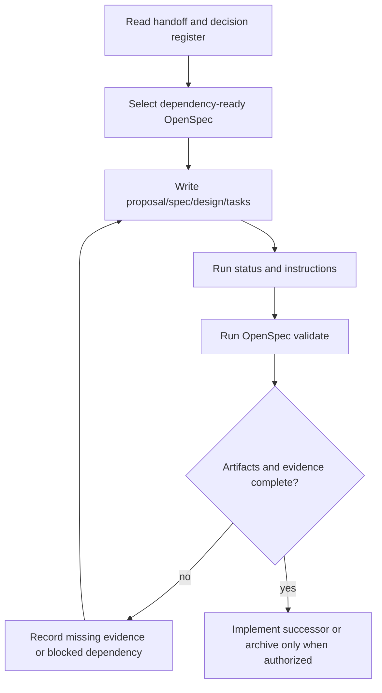

# OS-000: Architecture contract

## 1. Architecture decisions and target gate

This artifact implements the planning boundary from handoff sections 4.5, 5, 22, and 25. Relevant decisions are D-001, D-002, D-003, D-004, D-007, D-018, D-019, and D-020; format boundary F-005, F-006, and F-009; and the agent/process expectations in Section 25. The target is the Phase 0 source-of-truth and portable-contract gate, not a platform or hardware gate. No provisional technology decision is promoted here. SQLite, frontend, executor, transaction-machine, and format choices remain behind later OpenSpecs and their evidence gates.

## 2. Concrete outcome

An agent starting with only the repository and handoff can run the OpenSpec CLI, identify the active artifacts, see their dependency order, distinguish accepted decisions from provisional or gated choices, and determine the next dependency-ready work without chat history or a parallel registry. The repository has no OS-000 runtime implementation or architecture checker.

## 3. Prerequisites

- Read-only handoff: `docs/handoffs/diskweave-refined-architecture-v0.6.md`, especially Sections 4.5, 5, 22, 25.2, and 25.3.
- OpenSpec `spec-driven` workflow and CLI commands `status`, `instructions`, and `validate`.
- No Rust, runtime, database, frontend, or hardware prerequisite is required for this planning change.
- OS-001, OS-002, and OS-003 are correctness-critical successors and must not be treated as complete until their own artifacts and evidence are available.

## 4. Exact scope and non-scope

Scope is limited to repository-local OpenSpec artifacts: terminology, decision classifications, dependency order, portable boundaries, evidence rules, and agent workflow. The design makes no Linux, macOS, device, power-loss, SQLite, or performance claim. It does not edit the handoff, Rust source, product format, archive, or any platform adapter.

## 5. Semantic APIs and contracts

The planning API is the OpenSpec artifact set: proposal, delta spec, this design, and tasks. Each change SHALL use validator-compatible `## ADDED|MODIFIED|REMOVED Requirements`, `### Requirement`, and `#### Scenario` structure. Each requirement SHALL describe observable behavior, conservative uncertainty handling, and a testable acceptance condition. `openspec status --change`, `openspec instructions apply --change`, and `openspec validate` are the workflow interfaces; no custom checker or machine-readable duplicate registry is introduced.

The semantic architecture contract SHALL preserve: ordinary independently readable data payloads; replaceable frontend/runtime/database seams; explicit logical-versus-backend lifetimes; fail-closed identity and recovery decisions; bounded resources; independent parity and integrity state; and no stable format promise before recovery and independent-decoder evidence.

## 6. State ownership and lifecycle

- The handoff owns the upstream architecture decisions and remains read-only.
- OpenSpec proposals and specs own the requested semantic contract.
- Designs own the implementation boundary, evidence scope, and unresolved risks.
- Tasks own ordered work and its evidence status.
- The OpenSpec CLI owns computed artifact readiness and validation results.
- Later runtime components will own semantic transactions, topology snapshots, operation slots, buffers, backend uncertainty, persistent records, logs, and metrics; OS-000 does not own those states.
- An artifact is reusable by later work only after it is present, validator-compatible, and its required evidence is recorded. A task checkbox never substitutes for unavailable platform or hardware evidence.

## 7. Persistent-state impact

None. OS-000 writes only planning text. It creates no SQLite schema, array bytes, parity envelope, recovery manifest, normalized trace, or stable serialization. F-005/F-006/F-009 remain future semantic formats whose versioning and independent readers must be specified by their own OpenSpecs.

## 8. Irreversible and durability boundaries

OS-000 has no media or database mutation boundary. The irreversible planning boundary is accepting an artifact as the source for implementation; that acceptance requires a valid delta, explicit scope, recorded evidence, and no hidden platform claim. Archiving is a separate finalization action and is outside this change’s artifact update. No runtime state may be called durable, clean, valid, or certified based on OS-000 validation.

## 9. State and sequence diagrams

The states are `proposed`, `specified`, `designed`, `tasked`, `validated`, `implemented`, and `archived`; CLI artifact state and task evidence must not be conflated.

## 10. Concurrency and resource rules

Agents SHALL use the CLI as the readiness source and re-read artifacts before changing them. Changes must remain dependency-ordered: OS-000 precedes OS-001, OS-002, and OS-003. Artifact editing is bounded to the selected change directory, and no background checker, unbounded registry, or parallel status mechanism is permitted. A later implementation may choose queue, slot, buffer, retry, or worker counts only as bounded, measured decisions recorded in its OpenSpec.

## 11. Failure matrix

| Condition | Required result |
|---|---|
| Missing handoff or decision ID | Stop and record the missing prerequisite; do not infer an architecture decision. |
| Malformed delta or missing required artifact | OpenSpec validation fails; implementation is not declared ready. |
| Undefined normative term or conflicting scope | Preserve the conflict as an artifact gap and resolve it before dependent work. |
| Platform or hardware evidence unavailable | Record it as gated/unmet; never infer certification from portable tests. |
| Stale task checkbox | Reconcile the task against current artifacts and evidence before completion. |
| Provisional library or database choice | Keep a semantic seam and name the required comparison, vectors, or crash matrix. |
| Archive requested before acceptance | Keep the change active until the acceptance evidence is actually present. |

The default for uncertainty is to retain the blocker and fail closed.

## 12. Deterministic simulator cases

Runtime media simulation is not applicable to OS-000 because this change contains no runtime. The deterministic workflow cases are: missing artifact, malformed delta, missing prerequisite, valid dependency order, and unavailable platform evidence. Each case has a reproducible CLI command and an expected status/validation result. Media schedules belong to OS-004 and later.

## 13. Property, model, and fuzz tests

No runtime property or fuzz test is claimed. The artifact-level model is the dependency graph and the 20-section design contract. Validation SHALL check delta structure and required artifact presence. Future OpenSpecs SHALL compare semantic outcomes, minimize fault schedules, and retain regression fixtures; a custom repository checker is explicitly out of scope.

## 14. Integration tests

Runnable now: `openspec validate os-000-architecture-contract --json`, `openspec status --change os-000-architecture-contract --json`, and `openspec instructions apply --change os-000-architecture-contract --json`. No macOS, Linux, SQLite, or hardware integration test is claimed. Those gates remain visible in the successor artifacts that need them.

## 15. Observability, security, and operator behavior

Artifact diagnostics SHALL identify the change, requirement, decision ID, evidence class, and blocker without exposing secrets or host-specific credentials. Operator-facing runtime behavior is not implemented here. A later fail-closed result must distinguish unknown, stale, unsupported, ambiguous, and unavailable evidence rather than presenting a generic success.

## 16. Performance and resource bounds

OS-000 has no product runtime or resource budget. Its workflow must remain finite and repository-local: no generated registry, daemon, network service, or unbounded scan is required. Later work must record measurable limits for slots, buffers, queues, descriptors, database growth, and background work where those resources exist.

## 17. Executable acceptance criteria

- The four artifacts exist and validate with the OpenSpec CLI.
- This design contains the twenty numbered sections in this order.
- The artifacts cite the applicable handoff decisions and distinguish accepted, provisional, validation, tunable, user, deferred, rejected, and format-experimental choices where relevant.
- The dependency graph names OS-001, OS-002, and OS-003 as OS-000 successors without claiming their implementation evidence.
- No handoff, Rust source, archive, custom checker, database, or platform code is changed by OS-000.
- No unavailable platform or hardware evidence is represented as passing.

## 18. Forbidden outcomes

It is forbidden to create a second decision/status registry, define stable Rust ABI or database-table contracts, select a frontend/runtime/database as durable truth, claim physical durability, or mark a dependent change ready while OS-000 or its required artifact evidence is incomplete.

## 19. Migration and compatibility consequences

There is no product migration. This artifact revision tightens planning-document compatibility only. Existing runtime consumers are unaffected. Future incompatible format or recovery changes require their own versioned OpenSpec, migration evidence, independent reader, and explicit decision before promotion.

## 20. Next OpenSpecs unlocked

After OS-000’s artifacts validate, the next dependency-ready portable changes are OS-001 normalized block/frontend semantics, OS-002 random-access store/operation-slot/capability contracts, and OS-003 XOR reference math. OS-004 remains blocked until OS-001 through OS-003 have their required contracts and evidence. Later OpenSpecs must preserve this dependency direction.
