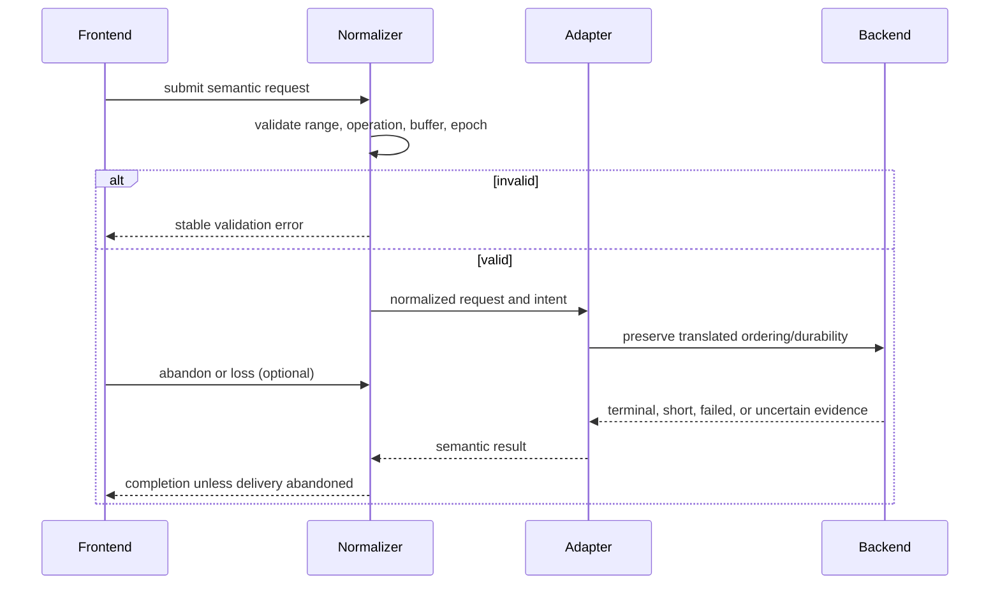

# OS-001: Normalized block semantics

## 1. Architecture decisions and target gate

This change follows handoff Sections 5, 11, 12, 22.2, and 25.3. Relevant decisions are D-001, D-004, D-007, D-015, D-018, and D-020; provisional boundaries P-001, P-003, and P-004; tunables T-001 and T-006; and the normalized trace boundary F-009. It contributes portable evidence to the Phase 0 contract gate and unlocks OS-004, OS-013, OS-020, and OS-030. It does not resolve frontend-library, runtime, queue-topology, or platform durability decisions.

## 2. Concrete outcome

Any frontend can translate a request into the same byte range, operation, identity, topology epoch, ordering, durability intent, and lifecycle vocabulary. Invalid ranges and buffer relationships are rejected before backend admission; abandonment suppresses delivery interest without claiming cancellation or media rollback; unsupported capabilities produce explicit results.

## 3. Prerequisites

- OS-000 architecture contract artifacts validate.
- Handoff Sections 5, 11, 12, 22.2, and 25.3 are available as read-only source input.
- A standard-library-only Rust build and deterministic unit-test environment are sufficient.
- No ublk, FSKit, io_uring, SQLite, async runtime, macOS, Linux, or hardware probe is required for this portable contract.
- OS-002 and OS-003 remain parallel contracts; their implementation must not be smuggled into this change.

## 4. Exact scope and non-scope

Scope is frontend-neutral request, ordering, durability, lifecycle, capability, completion-interest, and conformance semantics. Portable code may define semantic identifiers and validation but must not depend on OS tags, pointers, kernel structs, runtime futures, database rows, or frontend names. Non-scope is a real frontend/backend, parity, recovery database, physical flush/FUA proof, zoned I/O, Linux/macOS integration, and stable serialization or ABI.

## 5. Semantic APIs and contracts

The contract includes stable semantic identities for request, frontend, slot, topology epoch, sequence, fence domain, and generational buffer; checked byte ranges; read, write, flush, write-zeroes, discard, and explicitly rejected zoned operations; ordering intent; durability intent; frontend lifecycle events; and deterministic validation/completion errors.

Requests preserve target slot, captured topology epoch, byte range, operation, buffer relationship, sequence, ordering, and durability fields. Read/write require the appropriate generational buffer; flush does not accept a data buffer. Adapters may reject unsupported intent or emulate it only with equivalent capability evidence and must not silently weaken or strengthen semantics.

## 6. State ownership and lifecycle

The normalized core owns request identity, captured topology epoch, semantic validation, ordering/durability intent, lifecycle state, and completion interest. The frontend owns its submission and delivery handle. A later adapter owns backend tags and operation slots; the store owns backend resources and completion evidence. Abandonment changes delivery interest only. A request and its buffers become reusable only after the downstream operation-lifetime contract reports terminality and reconciliation; frontend loss alone is insufficient.

## 7. Persistent-state impact

None. Requests and events are in-memory semantic values. A later normalized trace or recovery manifest may serialize equivalent semantic fields under F-005/F-009, but this change freezes neither private Rust layout nor wire/table representation. No data-member metadata or stable format is introduced.

## 8. Irreversible and durability boundaries

Normalization itself has no media mutation and is reversible by rejecting the request. After admission, abandonment cannot roll back a transaction or reclaim backend resources. Before an adapter submits a preflush/write/FUA action, it must retain the requested ordering and durability intent. A terminal completion may report only the persistence evidence actually established; this contract never converts ordinary completion into durable proof.

## 9. State and sequence diagrams

The sequence does not imply backend cancellation, media durability, or frontend-specific completion timing.

## 10. Concurrency and resource rules

Requests carry monotonic submission sequence and captured topology epoch. Adapters must enforce configured queue, live-request, buffer, and tag bounds before admission and apply backpressure or deterministic resource exhaustion. Conflicting ranges and global ordering are delegated to later store/transaction contracts; this change must not invent a lock implementation. A stale epoch is rejected rather than silently retargeted. Numeric bounds are tunable evidence, not format semantics.

## 11. Failure matrix

| Condition | Required semantic result |
|---|---|
| Range end overflows | Reject before backend submission with a stable range error. |
| Wrong buffer for operation | Reject validation; do not submit I/O. |
| Unsupported discard or zoned operation | Explicit unsupported result; no write or zero-fill substitution. |
| Unsupported FUA/preflush/flush | Reject or use explicitly proven equivalent behavior; never silently weaken. |
| Frontend abandonment | Suppress delivery interest only; continue lifetime and durability obligations. |
| Frontend loss with duplicate possibility | Preserve uncertainty; do not reclaim or infer cancellation. |
| Quiescence | Record the drained sequence; do not treat it as media durability. |
| Backend short/EIO/timeout/unknown effect | Surface the adapter’s structured result; do not normalize it into success. |
| Stale topology epoch | Refuse the request or completion under the old snapshot. |
| Admission bound reached | Backpressure or deterministic resource-exhausted result. |

## 12. Deterministic simulator cases

OS-001 has no media simulator. It defines the cases OS-004 must later schedule: abandon before terminal completion, loss with possible duplicate, quiescence at sequence N, short completion, EIO, timeout/unknown effect, unsupported capability, and stale epoch. The expected oracle is preserved lifecycle and uncertainty, not successful return alone. No simulator result is claimed by this change.

## 13. Property, model, and fuzz tests

The portable conformance set SHALL generate valid and invalid ranges, operation/buffer combinations, intent combinations, lifecycle events, and bounded admission sequences. Properties include checked end arithmetic, field preservation, no silent intent weakening, abandonment not cancelling lifetime, stale epoch rejection, and deterministic error classification. Shrinking must retain the smallest request/event sequence that violates an invariant. Full fault-schedule and model comparison are OS-004 evidence; this change may claim only deterministic portable tests that are actually run.

## 14. Integration tests

Current-host evidence is limited to the dependency-free package’s unit/conformance tests and OpenSpec validation. A frontend adapter, real store, macOS, Linux, or hardware integration test is separately gated by OS-020, OS-030, and later release criteria; no skipped platform test is counted as passing here. The public dependency graph must remain free of those platform/runtime/database types.

## 15. Observability, security, and operator behavior

Stable semantic result classes must distinguish invalid, unsupported, stale, abandoned, short, failed, and uncertain outcomes. Diagnostics should include request identity, sequence, topology epoch, range, and evidence class while redacting payloads and frontend secrets. Operators must be told whether a request was rejected before I/O, abandoned for delivery only, or left with unknown backend effect. No privileged device access is introduced.

## 16. Performance and resource bounds

Validation must be O(1) in request metadata and use checked arithmetic without allocation proportional to payload size. Adapters must expose finite request, buffer, tag, and queue limits and retain resources until terminal reconciliation. No zero-copy, async runtime, SIMD, or queue-size choice is frozen. Later benchmarks must report allocations/request, memory, queue occupancy, and abandonment-drain behavior.

## 17. Executable acceptance criteria

- The portable semantic package builds without ublk, FSKit, io_uring, SQLite, async runtime, or OS-specific public types.
- Checked ranges reject representational overflow before admission.
- Valid requests preserve identities, epoch, operation, range, buffers, sequence, ordering, and durability intent.
- Invalid operation/buffer relationships, zoned operations, unsupported discard, and unproven durability intents fail explicitly.
- Lifecycle tests prove abandonment is not cancellation and quiescence is not durability.
- Bounded-admission and stale-epoch behavior are deterministic.
- OpenSpec validation passes, while no platform or physical-durability evidence is claimed.

## 18. Forbidden outcomes

The implementation must not silently drop preflush/FUA/flush intent, translate discard to another operation, reclaim backend resources on frontend abandonment, accept an overflowed range, retarget a stale epoch, claim physical flush/FUA certification, or expose platform/runtime/database types as portable semantics.

## 19. Migration and compatibility consequences

There is no persisted-data migration or stable ABI promise. Later adapters must translate into these semantics without changing field meaning. If a serialized normalized trace or frontend compatibility layer is introduced, it requires a versioned format contract and migration tests; private Rust layout and crate identity remain replaceable.

## 20. Next OpenSpecs unlocked

OS-001 contributes the portable prerequisite for OS-004 deterministic volatile-media simulation, OS-013 healthy portable I/O, OS-020 macOS feasibility, and OS-030 Linux frontend feasibility. OS-002 and OS-003 remain independent OS-000 successors and are also required before OS-004. Platform and hardware certification remain later gates.
