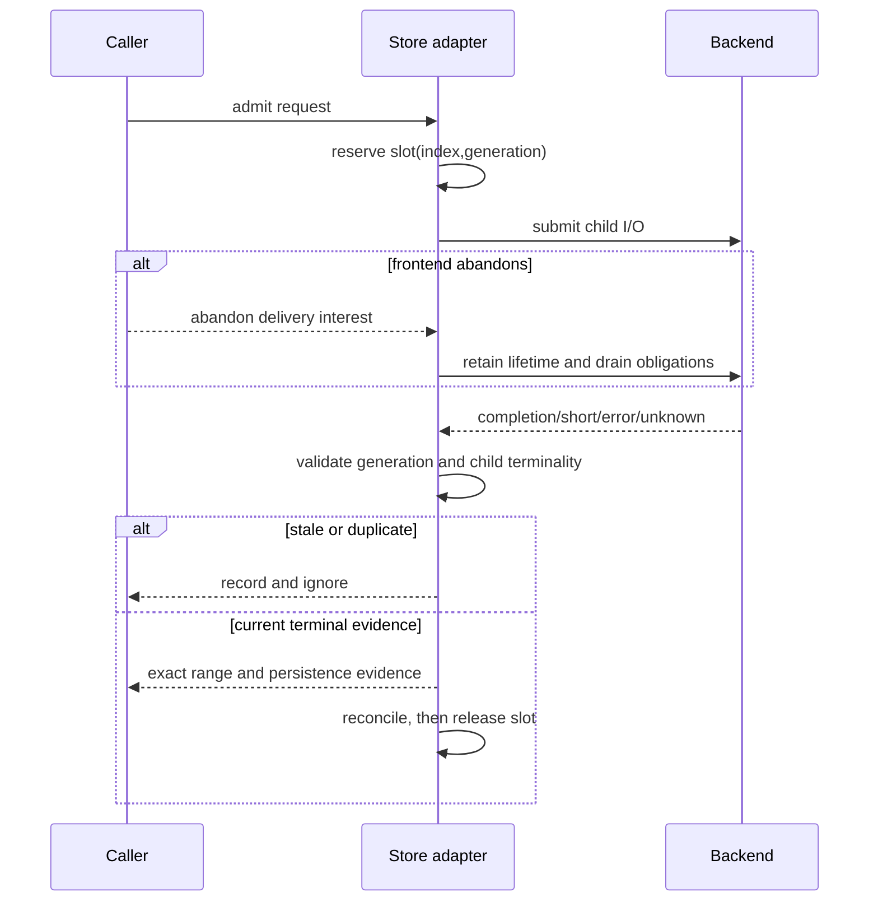

# OS-002: Store, operation-slot, and capability contracts

## 1. Architecture decisions and target gate

This change follows handoff Sections 4.5, 5, 11, 12, 22.2, and 25.3. Relevant decisions are D-001, D-002, D-003, D-004, D-005, D-006, D-007, D-014, D-017, D-018, and D-020; provisional boundaries P-003 and P-005; tunables T-001, T-002, and T-006; and format boundaries F-005 and F-006. It contributes portable store and lifetime evidence to the Phase 0 gate and unlocks OS-004, OS-012, and OS-031. It does not select io_uring, SQLite, ublk, queue sizes, or hardware safety.

## 2. Concrete outcome

A portable adapter can report exact completed ranges, short/failed/uncertain/duplicate outcomes, persistence evidence, capabilities, identity observations, and bounded resource state. Every admitted operation has a generation-bearing slot whose buffers, tags, child operations, watermarks, and reconciliation state remain owned until safe terminal reclamation. Stale and duplicate completions cannot affect reused resources.

## 3. Prerequisites

- OS-000 architecture contract artifacts validate.
- OS-001 normalized request semantics are available for request/range/epoch interoperability.
- Handoff Sections 4.5, 5, 11, 12, 22.2, and 25.3 are read-only source input.
- Standard-library-only portable tests and deterministic fake adapters are sufficient.
- Real file/device, io_uring, ublk, SQLite, macOS, Linux, and hardware evidence are outside this change and remain gated.

## 4. Exact scope and non-scope

Scope is the `RandomAccessStore` semantic boundary: exact ranges, dispositions, persistence evidence, capability observations, safety profiles, identity observations, operation-slot generations, bounded admission, duplicate/stale handling, disappearance, and retry legality. Non-scope is a concrete filesystem/device adapter, async executor, SQLite schema, parity layout, frontend, cancellation primitive, queue topology selection, and production or power-loss certification.

## 5. Semantic APIs and contracts

Each operation identifies the logical operation and requested byte range. Its completion reports the exact completed subset, disposition (`success`, `short`, `failed`, `uncertain`, or `duplicate`), backend error class where known, and persistence evidence such as volatile/unknown, FUA, or fence-based evidence. A timeout or lost completion with unknown media effect is uncertain, never an implicit retryable success.

Capability evidence covers logical/physical geometry, alignment, transfer limits, flush/FUA/order support, torn-write and volatile-cache model, write-zeroes/discard, sparse behavior, cancellation behavior, and identity sources. Safety profiles are named semantic classifications: simulation-certified, portable-demo, production-read-only, and production-write-safe. A profile is refused when required evidence is absent or unknown.

An operation slot is addressed by bounded index plus generation. Admission reserves it before backend submission. Completion validates generation before resource lookup; duplicate terminal delivery is recorded and ignored; reuse requires all child operations terminal and reconciliation recorded. Callers, not adapters, decide retry legality from idempotence and uncertainty.

## 6. State ownership and lifecycle

The store contract owns range outcomes, persistence evidence, capabilities, identity observations, and backend operation semantics. The slot owns in-flight buffers, frontend tags, child identities, submitted watermarks, drain state, duplicate records, and terminal evidence. The caller owns transaction policy and whether an uncertain operation may be reconciled or retried. A slot becomes reusable only after all children are terminal, duplicate/stale handling is complete, and required reconciliation is durable or explicitly recorded as unavailable. Logical task drop or frontend abandonment never suffices.

## 7. Persistent-state impact

The contract itself has no persistent schema or array-byte mutation. Completion and capability evidence may later be projected into `array.sqlite3`, manifests, or traces, but their semantic authority, versioning, migration, backup, and rebuild paths belong to OS-005 and F-005/F-006. Store capability fields must not become a stable on-media format by implication. Loss of recovery metadata must not make intact data unreadable.

## 8. Irreversible and durability boundaries

Reserving a slot and submitting backend I/O are irreversible with respect to possible media effect; after submission, uncertainty must be retained until reconciled. Before a write path mutates home media, a later transaction contract must establish dirty/integrity prerequisites. Before reporting durable completion, the store may claim only the evidence for the requested fence. Slot release is irreversible only after child terminality and reconciliation. No store completion alone establishes `CLEAN` or `VALID` recovery state.

## 9. State and sequence diagrams

## 10. Concurrency and resource rules

Admission is bounded by configured live slots, buffers, child submissions, retries, range locks, and background work. No operation may address a slot until its generation matches. Completions may be delayed, reordered, duplicated, or lost; generation checks and child terminal tracking must be independent of delivery order. Resource reuse waits for drain and reconciliation. Retry of a non-idempotent uncertain write is forbidden by default. Fairness and numeric limits are tunable but must be explicit and observable.

## 11. Failure matrix

| Condition | Required result |
|---|---|
| Exact success | Report requested range and only established persistence evidence. |
| Short read/write | Report exact completed subset and `short`; caller decides next action. |
| EIO or backend failure | Report failed with stable backend error class; do not hide the effect. |
| Timeout/lost completion | Report uncertain when media effect is unknown; no blind retry of non-idempotent work. |
| Delayed/out-of-order completion | Match child and generation; preserve ordering evidence. |
| Duplicate completion | Record duplicate and ignore without changing result or freeing resources early. |
| Stale generation | Reject before resource lookup; never touch reused memory. |
| Store disappearance/reappearance | Invalidate operations under the old topology; require new identity/capability decision. |
| Identity or geometry change | Refuse writable reuse until an explicit topology decision. |
| Unsupported/unknown capability | Refuse the requested safety profile or select a named safer profile. |
| Bound exhausted | Backpressure or deterministic resource-exhausted result. |

Unknown, stale, ambiguous, or indeterminate evidence remains conservative and visible.

## 12. Deterministic simulator cases

OS-002 does not claim OS-004’s simulator. It defines deterministic fake-adapter schedules for: short completion, EIO, timeout, delayed completion, reorder, duplicate, stale generation, disappearance/reappearance, identity change, unsupported capability, bound exhaustion, and abandoned frontend delivery. The oracle checks exact evidence, no unsafe reuse, and conservative retry behavior. OS-004 later composes these cases with durable/volatile/pending media state.

## 13. Property, model, and fuzz tests

Generators SHALL vary bounded slot counts, generations, child counts, completion order, duplicate count, completion loss, ranges, capability combinations, identity observations, and admission pressure. Properties include no stale resource access, no early slot reuse, duplicate idempotence, exact-range accounting, generation monotonicity, profile refusal for missing evidence, and no blind retry of uncertain non-idempotent operations. Shrinking retains the smallest completion trace that violates an invariant. Portable fake-adapter evidence does not substitute for physical durability testing.

## 14. Integration tests

Runnable now: portable contract tests, fake adapters, workspace tests, and OpenSpec CLI validation. OS-012 owns file-backed stores; OS-031 owns Linux executor integration; OS-004 owns simulator composition. No real device, ublk, io_uring, SQLite, macOS, or hardware integration result is claimed here, and unavailable platform evidence remains unmet rather than skipped-to-pass.

## 15. Observability, security, and operator behavior

Stable events and metrics must expose operation ID, slot generation, child ID, requested/completed range, disposition, persistence evidence, capability profile, topology epoch, and reconciliation state. Payloads and credentials are not logged. Operators must see whether an operation is short, failed, uncertain, stale, duplicate, or blocked by capability/identity ambiguity, and must be told when writes are refused. No automatic destructive replacement or rebaseline is authorized.

## 16. Performance and resource bounds

Slot lookup and generation validation are O(1) metadata operations. Every adapter must publish finite maxima for live slots, buffers, child submissions, retry attempts, range locks, queue occupancy, and background work; admission cannot allocate unbounded state. Later benchmarks must measure allocations/request, memory/member, descriptor usage, completion latency, duplicate handling, and drain time. Optimization must not move a generation or lifetime check after resource access.

## 17. Executable acceptance criteria

- The portable store contract builds without concrete filesystem, device, runtime, SQLite, ublk, or OS-specific public dependencies.
- Exact, short, failed, uncertain, and duplicate outcomes include completed-range and persistence evidence.
- Capability profiles refuse missing or unknown evidence for stronger safety claims.
- Stale generations are rejected before lookup; duplicates do not alter terminal state; slots are reusable only after drain/reconciliation.
- Disappearance, identity/geometry change, bounded exhaustion, and uncertain non-idempotent writes fail conservatively.
- Deterministic fake-adapter tests exercise the failure matrix and property/model tests are specified without claiming hardware proof.
- OpenSpec validation passes and no unavailable platform/hardware evidence is represented as complete.

## 18. Forbidden outcomes

The implementation must not silently convert short/uncertain/EIO results to success, blindly retry uncertain non-idempotent writes, use stale completions against reused resources, reclaim on logical cancellation, infer production-write-safe behavior from an unproven capability, or automatically reuse an ambiguous identity.

## 19. Migration and compatibility consequences

No persistent migration is introduced. Future adapters and recovery stores must preserve these semantic dispositions and evidence classes. Any serialized capability profile, identity observation, recovery record, or operation trace requires a separate versioned contract and migration/rebuild path; private slot layout and adapter crate identity remain replaceable.

## 20. Next OpenSpecs unlocked

OS-002 contributes the portable prerequisite for OS-004 deterministic volatile-media simulation, OS-012 portable file-backed stores, and OS-031 Linux operation-slot/raw-store execution. OS-005, OS-010, and later recovery work may consume its evidence but must preserve the independent recovery semantics and no-false-clean boundary. Production and hardware claims remain gated by later OpenSpecs.
