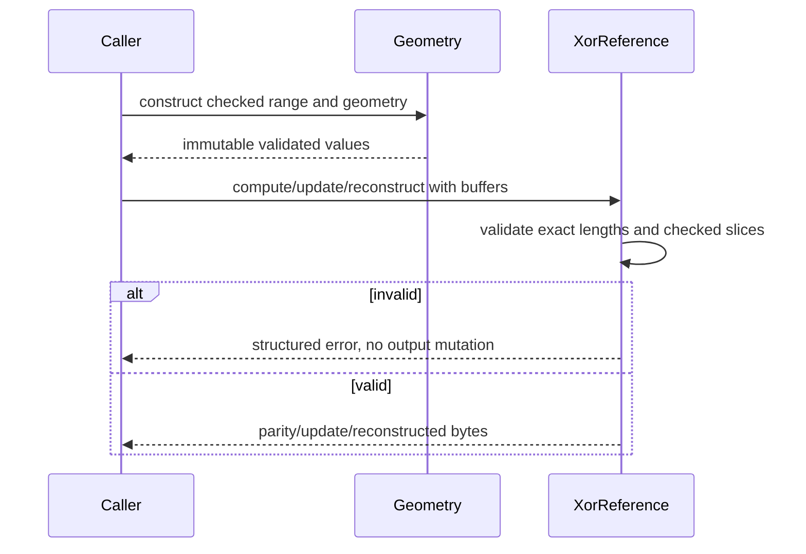

# OS-003: XOR reference model

## 1. Architecture decisions and target gate

This change follows handoff Sections 5.1, 7.3, 7.4, 16.9, 22.2, and 25.3. It contributes the portable single-parity/reference-codec evidence for the Phase 0 gate and unlocks OS-004, OS-006, and OS-008. The handoff’s accepted bytewise XOR equations and replaceable optimized-codec boundary are normative. P/Q field/coefficient selection, SIMD selection, and stable format promotion remain later evidence decisions.

## 2. Concrete outcome

`dwv-codec` computes bytewise single-parity XOR over explicit protected geometry, performs incremental read-modify-write updates, reconstructs every single known erasure, rejects ambiguous or malformed ranges, and provides deterministic vectors and a semantic seam for later implementations. The reference is dependency-free and is retained as the correctness oracle.

## 3. Prerequisites

- OS-000 artifacts validate and the handoff remains read-only.
- The normalized byte-range and store semantics from OS-001/OS-002 are available as compatible concepts; no device adapter is required.
- Rust standard-library tests and bounded generated inputs are available.
- No SIMD library, Reed-Solomon crate, runtime, filesystem, topology, or persistent-format implementation is a prerequisite for the reference path.

## 4. Exact scope and non-scope

Scope is explicit data-slot lengths, parity capacity, byte ranges, logical zero extension, full XOR, incremental update, one-erasure reconstruction, checked arithmetic, golden vectors, negative/property tests, and a trait seam. Non-scope is P/Q, finite-field coefficients, device I/O, locks, dirty tracking, checksums, parity envelopes, transaction ordering, stable serialization, CPU dispatch, and production throughput selection.

## 5. Semantic APIs and contracts

The semantic contract exposes checked immutable `ByteRange` values, explicit `Geometry`, a `ParityCodec` interface, and the `XorReference` implementation. Full inputs must match declared protected lengths exactly. Survivor inputs must match the protected intersection of the requested range exactly. All parity slices are derived through checked conversions and bounds; extra bytes are rejected rather than truncated.

The equations are `P = D_0 XOR ... XOR D_n`, `P_new = P_old XOR D_old XOR D_new`, and `D_missing = P XOR surviving D_i`. Shorter protected members contribute logical zero. Runtime batching and vector width cannot change the result.

## 6. State ownership and lifecycle

Geometry and range values own no storage and cannot be mutated after construction. Callers own data, parity, old-data, and new-data buffers. Codec operations validate geometry and all buffer lengths before allocating or mutating output. An optimized implementation may be added later, but must remain substitutable behind the same semantic contract and compare with the reference.

## 7. Persistent-state impact

None. The change produces in-memory parity bytes only. Golden vectors are test fixtures, not a stable on-disk format. No data-member headers, parity envelopes, crate identities, vector widths, or CPU dispatch decisions are persisted.

## 8. Irreversible and durability boundaries

Reference computation has no media side effect. Incremental update mutates only the caller-provided parity buffer after complete validation; a rejected request must not partially mutate it. A correct parity result is not evidence that independent data/parity writes were durably ordered. Dirty intent, fences, checksums, and recovery state belong to later transaction/recovery changes.

## 9. State and sequence diagrams

## 10. Concurrency and resource rules

The reference has no internal shared state and is safe to use as an independent oracle when callers provide separate buffers. Operations are bounded by declared range lengths and `usize` conversion limits. No hidden worker, queue, allocation policy, or vector width exists. Callers must coordinate concurrent read-modify-write operations through later range-lock and transaction contracts.

## 11. Failure matrix

| Condition | Required result |
|---|---|
| Empty data geometry | Reject with no-data-slots error. |
| Parity shorter than protected maximum | Reject before parity output. |
| Offset/length or slice conversion overflows | Return checked arithmetic error without mutation. |
| Data input shorter or longer than declared length | Reject exact-length mismatch. |
| Range outside slot or parity capacity | Reject without truncation. |
| Multiple erasures or missing survivor | Reject as insufficient/ambiguous redundancy. |
| Optimized result differs from reference | Fail conformance and do not promote implementation/profile. |

## 12. Deterministic simulator cases

OS-003 does not model media. It supplies OS-004 with vectors for heterogeneous lengths, non-zero offsets, zero tails, partial updates, single erasures, invalid capacity, overflows, and incomplete/extra survivors. OS-004 may schedule parity-affecting actions, but this reference never infers durability from a computation.

## 13. Property, model, and fuzz tests

Deterministic generated tests vary member count, heterogeneous lengths, offsets, valid update lengths, and missing slots. Properties require incremental update to equal full recomputation, every valid single erasure to reconstruct exactly, batching to be irrelevant, and invalid arithmetic/input lengths to fail without mutation. The test generator is bounded and reproducible; a future fuzz harness may expand inputs without changing semantics.

## 14. Integration tests

Current acceptance is `cargo test -p dwv-codec`, workspace tests, OpenSpec validation, and later cross-implementation vector comparison. No filesystem, runtime, Linux, macOS, device, or hardware integration result is claimed. OS-004, OS-008, and OS-042 own simulator/transaction/P/Q integration.

## 15. Observability, security, and operator behavior

Errors identify slot, range, required/actual length, parity capacity, or arithmetic failure without logging payload bytes. Malformed or hostile lengths must fail closed before allocation. No operator-facing repair or reconstruction command is introduced; callers must retain evidence about which survivors were trusted.

## 16. Performance and resource bounds

The reference is intentionally auditable rather than optimized. Work is linear in the requested byte range and number of data slots, with allocations bounded by checked `usize` lengths. Any SIMD, ISA-L, or Reed-Solomon implementation must be benchmarked separately and remain a replaceable adapter behind the semantic trait.

## 17. Executable acceptance criteria

- Checked immutable geometry/range values reject overflow and invalid capacity.
- Heterogeneous members use logical zero extension and exact protected-length validation.
- Full parity, incremental update, and every valid single-known-erasure reconstruction pass golden and generated tests.
- Invalid ranges, overlong/short inputs, multiple erasures, and arithmetic failures are explicit and non-mutating.
- The reference has no third-party dependency and no device/runtime/frontend type.
- The `ParityCodec` seam permits later optimized comparison without selecting a persistent profile or library identity.
- OpenSpec validation and workspace tests pass.

## 18. Forbidden outcomes

The implementation must not silently truncate protected tails, accept overflowed ranges, invent bytes for multiple erasures, use a library identity as persisted format semantics, claim physical durability from parity computation, or replace the reference oracle with an unverified optimized path.

## 19. Migration and compatibility consequences

There is no product migration. Any future persisted parity profile requires field/ordering/zero-extension semantics, independent decoder vectors, capacity/migration evidence, and a separate OpenSpec. Optimized implementation and crate changes remain compatible when they produce the same semantic vectors and errors.

## 20. Next OpenSpecs unlocked

OS-003 unlocks OS-004 deterministic media/fault composition, OS-006 parameterized P/Q/topology work, and OS-008 transaction/reference-machine work. It does not unlock production P/Q, degraded writes, or stable parity-envelope claims by itself.
