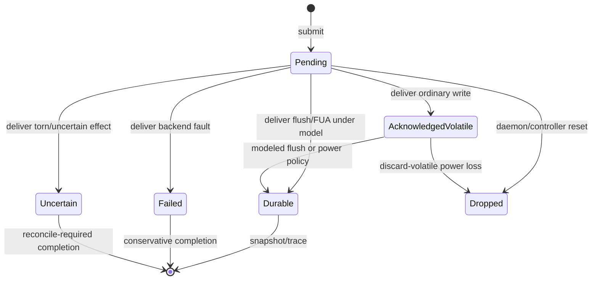

# OS-004: volatile media simulator

## 1. Architecture decisions and target gate

This change implements the handoff's first-class deterministic volatile-media model. It consumes the normalized request and store vocabulary from OS-001/OS-002 and the bytewise parity oracle from OS-003. Its Phase 0 target gate is a portable, bounded, replayable distinction between durable media, acknowledged volatile effects, pending work, completion delivery, recovery-state bytes, and parity-envelope copies. It does not certify a physical device.

## 2. Concrete outcome

`dwv-sim` provides a standard-library-only simulator with explicit submissions, completion delivery, deterministic faults, daemon/controller/power-loss boundaries, durable snapshots, traces, reproducible schedules, greedy minimization, and bounded one-range schedule enumeration. Recovery state and parity-envelope data are semantic fixtures owned by the simulator, not a selected persistence format.

## 3. Prerequisites

- OS-001 normalized operations and OS-002 completion/evidence types are available.
- OS-003 provides portable parity vectors where a parity-affecting action is needed.
- The simulator is exercised with bounded byte ranges and finite schedules.
- No operating-system adapter, database binding, asynchronous runtime, or real device is required for this change.

## 4. Exact scope and non-scope

Scope includes read, write, flush, FUA-like write, write-zeroes, discard, short/torn/failed/uncertain effects, duplicate delivery, reorder, disappearance, reappearance, daemon crash, controller reset, power loss, latent corruption, recovery-state commit outcomes, two envelope copies, traces, reproducers, minimization, and bounded enumeration.

Non-scope includes SQLite implementation, physical discard/deallocation, real cache behavior, production parity-envelope layout, transaction-machine policy, dirty-region/integrity protocol invariants, and hardware or power-cut certification.

## 5. Semantic APIs and contracts

The simulator owns durable bytes, acknowledged volatile writes, pending operations, completion delivery, availability, a deterministic `FaultModel`, recovery-state bytes, and two independently addressable envelope-copy fixtures. `ScheduleStep` is the explicit control surface. Completion ranges and dispositions are exact and conservative: a short, failed, torn, or uncertain action cannot be reported as a complete success.

## 6. State ownership and lifecycle

Submission creates bounded pending work. Delivery applies the modeled effect and records completion evidence. Daemon crash removes process-owned pending work and undelivered completion interest; controller reset removes pending controller work; power loss resolves volatile state according to the configured policy. Durable bytes survive process and controller reset. Recovery-state generation advances only after a modeled durable commit.

## 7. Persistent-state impact

None. All media, recovery-state, and envelope state is in-memory test state. Versioned reproducer text is test data and is not a DiskWeave on-disk format.

## 8. Irreversible and durability boundaries

Submission and acknowledgement do not establish durability. A modeled flush or FUA-like durable effect may provide simulator evidence only. Power loss may discard unresolved volatile effects. Recovery commit failure or uncertainty never advances the authoritative recovery generation. A torn envelope copy is invalid/uncertain and cannot become authoritative by itself.

## 9. State and sequence diagrams

## 10. Concurrency and resource rules

The simulator is single-threaded and schedule-driven. `max_pending` bounds pending operations; schedule enumeration has an explicit maximum count. No hidden queue, retry, task, or allocation is permitted. A schedule step is applied in order, and duplicate delivery is recorded without applying a terminal media effect twice.

## 11. Failure matrix

| Boundary or fault | Required semantic result |
|---|---|
| Ordinary write acknowledgement | Volatile/unknown evidence unless the model separately persists it. |
| Short write | Exact prefix and `Short` disposition. |
| Torn write | Modeled prefix/mask and uncertain evidence. |
| Backend EIO | Failed completion with error evidence and no optimistic durability. |
| Lost/uncertain completion | `Uncertain`; no blind retry or evidence upgrade. |
| Duplicate delivery | Trace-only duplicate; no second terminal media effect. |
| Store disappearance | Submission rejected; no media mutation. |
| Daemon crash | Pending process state/completions dropped; device volatile state retained. |
| Controller reset | Pending controller work dropped; durable/volatile media retained. |
| Power loss | Volatile state resolved by configured policy; durable bytes retained. |
| Latent corruption | Only requested durable range changes under deterministic mask. |
| Recovery commit failure | Prior committed generation remains authoritative. |
| Envelope tear | Affected copy invalid/uncertain; sibling copy unchanged. |

## 12. Deterministic simulator cases

The focused cases cover ordinary-vs-durable writes, flush/FUA, write-zeroes, logical discard, short/torn/failed/uncertain effects, completion reorder and duplication, disappearance/reappearance, daemon crash, controller reset, power loss, latent corruption, recovery commit failure, envelope-copy tears, and bounded one-range schedules. Every case has deterministic trace and snapshot output.

## 13. Property, model, and fuzz tests

Bounded generated schedules are replayed twice and compared byte-for-byte for durable media, volatile state, pending count, delivery trace, recovery generation, and envelope validity. Invariants reject durable mutation from discarded volatile writes, out-of-range effects, incomplete success, invalid duplicate application, and non-round-tripping reproducers. A future fuzz harness may expand the same schedule grammar without changing the oracle.

## 14. Integration tests

Current acceptance is `cargo test -p dwv-sim`, workspace tests, and OpenSpec validation. The simulator composes OS-001/OS-002 semantic values and OS-003 vectors without a platform adapter. SQLite crash behavior, real-device discard, VM resets, and hardware power cuts remain integration gates for OS-005 and later OpenSpecs.

## 15. Observability, security, and operator behavior

Traces expose request identity, ranges, fault actions, completion disposition, evidence, and state transitions without requiring payload logging. Reproducer parsing is versioned and bounded. Hostile schedule counts, ranges, masks, and pending-operation counts fail closed before unbounded allocation. No operator-facing repair decision is inferred from simulated success.

## 16. Performance and resource bounds

The simulator is an auditable reference, not a throughput target. Memory is bounded by media image size, `max_pending`, envelope/recovery fixtures, and the requested schedule cap. Enumeration and minimization are deterministic and caller-bounded; no runtime or background worker is introduced.

## 17. Executable acceptance criteria

- Distinct durable, volatile, pending, completion, availability, recovery-state, and envelope-copy state is observable.
- Read/write/flush/FUA-like/write-zeroes/discard and all specified deterministic faults are represented.
- Crash, controller reset, and power-loss boundaries have distinct state effects.
- Recovery commits and parity-envelope tears are conservative and independently visible.
- Reproducers round-trip; minimization is deterministic; bounded enumeration is replayable and capped.
- Core replay/range/completion invariants pass focused and workspace tests.
- No physical durability, discard, SQLite, or production format claim is made.

## 18. Forbidden outcomes

The simulator must not equate acknowledgement with durability, treat daemon crash as power loss, silently convert discard to physical deallocation, hide EIO/uncertainty, apply duplicate effects twice, advance recovery state after failed commit, or make a torn envelope copy authoritative.

## 19. Migration and compatibility consequences

There is no product migration. Reproducer text has a version marker and must reject unsupported versions. New fault actions require an explicit schedule-format update and deterministic round-trip tests; simulator state is never persisted as user data.

## 20. Next OpenSpecs unlocked

OS-004 unlocks OS-005 recovery-state/SQLite evaluation, OS-008 transaction-machine modeling, and OS-010 dirty-region/integrity protocol modeling. It does not unlock physical media certification, production discard semantics, or a stable parity-envelope format.
