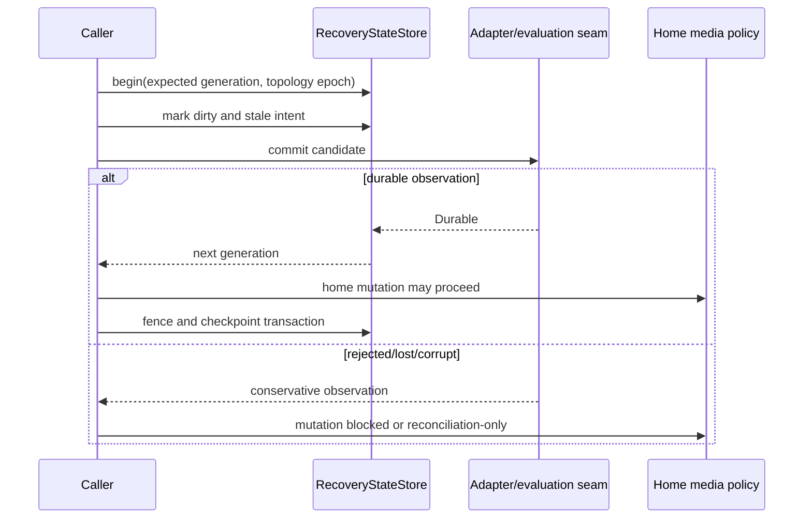

# OS-005: recovery-state semantics

## 1. Architecture decisions and target gate

This change implements the handoff's recovery authority boundary behind `RecoveryStateStore`. It consumes OS-002 evidence and OS-004 fault dispositions. The Phase 0 target gate is a generation-checked, topology-bound, portable recovery protocol plus executable SQLite evaluation fixtures. SQLite remains an adapter decision; no host-local commit is treated as proof that independent data/parity writes are durable.

## 2. Concrete outcome

`dwv-recovery` provides an in-memory reference store, atomic candidate transactions, dirty/integrity/fence/session/topology/checkpoint mutations, conservative health and commit observations, versioned semantic schema/migrations, and bounded semantic export. `dwv-recovery-sqlite` provides an evaluation-only host-`sqlite3` prototype for candidate modes, migration, semantic-header persistence/export, integrity, missing state, and corruption fixtures.

## 3. Prerequisites

- OS-000 architecture contracts, OS-001 normalized semantics, and OS-002 store evidence are available.
- OS-004 supplies deterministic reset, corruption, commit-failure, and uncertainty cases.
- Recovery state is treated as a protocol authority, not a mirror of home-media bytes.
- The portable package remains free of SQLite, filesystem, operating-system, frontend, and runtime types.

## 4. Exact scope and non-scope

Scope includes recovery generations, topology epochs, dirty intent, stale integrity evidence, typed store fences, writable sessions, clean checkpoints, health/disposition, commit observations, semantic schema descriptors, migration plans, bounded manifests, candidate SQLite matrix fixtures, and an evaluation-only SQLite prototype.

Non-scope includes the full transaction machine, parity-envelope production format, home-media adapter, production SQLite binding choice, journal/synchronization selection, VM or hardware power-loss certification, and treating the prototype as a write-safe deployment.

## 5. Semantic APIs and contracts

`RecoveryStateStore` exposes assembly snapshot loading, integrity health, generation/topology-bound transactions, durable commit, and semantic manifest export. `RecoveryTxn` applies mutations to a cloned candidate and publishes only after every transition validates. `RecoveryManifest`, `RecoverySchemaDescriptor`, and `RecoveryMigrationPlan` contain semantic records only. `RecoveryCommitObservation` distinguishes durable, rejected, lost, and corrupt outcomes.

The separate `SqlitePrototype` accepts a candidate `SqliteEvaluationCase`, applies the checked-in migration, writes a bounded semantic header/payload summary, exports that header, runs SQLite integrity checks, and exposes missing/corrupt fixtures. It does not expose SQL handles or SQLite types through `dwv-recovery`.

## 6. State ownership and lifecycle

`MemoryRecoveryStore` owns the authoritative in-memory snapshot and health. A transaction captures expected generation and topology epoch, accumulates mutations, validates a candidate, then atomically replaces the snapshot and increments the generation. An adapter may report a commit observation before the semantic caller decides whether to publish. Missing/corrupt/stale health blocks writable assembly and routes to rebuild or read-only reconciliation.

## 7. Persistent-state impact

The portable package has no persistent format. The evaluation crate includes candidate migration SQL under its own adapter boundary and a singleton recovery-state table used only for the prototype. Its exported representation is a semantic header and bounded summary, not a promised production schema or complete home-media record format.

## 8. Irreversible and durability boundaries

Dirty/stale intent must be durably committed before a caller is authorized to mutate home media. A fence requires matching store identity, topology epoch, watermark, and capability evidence. Clean, valid, closed-session, and writable claims require covering fence/checkpoint evidence. Rejected, lost, or corrupt commit observations cannot advance generation or authorize clean state.

## 9. State and sequence diagrams

## 10. Concurrency and resource rules

Transactions are optimistic and generation-checked; stale generation or topology commits fail before publication. Candidate validation is bounded by configured export limits and finite vectors. The reference store has no background tasks or implicit retry. A future adapter must serialize its own connections and preserve the same semantic generation boundary.

## 11. Failure matrix

| Condition | Required semantic result |
|---|---|
| Generation mismatch | Reject transaction with no snapshot change. |
| Topology epoch mismatch | Reject transaction with no snapshot change. |
| Invalid mutation batch | Reject the whole candidate with no partial publication. |
| Dirty/stale intent commit rejected | Home mutation remains unauthorized. |
| Volatile/unknown fence evidence | Cannot clear dirty or validate integrity. |
| Lost commit acknowledgement | Reconciliation-required; no clean inference. |
| Missing state | Block writable assembly; rebuild from data. |
| Corrupt state/journal | Block writable assembly; rebuild from data. |
| Stale state | Read-only reconciliation until a new generation is established. |
| Export exceeds a configured bound | Reject export with the record kind; no truncation. |
| Unsupported schema migration | Reject without changing state. |
| SQLite mode lacks evidence | Keep it a candidate; do not select a production profile. |

## 12. Deterministic simulator cases

The recovery fixture matrix covers candidate WAL/rollback, normal/full/extra synchronization, automatic/explicit checkpointing, one/two connection candidates, process reset, VM reset, power loss during journal sync, rejected commit, lost acknowledgement, missing database, corrupt main state, and corrupt journal. Each fixture records observation, expected health, disposition, and whether home mutation is permitted.

## 13. Property, model, and fuzz tests

Deterministic tests require atomic all-or-nothing transactions, generation/topology rejection, dirty-before-clean ordering, fence coverage, stale integrity rejection, conservative commit observations, schema migration rejection, bounded exports, and health dispositions. Generated mutation batches may be added later, but any counterexample must preserve the semantic snapshot oracle and never rely on SQLite layout.

## 14. Integration tests

Current acceptance is `cargo test -p dwv-recovery`, `cargo test -p dwv-recovery-sqlite` when the host `sqlite3` executable is available, workspace tests, and OpenSpec validation. The SQLite prototype exercises migration, candidate configuration, semantic header export, integrity, missing state, corruption visibility, and direct-data independence as an evaluation fixture. It does not claim crash-consistent production behavior.

## 15. Observability, security, and operator behavior

Health, disposition, commit observation, generation, topology epoch, and export-limit failures are explicit values suitable for logs/metrics without exposing payloads. Corrupt or missing recovery state is never silently treated as clean. Export bounds protect memory and output size; SQL values are quoted at the prototype boundary. Operators receive reconciliation/rebuild-required outcomes rather than an automatic writable decision.

## 16. Performance and resource bounds

The reference uses snapshot cloning for auditability. Export limits bound dirty records, integrity records, fences, stores/captures, topology assignments, maintenance checkpoints, and digest bytes. The evaluation prototype invokes one bounded host command per operation and is not a production I/O path. Performance optimization belongs behind the semantic port and a later evidence gate.

## 17. Executable acceptance criteria

- Generation-checked transactions publish atomically and reject stale generation/epoch candidates.
- Dirty intent, integrity invalidation, fence coverage, clean checkpoints, sessions, topology, and maintenance mutations are explicit.
- Missing, corrupt, stale, rejected, lost, and durable outcomes have conservative policies.
- Semantic schema, migration, and bounded export contain no SQLite layout types.
- Candidate SQLite matrix fixtures cover reset, journal/sync/checkpoint, missing, corruption, and commit uncertainty without selecting a mode.
- The evaluation-only SQLite crate runs migration/configuration/export/integrity/missing/corruption fixtures and verifies deleting its state does not alter separate direct-data bytes.
- Recovery and workspace tests plus OpenSpec validation pass.

## 18. Forbidden outcomes

The implementation must not treat a process-local SQLite commit as proof of home-media durability, publish a partial mutation batch, accept stale fence evidence, infer clean or valid state from volatile/unknown completion, silently rebuild from corrupt state, expose SQL layout in the portable API, or turn a candidate matrix entry into a production selection without evidence.

## 19. Migration and compatibility consequences

The semantic schema starts at version 1 and exposes an explicit v0-to-v1 initialization plan. Unsupported migrations fail closed. The evaluation SQL migration is adapter-local and may change independently of semantic record meanings; a production adapter must define its own migration/export/corruption compatibility before use.

## 20. Next OpenSpecs unlocked

OS-005 unlocks OS-006 topology/identity evidence, OS-008 the explicit transaction machine, and OS-010 dirty-region/integrity protocol work. It does not select production SQLite settings, a home-media transaction boundary, a parity-envelope format, or hardware durability claims.
