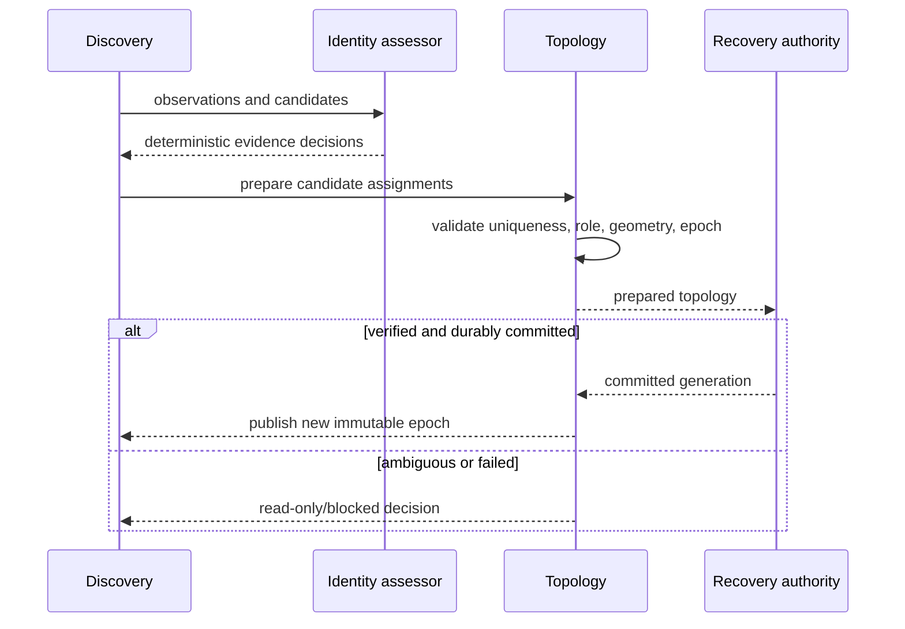

# OS-006: anchorless topology and identity

## 1. Architecture decisions and target gate

This change implements handoff Sections 6.1–6.5 and Phase 0 OS-006. Topology is portable semantic state; physical discovery is an evidence producer. The target gate is deterministic clone/replacement/geometry assessment and fail-closed writable assembly, not a macOS or Linux discovery daemon.

## 2. Concrete outcome

`dwv-core` gains stable array/slot/role/coding/assignment/topology values and immutable snapshot validation. `dwv-store` gains richer identity evidence and an assessor that returns explicit match, ambiguity, conflict, and new-device decisions. The implementation is split into `topology.rs` and `identity.rs` modules with public re-exports from `lib.rs`.

## 3. Prerequisites

- Archived OS-000, OS-003, OS-005, and current OS-002 semantics are available.
- `SlotId`, `TopologyEpoch`, `StoreId`, and existing capability/identity types remain compatible.
- No data-member header, sidecar, physical path, probe order, OS object, database row, or runtime handle is required.

## 4. Exact scope and non-scope

Scope is stable logical IDs, role/coding assignments, immutable snapshots, validation, staged topology transition state, evidence observations, deterministic assessment, bounded reports, and fixtures. Non-scope is device discovery, destructive replacement, online reshape, parity-envelope format selection, operator UI, and production frontend integration.

## 5. Semantic APIs and contracts

`TopologySnapshot` contains array identity, epoch, assignments, and protected geometry. `TopologyAssignment` separates slot, role, coding position, assignment instance, assignment generation, and observed evidence. `IdentityObservation` carries source, fingerprint, provenance class, stability, and confidence. `IdentityAssessment` and `AssemblyDecision` are exhaustive and serializable by semantic debug/report code, not Rust layout.

## 6. State ownership and lifecycle

Recovery state owns the committed topology. Discovery owns observations and candidates. A prepared transition owns a candidate snapshot until verification and durable commit. Frontends capture a published snapshot and never mutate it. Assignment generation increments for replacement; slot and coding identity are retained.

## 7. Persistent-state impact

The core types are semantic values only. A later recovery/export implementation may persist them, but this change adds no data-member bytes, SQL schema, parity-envelope encoding, or path-based anchor.

## 8. Irreversible and durability boundaries

Assessment and preparation are read-only. Publishing a topology epoch is a durable recovery transition and requires a verified candidate. Releasing an old member, authorizing writes, or destructive replacement is outside this change and must not be implied by an assessment.

## 9. State and sequence diagrams

## 10. Concurrency and resource rules

Snapshots are immutable and cheaply cloneable. Candidate lists and observations have explicit maximum counts. A prepared transition is single-owner; concurrent candidates cannot publish over one another without a generation check. No background discovery, path watcher, or hidden lock is introduced.

## 11. Failure matrix

| Condition | Required result |
|---|---|
| Duplicate slot or coding position | Reject candidate. |
| Array/epoch mismatch | Reject candidate. |
| Clone UUID with conflicting evidence | Ambiguous/conflicting; no writable assembly. |
| Missing serial/WWN | Assess remaining evidence; report insufficiency if threshold is unmet. |
| Path-only match | Never confident stable match. |
| Capacity/geometry change | Explainable replacement only through staged path. |
| Multiple candidates for one slot | Ambiguous; preserve all candidates. |
| No candidate | Missing/blocked required assignment. |
| Prepared verification failure | Keep old topology active. |
| Commit/publish interruption | Reconcile from committed recovery generation. |

## 12. Deterministic simulator cases

Fixtures cover same observations in reordered discovery order, cloned filesystem/PARTUUID values, USB bridge without stable hardware IDs, file-ID replacement, capacity/geometry change, one confident candidate, duplicate candidates, missing role, and prepared-transition failure. Each case records decision, writable authorization, and required action.

## 13. Property, model, and fuzz tests

Generated bounded candidate sets assert order independence, deterministic assessment, no duplicate active slots/coding positions, epoch monotonicity, and preservation of old topology on failed preparation. Shrinking retains the smallest evidence set that produces ambiguity or conflict.

## 14. Integration tests

Run core/store tests and OpenSpec validation on every host. OS-012 supplies macOS file-ID observations later. Linux device identity and udev integration are explicitly deferred to OS-030+.

## 15. Observability, security, and operator behavior

Reports identify candidate, source classes, confidence, conflict, missing evidence, topology epoch, and required action without logging raw paths or sensitive serials by default. Ambiguity emits a stable blocked/read-only classification. No automatic destructive assignment is exposed.

## 16. Performance and resource bounds

Assessment is O(candidates × observations) with bounded vectors. Snapshot validation is linear in assignment count. No I/O, hashing, or network call occurs in the semantic assessor.

## 17. Executable acceptance criteria

- Stable topology values validate and remain immutable within an epoch.
- Discovery order never changes coding positions or slot assignment.
- Clone, missing, USB-bridge, replacement, geometry, and ambiguity fixtures produce deterministic decisions.
- Writable assembly is authorized only for one confident/attested candidate per required role.
- Prepared transitions preserve the old topology until durable commit.
- New modules are re-exported without breaking existing public semantics.
- Core/store tests and OpenSpec validation pass.

## 18. Forbidden outcomes

Do not use path or probe order as identity, accept duplicated UUIDs as unique proof, silently alter coding positions, publish an unverified topology, release an old assignment on preparation failure, or place topology metadata in data payload files.

## 19. Migration and compatibility consequences

Existing `SlotId` and `TopologyEpoch` values remain valid. New assignment fields are additive and versioned at the semantic manifest boundary. A future persisted topology migration must preserve old coding positions and reject unknown identity evidence rather than reinterpret it.

## 20. Next OpenSpecs unlocked

OS-006 unlocks OS-007 envelope comparison, OS-008 transaction actions, OS-015 metadata-loss recovery, and OS-020/022 macOS acceptance. It does not unlock destructive replacement or online reshape.
