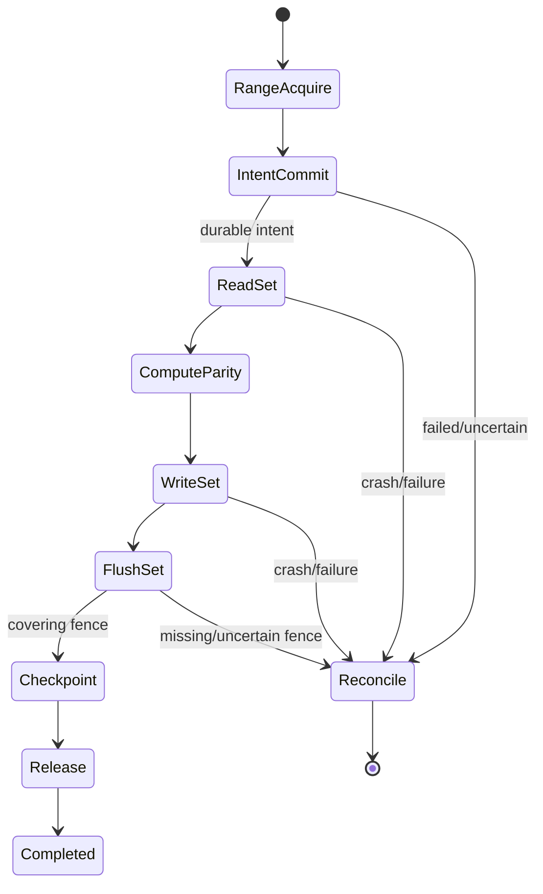

# OS-008: explicit reference transaction machine

## 1. Architecture decisions and target gate

This change implements handoff Sections 9.8–9.10 and Phase 0 OS-008. The explicit machine is the correctness oracle before any `procmachines` comparison. It emits semantic actions and consumes semantic results; operation slots and concrete stores own child I/O.

## 2. Concrete outcome

`dwv-transaction-ref` contains a modular `machine.rs`, `action.rs`, `trace.rs`, and `error.rs` implementation. It models first-write, already-dirty, checkpoint/clear, abandonment, crash, and reconciliation paths with deterministic traces and no runtime, SQLite, or frontend types.

## 3. Prerequisites

- OS-003 parity semantics, OS-005 recovery transactions, OS-002 slots/completions, and OS-004 simulator are archived.
- Range-lock, checksum, and healthy file-store implementations are represented by semantic tokens or planned values, not concrete I/O.
- `procmachines` is not a dependency or decision in this change.

## 4. Exact scope and non-scope

Scope is action ordering, state transitions, semantic results, failure/reconciliation, abandonment, crash/restart recovery state, trace normalization, and invariant tests. Non-scope is backend scheduling, actual parity bytes, checksum hashing, SQLite calls, locks, concurrency implementation, degraded writes, and production machine selection.

## 5. Semantic APIs and contracts

The machine accepts a bounded `TransactionPlan` and emits `TransactionAction` values: acquire ranges, persist dirty/invalidate integrity, read set, compute parity, write set, flush set, checkpoint/clear, and release. `ActionResult` carries only semantic success, durable generation, fence, completion, failure, or uncertainty. `TransactionState` exposes progress and terminal disposition.

## 6. State ownership and lifecycle

The machine owns logical stage, captured topology/recovery generations, pending semantic action, irreversible boundary, and trace. Operation slots own buffers/tags/children. Recovery store owns durable snapshot. The machine never assumes dropping a caller handle cancels work.

## 7. Persistent-state impact

None. Traces are versioned test artifacts. The machine does not serialize a product transaction format or persist private enum discriminants.

## 8. Irreversible and durability boundaries

Before durable intent, no protected home mutation action is legal. After a write action is emitted, abandonment and crash require drain/reconciliation. Clean/checkpoint and release require complete terminal results plus covering durable fence evidence. Failed or uncertain results cannot advance to clean.

## 9. State and sequence diagrams

## 10. Concurrency and resource rules

One machine owns one semantic transaction and one pending action. A caller may drive it serially; concurrent backend children are represented inside results. Plans have bounded ranges, extents, stores, and writes. No action is accepted twice and no release is emitted while reconciliation is pending.

## 11. Failure matrix

| Result or event | Required state/action |
|---|---|
| Range acquisition failure | Aborted; no intent or home mutation. |
| Durable intent | Proceed to read set. |
| Rejected/lost/corrupt intent | Reconcile/blocked; no home write. |
| Read short/EIO/uncertain | Reconcile; no optimistic parity/write. |
| Parity computation failure | Reconcile; no write/checkpoint. |
| Write failure/uncertainty | Dirty/reconcile; no clear. |
| Fence incomplete/volatile | Reconcile; no checkpoint/release. |
| Checkpoint durable | Release then completed. |
| Abandonment | Suppress delivery interest; continue obligations. |
| Crash | Reopen from durable recovery state; preserve unknown boundary. |
| Duplicate/out-of-order result | Stable transition error; prior state unchanged. |

## 12. Deterministic simulator cases

The machine maps to OS-004 schedules for intent failure, crash before intent, crash after intent, failure after home write, fence failure, checkpoint failure, abandonment at every stage, duplicate result, and restart. Allowed terminal states are asserted by the simulator, not inferred from a successful method call.

## 13. Property, model, and fuzz tests

Generated bounded plans and result schedules assert no write before durable intent, no clear before fence, no release before terminal/reconciliation, deterministic state transitions, and trace replay equality. Mutation tests intentionally remove ordering guards and must fail.

## 14. Integration tests

Run `cargo test -p dwv-transaction-ref`, compose with `dwv-recovery` and `dwv-sim`, and compare normalized traces. OS-009 may later drive the same plans through `procmachines`; no Linux or macOS adapter is required here.

## 15. Observability, security, and operator behavior

Trace events expose stage, action kind, recovery generation, topology epoch, stable error class, and conservative disposition. Payload bytes, paths, SQL statements, and frontend tags are excluded. Reconciliation-required is an operator-visible state, not a hidden retry.

## 16. Performance and resource bounds

Machine memory is bounded by the plan and trace caps. Transition work is O(actions + result fields). It is an oracle, not a throughput implementation; batching/performance belongs to later executor work.

## 17. Executable acceptance criteria

- Every legal first-write/checkpoint transition emits the expected action sequence.
- No invalid order can produce a home write, clean checkpoint, or release.
- Failed/uncertain recovery and backend results remain conservative.
- Abandonment and crash preserve irreversible/reconciliation obligations.
- Traces replay deterministically and are independent of private crate/runtime layout.
- Module organization and public re-exports preserve workspace boundaries.
- Focused, simulator, and workspace tests pass.

## 18. Forbidden outcomes

Do not emit home mutation before durable intent, clear before a covering fence, release before terminal/reconciliation, treat abandonment as cancellation, infer durability from action delivery, or select `procmachines` without OS-009 evidence.

## 19. Migration and compatibility consequences

No product migration. Trace versioning is test-only and additive. Future checksum/range/transaction fields must be introduced through semantic actions/results and cannot expose backend layouts.

## 20. Next OpenSpecs unlocked

OS-008 unlocks OS-009 comparison, OS-010 dirty/integrity ordering, OS-013 healthy portable I/O, and OS-024 trace replay. It does not unlock Linux executor or degraded writes.
