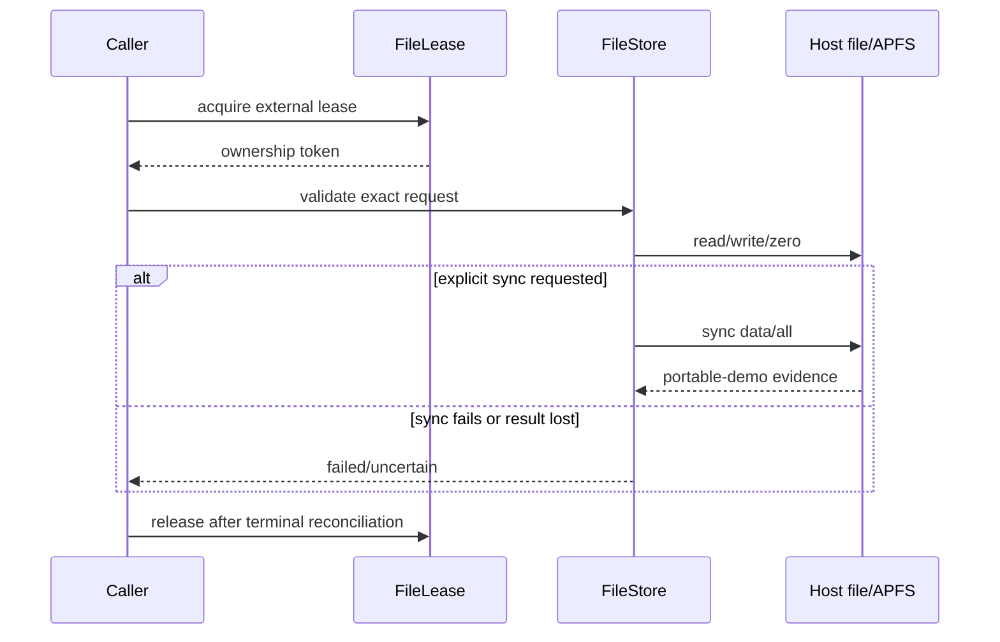

# OS-012: file-backed stores

## 1. Architecture decisions and target gate

This change implements handoff Phase 1 OS-012 for the portable/macOS path. A fixed-size regular/sparse file is a `RandomAccessStore`; host synchronization is evidence-limited portable-demo behavior. The store implementation is modularized into `file_store.rs`, `capabilities.rs`, `lease.rs`, and `control.rs`, with a small `lib.rs` re-export surface.

## 2. Concrete outcome

`dwv-store-file` provides bounded exact-range file I/O, fixed geometry, sparse-hole behavior, write-zeroes, sync, identity observations, capability reports, and an atomic ephemeral lease. A separate control SQLite projection is disposable and rebuildable; recovery authority remains the existing semantic port.

## 3. Prerequisites

- OS-002 store contracts and OS-005 recovery semantics are archived.
- macOS standard Unix file APIs and host `sqlite3` are available for local evidence.
- No Linux ublk/io_uring, async runtime, third-party Rust dependency, or physical device is required.

## 4. Exact scope and non-scope

Scope is regular/sparse files, fixed geometry, exact reads/writes/zeroes/flush, conservative unsupported discard, capabilities, file identity, leases, alias checks, control-state migration/export/rebuild, and macOS-runnable tests. Non-scope is parity orchestration, recovery transaction authority, physical FUA/discard, FSKit/DiskImages, ublk, and hardware power cuts.

## 5. Semantic APIs and contracts

`FileStoreConfig` declares path, protected length, logical block size, transfer bound, and evidence profile. `FileStore` implements `RandomAccessStore` with exact `StoreCompletion`. `FileCapabilities` maps known file facts into `StoreCapabilities`. `FileLease` owns an external lock path. `ControlProjection` owns only inventory/history/job data and exports semantic rows without becoming recovery authority.

## 6. State ownership and lifecycle

The file owns payload bytes and fixed apparent size. `FileStore` owns an open handle and captured file identity. The lease owns ephemeral writer claim. Control SQLite owns rebuildable presentation state. Recovery state owns dirty/clean/topology facts. Closing releases the lease; a changed identity invalidates reuse.

## 7. Persistent-state impact

Payload files remain ordinary files with no required DiskWeave bytes. The lock file is ephemeral. Control SQLite uses a versioned disposable schema. No file-side header, sidecar, hidden tail, or SQL row is required to interpret payload bytes.

## 8. Irreversible and durability boundaries

Writes change payload bytes; sync establishes only configured portable-demo evidence. Discard is unsupported rather than silently translated to a physical promise. Lease acquisition precedes writable access. Control-state deletion does not delete or reinterpret payloads.

## 9. State and sequence diagrams

## 10. Concurrency and resource rules

One lease is allowed per writable backing path. File handles and buffers are bounded by callers. Reads/writes use exact ranges and bounded chunks for zeroing. Control commands are bounded and serialized through the host SQLite process. No background threads or unbounded retry are introduced.

## 11. Failure matrix

| Condition | Required result |
|---|---|
| Missing file | Explicit open error; no creation unless requested by config. |
| Wrong length/resize | Refuse writable open or resize; preserve payload. |
| Range overflow/outside | Store error before I/O. |
| Short read/write | Exact short completion; no success promotion. |
| EIO/permission | Failed completion and evidence. |
| Sync error/lost result | Failed/uncertain; no durable upgrade. |
| Discard request | Unsupported unless a later capability proves equivalent semantics. |
| Lease exists | Writable open blocked. |
| File identity changed | Invalidate captured topology; no reuse. |
| Backing/export alias | Assembly blocked before service. |
| Control DB missing/corrupt | Rebuild projection; payload/recovery authority unchanged. |

## 12. Deterministic simulator cases

File-store tests use synthetic files and OS-004 schedules for ordinary write, short/EIO/uncertain completion, sync failure, disappearance, identity replacement, and control-state loss. Real APFS sync/cache behavior is recorded separately by OS-020/023.

## 13. Property, model, and fuzz tests

Bounded generated ranges assert no out-of-bounds mutation, fixed length, exact completion ranges, zero-hole reads, no lease double ownership, identity-change invalidation, and control deletion independence. Temporary files are deterministic in shape and cleaned after tests.

## 14. Integration tests

Run focused crate tests on macOS, workspace tests, `sqlite3` control migration/export tests, and `cargo tree`. Linux-only integration is skipped and remains visible as later evidence. OS-020 will add `hdiutil`/DiskImages bridge tests.

## 15. Observability, security, and operator behavior

Errors expose stable class, operation, range, and path-independent store identity. Raw paths and payload contents are not included in semantic traces. Lease failures say which ownership decision is required. Control DB rebuild is non-destructive and explicit.

## 16. Performance and resource bounds

I/O is bounded by transfer and zeroing chunk limits; no full-file buffering is required. Capability/probe output is bounded. The control projection has bounded rows/export. Performance measurements are portable file benchmarks, not physical-device certification.

## 17. Executable acceptance criteria

- Regular and sparse files preserve fixed geometry and exact range semantics.
- Reads of holes return zeros; writes/zeroes and sync report conservative evidence.
- Capability and file identity observations are explicit; physical durability/discard remain unknown/unsupported.
- Lease and alias tests prevent simultaneous writable backing/export use.
- Control SQLite migration/export/deletion/rebuild leaves direct payload and recovery semantics unaffected.
- Modules are organized by responsibility with stable public re-exports.
- macOS focused and workspace tests pass.

## 18. Forbidden outcomes

Do not extend files silently, treat `fsync` as hardware FUA, translate discard into an unproven physical operation, use path alone as identity, create required payload sidecars, allow aliasing, or make control SQLite authoritative for recovery.

## 19. Migration and compatibility consequences

No payload migration. Existing files are opened only at their declared protected length. Control schema is versioned and rebuildable. A future platform adapter must preserve the same completion/capability/identity semantics and may not change payload interpretation.

## 20. Next OpenSpecs unlocked

OS-012 unlocks OS-013 healthy portable I/O and OS-020 macOS bridge feasibility. It does not unlock physical durability, Linux executor, or production write-safe classification.
